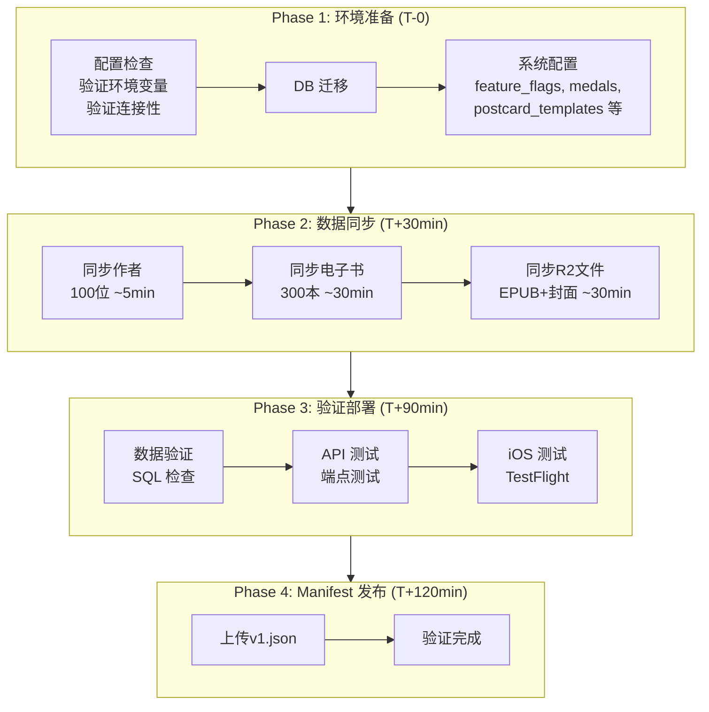

# V1.0 Staging 环境实施执行计划

> Foundation MVP 发布准备 | 电子书 + 作者 | 无有声书

---

## 一、实施目标

### 1.1 V1.0 版本范围

### 1.2 Staging 环境数据目标

| 内容类型 | 数量 | 来源 | 说明 |
|----------|------|------|------|
| **电子书** | 300 本 | Debug 环境 (Standard Ebooks) | 严格按书单 |
| **作者** | 100 位 | Debug 环境 | 与电子书关联 |
| **章节** | ~5,000 章 | EPUB 解析 | 自动提取 |
| **有声书** | 0 本 | - | V1.0 不含 |

---

## 二、前置条件检查

### 2.1 环境检查清单

### 2.2 数据源验证 SQL (Debug 环境)

---

## 三、实施步骤

### 3.1 执行流程图

### 3.2 Phase 1: 环境准备

#### Step 1.1: SSH 登录 Droplet

#### Step 1.2: 更新代码

#### Step 1.3: 验证环境配置

#### Step 1.4: 数据库迁移

#### Step 1.5: 系统配置初始化

> ⚠️ 仅限 Feature Flags 等系统配置，禁止业务数据

### 3.3 Phase 2: 数据同步

#### Step 2.1: 同步作者 (100 位)

#### Step 2.2: 同步电子书 (300 本)

#### Step 2.3: 同步 R2 文件

### 3.4 Phase 3: 验证部署

#### Step 3.1: 数据验证

#### Step 3.2: API 端点测试

#### Step 3.3: R2 文件验证

#### Step 3.4: iOS TestFlight 测试

### 3.5 Phase 4: Manifest 发布

#### Step 4.1: 创建 V1 Manifest

#### Step 4.2: 上传 Manifest 到 R2

#### Step 4.3: 验证 Manifest

---

## 四、验收标准

### 4.1 数据验收

| 检查项 | 期望值 | 允许偏差 | 验证方式 |
|--------|--------|----------|----------|
| 电子书数量 | 300 | ≥285 (95%) | SQL COUNT |
| 作者数量 | 100 | ≥95 (95%) | SQL COUNT |
| 章节数量 | ~5,000 | - | SQL COUNT |
| EPUB 文件 | 与电子书数一致 | 100% | R2 LIST |
| 封面图 | 与电子书数一致 | 100% | R2 LIST |

### 4.2 功能验收

| 检查项 | 验证方式 | 通过标准 |
|--------|----------|----------|
| 书籍列表 API | curl 测试 | 返回 200 + 数据 |
| 书籍详情 API | curl 测试 | 返回完整信息 |
| EPUB 下载 | curl 测试 | 返回 200 |
| iOS 书库加载 | TestFlight | 正常显示 |
| iOS 阅读器 | TestFlight | 可正常阅读 |
| 有声书 Tab | TestFlight | 不可见 |

### 4.3 缺失项处理

---

## 五、风险与回滚

### 5.1 风险识别

| 风险 | 影响 | 概率 | 缓解措施 |
|------|------|------|----------|
| Debug 数据不完整 | 同步失败 | 中 | 先验证源数据 |
| R2 传输失败 | 文件缺失 | 低 | 支持重试 |
| DB 迁移失败 | 无法启动 | 低 | 备份后迁移 |
| API 部署失败 | 服务不可用 | 低 | Fly.io 回滚 |

### 5.2 回滚方案

---

## 六、时间估算

| 阶段 | 任务 | 预计时间 | 累计 |
|------|------|----------|------|
| Phase 1 | 环境准备 | 15 分钟 | 15 分钟 |
| Phase 2.1 | 同步作者 | 10 分钟 | 25 分钟 |
| Phase 2.2 | 同步电子书 | 40 分钟 | 65 分钟 |
| Phase 2.3 | 同步 R2 文件 | 30 分钟 | 95 分钟 |
| Phase 3 | 验证部署 | 30 分钟 | 125 分钟 |
| Phase 4 | Manifest 发布 | 10 分钟 | 135 分钟 |
| **总计** | | **~2.5 小时** | |

---

## 七、执行命令快速参考

---

## 八、后续步骤 (V1.1+)

---

## 九、相关文档

| 文档 | 说明 |
|------|------|
| [complete-version-roadmap.md](./complete-version-roadmap.md) | 完整版本路线图 |
| [staging-phase1-booklist.md](../content/staging-phase1-booklist.md) | Phase 1 详细书单 |
| [staging-data-population-plan.md](../backend/staging-data-population-plan.md) | 数据填充方案 |
| [r2-versioning-strategy.md](./r2-versioning-strategy.md) | R2 版本策略 |

---

*文档版本: 1.0*
*创建日期: 2025-12-31*
*状态: 待执行*
