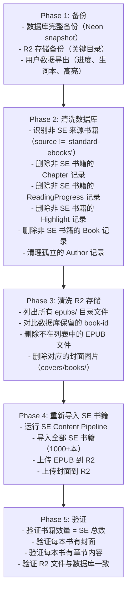

# V2.0 全栈发布计划

> 100% Standard Ebooks 内容 + 有声书 + Android 客户端

---

## 一、发布目标

```
┌─────────────────────────────────────────────────────────────────┐
│                      V2.0 发布目标                                │
├─────────────────────────────────────────────────────────────────┤
│                                                                   │
│   内容目标                      平台目标                          │
│   ─────────────                ─────────────                     │
│   • 100% SE 书籍               • iOS 2.0 发布                    │
│   • 1000+ 电子书               • Android 2.0 首发                │
│   • 150 有声书                 • Backend 2.0 部署                │
│   • ~300 作者                  • Dashboard 更新                  │
│                                                                   │
│   质量目标                      时间目标                          │
│   ─────────────                ─────────────                     │
│   • 数据源统一规范             • 2025 Q2                         │
│   • 零非 SE 内容               • iOS 先行                        │
│   • 封面风格一致               • Android 跟进                    │
│                                                                   │
└─────────────────────────────────────────────────────────────────┘
```

---

## 二、核心任务

### 2.1 数据清洗与重建



### 2.2 有声书模块

| 任务 | 说明 | 依赖 |
|------|------|------|
| LibriVox 数据对接 | 获取与 SE 书籍匹配的有声书 | SE 导入完成 |
| 音频文件上传 | 上传到 R2 audiobooks/ 目录 | LibriVox 对接 |
| 播放器开发 (iOS) | 实现播放器 UI 和功能 | 无 |
| 播放器开发 (Android) | 实现播放器 UI 和功能 | 无 |
| 后端 API | 有声书列表、详情、进度 API | 无 |

### 2.3 Android 客户端

| 任务 | 说明 | 依赖 |
|------|------|------|
| 项目初始化 | Kotlin + Jetpack Compose | 无 |
| 功能对等开发 | 与 iOS 功能一一对应 | iOS 功能稳定 |
| 有声书模块 | Android 播放器实现 | 有声书 API |
| Google Play 准备 | 商店资料、截图、描述 | 功能完成 |
| 测试与发布 | 内测 → 公测 → 正式发布 | 全部完成 |

### 2.4 iOS 客户端升级

| 任务 | 说明 | 依赖 |
|------|------|------|
| 有声书模块集成 | 添加有声书 Tab 和播放器 | 有声书 API |
| 数据迁移处理 | 处理非 SE 书籍移除后的用户体验 | 数据清洗 |
| 版本号升级 | 1.x → 2.0 | 无 |
| App Store 提审 | 准备 2.0 版本提交 | 功能完成 |

---

## 三、发布检查清单

### 3.1 数据层

| 检查项 | 状态 | 负责人 |
|--------|:----:|--------|
| 数据库备份完成 | ☐ | |
| R2 备份完成 | ☐ | |
| 非 SE 数据清理完成 | ☐ | |
| SE 书籍导入完成（1000+本） | ☐ | |
| 有声书数据导入完成（150本） | ☐ | |
| 数据一致性验证通过 | ☐ | |

### 3.2 后端

| 检查项 | 状态 | 负责人 |
|--------|:----:|--------|
| 有声书 API 开发完成 | ☐ | |
| API 测试通过 | ☐ | |
| v2.0.0 manifest 上传 | ☐ | |
| Production 环境部署 | ☐ | |
| 性能测试通过 | ☐ | |

### 3.3 iOS 客户端

| 检查项 | 状态 | 负责人 |
|--------|:----:|--------|
| 有声书模块开发完成 | ☐ | |
| 数据迁移提示实现 | ☐ | |
| 版本号更新为 2.0.0 | ☐ | |
| TestFlight 测试通过 | ☐ | |
| App Store 提审材料准备 | ☐ | |
| App Store 审核通过 | ☐ | |

### 3.4 Android 客户端

| 检查项 | 状态 | 负责人 |
|--------|:----:|--------|
| 核心功能开发完成 | ☐ | |
| 有声书模块开发完成 | ☐ | |
| 内部测试通过 | ☐ | |
| Google Play 商店资料准备 | ☐ | |
| Google Play 审核通过 | ☐ | |

---

## 四、时间规划

```
┌─────────────────────────────────────────────────────────────────┐
│                      V2.0 时间线                                  │
├─────────────────────────────────────────────────────────────────┤
│                                                                   │
│   Week 1-2: 数据清洗                                              │
│   ├── 备份现有数据                                                │
│   ├── 清洗数据库和 R2                                             │
│   └── 导入全部 SE 书籍                                            │
│                                                                   │
│   Week 3-4: 有声书模块                                            │
│   ├── LibriVox 数据对接                                           │
│   ├── 后端 API 开发                                               │
│   └── iOS 播放器开发                                              │
│                                                                   │
│   Week 5-8: Android 客户端                                        │
│   ├── 核心功能开发                                                │
│   ├── 有声书模块集成                                              │
│   └── 测试和优化                                                  │
│                                                                   │
│   Week 9-10: 发布准备                                             │
│   ├── 全平台测试                                                  │
│   ├── 商店资料准备                                                │
│   └── 提交审核                                                    │
│                                                                   │
│   Week 11-12: 发布                                                │
│   ├── iOS 2.0 发布                                                │
│   └── Android 2.0 发布                                            │
│                                                                   │
└─────────────────────────────────────────────────────────────────┘
```

---

## 五、风险与应对

| 风险 | 影响 | 应对措施 |
|------|------|----------|
| SE 导入失败 | 内容缺失 | 备份原数据，可回滚 |
| 用户数据丢失 | 用户体验差 | 提前通知，导出关键数据 |
| Android 开发延期 | 发布延迟 | iOS 先行发布，Android 跟进 |
| App Store 审核被拒 | 发布延迟 | 提前准备，预留审核时间 |
| 有声书匹配率低 | 内容少 | 接受现有匹配数量，后续补充 |

---

## 六、回滚方案

```
┌─────────────────────────────────────────────────────────────────┐
│                      回滚方案                                     │
├─────────────────────────────────────────────────────────────────┤
│                                                                   │
│   触发条件：                                                      │
│   • SE 导入后数据严重缺失                                         │
│   • 生产环境出现重大故障                                          │
│   • 用户反馈严重负面                                              │
│                                                                   │
│   回滚步骤：                                                      │
│   1. 停止新版本客户端访问（通过 manifest 控制）                   │
│   2. 恢复数据库备份（Neon restore）                               │
│   3. 恢复 R2 备份文件                                             │
│   4. 切换 manifest 到 v1.0.0                                      │
│   5. 验证服务恢复正常                                             │
│                                                                   │
└─────────────────────────────────────────────────────────────────┘
```

---

## 七、相关文档

| 文档 | 描述 |
|------|------|
| [V2.0.0 Release Notes](../notes/v2.0.0.md) | 版本说明 |
| [数据清洗执行记录](../../10-pipeline/execution-logs/P006-v2-data-cleanup.md) | 清洗过程记录 |
| [SE Content Pipeline](../../plans/2026-01-26-se-content-pipeline-design.md) | SE 导入设计 |
| [SE 数据盘点](../../06-content/sources/standard-ebooks/data-inventory.md) | SE 数据详情 |
| [完整版本路线图](./complete-version-roadmap.md) | V1-V5 规划 |

---

*文档创建日期: 2026-01-26*
