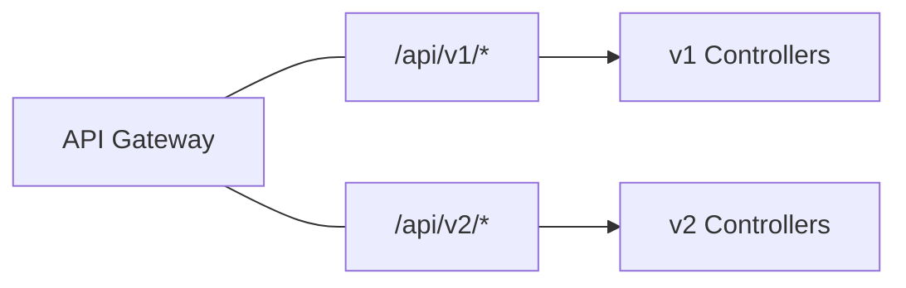
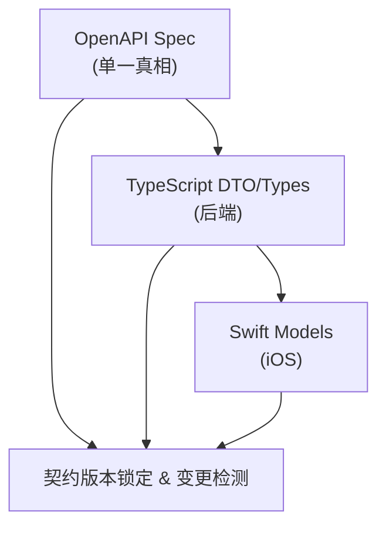

# Readmigo 全栈版本管理设计

## 1. 概述

本文档定义 Readmigo 项目的版本管理策略，涵盖 iOS 客户端、后端 API、数据库迁移的版本控制与升级机制。

### 1.1 当前状态

| 组件 | 当前版本 | 版本位置 |
|------|---------|---------|
| iOS App | 1.0 (Build 1) | `ios/Readmigo/Info.plist` |
| Backend | 0.1.0 | `apps/backend/package.json` |
| API | v1 | `app.setGlobalPrefix('api/v1')` |
| Database | Prisma migrations | `packages/database/prisma/` |

### 1.2 统一版本号策略

> **核心决策：全栈使用统一版本号，简化版本管理复杂度。**

```
┌─────────────────────────────────────────────────────────────┐
│                    统一版本号: 1.0.0                          │
├─────────────────────────────────────────────────────────────┤
│  iOS App      │  Backend API   │  Database Schema           │
│  1.0.0        │  1.0.0         │  1.0.0                     │
│  (Build 1)    │  /api/v1       │  migration_1.0.0           │
└─────────────────────────────────────────────────────────────┘
```

**优势：**
- 一目了然的版本对应关系
- 简化发版流程和沟通
- 降低版本兼容性判断复杂度
- 便于问题追溯和回滚

### 1.3 缺失的功能

- 版本检查 API
- 强制更新机制
- 版本废弃策略
- 灰度更新配置
- API 版本兼容性管理
- **API 契约锁定机制**
- **向后兼容性规则**
- **客户端防御性解析**

### 1.4 核心原则

> **客户端一旦发版，接口不可修改。** 任何接口变更都必须保证向后兼容，或通过新版本 API 提供。

---

## 2. 统一版本号规范

### 2.1 语义化版本 (Semantic Versioning)

全栈统一采用 `MAJOR.MINOR.PATCH` 格式：

```
MAJOR - 不兼容的 API 变更（需要强制更新客户端）
MINOR - 向后兼容的功能新增
PATCH - 向后兼容的问题修复
```

### 2.2 版本号存储位置（单一真相来源）

```
/version.json  ← 全栈统一版本号配置（唯一来源）
```

**version.json 结构：**

```json
{
  "version": "1.0.0",
  "buildNumber": 1,
  "releaseDate": "2024-12-21",
  "minSupportedVersion": "1.0.0",
  "changelog": {
    "en": "Initial release",
    "zh": "首次发布"
  }
}
```

### 2.3 各组件版本同步

| 组件 | 版本来源 | 同步方式 |
|------|---------|---------|
| iOS App | `version.json` | 构建脚本自动同步到 Info.plist |
| Backend | `version.json` | 启动时读取或构建时同步 |
| API 路由 | 固定 `/api/v1` | MAJOR 版本变更时新增 `/api/v2` |
| Database | `version.json` | Migration 文件名包含版本号 |
| Sentry | `version.json` | 启动时读取 |

### 2.4 版本同步脚本

```bash
#!/bin/bash
# scripts/sync-version.sh - 同步版本号到所有组件

VERSION=$(jq -r '.version' version.json)
BUILD=$(jq -r '.buildNumber' version.json)

echo "Syncing version $VERSION (build $BUILD) to all components..."

# 1. 同步到后端 package.json
jq ".version = \"$VERSION\"" apps/backend/package.json > tmp.json && mv tmp.json apps/backend/package.json

# 2. 同步到根 package.json
jq ".version = \"$VERSION\"" package.json > tmp.json && mv tmp.json package.json

# 3. 同步到 iOS Info.plist
/usr/libexec/PlistBuddy -c "Set :CFBundleShortVersionString $VERSION" ios/Readmigo/Info.plist
/usr/libexec/PlistBuddy -c "Set :CFBundleVersion $BUILD" ios/Readmigo/Info.plist

# 4. 更新 Xcode project
sed -i '' "s/MARKETING_VERSION = .*/MARKETING_VERSION = $VERSION;/" ios/Readmigo.xcodeproj/project.pbxproj
sed -i '' "s/CURRENT_PROJECT_VERSION = .*/CURRENT_PROJECT_VERSION = $BUILD;/" ios/Readmigo.xcodeproj/project.pbxproj

echo "Version sync complete!"
```

### 2.5 版本递增规则

```bash
# 发布新功能（向后兼容）
pnpm version:minor  # 1.0.0 → 1.1.0

# Bug 修复
pnpm version:patch  # 1.0.0 → 1.0.1

# Breaking Change（需要强制更新）
pnpm version:major  # 1.0.0 → 2.0.0
```

**package.json scripts：**

```json
{
  "scripts": {
    "version:patch": "node scripts/bump-version.js patch && pnpm sync:version",
    "version:minor": "node scripts/bump-version.js minor && pnpm sync:version",
    "version:major": "node scripts/bump-version.js major && pnpm sync:version",
    "sync:version": "bash scripts/sync-version.sh"
  }
}
```

### 2.6 iOS Build Number 策略

```
Marketing Version: 与全栈版本一致 (1.0.0)
Build Number: 自增整数，每次提交 App Store 递增
```

**Build Number 规则：**
- 同一 Marketing Version 可以有多个 Build（用于 TestFlight 迭代）
- 提交 App Store 时 Build Number 必须递增
- Build Number 独立于语义化版本，仅用于 App Store 区分构建

---

## 3. API 版本策略

### 3.1 URL 路径版本控制

```
当前: /api/v1/*
未来: /api/v2/* (当有 breaking changes 时)
```

### 3.2 版本共存策略



**实现方式（NestJS）：**

```typescript
// app.module.ts
import { RouterModule } from '@nestjs/core';

@Module({
  imports: [
    RouterModule.register([
      { path: 'api/v1', module: V1Module },
      { path: 'api/v2', module: V2Module },
    ]),
  ],
})
```

### 3.3 API 版本生命周期

| 状态 | 含义 | 客户端处理 |
|------|------|-----------|
| `current` | 当前推荐版本 | 正常使用 |
| `supported` | 仍然支持 | 可使用，建议升级 |
| `deprecated` | 已废弃 | 提示用户升级 |
| `sunset` | 已下线 | 返回 410 Gone |

---

## 4. API 契约管理（核心）

> 本章节解决"客户端发版后接口不能修改"的问题，确保接口稳定性和数据结构一致性。

### 4.1 契约管理架构



### 4.2 OpenAPI 作为单一真相来源

**导出 OpenAPI 规范文件：**

```typescript
// scripts/export-openapi.ts
import { NestFactory } from '@nestjs/core';
import { SwaggerModule, DocumentBuilder } from '@nestjs/swagger';
import { AppModule } from '../src/app.module';
import * as fs from 'fs';

async function exportOpenAPI() {
  const app = await NestFactory.create(AppModule);

  const config = new DocumentBuilder()
    .setTitle('Readmigo API')
    .setVersion('1.0.0')
    .build();

  const document = SwaggerModule.createDocument(app, config);

  // 导出为 JSON 和 YAML
  fs.writeFileSync('openapi/v1.json', JSON.stringify(document, null, 2));

  await app.close();
}

exportOpenAPI();
```

**版本化存储：**

```
openapi/
├── v1.json              # 当前生产版本（锁定）
├── v1.snapshot.json     # 上次发布的快照
├── v1.dev.json          # 开发中的变更
└── changelog.md         # 变更日志
```

### 4.3 向后兼容性规则（铁律）

#### 4.3.1 允许的变更（向后兼容）

| 变更类型 | 示例 | 说明 |
|---------|------|------|
| 添加可选字段 | `newField?: string` | 客户端忽略未知字段 |
| 添加新接口 | `GET /api/v1/new-endpoint` | 不影响现有接口 |
| 扩展枚举值 | `status: 'A' \| 'B' \| 'C'` → 添加 `'D'` | 客户端需容错处理 |
| 放宽字段约束 | `minLength: 5` → `minLength: 1` | 更宽松的验证 |
| 添加可选参数 | `?newParam=value` | 默认值处理 |

#### 4.3.2 禁止的变更（Breaking Changes）

| 变更类型 | 示例 | 后果 |
|---------|------|------|
| 删除字段 | 移除 `user.email` | 客户端解析失败/crash |
| 重命名字段 | `userName` → `displayName` | 客户端找不到字段 |
| 修改字段类型 | `id: number` → `id: string` | 类型转换失败 |
| 修改必填性 | `name?: string` → `name: string` | 旧数据缺失字段 |
| 删除枚举值 | 移除 `status: 'PENDING'` | 未知枚举值 |
| 修改 URL 路径 | `/users` → `/members` | 404 错误 |
| 修改 HTTP 方法 | `GET` → `POST` | 请求失败 |

#### 4.3.3 字段废弃流程（3 版本周期）

```
版本 1.0: 正常使用字段 oldField
版本 1.1: 添加 newField，标记 oldField 为 @deprecated
版本 1.2: oldField 仍返回，但文档标记为废弃
版本 1.3: 可以删除 oldField（确保 1.0 用户已升级）
```

**DTO 中的废弃标记：**

```typescript
export class UserDto {
  @ApiProperty()
  id: string;

  @ApiProperty()
  displayName: string;

  @ApiProperty({ deprecated: true, description: '请使用 displayName' })
  @Expose()
  get userName(): string {
    return this.displayName;
  }
}
```

### 4.4 响应体版本标识

#### 4.4.1 响应头标识

```typescript
// response-version.interceptor.ts
@Injectable()
export class ResponseVersionInterceptor implements NestInterceptor {
  intercept(context: ExecutionContext, next: CallHandler): Observable<any> {
    const response = context.switchToHttp().getResponse();

    // 添加 API 版本头
    response.setHeader('X-API-Version', 'v1');
    response.setHeader('X-Schema-Version', '2024.12.21');

    return next.handle();
  }
}
```

#### 4.4.2 统一响应包装

```typescript
// 所有 API 响应的统一格式
export interface ApiEnvelope<T> {
  success: boolean;
  data: T;
  meta: {
    apiVersion: string;      // "v1"
    schemaVersion: string;   // "2024.12.21"
    timestamp: string;       // ISO8601
    requestId: string;       // 请求追踪 ID
  };
  error?: {
    code: string;
    message: string;
    details?: unknown;
  };
}
```

**响应示例：**

```json
{
  "success": true,
  "data": {
    "id": "user_123",
    "displayName": "John"
  },
  "meta": {
    "apiVersion": "v1",
    "schemaVersion": "2024.12.21",
    "timestamp": "2024-12-21T10:30:00Z",
    "requestId": "req_abc123"
  }
}
```

### 4.5 客户端防御性解析（iOS）

#### 4.5.1 Swift Codable 容错策略

```swift
// SafeDecodable.swift
/// 安全解码包装器 - 未知值时使用默认值，不会 crash
@propertyWrapper
struct SafeDecodable<T: Codable>: Codable {
    var wrappedValue: T

    init(wrappedValue: T) {
        self.wrappedValue = wrappedValue
    }

    init(from decoder: Decoder) throws {
        let container = try decoder.singleValueContainer()
        self.wrappedValue = (try? container.decode(T.self)) ?? wrappedValue
    }

    func encode(to encoder: Encoder) throws {
        var container = encoder.singleValueContainer()
        try container.encode(wrappedValue)
    }
}

/// 未知枚举值容错
@propertyWrapper
struct UnknownCaseCodable<T: RawRepresentable & Codable>: Codable
    where T.RawValue: Codable {

    var wrappedValue: T?

    init(wrappedValue: T?) {
        self.wrappedValue = wrappedValue
    }

    init(from decoder: Decoder) throws {
        let container = try decoder.singleValueContainer()
        let rawValue = try container.decode(T.RawValue.self)
        self.wrappedValue = T(rawValue: rawValue)
        // 未知枚举值时为 nil，不会 crash
    }
}
```

#### 4.5.2 模型定义最佳实践

```swift
// User.swift
struct User: Codable {
    let id: String
    let displayName: String

    // 可选字段 - 服务端可能不返回
    let email: String?
    let avatarUrl: String?

    // 带默认值的字段 - 防止缺失
    @SafeDecodable var isVerified: Bool = false
    @SafeDecodable var followerCount: Int = 0

    // 枚举容错 - 未知值不会 crash
    @UnknownCaseCodable var status: UserStatus?

    // 新增字段向后兼容
    let newFeatureFlag: Bool?  // 旧版本 API 不返回此字段

    // CodingKeys - 只解码已知字段，忽略未知字段
    enum CodingKeys: String, CodingKey {
        case id, displayName, email, avatarUrl
        case isVerified, followerCount, status
        case newFeatureFlag
    }
}

enum UserStatus: String, Codable {
    case active = "ACTIVE"
    case inactive = "INACTIVE"
    case suspended = "SUSPENDED"
    // 不需要 unknown case - 使用 @UnknownCaseCodable 处理
}
```

#### 4.5.3 API 响应解码器配置

```swift
// APIClient.swift - 容错解码配置
private func configureDecoder() -> JSONDecoder {
    let decoder = JSONDecoder()

    // 日期解码容错
    decoder.dateDecodingStrategy = .custom { decoder in
        let container = try decoder.singleValueContainer()
        let dateString = try container.decode(String.self)

        // 尝试多种日期格式
        for formatter in Self.dateFormatters {
            if let date = formatter.date(from: dateString) {
                return date
            }
        }

        // 解析失败返回当前时间，而不是 crash
        LoggingService.shared.warning("Date parse failed: \(dateString)")
        return Date()
    }

    // 键名策略 - 忽略未知键
    decoder.keyDecodingStrategy = .useDefaultKeys

    return decoder
}

private static let dateFormatters: [ISO8601DateFormatter] = {
    let withFractional = ISO8601DateFormatter()
    withFractional.formatOptions = [.withInternetDateTime, .withFractionalSeconds]

    let withoutFractional = ISO8601DateFormatter()
    withoutFractional.formatOptions = [.withInternetDateTime]

    return [withFractional, withoutFractional]
}()
```

### 4.6 接口变更审批流程

#### 4.6.1 PR 变更检测（CI/CD）

```yaml
# .github/workflows/api-change-check.yml
name: API Change Detection

on:
  pull_request:
    paths:
      - 'apps/backend/src/modules/**/dto/**'
      - 'packages/shared/src/types.ts'

jobs:
  check-api-changes:
    runs-on: ubuntu-latest
    steps:
      - uses: actions/checkout@v4
        with:
          fetch-depth: 0

      - name: Generate OpenAPI spec
        run: pnpm run export:openapi

      - name: Compare with baseline
        run: |
          npx openapi-diff openapi/v1.json openapi/v1.dev.json \
            --format markdown > api-changes.md

      - name: Check for breaking changes
        run: |
          if grep -q "BREAKING" api-changes.md; then
            echo "::error::Breaking API changes detected!"
            cat api-changes.md
            exit 1
          fi

      - name: Comment PR with changes
        uses: actions/github-script@v7
        with:
          script: |
            const fs = require('fs');
            const changes = fs.readFileSync('api-changes.md', 'utf8');
            if (changes.trim()) {
              github.rest.issues.createComment({
                owner: context.repo.owner,
                repo: context.repo.repo,
                issue_number: context.issue.number,
                body: '## API Changes Detected\n\n' + changes
              });
            }
```

#### 4.6.2 Breaking Change 检测规则

```typescript
// scripts/check-breaking-changes.ts
interface BreakingChangeRule {
  type: string;
  detect: (oldSpec: OpenAPISpec, newSpec: OpenAPISpec) => BreakingChange[];
}

const rules: BreakingChangeRule[] = [
  {
    type: 'REMOVED_ENDPOINT',
    detect: (old, new_) => {
      const oldPaths = Object.keys(old.paths);
      const newPaths = Object.keys(new_.paths);
      return oldPaths
        .filter(p => !newPaths.includes(p))
        .map(p => ({ path: p, message: `Endpoint removed: ${p}` }));
    },
  },
  {
    type: 'REMOVED_FIELD',
    detect: (old, new_) => {
      // 检测响应 schema 中移除的字段
      const changes: BreakingChange[] = [];
      for (const [path, methods] of Object.entries(old.paths)) {
        // ... 遍历检测
      }
      return changes;
    },
  },
  {
    type: 'TYPE_CHANGED',
    detect: (old, new_) => {
      // 检测字段类型变更
    },
  },
  {
    type: 'REQUIRED_ADDED',
    detect: (old, new_) => {
      // 检测新增的必填字段
    },
  },
];
```

#### 4.6.3 变更审批模板

```markdown
## API 变更申请

### 变更类型
- [ ] 新增接口
- [ ] 新增可选字段
- [ ] 废弃字段/接口
- [ ] ⚠️ Breaking Change（需要新 API 版本）

### 变更描述
<!-- 描述具体的变更内容 -->

### 影响的客户端版本
<!-- 列出会受影响的 iOS/Android 版本 -->

### 向后兼容性说明
<!-- 说明如何保证向后兼容，或为什么需要 breaking change -->

### 废弃计划（如适用）
- 废弃日期：
- 移除日期：
- 迁移指南：

### Checklist
- [ ] OpenAPI spec 已更新
- [ ] 已添加 @deprecated 标记（如需废弃）
- [ ] iOS 模型已同步更新
- [ ] 已通知客户端团队
```

### 4.7 统一版本兼容性（简化）

由于全栈使用统一版本号，版本兼容性判断大幅简化：

```
┌─────────────────────────────────────────────────────────────┐
│                    统一版本兼容性规则                          │
├─────────────────────────────────────────────────────────────┤
│                                                             │
│   客户端版本 >= minSupportedVersion  →  允许访问             │
│   客户端版本 <  minSupportedVersion  →  强制更新             │
│                                                             │
│   示例：                                                     │
│   当前版本: 1.2.0                                            │
│   最低支持: 1.0.0                                            │
│                                                             │
│   客户端 1.0.0  → 允许（建议更新）                            │
│   客户端 1.1.0  → 允许（建议更新）                            │
│   客户端 1.2.0  → 允许（最新）                               │
│   客户端 0.9.0  → 强制更新                                   │
│                                                             │
└─────────────────────────────────────────────────────────────┘
```

**version.json 作为唯一配置来源：**

```json
{
  "version": "1.2.0",
  "minSupportedVersion": "1.0.0",
  "forceUpdateVersions": ["0.9.0", "0.9.1"]
}
```

**后端版本检查逻辑简化：**

```typescript
// version.service.ts
export class VersionService {
  async checkVersion(clientVersion: string) {
    const config = await this.getVersionConfig(); // 读取 version.json

    return {
      currentVersion: config.version,
      minSupportedVersion: config.minSupportedVersion,
      forceUpdateRequired: this.compareVersions(clientVersion, config.minSupportedVersion) < 0,
      updateAvailable: this.compareVersions(clientVersion, config.version) < 0,
    };
  }
}
```

---

## 5. 版本检查 API 设计

### 5.1 新增数据库模型

```prisma
// schema.prisma
model AppVersion {
  id              String   @id @default(cuid())
  platform        String   // "ios", "android"
  version         String   // "1.0.0"
  buildNumber     Int      // 1
  minApiVersion   String   // 支持的最低 API 版本 "v1"
  releaseNotes    String?  // 更新说明
  releaseNotesZh  String?  // 中文更新说明
  forceUpdate     Boolean  @default(false)
  enabled         Boolean  @default(true)
  releaseDate     DateTime @default(now())
  createdAt       DateTime @default(now())
  updatedAt       DateTime @updatedAt

  @@unique([platform, version])
  @@index([platform, enabled])
}

model ApiVersionConfig {
  id              String   @id @default(cuid())
  version         String   @unique // "v1", "v2"
  status          String   // "current", "supported", "deprecated", "sunset"
  minClientVersion String  // 最低客户端版本要求
  sunsetDate      DateTime? // 下线日期
  createdAt       DateTime @default(now())
  updatedAt       DateTime @updatedAt
}
```

### 5.2 版本检查接口

**Request:**
```http
GET /api/v1/version/check
X-App-Version: 1.0.0
X-Build-Number: 1
X-Platform: ios
```

**Response:**
```json
{
  "currentVersion": "1.2.0",
  "minSupportedVersion": "1.0.0",
  "forceUpdateRequired": false,
  "updateAvailable": true,
  "releaseNotes": "Bug fixes and improvements",
  "releaseNotesZh": "问题修复和性能改进",
  "storeUrl": "https://apps.apple.com/app/readmigo/id123456",
  "apiStatus": {
    "v1": "current",
    "deprecationDate": null
  }
}
```

### 5.3 强制更新逻辑

```typescript
// version.service.ts
export class VersionService {
  async checkVersion(platform: string, clientVersion: string, buildNumber: number) {
    const latestVersion = await this.getLatestVersion(platform);
    const minVersion = await this.getMinSupportedVersion(platform);

    const forceUpdate = this.compareVersions(clientVersion, minVersion) < 0;
    const updateAvailable = this.compareVersions(clientVersion, latestVersion.version) < 0;

    return {
      currentVersion: latestVersion.version,
      minSupportedVersion: minVersion,
      forceUpdateRequired: forceUpdate,
      updateAvailable,
      releaseNotes: latestVersion.releaseNotes,
      releaseNotesZh: latestVersion.releaseNotesZh,
      storeUrl: this.getStoreUrl(platform),
    };
  }

  private compareVersions(v1: string, v2: string): number {
    const parts1 = v1.split('.').map(Number);
    const parts2 = v2.split('.').map(Number);

    for (let i = 0; i < 3; i++) {
      if (parts1[i] > parts2[i]) return 1;
      if (parts1[i] < parts2[i]) return -1;
    }
    return 0;
  }
}
```

---

## 6. iOS 客户端版本检查实现

### 6.1 启动时检查

```swift
// VersionManager.swift
@MainActor
class VersionManager: ObservableObject {
    static let shared = VersionManager()

    @Published var updateRequired = false
    @Published var updateAvailable = false
    @Published var releaseNotes: String?

    private var lastCheckTime: Date?
    private let checkInterval: TimeInterval = 3600 // 1 hour

    func checkVersion() async {
        guard shouldCheck() else { return }

        do {
            let response = try await APIClient.shared.checkVersion()

            await MainActor.run {
                self.updateRequired = response.forceUpdateRequired
                self.updateAvailable = response.updateAvailable
                self.releaseNotes = response.releaseNotes
                self.lastCheckTime = Date()
            }
        } catch {
            LoggingService.shared.error("Version check failed: \(error)")
        }
    }

    private func shouldCheck() -> Bool {
        guard let lastCheck = lastCheckTime else { return true }
        return Date().timeIntervalSince(lastCheck) > checkInterval
    }

    func openAppStore() {
        if let url = URL(string: "https://apps.apple.com/app/readmigo/id123456") {
            UIApplication.shared.open(url)
        }
    }
}
```

### 6.2 强制更新 UI

```swift
// ForceUpdateView.swift
struct ForceUpdateView: View {
    @ObservedObject var versionManager = VersionManager.shared

    var body: some View {
        VStack(spacing: 24) {
            Image(systemName: "arrow.down.app")
                .font(.system(size: 64))
                .foregroundColor(.accentColor)

            Text("update_required_title")
                .font(.title)
                .fontWeight(.bold)

            Text("update_required_message")
                .multilineTextAlignment(.center)
                .foregroundColor(.secondary)

            if let notes = versionManager.releaseNotes {
                Text(notes)
                    .font(.subheadline)
                    .padding()
                    .background(Color(.systemGray6))
                    .cornerRadius(8)
            }

            Button(action: { versionManager.openAppStore() }) {
                Text("update_now")
                    .frame(maxWidth: .infinity)
            }
            .buttonStyle(.borderedProminent)
        }
        .padding()
    }
}
```

### 6.3 入口集成

```swift
// ReadmigoApp.swift
@main
struct ReadmigoApp: App {
    @StateObject private var versionManager = VersionManager.shared

    var body: some Scene {
        WindowGroup {
            Group {
                if versionManager.updateRequired {
                    ForceUpdateView()
                } else {
                    ContentView()
                        .task {
                            await versionManager.checkVersion()
                        }
                }
            }
        }
    }
}
```

---

## 7. 数据库迁移策略

### 7.1 Prisma Migration 工作流

```bash
# 开发环境
pnpm --filter @readmigo/database migrate

# 生产环境部署
pnpm --filter @readmigo/database prisma migrate deploy
```

### 7.2 Migration 命名规范

```
YYYYMMDDHHMMSS_description
示例: 20241221120000_add_app_version_table
```

### 7.3 Breaking Changes 处理

1. **添加字段**：使用 `@default()` 或可选字段
2. **删除字段**：先标记 deprecated，下个版本再删除
3. **修改字段类型**：创建新字段 → 迁移数据 → 删除旧字段

```prisma
// Step 1: 添加新字段
model User {
  oldField String?   @map("old_field") // deprecated
  newField String?   @map("new_field")
}

// Step 2: 运行数据迁移脚本
// Step 3: 下个版本删除 oldField
```

---

## 8. 灰度发布策略

### 8.1 后端灰度（Feature Flags）

```typescript
// feature-flags.service.ts
export class FeatureFlagsService {
  async isFeatureEnabled(
    featureKey: string,
    userId?: string,
    deviceId?: string
  ): Promise<boolean> {
    const flag = await this.getFlag(featureKey);

    if (!flag.enabled) return false;
    if (flag.rolloutPercentage === 100) return true;

    // 基于用户/设备 ID 的一致性哈希
    const hash = this.hashString(userId || deviceId || '');
    return (hash % 100) < flag.rolloutPercentage;
  }
}
```

### 8.2 iOS 灰度

使用 TestFlight 分组：
- Internal Testing：开发团队
- External Testing - Beta：10% 用户
- External Testing - RC：50% 用户
- App Store Release：100% 用户

---

## 9. 版本发布 Checklist（统一版本）

### 9.1 版本递增（第一步）

```bash
# 根据变更类型选择
pnpm version:patch  # Bug 修复: 1.0.0 → 1.0.1
pnpm version:minor  # 新功能: 1.0.0 → 1.1.0
pnpm version:major  # Breaking Change: 1.0.0 → 2.0.0
```

执行后自动同步到所有组件：
- [x] `version.json` 已更新
- [x] `package.json` 已同步
- [x] `Info.plist` 已同步
- [x] `project.pbxproj` 已同步

### 9.2 后端发布

- [ ] 运行 `prisma migrate deploy`
- [ ] 部署后端服务
- [ ] 验证健康检查 `/health`
- [ ] 验证版本接口 `/api/v1/version/check` 返回新版本

### 9.3 iOS 发布

- [ ] 递增 Build Number（如需提交 App Store）
- [ ] Archive 并上传到 App Store Connect
- [ ] 提交 TestFlight 测试
- [ ] 提交 App Store 审核

### 9.4 发布后验证

- [ ] 确认新版本客户端能正常请求 API
- [ ] 确认旧版本客户端仍能正常使用（向后兼容）
- [ ] 监控 Sentry 错误报告

### 9.5 协同发布流程（Breaking Changes）

当需要 MAJOR 版本升级时：

```
┌─────────────────────────────────────────────────────────────┐
│                  Breaking Change 发布流程                    │
├─────────────────────────────────────────────────────────────┤
│                                                             │
│  Day 0:  部署后端 2.0.0（同时保留 1.x 兼容逻辑）              │
│          更新 version.json: minSupportedVersion = "1.0.0"   │
│                                                             │
│  Day 1-7: 提交 iOS 2.0.0 审核                               │
│                                                             │
│  Day 7:  iOS 2.0.0 上架                                     │
│          监控 1.x 用户比例                                   │
│                                                             │
│  Day 30: 当 1.x 用户 < 5%                                   │
│          更新 minSupportedVersion = "2.0.0"                 │
│          触发旧版本强制更新                                  │
│                                                             │
│  Day 60: 移除后端 1.x 兼容代码                               │
│                                                             │
└─────────────────────────────────────────────────────────────┘
```

---

## 10. 监控与告警

### 10.1 版本分布监控

通过 `runtime_logs` 表统计各版本使用情况：

```sql
SELECT
  app_version,
  COUNT(DISTINCT device_id) as unique_devices,
  COUNT(*) as total_logs
FROM runtime_logs
WHERE created_at > NOW() - INTERVAL '7 days'
GROUP BY app_version
ORDER BY unique_devices DESC;
```

### 10.2 告警规则

| 指标 | 阈值 | 动作 |
|------|------|------|
| 旧版本占比 | > 30% | 考虑强制更新 |
| 崩溃率增加 | > 50% | 回滚或热修复 |
| API v1 调用量 | < 5% | 可安全下线 |

---

## 11. 实施计划

### Phase 0: 上线前必须（立即执行）

**目标：确保首版客户端上线后接口稳定性**

1. **锁定当前 API 契约**
   - 导出 OpenAPI v1.json 作为基线
   - 建立 `openapi/` 版本化目录
   - 配置 CI 自动检测 API 变更

2. **iOS 客户端防御性解析**
   - 实现 `SafeDecodable` 和 `UnknownCaseCodable`
   - 更新所有 Codable 模型使用可选字段
   - 配置容错的 JSONDecoder

3. **版本检查基础设施**
   - 创建 `AppVersion` 数据库表
   - 实现 `/api/v1/version/check` 接口
   - iOS 集成强制更新 UI

### Phase 1: 契约管理自动化

1. 配置 GitHub Actions API 变更检测
2. 添加 PR Breaking Change 审批流程
3. 建立 API 变更日志自动生成

### Phase 2: 监控与响应

1. 版本分布 Dashboard
2. 异常解析错误告警
3. 客户端崩溃版本追踪

### Phase 3: 灰度与多版本

1. Feature Flags 服务
2. API 多版本共存架构
3. 灰度发布流程

---

## 12. API 变更记录

| 版本 | 日期 | 变更内容 | 影响 |
|------|------|---------|------|
| v1 | 2024-12-21 | 初始版本 | - |

---

## 附录 A: 版本比较工具函数

```typescript
// shared/utils/version.ts
export function compareVersions(v1: string, v2: string): number {
  const normalize = (v: string) => v.split('.').map(n => parseInt(n, 10));
  const [a, b] = [normalize(v1), normalize(v2)];

  for (let i = 0; i < Math.max(a.length, b.length); i++) {
    const diff = (a[i] || 0) - (b[i] || 0);
    if (diff !== 0) return Math.sign(diff);
  }
  return 0;
}

export function isVersionAtLeast(current: string, required: string): boolean {
  return compareVersions(current, required) >= 0;
}
```

```swift
// iOS: shared/VersionUtils.swift
func compareVersions(_ v1: String, _ v2: String) -> ComparisonResult {
    let parts1 = v1.split(separator: ".").compactMap { Int($0) }
    let parts2 = v2.split(separator: ".").compactMap { Int($0) }

    for i in 0..<max(parts1.count, parts2.count) {
        let p1 = i < parts1.count ? parts1[i] : 0
        let p2 = i < parts2.count ? parts2[i] : 0

        if p1 < p2 { return .orderedAscending }
        if p1 > p2 { return .orderedDescending }
    }
    return .orderedSame
}
```

---

## 附录 B: 上线前 Checklist 总结

### 统一版本号基础设施（必须）

- [ ] 创建 `/version.json` 统一版本配置文件
- [ ] 创建 `scripts/sync-version.sh` 版本同步脚本
- [ ] 创建 `scripts/bump-version.js` 版本递增脚本
- [ ] 配置 `package.json` 版本管理 scripts

### 接口稳定性保障（必须）

- [ ] **后端**：导出并锁定 OpenAPI v1.json 基线文件
- [ ] **后端**：配置响应头 `X-API-Version` 和 `X-Schema-Version`
- [ ] **后端**：确保所有响应字段有明确类型，新增字段必须可选
- [ ] **iOS**：实现 `SafeDecodable` 属性包装器
- [ ] **iOS**：实现 `UnknownCaseCodable` 枚举容错
- [ ] **iOS**：所有非必需字段使用可选类型 `?`
- [ ] **iOS**：JSONDecoder 配置日期容错解析

### 版本控制（必须）

- [ ] **后端**：实现 `/api/v1/version/check` 接口（读取 version.json）
- [ ] **iOS**：实现 `VersionManager` 和 `ForceUpdateView`
- [ ] **iOS**：App 启动时进行版本检查

### 流程规范（推荐）

- [ ] 建立 API 变更 PR 模板
- [ ] 配置 CI Breaking Change 检测
- [ ] 制定 3 版本废弃周期规范

---

## 附录 C: 核心原则速查

| 原则 | 说明 |
|------|------|
| **统一版本号** | 全栈使用 `version.json` 作为唯一版本来源 |
| **只增不删** | 永远不删除已发布的字段和接口 |
| **可选新增** | 新增字段必须是可选的，带默认值 |
| **客户端容错** | 客户端必须能处理未知字段和枚举值 |
| **版本锁定** | 发版前锁定 OpenAPI 基线，不可变更 |
| **3 版本周期** | 废弃字段至少保留 3 个客户端版本 |
| **先部署后端** | Breaking Change 时先部署后端，保留旧版本 |
| **强制更新兜底** | 实在不兼容时，通过强制更新解决 |

---

*文档版本: 1.0.0*
*最后更新: 2024-12-21*
