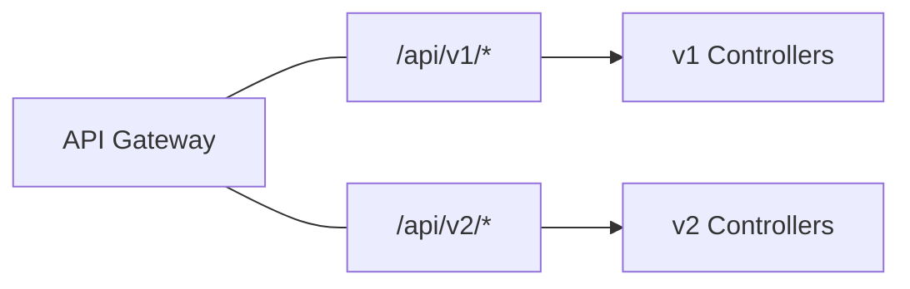
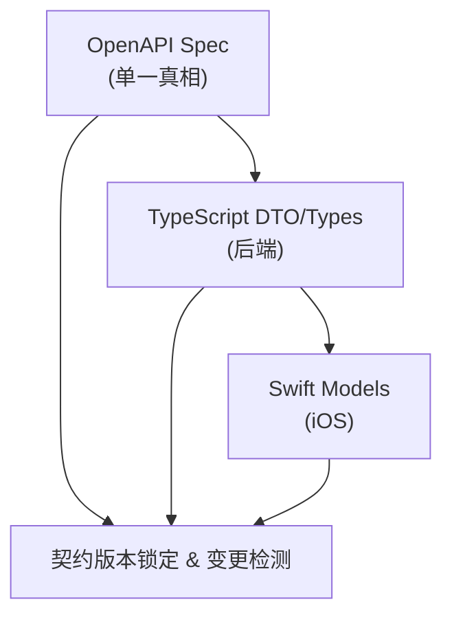

# Readmigo 全栈版本管理设计

## 1. 概述

本文档定义 Readmigo 项目的版本管理策略，涵盖 iOS 客户端、后端 API、数据库迁移的版本控制与升级机制。

### 1.1 当前状态

| 组件 | 当前版本 | 版本位置 |
|------|---------|---------|
| iOS App | 1.0 (Build 1) | `ios/Readmigo/Info.plist` |
| Backend | 0.1.0 | `apps/backend/package.json` |
| API | v1 | `app.setGlobalPrefix('api/v1')` |
| Database | Prisma migrations | `packages/database/prisma/` |

### 1.2 统一版本号策略

> **核心决策：全栈使用统一版本号，简化版本管理复杂度。**

**优势：**
- 一目了然的版本对应关系
- 简化发版流程和沟通
- 降低版本兼容性判断复杂度
- 便于问题追溯和回滚

### 1.3 缺失的功能

- 版本检查 API
- 强制更新机制
- 版本废弃策略
- 灰度更新配置
- API 版本兼容性管理
- **API 契约锁定机制**
- **向后兼容性规则**
- **客户端防御性解析**

### 1.4 核心原则

> **客户端一旦发版，接口不可修改。** 任何接口变更都必须保证向后兼容，或通过新版本 API 提供。

---

## 2. 统一版本号规范

### 2.1 语义化版本 (Semantic Versioning)

全栈统一采用 `MAJOR.MINOR.PATCH` 格式：

### 2.2 版本号存储位置（单一真相来源）

**version.json 结构：**

### 2.3 各组件版本同步

| 组件 | 版本来源 | 同步方式 |
|------|---------|---------|
| iOS App | `version.json` | 构建脚本自动同步到 Info.plist |
| Backend | `version.json` | 启动时读取或构建时同步 |
| API 路由 | 固定 `/api/v1` | MAJOR 版本变更时新增 `/api/v2` |
| Database | `version.json` | Migration 文件名包含版本号 |
| Sentry | `version.json` | 启动时读取 |

### 2.4 版本同步脚本

### 2.5 版本递增规则

**package.json scripts：**

### 2.6 iOS Build Number 策略

**Build Number 规则：**
- 同一 Marketing Version 可以有多个 Build（用于 TestFlight 迭代）
- 提交 App Store 时 Build Number 必须递增
- Build Number 独立于语义化版本，仅用于 App Store 区分构建

---

## 3. API 版本策略

### 3.1 URL 路径版本控制

### 3.2 版本共存策略

**实现方式（NestJS）：**

### 3.3 API 版本生命周期

| 状态 | 含义 | 客户端处理 |
|------|------|-----------|
| `current` | 当前推荐版本 | 正常使用 |
| `supported` | 仍然支持 | 可使用，建议升级 |
| `deprecated` | 已废弃 | 提示用户升级 |
| `sunset` | 已下线 | 返回 410 Gone |

---

## 4. API 契约管理（核心）

> 本章节解决"客户端发版后接口不能修改"的问题，确保接口稳定性和数据结构一致性。

### 4.1 契约管理架构

### 4.2 OpenAPI 作为单一真相来源

**导出 OpenAPI 规范文件：**

**版本化存储：**

### 4.3 向后兼容性规则（铁律）

#### 4.3.1 允许的变更（向后兼容）

| 变更类型 | 示例 | 说明 |
|---------|------|------|
| 添加可选字段 | `newField?: string` | 客户端忽略未知字段 |
| 添加新接口 | `GET /api/v1/new-endpoint` | 不影响现有接口 |
| 扩展枚举值 | `status: 'A' \| 'B' \| 'C'` → 添加 `'D'` | 客户端需容错处理 |
| 放宽字段约束 | `minLength: 5` → `minLength: 1` | 更宽松的验证 |
| 添加可选参数 | `?newParam=value` | 默认值处理 |

#### 4.3.2 禁止的变更（Breaking Changes）

| 变更类型 | 示例 | 后果 |
|---------|------|------|
| 删除字段 | 移除 `user.email` | 客户端解析失败/crash |
| 重命名字段 | `userName` → `displayName` | 客户端找不到字段 |
| 修改字段类型 | `id: number` → `id: string` | 类型转换失败 |
| 修改必填性 | `name?: string` → `name: string` | 旧数据缺失字段 |
| 删除枚举值 | 移除 `status: 'PENDING'` | 未知枚举值 |
| 修改 URL 路径 | `/users` → `/members` | 404 错误 |
| 修改 HTTP 方法 | `GET` → `POST` | 请求失败 |

#### 4.3.3 字段废弃流程（3 版本周期）

**DTO 中的废弃标记：**

### 4.4 响应体版本标识

#### 4.4.1 响应头标识

#### 4.4.2 统一响应包装

**响应示例：**

### 4.5 客户端防御性解析（iOS）

#### 4.5.1 Swift Codable 容错策略

#### 4.5.2 模型定义最佳实践

#### 4.5.3 API 响应解码器配置

### 4.6 接口变更审批流程

#### 4.6.1 PR 变更检测（CI/CD）

#### 4.6.2 Breaking Change 检测规则

#### 4.6.3 变更审批模板

### 4.7 统一版本兼容性（简化）

由于全栈使用统一版本号，版本兼容性判断大幅简化：

**version.json 作为唯一配置来源：**

**后端版本检查逻辑简化：**

---

## 5. 版本检查 API 设计

### 5.1 新增数据库模型

### 5.2 版本检查接口

**Request:**

**Response:**

### 5.3 强制更新逻辑

---

## 6. iOS 客户端版本检查实现

### 6.1 启动时检查

### 6.2 强制更新 UI

### 6.3 入口集成

---

## 7. 数据库迁移策略

### 7.1 Prisma Migration 工作流

### 7.2 Migration 命名规范

### 7.3 Breaking Changes 处理

1. **添加字段**：使用 `@default()` 或可选字段
2. **删除字段**：先标记 deprecated，下个版本再删除
3. **修改字段类型**：创建新字段 → 迁移数据 → 删除旧字段

---

## 8. 灰度发布策略

### 8.1 后端灰度（Feature Flags）

### 8.2 iOS 灰度

使用 TestFlight 分组：
- Internal Testing：开发团队
- External Testing - Beta：10% 用户
- External Testing - RC：50% 用户
- App Store Release：100% 用户

---

## 9. 版本发布 Checklist（统一版本）

### 9.1 版本递增（第一步）

执行后自动同步到所有组件：
- [x] `version.json` 已更新
- [x] `package.json` 已同步
- [x] `Info.plist` 已同步
- [x] `project.pbxproj` 已同步

### 9.2 后端发布

- [ ] 运行 `prisma migrate deploy`
- [ ] 部署后端服务
- [ ] 验证健康检查 `/health`
- [ ] 验证版本接口 `/api/v1/version/check` 返回新版本

### 9.3 iOS 发布

- [ ] 递增 Build Number（如需提交 App Store）
- [ ] Archive 并上传到 App Store Connect
- [ ] 提交 TestFlight 测试
- [ ] 提交 App Store 审核

### 9.4 发布后验证

- [ ] 确认新版本客户端能正常请求 API
- [ ] 确认旧版本客户端仍能正常使用（向后兼容）
- [ ] 监控 Sentry 错误报告

### 9.5 协同发布流程（Breaking Changes）

当需要 MAJOR 版本升级时：

---

## 10. 监控与告警

### 10.1 版本分布监控

通过 `runtime_logs` 表统计各版本使用情况：

### 10.2 告警规则

| 指标 | 阈值 | 动作 |
|------|------|------|
| 旧版本占比 | > 30% | 考虑强制更新 |
| 崩溃率增加 | > 50% | 回滚或热修复 |
| API v1 调用量 | < 5% | 可安全下线 |

---

## 11. 实施计划

### Phase 0: 上线前必须（立即执行）

**目标：确保首版客户端上线后接口稳定性**

1. **锁定当前 API 契约**
   - 导出 OpenAPI v1.json 作为基线
   - 建立 `openapi/` 版本化目录
   - 配置 CI 自动检测 API 变更

2. **iOS 客户端防御性解析**
   - 实现 `SafeDecodable` 和 `UnknownCaseCodable`
   - 更新所有 Codable 模型使用可选字段
   - 配置容错的 JSONDecoder

3. **版本检查基础设施**
   - 创建 `AppVersion` 数据库表
   - 实现 `/api/v1/version/check` 接口
   - iOS 集成强制更新 UI

### Phase 1: 契约管理自动化

1. 配置 GitHub Actions API 变更检测
2. 添加 PR Breaking Change 审批流程
3. 建立 API 变更日志自动生成

### Phase 2: 监控与响应

1. 版本分布 Dashboard
2. 异常解析错误告警
3. 客户端崩溃版本追踪

### Phase 3: 灰度与多版本

1. Feature Flags 服务
2. API 多版本共存架构
3. 灰度发布流程

---

## 12. API 变更记录

| 版本 | 日期 | 变更内容 | 影响 |
|------|------|---------|------|
| v1 | 2024-12-21 | 初始版本 | - |

---

## 附录 A: 版本比较工具函数

---

## 附录 B: 上线前 Checklist 总结

### 统一版本号基础设施（必须）

- [ ] 创建 `/version.json` 统一版本配置文件
- [ ] 创建 `scripts/sync-version.sh` 版本同步脚本
- [ ] 创建 `scripts/bump-version.js` 版本递增脚本
- [ ] 配置 `package.json` 版本管理 scripts

### 接口稳定性保障（必须）

- [ ] **后端**：导出并锁定 OpenAPI v1.json 基线文件
- [ ] **后端**：配置响应头 `X-API-Version` 和 `X-Schema-Version`
- [ ] **后端**：确保所有响应字段有明确类型，新增字段必须可选
- [ ] **iOS**：实现 `SafeDecodable` 属性包装器
- [ ] **iOS**：实现 `UnknownCaseCodable` 枚举容错
- [ ] **iOS**：所有非必需字段使用可选类型 `?`
- [ ] **iOS**：JSONDecoder 配置日期容错解析

### 版本控制（必须）

- [ ] **后端**：实现 `/api/v1/version/check` 接口（读取 version.json）
- [ ] **iOS**：实现 `VersionManager` 和 `ForceUpdateView`
- [ ] **iOS**：App 启动时进行版本检查

### 流程规范（推荐）

- [ ] 建立 API 变更 PR 模板
- [ ] 配置 CI Breaking Change 检测
- [ ] 制定 3 版本废弃周期规范

---

## 附录 C: 核心原则速查

| 原则 | 说明 |
|------|------|
| **统一版本号** | 全栈使用 `version.json` 作为唯一版本来源 |
| **只增不删** | 永远不删除已发布的字段和接口 |
| **可选新增** | 新增字段必须是可选的，带默认值 |
| **客户端容错** | 客户端必须能处理未知字段和枚举值 |
| **版本锁定** | 发版前锁定 OpenAPI 基线，不可变更 |
| **3 版本周期** | 废弃字段至少保留 3 个客户端版本 |
| **先部署后端** | Breaking Change 时先部署后端，保留旧版本 |
| **强制更新兜底** | 实在不兼容时，通过强制更新解决 |

---

*文档版本: 1.0.0*
*最后更新: 2024-12-21*
