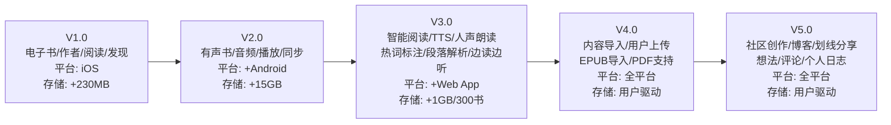
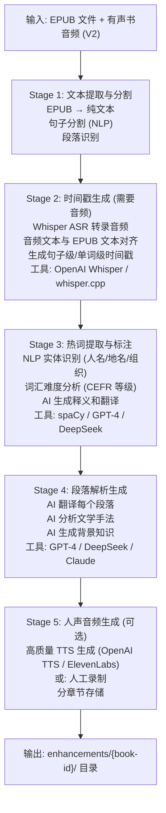
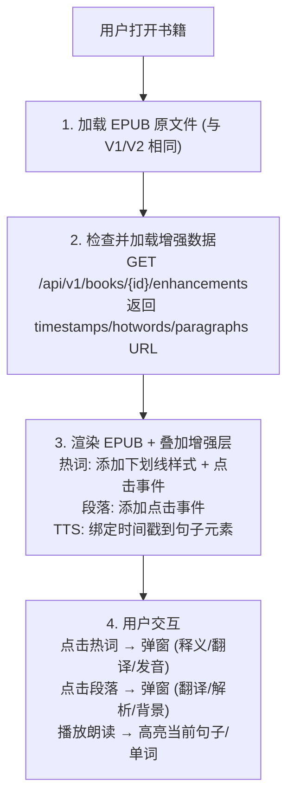
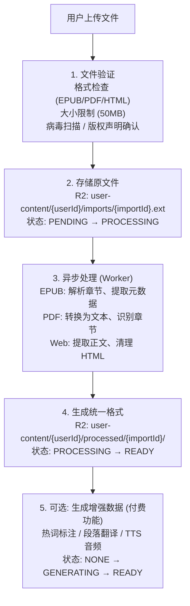

# 版本演进路线图 V1-V5

> V1: iOS首发 | V2: Android+有声书 | V3: Web+智能阅读 | V4: 内容导入 | V5: 社区与创作

---

## 版本全景图

### 平台支持矩阵

| 版本 | iOS | Android | Web App | 新增功能 |
|------|-----|---------|---------|----------|
| V1.0 | ✅ | ❌ | ❌ | 电子书/作者/阅读/发现 |
| V2.0 | ✅ | ✅ | ❌ | 有声书 |
| V3.0 | ✅ | ✅ | ✅ | 智能阅读增强 |
| V4.0 | ✅ | ✅ | ✅ | 内容导入 |
| V5.0 | ✅ | ✅ | ✅ | 社区与创作 |

---

## V3: 智能阅读增强

### 功能清单

| 功能 | 描述 | 数据需求 |
|------|------|----------|
| **TTS 朗读** | 系统 TTS 实时朗读 | 无需预存储 |
| **人声朗读** | 预录制高质量人声 | 需要音频文件 |
| **边读边听** | 阅读时高亮当前朗读位置 | 需要时间戳数据 |
| **热词标注** | 重要词汇预先标记 | 需要词汇元数据 |
| **段落解析** | 点击段落显示翻译/解析 | 需要段落元数据 |

### 核心问题：是否修改原 EPUB？

### V3 新增存储结构

### 各增强数据详细设计

#### 1. 时间戳数据 (timestamps.json)

#### 2. 热词标注数据 (hotwords.json)

#### 3. 段落解析数据 (paragraphs.json)

### V3 数据生成流水线

### V3 存储估算

| 数据类型 | 单书大小 | 300 书总量 | 说明 |
|----------|----------|------------|------|
| timestamps.json | ~500KB | ~150MB | 句子级时间戳 |
| hotwords.json | ~1MB | ~300MB | 热词标注 |
| paragraphs.json | ~2MB | ~600MB | 段落解析 |
| TTS 音频 (可选) | ~50MB | ~15GB | 高质量人声 |
| **总计 (无音频)** | ~3.5MB | **~1GB** | 纯元数据 |
| **总计 (含音频)** | ~53MB | **~16GB** | 含人声朗读 |

### V3 客户端渲染流程

---

## V4: 内容导入

### 功能清单

| 功能 | 描述 | 技术挑战 |
|------|------|----------|
| **EPUB 导入** | 用户上传自有 EPUB | 格式验证、存储 |
| **PDF 导入** | 用户上传 PDF 文档 | PDF 解析、转换 |
| **网页导入** | 保存网页文章 | 内容提取、清洗 |
| **导入书籍阅读** | 与平台书籍相同体验 | 统一阅读器 |
| **可选增强** | 对导入内容生成增强数据 | 按需处理 |

### V4 存储架构

### V4 数据模型

### V4 导入处理流程

### V4 存储配额

| 用户等级 | 导入数量 | 总存储 | 增强数据 |
|----------|----------|--------|----------|
| 免费用户 | 5 本 | 100MB | 不支持 |
| 订阅用户 | 50 本 | 1GB | 5 本/月 |
| 高级用户 | 无限 | 10GB | 无限 |

---

## V5: 社区与创作

### 功能清单

| 功能 | 描述 | 数据需求 |
|------|------|----------|
| **博客** | 用户发布读书笔记/文章 | 富文本+图片 |
| **划线分享** | 分享书中精彩段落 | 引用+评论 |
| **想法** | 简短的读书感想 | 短文本+标签 |
| **评论** | 对书籍/文章的评论 | 文字+图片+回复 |
| **个人日志** | 私密的阅读日记 | 富文本+日期 |

### V5 存储架构

### V5 数据模型

### V5 富文本内容格式

---

## 版本间存储对比

---

## Manifest 版本演进

---

## API 版本策略

| 版本 | API 路径 | 新增端点 |
|------|----------|----------|
| V1-V2 | /api/v1 | 基础 + 有声书 |
| V3 | /api/v1 | /books/{id}/enhancements |
| V4 | /api/v1 | /imports, /imports/{id}/enhance |
| V5 | /api/v1 | /posts, /thoughts, /journals, /feed |

> 所有版本共用 /api/v1，通过 manifest features 控制客户端功能

---

## 执行优先级建议

---

*文档版本: 1.0*
*创建日期: 2025-12-31*
*关联文档: v1-fullstack-release-plan.md, r2-versioning-strategy.md*
