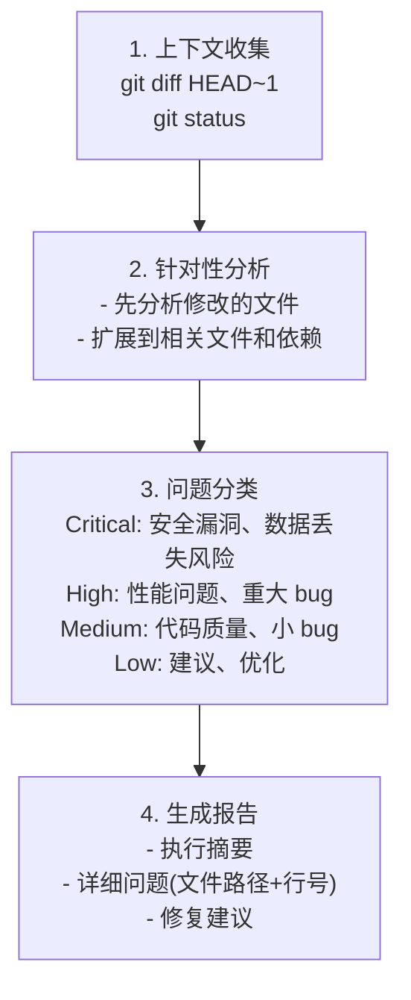
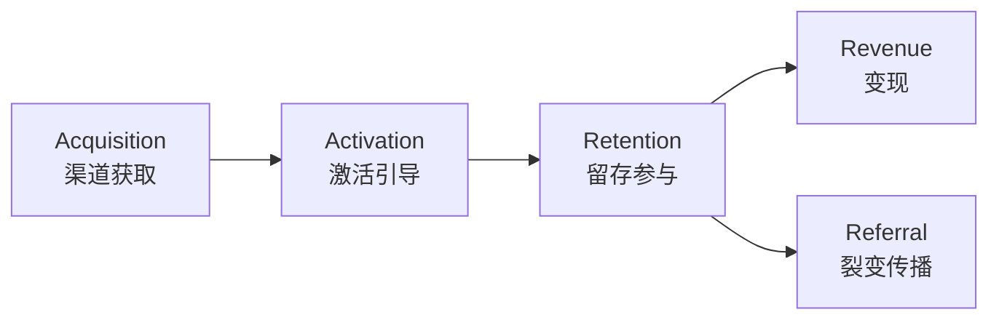
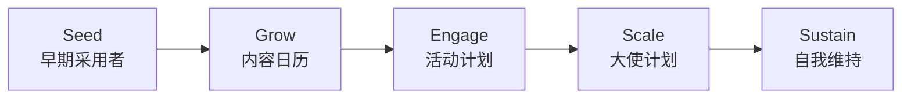

# Claude Code Agents 使用教程

## 目录

1. [Agent 概述](#agent-概述)
2. [Agent 目录结构](#agent-目录结构)
3. [核心 Agents 详解](#核心-agents-详解)
4. [Agent 调用方式](#agent-调用方式)
5. [Agent 链式调用](#agent-链式调用)
6. [实战场景](#实战场景)
7. [自定义 Agent](#自定义-agent)
8. [最佳实践](#最佳实践)

---

## Agent 概述

### 什么是 Agent？

Agent 是具有特定专业能力的 AI 助手，每个 Agent：

| 特性 | 说明 |
|------|------|
| **专业化** | 专注于特定领域（安全、测试、架构等）|
| **隔离执行** | 独立上下文，防止交叉污染 |
| **主动触发** | 基于关键词和上下文自动激活 |
| **最小权限** | 仅授予必要的工具权限 |
| **可链式调用** | 多个 Agent 组合完成复杂任务 |

### Agent vs 传统命令

---

## Agent 目录结构

---

## 核心 Agents 详解

### 1. code-auditor - 代码审计师

**职责**: 代码质量保证

**工具权限**: Read, Grep, Glob, Bash, WebFetch

**自动触发**: 代码变更后、PR 审查、重构

**调用示例**:

---

### 2. security-auditor - 安全审计师

**职责**: 安全漏洞检测、合规审计

**专业领域**:
- OWASP Top 10
- 威胁建模
- 渗透测试
- 认证/授权分析
- 依赖漏洞扫描

**核心原则**:

| 原则 | 说明 |
|------|------|
| 纵深防御 | 多层冗余控制 |
| 最小权限 | 最小必要访问 |
| 不信任输入 | 所有外部输入视为恶意 |
| 安全失败 | 错误时默认安全状态 |

**调用示例**:

---

### 3. test-engineer - 测试工程师

**职责**: 自动化测试生成、覆盖率分析

**工具权限**: Read, Write, Edit, Bash, Grep, Glob

**测试类型**:

**覆盖率目标**:
- 行覆盖率: >90%
- 分支覆盖率: >85%
- 函数覆盖率: >95%
- 关键路径: 100%

**调用示例**:

---

### 4. task-orchestrator - 任务编排器

**职责**: 复杂任务分解、依赖管理、并行执行优化

**工具权限**: Read, Write, Edit, Bash, Grep, Glob, TodoWrite

**任务分解结构**:

**依赖类型**:

| 类型 | 说明 |
|------|------|
| Sequential | Task B 需要 Task A 完成 |
| Parallel | 可同时运行 |
| Blocking | 阻塞所有依赖任务 |
| Soft | 首选但非必需的顺序 |

**优先级矩阵**:

---

### 5. project-architect - 项目架构师

**职责**: 项目脚手架、最佳实践、工具配置

**工具权限**: Read, Write, Edit, Bash, Glob, TodoWrite

**调用示例**:

---

### 6. release-manager - 发布管理器

**职责**: 版本管理、变更日志、部署、回滚

**工具权限**: Read, Write, Edit, Bash, Grep, Glob, WebFetch

**调用示例**:

---

### 7. strategic-analyst - 战略分析师

**职责**: 场景规划、风险评估、决策建模

**调用示例**:

---

## 市场运营类 Agents 详解

### 1. marketing-strategist - 市场策略专家

**职责**: 市场策略规划、品牌定位、渠道优化

**核心能力**:
- 品牌策略：定位、信息传递、视觉规范
- 活动策划：营销活动设计、时间线、预算分配
- 渠道策略：数字营销、社交媒体、付费广告
- 绩效营销：ROI 优化、转化漏斗分析

**调用示例**:

---

### 2. growth-hacker - 增长黑客

**职责**: 用户获取、留存优化、转化提升

**AARRR 漏斗框架**:

**实验优先级 (ICE)**:
| 实验 | Impact | Confidence | Ease | ICE |
|------|--------|------------|------|-----|
| A/B 测试注册流程 | 8 | 7 | 9 | 24 |
| 推送通知优化 | 7 | 6 | 8 | 21 |

**调用示例**:

---

### 3. content-creator - 内容创作者

**职责**: 博客文章、社交媒体、视频脚本、营销文案

**内容类型矩阵**:
| 类型 | 平台 | 格式 | 目标 |
|------|------|------|------|
| Blog | 网站 | 长文 | SEO, 权威 |
| Social | Twitter | Thread | 互动 |
| Social | LinkedIn | 文章 | B2B 获客 |
| Video | YouTube | 教程 | 教育 |
| Email | 邮件 | 简报 | 留存 |

**调用示例**:

---

### 4. aso-specialist - ASO 专家

**职责**: 应用商店优化、关键词研究、转化率提升

**ASO 优化领域**:

**平台差异**:
| 元素 | iOS App Store | Google Play |
|------|--------------|-------------|
| 标题 | 30 字符 | 30 字符 |
| 副标题 | 30 字符 | 80 字符 |
| 关键词 | 100 字符(隐藏) | 在描述中 |

**调用示例**:

---

### 5. community-manager - 社区运营

**职责**: 社区建设、用户互动、反馈收集

**社区生命周期**:

**互动策略**:
| 策略 | 频率 | 目标 |
|------|------|------|
| 每日讨论 | 每日 | 互动 |
| 每周亮点 | 每周 | 认可 |
| AMA 活动 | 双周 | 透明度 |
| 社区挑战 | 每月 | 激活 |

**调用示例**:

---

### 6. competitive-analyst - 竞品分析师

**职责**: 竞品追踪、市场定位、竞争情报

**竞品分析框架**:

**监控清单**:
| 领域 | 频率 | 来源 |
|------|------|------|
| 产品更新 | 每周 | 应用商店、changelog |
| 定价变化 | 每月 | 官网 |
| 营销活动 | 每周 | 社交、广告 |
| 用户评论 | 每日 | 应用商店 |
| 融资新闻 | 每周 | 媒体、Crunchbase |

**调用示例**:

---

### 7. market-researcher - 市场研究员

**职责**: 市场分析、行业研究、市场规模评估

**市场规模金字塔**:

**调用示例**:

---

### 8. gtm-strategist - GTM 策略师

**职责**: 产品上市、市场进入、发布策划

**GTM 框架**:

**发布时间线**:

**调用示例**:

---

### 9. user-researcher - 用户研究员

**职责**: 用户访谈、画像开发、旅程地图

**研究方法矩阵**:
| 方法 | 适用场景 | 数据类型 | 时长 |
|------|----------|----------|------|
| 用户访谈 | 深度洞察 | 定性 | 1-2 周 |
| 问卷调查 | 验证假设 | 定量 | 1 周 |
| 可用性测试 | UX 评估 | 混合 | 1-2 周 |
| 日记研究 | 行为追踪 | 定性 | 2-4 周 |

**用户画像模板**:

**调用示例**:

---

## Agent 调用方式

### 方式 1: 显式调用

### 方式 2: 自动触发

Agent 会根据关键词自动激活：

| 关键词 | 触发的 Agent |
|--------|-------------|
| "review code", "code quality" | code-auditor |
| "security", "vulnerability" | security-auditor |
| "performance", "optimize" | performance-auditor |
| "test", "coverage" | test-engineer |
| "release", "deploy" | release-manager |
| "architecture", "design" | architecture-auditor |

### 方式 3: 组合调用

---

## Agent 链式调用

### 模式 1: 顺序分析

**适用场景**: 全面代码审查

---

### 模式 2: 并行分析

**适用场景**: 调查复杂问题

---

### 模式 3: 迭代改进

**适用场景**: 确保高代码质量

---

### 模式 4: 战略到战术

**适用场景**: 规划新功能或项目

---

## 实战场景

### 场景 1: 新功能开发

---

### 场景 2: Bug 修复流程

---

### 场景 3: 技术债务清理

---

### 场景 4: 安全事件响应

---

### 场景 5: 产品发布营销

---

## 自定义 Agent

### Agent 文件结构

### 示例: 创建 iOS 专家 Agent

### 创建 Agent 的最佳实践

| 原则 | 说明 |
|------|------|
| **单一职责** | 一个 Agent，一个领域 |
| **明确触发** | 使用 "MUST BE USED" 和 "PROACTIVELY" |
| **最小工具** | 仅授予必要权限 |
| **结构化输出** | 定义一致的输出格式 |

---

## 最佳实践

### Agent 选择指南

| 任务类型 | 推荐 Agent |
|----------|-----------|
| 代码质量检查 | code-auditor |
| 安全漏洞扫描 | security-auditor |
| 性能优化 | performance-auditor |
| 架构评审 | architecture-auditor |
| 测试生成 | test-engineer |
| 项目设置 | project-architect |
| 发布管理 | release-manager |
| 复杂任务分解 | task-orchestrator |
| 战略决策 | strategic-analyst |
| 市场策略规划 | marketing-strategist |
| 用户增长分析 | growth-hacker |
| 内容创作 | content-creator |
| 应用商店优化 | aso-specialist |
| 社区运营 | community-manager |
| 竞品分析 | competitive-analyst |
| 市场调研 | market-researcher |
| 产品上市策略 | gtm-strategist |
| 用户研究 | user-researcher |

### 效率提升技巧

### 常见错误避免

| 错误 | 正确做法 |
|------|----------|
| 跳过代码审查 | 任何代码变更后使用 code-auditor |
| 忽略安全检查 | 涉及认证/数据时使用 security-auditor |
| 手写所有测试 | 让 test-engineer 生成基础测试 |
| 直接发布 | 使用 release-manager 准备发布 |
| 盲目重构 | 先用 architecture-auditor 分析 |

---

## Agent 能力矩阵

| Agent | Read | Write | Edit | Bash | MCP | WebFetch | 主要职责 |
|-------|------|-------|------|------|-----|----------|----------|
| code-auditor | Y | - | - | Y | - | Y | 代码质量 |
| security-auditor | Y | Y | Y | Y | Y | Y | 安全审计 |
| performance-auditor | Y | - | - | Y | - | - | 性能优化 |
| architecture-auditor | Y | - | - | Y | - | - | 架构评审 |
| test-engineer | Y | Y | Y | Y | - | - | 测试生成 |
| project-architect | Y | Y | Y | Y | - | - | 项目设置 |
| task-orchestrator | Y | Y | Y | Y | - | - | 任务编排 |
| release-manager | Y | Y | Y | Y | - | Y | 发布管理 |
| strategic-analyst | Y | Y | - | Y | Y | Y | 战略分析 |
| integration-manager | Y | Y | - | Y | Y | Y | 集成管理 |
| marketing-strategist | Y | Y | - | - | - | Y | 市场策略 |
| growth-hacker | Y | Y | - | - | - | Y | 用户增长 |
| content-creator | Y | Y | Y | - | - | - | 内容创作 |
| aso-specialist | Y | Y | - | - | - | Y | ASO优化 |
| community-manager | Y | Y | - | - | - | - | 社区运营 |
| competitive-analyst | Y | Y | - | - | - | Y | 竞品分析 |
| market-researcher | Y | Y | - | - | - | Y | 市场调研 |
| gtm-strategist | Y | Y | - | - | - | Y | 产品上市 |
| user-researcher | Y | Y | - | - | - | Y | 用户研究 |

---

## 快速参考

### 常用调用短语

### Agent 链快速参考

---

*文档位置: `docs/09-reference/agents-guide.md`*
*最后更新: 2026-01-24*
