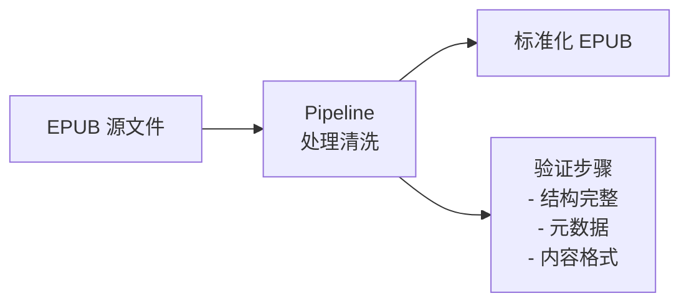

# EPUB 格式标准参考

## 概述

EPUB (Electronic Publication) 是由 W3C 维护的开放电子书标准。当前最新版本为 **EPUB 3.3**（2023 年发布）。

| 版本 | 发布时间 | 主要特性 |
|------|---------|---------|
| EPUB 2.0 | 2007 | 基础格式，XHTML 1.1 |
| EPUB 3.0 | 2011 | HTML5、SVG、MathML、媒体叠加 |
| EPUB 3.2 | 2019 | 简化规范，移除 NCX 要求 |
| EPUB 3.3 | 2023 | 可访问性增强，W3C 正式推荐标准 |

官方规范：https://www.w3.org/TR/epub-33/

---

## 文件结构

EPUB 本质是一个 **ZIP 压缩包**，扩展名改为 `.epub`。

---

## 必须的文件

### 1. mimetype

**要求**：
- 必须是 ZIP 包的第一个文件
- 不能压缩（store 模式）
- 无换行符

### 2. container.xml

位于 `META-INF/container.xml`，指向 Package Document 位置。

### 3. Package Document (content.opf)

EPUB 的核心元数据文件，包含三个主要部分：

| 部分 | 作用 | 必须元素 |
|------|------|---------|
| `<metadata>` | 书籍元数据 | dc:identifier, dc:title, dc:language |
| `<manifest>` | 资源清单 | 所有文件的 id、href、media-type |
| `<spine>` | 阅读顺序 | itemref 引用 manifest 中的 id |

#### Metadata 必须字段

| 字段 | 说明 | 示例 |
|------|------|------|
| `dc:identifier` | 唯一标识符 (ISBN/UUID) | `urn:uuid:12345-67890` |
| `dc:title` | 书名 | `Pride and Prejudice` |
| `dc:language` | 语言代码 (BCP 47) | `en`, `zh-CN` |

#### Metadata 推荐字段

| 字段 | 说明 |
|------|------|
| `dc:creator` | 作者 |
| `dc:publisher` | 出版商 |
| `dc:date` | 出版日期 |
| `dc:description` | 描述 |
| `dc:subject` | 主题分类 |
| `dcterms:modified` | 最后修改时间 |

### 4. Navigation Document (toc.xhtml)

EPUB 3 的导航文档，使用 `<nav>` 元素。

**必须包含**：
- `epub:type="toc"` 的 nav 元素（目录）

**可选包含**：
- `epub:type="landmarks"` 的 nav 元素（地标）
- `epub:type="page-list"` 的 nav 元素（页码对应）

---

## 内容文档格式

### XHTML 要求

EPUB 3 使用 **XHTML5**（XML 序列化的 HTML5）。

| 要求 | 说明 |
|------|------|
| XML 声明 | `<?xml version="1.0" encoding="UTF-8"?>` |
| DOCTYPE | 可选，推荐省略 |
| 命名空间 | `xmlns="http://www.w3.org/1999/xhtml"` |
| EPUB 命名空间 | `xmlns:epub="http://www.idpf.org/2007/ops"` |
| 标签闭合 | 所有标签必须正确闭合 |
| 属性引号 | 所有属性值必须用引号 |

### 支持的媒体类型

| 类型 | MIME Type | 说明 |
|------|-----------|------|
| XHTML | `application/xhtml+xml` | 内容文档 |
| CSS | `text/css` | 样式表 |
| JPEG | `image/jpeg` | 图片 |
| PNG | `image/png` | 图片 |
| GIF | `image/gif` | 图片 |
| SVG | `image/svg+xml` | 矢量图 |
| WOFF | `font/woff` | 字体 |
| WOFF2 | `font/woff2` | 字体 |
| MP3 | `audio/mpeg` | 音频 |
| MP4 | `video/mp4` | 视频 |

---

## epub:type 语义标注

EPUB 3 使用 `epub:type` 属性标注内容语义。

### 结构语义

| 值 | 用途 |
|------|------|
| `frontmatter` | 前言部分 |
| `bodymatter` | 正文部分 |
| `backmatter` | 后记部分 |
| `cover` | 封面 |
| `titlepage` | 书名页 |
| `toc` | 目录 |
| `chapter` | 章节 |
| `part` | 部分 |
| `prologue` | 序章 |
| `epilogue` | 尾声 |
| `appendix` | 附录 |
| `glossary` | 词汇表 |
| `index` | 索引 |
| `footnote` | 脚注 |
| `endnote` | 尾注 |

---

## Standard Ebooks (SE) 标准

SE 是在 EPUB 3 基础上的**出版级增强标准**，要求更严格。

### SE vs 普通 EPUB

| 维度 | 普通 EPUB 3 | SE 标准 |
|------|-------------|---------|
| 文件命名 | 任意 | 严格规范 (chapter-1.xhtml) |
| 目录结构 | 灵活 | 固定 (src/epub/text/) |
| CSS | 自定义 | 三层系统 (core/se/local) |
| Metadata | 基本字段 | 完整的 dc:* + se:* |
| 语义标注 | 推荐 | 必须 |
| 可访问性 | 推荐 | WCAG AA 必须 |
| 封面 | 任意图片 | SVG 生成 + 特定尺寸 |
| 排版 | 基本 | 出版级（引号、破折号、间距） |

### SE 工具链

官方手册：https://standardebooks.org/manual/latest

---

## Readmigo 项目中的 EPUB 处理

### 内容来源

| 来源 | 格式质量 | 处理方式 |
|------|---------|---------|
| Standard Ebooks | 出版级 | 直接使用 |
| Project Gutenberg | 基础级 | Pipeline 清洗 |
| 用户上传 | 不确定 | 验证 + 修复 |

### 处理流程

### 相关文档

- [EPUB 阅读器架构决策](../03-architecture/epub-architecture-decision.md)
- [EPUB 移动端最佳实践](../03-architecture/epub-mobile-best-practices.md)
- [书籍导入系统](../10-pipeline/book-import-system.md)

---

## 参考资源

| 资源 | 链接 |
|------|------|
| EPUB 3.3 规范 | https://www.w3.org/TR/epub-33/ |
| EPUB 可访问性 | https://www.w3.org/TR/epub-a11y-11/ |
| Standard Ebooks 手册 | https://standardebooks.org/manual/latest |
| IDPF EPUB 语义词汇表 | https://idpf.github.io/epub-vocabs/structure/ |
| epubcheck 验证工具 | https://github.com/w3c/epubcheck |
