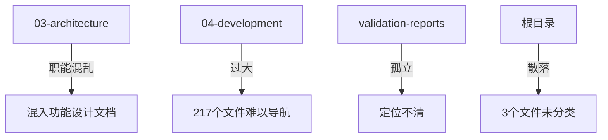

# Readmigo 文档整理报告 (2026-01)

> 生成日期：2026-01-23
> 扫描范围：481 个 Markdown 文件
> 执行工具：Claude Code + 10 个并行 Agent

---

## 一、文档规模统计

| 目录 | 文件数 | 说明 |
|------|--------|------|
| 00-market | 13 | 市场与增长（GTM、竞品、可行性） |
| 01-product | 26 | 产品与规划（PRD、路线图、功能设计） |
| 02-design | 7 | 设计系统（排版、交互、视觉） |
| 03-architecture | 19 | 技术架构（系统、API、数据库） |
| 04-development | 217 | 开发文档（iOS/Android/Web/RN/后端） |
| 05-operations | 48 | 部署运维（环境、CI/CD、监控） |
| 06-content | 30+ | 内容运营（书单、分类、数据源） |
| 07-modules | 69 | 功能模块（阅读器、有声书、作者） |
| 08-releases | 9 | 版本发布（路线图、发布历史） |
| 09-reference | 12 | 参考资料（法律、算法、元文档） |
| validation-reports | 2 | 验证报告 |
| **总计** | **450+** | |

---

## 二、质量问题清单

### 严重问题 (P0/P1)

| 优先级 | 问题 | 影响文件 | 建议处理 |
|--------|------|----------|----------|
| **P0** | R2 Access Key 泄露 | `05-operations/deployment/environments.md` | 立即轮换密钥，删除敏感信息 |
| **P1** | 根目录散落文件 | 3 个文件 | 已移动到对应目录 |
| **P1** | 重复文档 | `epub-reader-mobile-issues*.md` | 建议合并为单一文档 |

### 高优先级问题 (P2)

| 问题 | 影响文件 | 建议处理 |
|------|----------|----------|
| 环境配置文档冗余 | 4 个文件（70% 重复） | 整合为 2 个文件 |
| 设计系统文档分散 | 6 个 design-system*.md | 建立 SSOT，其他改为链接 |
| V1 过时文档 | v1-*.md | 归档到 history/ |
| App Store 文档重复 | 3 个文件 | 整合 |

### 中等问题 (P3)

| 问题 | 影响 | 建议 |
|------|------|------|
| 浅层 README | 6 个文件仅含链接 | 补充模块概述 |
| TODO/FIXME 未追踪 | 5+ 个文件 | 转为 GitHub Issue |
| 文档同步标记缺失 | iOS 阅读器相关 | 添加同步关联标记 |
| 链接路径过深 | 多处 ../../../ | 改用绝对路径 |

---

## 三、结构重组建议

### 当前问题

### 建议的结构调整

| 调整项 | 当前 | 建议 |
|--------|------|------|
| 根目录文件 | 3 个散落 | 移到对应子目录 |
| validation-reports | 独立目录 | 合并到 06-content/validation/ |
| 04-development/pipeline | 子目录 | 独立为 10-pipeline/ |
| 03-architecture 功能文档 | 混入 | 移到 07-modules/ |

### 已执行的移动

---

## 四、各目录索引摘要

### 00-market (13 个文件)

| 文件 | 描述 |
|------|------|
| feasibility-assessment.md | 产品可行性评估与收益预估 |
| gtm-strategy.md | 市场推广策略与用户增长模型 |
| marketing-copy.md | 营销文案库 |
| operational-activities-design.md | 运营活动设计 |
| competitive/*.md | 竞品分析（阅读器、技术方案、数据源） |
| business/*.md | 商业计划（全球书籍销售） |
| research/*.md | 市场研究（API服务指南） |

### 01-product (26 个文件)

| 分类 | 文件 | 描述 |
|------|------|------|
| 核心 | prd.md | 完整产品需求文档 |
| 核心 | roadmap.md | 8周MVP开发路线图 |
| 商业 | subscription-design.md | Pro订阅设计（$7.99/月） |
| 商业 | membership-system.md | 会员体系完整设计 |
| 策略 | product-evolution-strategy.md | 产品演进策略 |
| 跨平台 | react-native-design-strategy.md | RN跨平台设计 |
| 跨平台 | ipad-design-strategy.md | iPad沉浸式阅读 |
| 功能 | features/social/*.md | 金句、明信片、作者对话 |
| 功能 | features/gamification/*.md | 勋章、年度报告 |
| 功能 | features/reading-enhancement/*.md | 人物关系、时间线、精读 |

### 02-design (7 个文件)

| 文件 | 描述 |
|------|------|
| design-system.md | 产品设计系统（品牌、色彩、字体） |
| typography-research.md | 专业排版技术调研 |
| book-display-styles.md | 7种书籍展示样式设计 |
| interaction-design.md | 交互设计规范 |
| highlight-sync-pipeline.md | 有声书高亮同步管道 |
| author-profile-redesign.md | 作者主页重设计 |

### 03-architecture (19 个文件)

| 分类 | 文件 | 描述 |
|------|------|------|
| 核心 | system-architecture.md | 整体系统架构图 |
| 核心 | client-architecture.md | 多端客户端架构 |
| 核心 | security.md | 安全设计（OAuth+JWT） |
| 核心 | scalability.md | 水平扩展策略 |
| API | api/api-design.md | API规范（37+端点） |
| API | api/backend-architecture.md | 后端模块划分 |
| API | api/database-design.md | 数据库设计（60+表） |
| 功能 | bilingual-reading-system.md | 双语阅读架构 |
| 功能 | chapter-storage-design.md | 章节存储设计 |

### 04-development (217 个文件)

| 平台 | 文件数 | 主要内容 |
|------|--------|----------|
| iOS | 50+ | Swift原生、阅读器引擎、功能模块 |
| Android | 20+ | Kotlin、Compose UI |
| Web | 15+ | Next.js、前端架构 |
| RN | 3 | Expo跨平台方案 |
| Dashboard | 3 | 运营管理平台 |
| Backend | 12 | 后端服务、数据流 |
| Pipeline | 43 | 数据管线系统 |

### 05-operations (48 个文件)

| 分类 | 内容 |
|------|------|
| deployment/ | 环境配置、CI/CD、平台部署 |
| infrastructure/ | 数据库、存储、域名管理 |
| monitoring/ | 日志、性能、Sentry |
| runbooks/ | 操作手册 |
| automation/ | 工作流自动化 |

**核心服务：** Fly.io + Neon PostgreSQL + Upstash Redis + Cloudflare R2

### 06-content (30+ 个文件)

| 分类 | 内容 |
|------|------|
| 核心策略 | content-data-strategy.md（三层数据架构） |
| 分类系统 | classification-system.md（12层级分类） |
| 书单 | staging-phase1/2/3-booklist.md |
| 数据源 | sources/（Gutenberg、SE、LibriVox等） |

**内容规模：** 1,000+ SE电子书 + 76,000+ PG公版书 + 20,000+ LibriVox有声书

### 07-modules (69 个文件)

| 模块 | 文件数 | 亮点 |
|------|--------|------|
| reader/ | 16 | 多格式渲染、物理翻页动画 |
| audiobook/ | 6 | 20,648+ 有声书 |
| author/ | 6 | 100+ 作者数据 |
| learning/ | 2 | SM-2 词汇算法 |
| account/ | 5 | 账户系统设计 |
| agora/ | 4 | 社区讨论功能 |

### 08-releases (9 个文件)

| 文件 | 描述 |
|------|------|
| complete-version-roadmap.md | V1-V5 完整路线图 |
| version-management-design.md | 版本管理设计规范 |
| release-history.md | 版本发布历史 |
| v1.0.0.md | V1.0.0 发布说明 |

### 09-reference (12 个文件)

| 分类 | 内容 |
|------|------|
| research/algorithm/ | 书籍排序算法设计 |
| legal/ | 隐私政策、服务条款（中英） |
| meta/ | 文档架构、重组计划 |

---

## 五、后续建议

### 立即执行

- [ ] 轮换 R2 Access Key（安全风险）
- [ ] 合并 epub-reader-mobile-issues 文档

### 近期执行

- [ ] 整合环境配置文档（4→2）
- [ ] 建立设计系统 SSOT
- [ ] 为 V1 文档添加归档标记

### 长期优化

- [ ] 独立 pipeline 为 10-pipeline/
- [ ] 补充浅层 README 内容
- [ ] 制定文档编写规范

---

## 六、附录

### 执行记录

| 时间 | 操作 | 结果 |
|------|------|------|
| 2026-01-23 | 并行启动 10 个 Agent | 全部完成 |
| 2026-01-23 | 生成目录索引 | 8 个目录完成 |
| 2026-01-23 | 质量检查 | 14 个问题识别 |
| 2026-01-23 | 结构重组分析 | 25-30 个文件需移动 |
| 2026-01-23 | 执行文件移动 | 5 个文件已移动 |
| 2026-01-23 | 更新 README | 进行中 |
