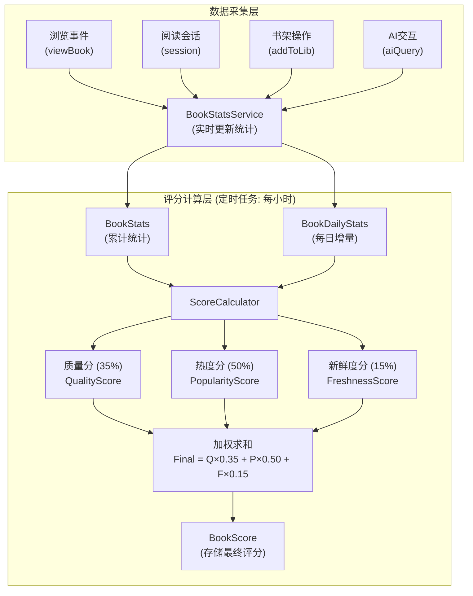
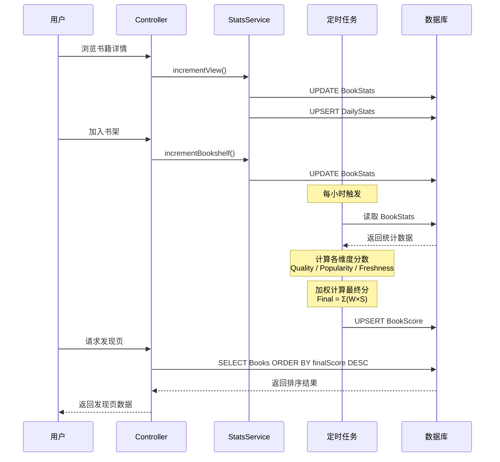

# 书籍推荐算法实施设计文档

> 基于现有后端架构的可执行实施方案
>
> 状态: 待 Review
> 创建日期: 2025-12-24

---

## 1. 现状分析

### 1.1 现有推荐功能

当前 `BooksService.getRecommendations()` 实现非常简单：

**问题**：
- 没有真正的个性化推荐
- 没有质量分、热度分计算
- popular 和 newArrivals 逻辑相同
- 缺少多样性控制

### 1.2 现有数据资产

| 数据类型 | 已有 | 可用于算法 |
|---------|------|-----------|
| 书籍基础信息 | ✅ Book | 难度分、CEFR、类别 |
| 用户阅读记录 | ✅ UserBook | 阅读状态、进度 |
| 阅读会话 | ✅ ReadingSession | 阅读时长、页数 |
| 每日统计 | ✅ DailyStats | 阅读分钟数 |
| AI交互 | ✅ AIInteraction | 查词、问答次数 |
| 书单配置 | ✅ BookList | 编辑精选 |
| **书籍热度统计** | ❌ 缺失 | 需新建 |
| **用户画像** | ❌ 缺失 | 需新建 |
| **评分系统** | ❌ 缺失 | 需新建 |

---

## 2. 评分计算流程

### 2.1 整体架构图

### 2.2 评分计算公式

### 2.3 数据流转时序图

### 2.4 评分计算示例

---

## 3. 实施策略

### 3.1 分阶段目标

| 阶段 | 目标 | 预期效果 |
|------|------|---------|
| **Phase 1** | 基础评分系统 | 书籍有质量分和热度分，可按分数排序 |
| **Phase 2** | 个性化推荐 | 用户画像 + 个性化分数 |
| **Phase 3** | 高级功能 | 多样性、新鲜度、作者热度 |
| **Phase 4** | 优化迭代 | A/B测试、模型优化 |

### 3.2 Phase 1 详细设计（本次实施）

**目标**：实现基础的书籍质量分和热度分计算，让发现页有真正的排序依据。

**范围**：
- 新增数据模型
- 热度数据收集
- 评分计算服务
- 发现页 API 改造

---

## 4. 数据模型设计

### 4.1 新增 Prisma 模型

### 4.2 用户画像模型（Phase 2）

---

## 5. Phase 1 实施计划

### 5.1 文件结构

### 5.2 核心服务实现

#### 5.2.1 BookStatsService - 统计收集

#### 5.2.2 ScoreCalculator - 评分计算器

#### 5.2.3 BookScoreService - 评分更新服务

#### 5.2.4 RecommendationService - 推荐服务

### 5.3 定时任务

### 5.4 API 接口

### 5.5 集成到现有系统

#### 修改 TrackingService

#### 修改 ReadingService

---

## 6. 数据迁移

### 6.1 初始化脚本

### 6.2 Prisma Migration

---

## 7. 测试计划

### 7.1 单元测试

### 7.2 集成测试

---

## 8. 监控与告警

### 8.1 关键指标

| 指标 | 说明 | 告警阈值 |
|------|------|---------|
| 评分计算成功率 | 定时任务成功率 | < 95% |
| 评分计算耗时 | 全量更新耗时 | > 10分钟 |
| 发现页 API 响应时间 | P99 响应时间 | > 500ms |
| 书籍无评分比例 | 活跃书籍无评分占比 | > 5% |

### 8.2 日志记录

---

## 9. 后续阶段预览

### Phase 2: 个性化推荐

- 用户画像模型 (UserReadingProfile)
- 类别偏好计算
- 个性化分数维度
- 协同过滤推荐

### Phase 3: 高级功能

- 作者热度分
- 多样性控制
- 社交热度 (好友在读)
- 时效热点 (影视改编)

### Phase 4: 优化迭代

- A/B 测试框架
- 深度学习排序模型
- 实时个性化
- 反馈闭环

---

## 10. 风险与缓解

| 风险 | 影响 | 缓解措施 |
|------|------|---------|
| 冷启动问题 | 新书/新用户无推荐 | 使用编辑精选兜底 |
| 性能问题 | 大量书籍评分计算慢 | 批量处理 + 增量更新 |
| 数据不足 | 统计数据少导致分数偏差 | 设置最低阈值 + 默认分数 |

---

## 11. 审批清单

- [ ] 数据模型设计审批
- [ ] API 接口设计审批
- [ ] 评分算法权重确认
- [ ] 性能要求确认
- [ ] 上线计划确认

---

*文档版本: 1.0*
*创建日期: 2025-12-24*
*状态: Phase 1 已实现 (基础评分系统)*

> Phase 1 已实现，代码位于 `src/modules/recommendation/`。
> Phase 2 (个性化推荐) 中的 AI 相关部分已废弃，将改为基于规则的推荐。
