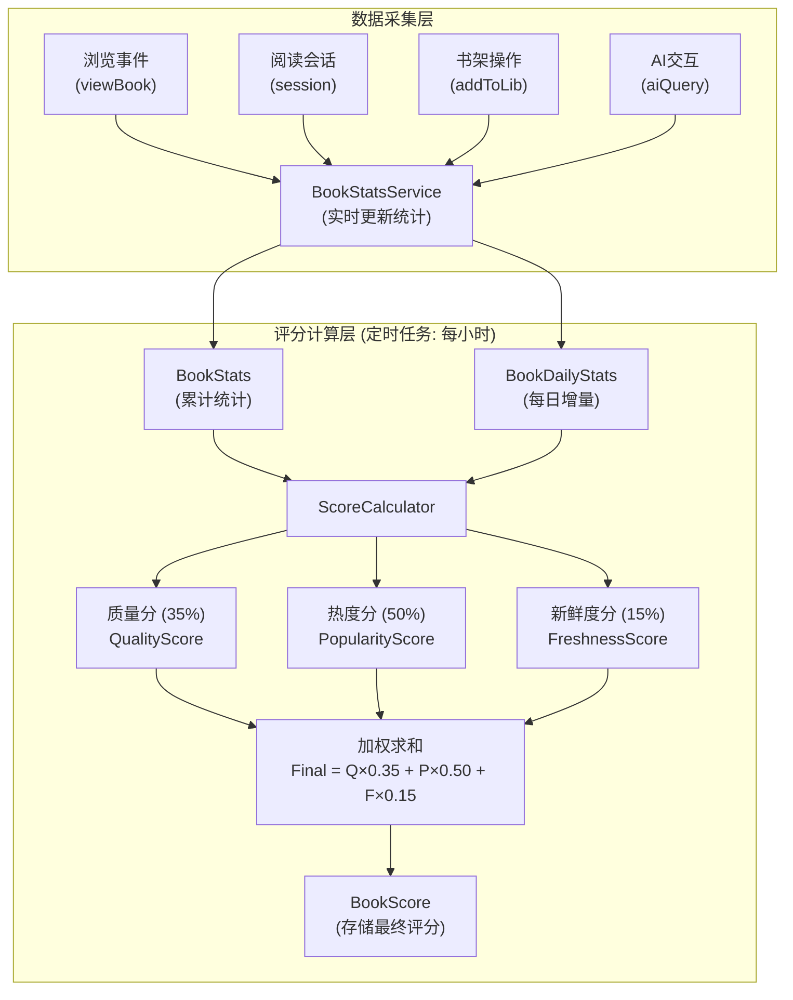
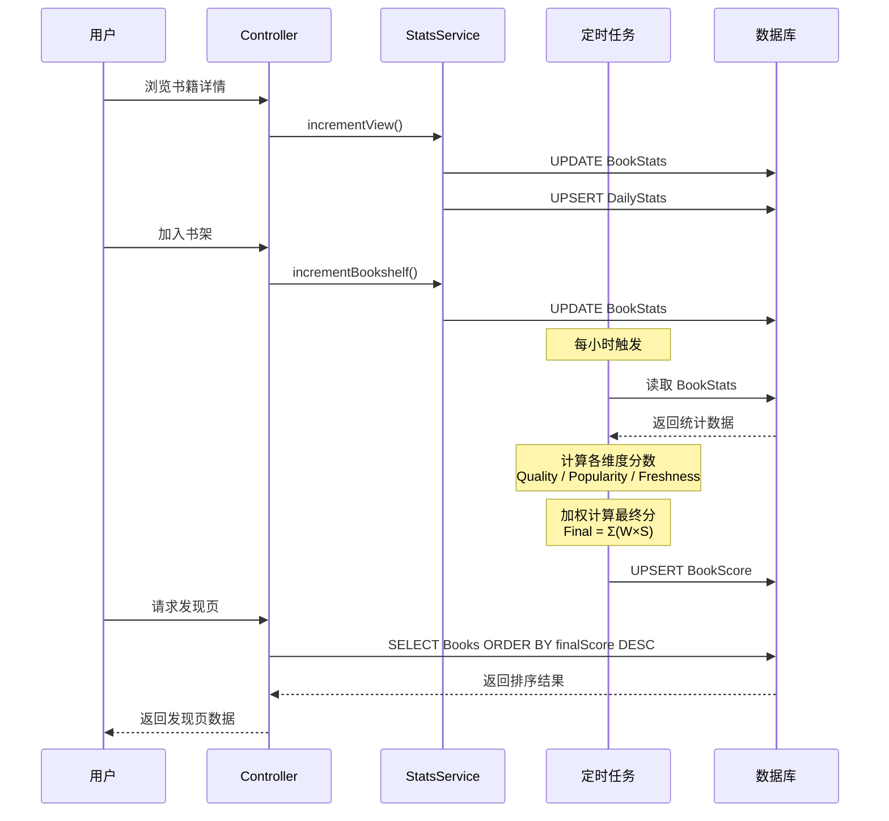

# 书籍推荐算法实施设计文档

> 基于现有后端架构的可执行实施方案
>
> 状态: 待 Review
> 创建日期: 2025-12-24

---

## 1. 现状分析

### 1.1 现有推荐功能

当前 `BooksService.getRecommendations()` 实现非常简单：

```typescript
// 现有逻辑
1. 根据 englishLevel 映射难度范围 (BEGINNER: 0-30, INTERMEDIATE: 20-60, ADVANCED: 50-100)
2. 排除用户已读书籍
3. 返回 3 个板块: forYou, popular, newArrivals (都是按 createdAt 排序)
```

**问题**：
- 没有真正的个性化推荐
- 没有质量分、热度分计算
- popular 和 newArrivals 逻辑相同
- 缺少多样性控制

### 1.2 现有数据资产

| 数据类型 | 已有 | 可用于算法 |
|---------|------|-----------|
| 书籍基础信息 | ✅ Book | 难度分、CEFR、类别 |
| 用户阅读记录 | ✅ UserBook | 阅读状态、进度 |
| 阅读会话 | ✅ ReadingSession | 阅读时长、页数 |
| 每日统计 | ✅ DailyStats | 阅读分钟数 |
| AI交互 | ✅ AIInteraction | 查词、问答次数 |
| 书单配置 | ✅ BookList | 编辑精选 |
| **书籍热度统计** | ❌ 缺失 | 需新建 |
| **用户画像** | ❌ 缺失 | 需新建 |
| **评分系统** | ❌ 缺失 | 需新建 |

---

## 2. 评分计算流程

### 2.1 整体架构图



### 2.2 评分计算公式

```
┌─────────────────────────────────────────────────────────────────────────────────┐
│                                                                                  │
│   📐 最终得分公式                                                                 │
│   ═══════════════                                                                │
│                                                                                  │
│   FinalScore = QualityScore × 0.35                                              │
│              + PopularityScore × 0.50                                           │
│              + FreshnessScore × 0.15                                            │
│                                                                                  │
│   ─────────────────────────────────────────────────────────────────────────────  │
│                                                                                  │
│   📊 各维度计算详情                                                               │
│                                                                                  │
│   ┌─────────────────────────────────────────────────────────────────────────┐   │
│   │  QualityScore (质量分) = 0~1                                             │   │
│   │  ════════════════════════════════                                        │   │
│   │                                                                          │   │
│   │  ┌────────────────┐                                                      │   │
│   │  │ 经典/获奖 (30%) │ ← isClassic (+0.6) + isAwardWinner (+0.4)           │   │
│   │  ├────────────────┤                                                      │   │
│   │  │ 编辑评分 (30%) │ ← editorialScore / 10                                │   │
│   │  ├────────────────┤                                                      │   │
│   │  │ 完读率   (25%) │ ← readCompleteCount / readStartCount                 │   │
│   │  ├────────────────┤                                                      │   │
│   │  │ 阅读深度 (15%) │ ← avgReadingTime (60%) + highlightDensity (40%)      │   │
│   │  └────────────────┘                                                      │   │
│   └─────────────────────────────────────────────────────────────────────────┘   │
│                                                                                  │
│   ┌─────────────────────────────────────────────────────────────────────────┐   │
│   │  PopularityScore (热度分) = 0~1                                          │   │
│   │  ══════════════════════════════════                                      │   │
│   │                                                                          │   │
│   │  ┌────────────────┐                                                      │   │
│   │  │ 浏览热度 (20%) │ ← log₁₀(viewCount) × 0.6 + log₁₀(recentView) × 0.4   │   │
│   │  ├────────────────┤                                                      │   │
│   │  │ 收藏热度 (20%) │ ← log₁₀(bookshelfCount)                              │   │
│   │  ├────────────────┤                                                      │   │
│   │  │ 阅读热度 (30%) │ ← readStart (40%) + complete (30%) + minutes (30%)   │   │
│   │  ├────────────────┤                                                      │   │
│   │  │ 互动热度 (20%) │ ← highlight (50%) + aiInteraction (50%)              │   │
│   │  ├────────────────┤                                                      │   │
│   │  │ 增长趋势 (10%) │ ← recentViewCount / totalViewCount                   │   │
│   │  └────────────────┘                                                      │   │
│   └─────────────────────────────────────────────────────────────────────────┘   │
│                                                                                  │
│   ┌─────────────────────────────────────────────────────────────────────────┐   │
│   │  FreshnessScore (新鲜度分) = 0~1                                         │   │
│   │  ════════════════════════════════                                        │   │
│   │                                                                          │   │
│   │  天数        │ 0天    │ 15天   │ 30天   │ 60天   │ 90天+  │              │   │
│   │  ────────────┼────────┼────────┼────────┼────────┼────────┤              │   │
│   │  分数        │ 1.0    │ 0.75   │ 0.5    │ 0.3    │ 0.1    │              │   │
│   │                                                                          │   │
│   │  公式:                                                                    │   │
│   │  • 0-30天:  1 - (days/30) × 0.5                                          │   │
│   │  • 30-90天: 0.5 - ((days-30)/60) × 0.4                                   │   │
│   │  • 90天+:   0.1 (最低保底)                                                │   │
│   └─────────────────────────────────────────────────────────────────────────┘   │
│                                                                                  │
└─────────────────────────────────────────────────────────────────────────────────┘
```

### 2.3 数据流转时序图



### 2.4 评分计算示例

```
┌─────────────────────────────────────────────────────────────────────────────────┐
│  📖 示例: 《Pride and Prejudice》评分计算                                         │
├─────────────────────────────────────────────────────────────────────────────────┤
│                                                                                  │
│  原始数据:                                                                        │
│  ─────────                                                                       │
│  • isClassic: true           • viewCount: 5,000                                 │
│  • isAwardWinner: false      • bookshelfCount: 800                              │
│  • editorialScore: 9.0       • readStartCount: 600                              │
│  • createdAt: 180天前         • readCompleteCount: 420                           │
│                              • totalReadingMinutes: 18,000                      │
│                              • highlightCount: 3,500                            │
│                              • recentViewCount (7天): 350                        │
│                                                                                  │
│  ─────────────────────────────────────────────────────────────────────────────  │
│                                                                                  │
│  Step 1: 计算质量分                                                               │
│  ───────────────────                                                             │
│                                                                                  │
│  经典标记:    isClassic × 0.6 = 0.6                                              │
│  编辑评分:    9.0 / 10 = 0.9                                                     │
│  完读率:      420 / 600 = 0.7                                                    │
│  阅读深度:    avgTime = 18000/600 = 30min → 1.0                                 │
│              density = 3500/600 = 5.83 → 0.58                                   │
│              depth = 1.0×0.6 + 0.58×0.4 = 0.83                                  │
│                                                                                  │
│  QualityScore = 0.6×0.30 + 0.9×0.30 + 0.7×0.25 + 0.83×0.15                      │
│               = 0.18 + 0.27 + 0.175 + 0.125                                      │
│               = 0.75                                                             │
│                                                                                  │
│  ─────────────────────────────────────────────────────────────────────────────  │
│                                                                                  │
│  Step 2: 计算热度分                                                               │
│  ───────────────────                                                             │
│                                                                                  │
│  浏览热度:    log₁₀(5001)/6 × 0.6 + log₁₀(351)/4 × 0.4                          │
│              = 0.62×0.6 + 0.64×0.4 = 0.63                                       │
│  收藏热度:    log₁₀(801)/5 = 0.58                                                │
│  阅读热度:    log₁₀(601)/5×0.4 + log₁₀(421)/4×0.3 + log₁₀(18001)/6×0.3          │
│              = 0.56×0.4 + 0.66×0.3 + 0.71×0.3 = 0.64                            │
│  互动热度:    log₁₀(3501)/5×0.5 + 0×0.5 = 0.35                                   │
│  增长趋势:    350/5000 = 0.07 → 0.07/0.2 = 0.35                                  │
│                                                                                  │
│  PopularityScore = 0.63×0.20 + 0.58×0.20 + 0.64×0.30 + 0.35×0.20 + 0.35×0.10   │
│                  = 0.126 + 0.116 + 0.192 + 0.07 + 0.035                         │
│                  = 0.54                                                          │
│                                                                                  │
│  ─────────────────────────────────────────────────────────────────────────────  │
│                                                                                  │
│  Step 3: 计算新鲜度分                                                             │
│  ─────────────────────                                                           │
│                                                                                  │
│  days = 180 (> 90天)                                                             │
│  FreshnessScore = 0.1 (最低保底值)                                               │
│                                                                                  │
│  ─────────────────────────────────────────────────────────────────────────────  │
│                                                                                  │
│  Step 4: 计算最终得分                                                             │
│  ─────────────────────                                                           │
│                                                                                  │
│  FinalScore = 0.75 × 0.35 + 0.54 × 0.50 + 0.1 × 0.15                            │
│             = 0.2625 + 0.27 + 0.015                                              │
│             = 0.5475                                                             │
│                                                                                  │
│  ─────────────────────────────────────────────────────────────────────────────  │
│                                                                                  │
│  📊 最终结果:                                                                     │
│  ┌──────────────┬───────────┬───────────┐                                        │
│  │    维度       │   分数    │   贡献     │                                        │
│  ├──────────────┼───────────┼───────────┤                                        │
│  │ QualityScore │   0.75    │   26.3%   │                                        │
│  │ Popularity   │   0.54    │   27.0%   │                                        │
│  │ Freshness    │   0.10    │    1.5%   │                                        │
│  ├──────────────┼───────────┼───────────┤                                        │
│  │ FinalScore   │   0.55    │   100%    │                                        │
│  └──────────────┴───────────┴───────────┘                                        │
│                                                                                  │
│  💡 分析: 这本经典名著质量分很高 (0.75)，但因为上架时间较久，                        │
│     新鲜度分很低 (0.1)，最终综合得分为 0.55。                                       │
│                                                                                  │
└─────────────────────────────────────────────────────────────────────────────────┘
```

---

## 3. 实施策略

### 3.1 分阶段目标

| 阶段 | 目标 | 预期效果 |
|------|------|---------|
| **Phase 1** | 基础评分系统 | 书籍有质量分和热度分，可按分数排序 |
| **Phase 2** | 个性化推荐 | 用户画像 + 个性化分数 |
| **Phase 3** | 高级功能 | 多样性、新鲜度、作者热度 |
| **Phase 4** | 优化迭代 | A/B测试、模型优化 |

### 3.2 Phase 1 详细设计（本次实施）

**目标**：实现基础的书籍质量分和热度分计算，让发现页有真正的排序依据。

**范围**：
- 新增数据模型
- 热度数据收集
- 评分计算服务
- 发现页 API 改造

---

## 4. 数据模型设计

### 4.1 新增 Prisma 模型

```prisma
// ============================================
// 书籍评分与统计扩展
// ============================================

/// 书籍评分表 - 存储计算后的各维度分数
model BookScore {
  id                    String   @id @default(uuid())
  bookId                String   @unique

  // === 质量分相关 ===
  qualityScore          Float    @default(0)    // 综合质量分 0-1

  // === 热度分相关 ===
  popularityScore       Float    @default(0)    // 综合热度分 0-1

  // === 其他维度分 (Phase 2+) ===
  freshnessScore        Float    @default(0)    // 新鲜度分 0-1
  authorPopularityScore Float    @default(0)    // 作者热度分 0-1

  // === 最终得分 ===
  finalScore            Float    @default(0)    // 加权综合得分

  // === 时间戳 ===
  lastCalculatedAt      DateTime @default(now())
  createdAt             DateTime @default(now())
  updatedAt             DateTime @updatedAt

  // === 关联 ===
  book                  Book     @relation(fields: [bookId], references: [id], onDelete: Cascade)

  @@index([finalScore(sort: Desc)])
  @@index([qualityScore(sort: Desc)])
  @@index([popularityScore(sort: Desc)])
}

/// 书籍统计表 - 存储原始统计数据
model BookStats {
  id                    String   @id @default(uuid())
  bookId                String   @unique

  // === 浏览统计 ===
  viewCount             Int      @default(0)    // 总浏览量
  uniqueViewerCount     Int      @default(0)    // 独立访客数

  // === 收藏统计 ===
  bookshelfCount        Int      @default(0)    // 加入书架次数
  wishlistCount         Int      @default(0)    // 加入想读次数

  // === 阅读统计 ===
  readStartCount        Int      @default(0)    // 开始阅读人数
  readCompleteCount     Int      @default(0)    // 完读人数
  totalReadingMinutes   Int      @default(0)    // 总阅读时长(分钟)

  // === 互动统计 ===
  highlightCount        Int      @default(0)    // 划线总次数
  noteCount             Int      @default(0)    // 笔记总数
  aiInteractionCount    Int      @default(0)    // AI交互次数

  // === 评分统计 (预留，暂不实现) ===
  ratingSum             Float    @default(0)    // 评分总和
  ratingCount           Int      @default(0)    // 评分人数
  averageRating         Float    @default(0)    // 平均评分

  // === 时间戳 ===
  createdAt             DateTime @default(now())
  updatedAt             DateTime @updatedAt

  // === 关联 ===
  book                  Book     @relation(fields: [bookId], references: [id], onDelete: Cascade)
}

/// 书籍每日统计表 - 用于计算趋势和热度变化
model BookDailyStats {
  id                    String   @id @default(uuid())
  bookId                String
  date                  DateTime @db.Date

  // === 每日增量统计 ===
  viewCount             Int      @default(0)
  uniqueViewerCount     Int      @default(0)
  bookshelfAdds         Int      @default(0)
  readStarts            Int      @default(0)
  readCompletes         Int      @default(0)
  readingMinutes        Int      @default(0)
  highlightCount        Int      @default(0)
  noteCount             Int      @default(0)
  aiInteractionCount    Int      @default(0)

  createdAt             DateTime @default(now())

  @@unique([bookId, date])
  @@index([date])
  @@index([bookId])
}

// ============================================
// Book 模型扩展 (添加关联)
// ============================================

model Book {
  // ... 现有字段保持不变 ...

  // === 新增质量标记字段 ===
  isClassic             Boolean  @default(false)   // 是否经典名著
  isAwardWinner         Boolean  @default(false)   // 是否获奖作品
  editorialScore        Float?                      // 编辑评分 0-10

  // === 新增关联 ===
  bookScore             BookScore?
  bookStats             BookStats?
  bookDailyStats        BookDailyStats[]
}
```

### 4.2 用户画像模型（Phase 2）

```prisma
/// 用户阅读偏好画像
model UserReadingProfile {
  id                    String   @id @default(uuid())
  userId                String   @unique

  // === 类别偏好 ===
  preferredCategories   Json     @default("{}") // { categoryId: weight }
  preferredGenres       Json     @default("{}") // { genre: weight }

  // === 难度偏好 ===
  preferredDifficulty   Float?   // 偏好难度 0-100
  difficultyRange       Float    @default(20) // 难度容忍范围

  // === 阅读行为特征 ===
  avgSessionDuration    Float?   // 平均阅读时长(分钟)
  avgCompletionRate     Float?   // 历史完读率

  // === 向量表示 (Phase 3+) ===
  embedding             Float[]  // 用户向量表示

  // === 时间戳 ===
  lastCalculatedAt      DateTime @default(now())
  createdAt             DateTime @default(now())
  updatedAt             DateTime @updatedAt

  user                  User     @relation(fields: [userId], references: [id], onDelete: Cascade)
}
```

---

## 5. Phase 1 实施计划

### 5.1 文件结构

```
apps/backend/src/modules/
├── recommendation/                    # 新建推荐模块
│   ├── recommendation.module.ts
│   ├── recommendation.controller.ts   # 发现页 API
│   ├── recommendation.service.ts      # 推荐逻辑
│   │
│   ├── services/
│   │   ├── book-score.service.ts      # 评分计算服务
│   │   ├── book-stats.service.ts      # 统计收集服务
│   │   └── score-calculator.ts        # 评分计算器
│   │
│   ├── dto/
│   │   ├── discover-books.dto.ts
│   │   └── book-with-score.dto.ts
│   │
│   └── jobs/
│       ├── update-book-scores.job.ts  # 定时评分更新任务
│       └── aggregate-daily-stats.job.ts
│
├── tracking/
│   └── tracking.service.ts            # 修改：新增书籍统计更新
```

### 5.2 核心服务实现

#### 5.2.1 BookStatsService - 统计收集

```typescript
// apps/backend/src/modules/recommendation/services/book-stats.service.ts

import { Injectable } from '@nestjs/common';
import { PrismaService } from '@app/database';

@Injectable()
export class BookStatsService {
  constructor(private prisma: PrismaService) {}

  /**
   * 增加书籍浏览量
   */
  async incrementView(bookId: string, userId?: string): Promise<void> {
    const today = this.getToday();

    await this.prisma.$transaction([
      // 更新总统计
      this.prisma.bookStats.upsert({
        where: { bookId },
        create: { bookId, viewCount: 1, uniqueViewerCount: userId ? 1 : 0 },
        update: {
          viewCount: { increment: 1 },
          // uniqueViewerCount 需要单独计算，这里简化处理
        },
      }),
      // 更新每日统计
      this.prisma.bookDailyStats.upsert({
        where: { bookId_date: { bookId, date: today } },
        create: { bookId, date: today, viewCount: 1 },
        update: { viewCount: { increment: 1 } },
      }),
    ]);
  }

  /**
   * 增加书架添加数
   */
  async incrementBookshelf(bookId: string): Promise<void> {
    const today = this.getToday();

    await this.prisma.$transaction([
      this.prisma.bookStats.upsert({
        where: { bookId },
        create: { bookId, bookshelfCount: 1 },
        update: { bookshelfCount: { increment: 1 } },
      }),
      this.prisma.bookDailyStats.upsert({
        where: { bookId_date: { bookId, date: today } },
        create: { bookId, date: today, bookshelfAdds: 1 },
        update: { bookshelfAdds: { increment: 1 } },
      }),
    ]);
  }

  /**
   * 增加开始阅读数
   */
  async incrementReadStart(bookId: string): Promise<void> {
    const today = this.getToday();

    await this.prisma.$transaction([
      this.prisma.bookStats.upsert({
        where: { bookId },
        create: { bookId, readStartCount: 1 },
        update: { readStartCount: { increment: 1 } },
      }),
      this.prisma.bookDailyStats.upsert({
        where: { bookId_date: { bookId, date: today } },
        create: { bookId, date: today, readStarts: 1 },
        update: { readStarts: { increment: 1 } },
      }),
    ]);
  }

  /**
   * 增加完读数
   */
  async incrementReadComplete(bookId: string): Promise<void> {
    const today = this.getToday();

    await this.prisma.$transaction([
      this.prisma.bookStats.upsert({
        where: { bookId },
        create: { bookId, readCompleteCount: 1 },
        update: { readCompleteCount: { increment: 1 } },
      }),
      this.prisma.bookDailyStats.upsert({
        where: { bookId_date: { bookId, date: today } },
        create: { bookId, date: today, readCompletes: 1 },
        update: { readCompletes: { increment: 1 } },
      }),
    ]);
  }

  /**
   * 增加阅读时长
   */
  async addReadingMinutes(bookId: string, minutes: number): Promise<void> {
    const today = this.getToday();

    await this.prisma.$transaction([
      this.prisma.bookStats.upsert({
        where: { bookId },
        create: { bookId, totalReadingMinutes: minutes },
        update: { totalReadingMinutes: { increment: minutes } },
      }),
      this.prisma.bookDailyStats.upsert({
        where: { bookId_date: { bookId, date: today } },
        create: { bookId, date: today, readingMinutes: minutes },
        update: { readingMinutes: { increment: minutes } },
      }),
    ]);
  }

  /**
   * 增加划线数
   */
  async incrementHighlight(bookId: string): Promise<void> {
    const today = this.getToday();

    await this.prisma.$transaction([
      this.prisma.bookStats.upsert({
        where: { bookId },
        create: { bookId, highlightCount: 1 },
        update: { highlightCount: { increment: 1 } },
      }),
      this.prisma.bookDailyStats.upsert({
        where: { bookId_date: { bookId, date: today } },
        create: { bookId, date: today, highlightCount: 1 },
        update: { highlightCount: { increment: 1 } },
      }),
    ]);
  }

  /**
   * 增加AI交互数
   */
  async incrementAIInteraction(bookId: string): Promise<void> {
    const today = this.getToday();

    await this.prisma.$transaction([
      this.prisma.bookStats.upsert({
        where: { bookId },
        create: { bookId, aiInteractionCount: 1 },
        update: { aiInteractionCount: { increment: 1 } },
      }),
      this.prisma.bookDailyStats.upsert({
        where: { bookId_date: { bookId, date: today } },
        create: { bookId, date: today, aiInteractionCount: 1 },
        update: { aiInteractionCount: { increment: 1 } },
      }),
    ]);
  }

  private getToday(): Date {
    const now = new Date();
    return new Date(now.getFullYear(), now.getMonth(), now.getDate());
  }
}
```

#### 5.2.2 ScoreCalculator - 评分计算器

```typescript
// apps/backend/src/modules/recommendation/services/score-calculator.ts

import { Injectable } from '@nestjs/common';

export interface BookMetrics {
  // 书籍基础信息
  isClassic: boolean;
  isAwardWinner: boolean;
  editorialScore: number | null;

  // 统计数据
  viewCount: number;
  bookshelfCount: number;
  readStartCount: number;
  readCompleteCount: number;
  totalReadingMinutes: number;
  highlightCount: number;
  noteCount: number;
  aiInteractionCount: number;

  // 时间相关
  publishedAt: Date | null;
  createdAt: Date;

  // 近7天统计
  recentViewCount: number;
  recentReadStarts: number;
  recentReadingMinutes: number;
}

export interface ScoreWeights {
  quality: number;
  popularity: number;
  freshness: number;
}

@Injectable()
export class ScoreCalculator {
  private readonly DEFAULT_WEIGHTS: ScoreWeights = {
    quality: 0.35,
    popularity: 0.50,
    freshness: 0.15,
  };

  /**
   * 计算书籍质量分 (0-1)
   *
   * 维度：
   * 1. 经典/获奖标记 (30%)
   * 2. 编辑评分 (30%)
   * 3. 完读率 (25%)
   * 4. 阅读深度 (15%) - 平均阅读时长、划线密度
   */
  calculateQualityScore(metrics: BookMetrics): number {
    // 1. 经典/获奖加成
    let classicScore = 0;
    if (metrics.isClassic) classicScore += 0.6;
    if (metrics.isAwardWinner) classicScore += 0.4;
    classicScore = Math.min(1, classicScore);

    // 2. 编辑评分归一化
    const editorialScore = metrics.editorialScore
      ? metrics.editorialScore / 10
      : 0.5; // 默认中等

    // 3. 完读率
    const completionRate = metrics.readStartCount > 0
      ? Math.min(1, metrics.readCompleteCount / metrics.readStartCount)
      : 0;

    // 4. 阅读深度
    let depthScore = 0;
    if (metrics.readStartCount > 0) {
      // 平均阅读时长 (假设30分钟为满分)
      const avgReadingTime = metrics.totalReadingMinutes / metrics.readStartCount;
      const timeScore = Math.min(1, avgReadingTime / 30);

      // 划线密度 (假设10次为满分)
      const highlightDensity = metrics.highlightCount / Math.max(1, metrics.readStartCount);
      const highlightScore = Math.min(1, highlightDensity / 10);

      depthScore = timeScore * 0.6 + highlightScore * 0.4;
    }

    // 加权汇总
    return classicScore * 0.30 +
           editorialScore * 0.30 +
           completionRate * 0.25 +
           depthScore * 0.15;
  }

  /**
   * 计算书籍热度分 (0-1)
   *
   * 维度：
   * 1. 浏览热度 (20%) - 总浏览量 + 近期浏览
   * 2. 收藏热度 (20%) - 书架添加数
   * 3. 阅读热度 (30%) - 阅读人数 + 阅读时长
   * 4. 互动热度 (20%) - 划线 + AI交互
   * 5. 增长趋势 (10%) - 近7天 vs 总量
   */
  calculatePopularityScore(metrics: BookMetrics): number {
    // 1. 浏览热度 (对数归一化)
    const viewScore = this.logNormalize(metrics.viewCount, 6) * 0.6 +
                      this.logNormalize(metrics.recentViewCount, 4) * 0.4;

    // 2. 收藏热度
    const collectScore = this.logNormalize(metrics.bookshelfCount, 5);

    // 3. 阅读热度
    const readScore = this.logNormalize(metrics.readStartCount, 5) * 0.4 +
                      this.logNormalize(metrics.readCompleteCount, 4) * 0.3 +
                      this.logNormalize(metrics.totalReadingMinutes, 6) * 0.3;

    // 4. 互动热度
    const interactionScore = this.logNormalize(metrics.highlightCount, 5) * 0.5 +
                             this.logNormalize(metrics.aiInteractionCount, 4) * 0.5;

    // 5. 增长趋势
    let trendScore = 0;
    if (metrics.viewCount > 0) {
      const recentRatio = metrics.recentViewCount / metrics.viewCount;
      // 假设7天占总量的20%以上表示有增长趋势
      trendScore = Math.min(1, recentRatio / 0.2);
    }

    // 加权汇总
    return Math.min(1,
      viewScore * 0.20 +
      collectScore * 0.20 +
      readScore * 0.30 +
      interactionScore * 0.20 +
      trendScore * 0.10
    );
  }

  /**
   * 计算新鲜度分 (0-1)
   *
   * 新书在30天内获得加成，之后线性衰减
   */
  calculateFreshnessScore(metrics: BookMetrics): number {
    const now = new Date();
    const createdAt = new Date(metrics.createdAt);
    const daysSinceCreate = Math.floor(
      (now.getTime() - createdAt.getTime()) / (1000 * 60 * 60 * 24)
    );

    // 30天内线性衰减
    if (daysSinceCreate <= 30) {
      return 1 - (daysSinceCreate / 30) * 0.5; // 第30天时为0.5
    }

    // 30-90天继续衰减
    if (daysSinceCreate <= 90) {
      return 0.5 - ((daysSinceCreate - 30) / 60) * 0.4; // 第90天时为0.1
    }

    // 90天后保持最低值
    return 0.1;
  }

  /**
   * 计算综合最终得分
   */
  calculateFinalScore(
    qualityScore: number,
    popularityScore: number,
    freshnessScore: number,
    weights: ScoreWeights = this.DEFAULT_WEIGHTS
  ): number {
    return qualityScore * weights.quality +
           popularityScore * weights.popularity +
           freshnessScore * weights.freshness;
  }

  /**
   * 对数归一化函数
   * 适用于长尾分布数据
   */
  private logNormalize(value: number, maxLog: number = 6): number {
    if (value <= 0) return 0;
    return Math.min(1, Math.log10(value + 1) / maxLog);
  }
}
```

#### 5.2.3 BookScoreService - 评分更新服务

```typescript
// apps/backend/src/modules/recommendation/services/book-score.service.ts

import { Injectable, Logger } from '@nestjs/common';
import { PrismaService } from '@app/database';
import { ScoreCalculator, BookMetrics } from './score-calculator';

@Injectable()
export class BookScoreService {
  private readonly logger = new Logger(BookScoreService.name);

  constructor(
    private prisma: PrismaService,
    private scoreCalculator: ScoreCalculator,
  ) {}

  /**
   * 更新单本书的评分
   */
  async updateBookScore(bookId: string): Promise<void> {
    const metrics = await this.getBookMetrics(bookId);
    if (!metrics) {
      this.logger.warn(`Book not found: ${bookId}`);
      return;
    }

    const qualityScore = this.scoreCalculator.calculateQualityScore(metrics);
    const popularityScore = this.scoreCalculator.calculatePopularityScore(metrics);
    const freshnessScore = this.scoreCalculator.calculateFreshnessScore(metrics);
    const finalScore = this.scoreCalculator.calculateFinalScore(
      qualityScore,
      popularityScore,
      freshnessScore
    );

    await this.prisma.bookScore.upsert({
      where: { bookId },
      create: {
        bookId,
        qualityScore,
        popularityScore,
        freshnessScore,
        finalScore,
        lastCalculatedAt: new Date(),
      },
      update: {
        qualityScore,
        popularityScore,
        freshnessScore,
        finalScore,
        lastCalculatedAt: new Date(),
      },
    });

    this.logger.debug(
      `Updated score for book ${bookId}: ` +
      `quality=${qualityScore.toFixed(3)}, ` +
      `popularity=${popularityScore.toFixed(3)}, ` +
      `freshness=${freshnessScore.toFixed(3)}, ` +
      `final=${finalScore.toFixed(3)}`
    );
  }

  /**
   * 批量更新所有书籍评分
   */
  async updateAllBookScores(): Promise<{ updated: number; failed: number }> {
    const books = await this.prisma.book.findMany({
      where: { status: 'ACTIVE' },
      select: { id: true },
    });

    let updated = 0;
    let failed = 0;

    for (const book of books) {
      try {
        await this.updateBookScore(book.id);
        updated++;
      } catch (error) {
        this.logger.error(`Failed to update score for book ${book.id}:`, error);
        failed++;
      }
    }

    this.logger.log(`Score update complete: ${updated} updated, ${failed} failed`);
    return { updated, failed };
  }

  /**
   * 获取书籍的所有统计指标
   */
  private async getBookMetrics(bookId: string): Promise<BookMetrics | null> {
    const book = await this.prisma.book.findUnique({
      where: { id: bookId },
      include: {
        bookStats: true,
      },
    });

    if (!book) return null;

    // 获取近7天统计
    const sevenDaysAgo = new Date();
    sevenDaysAgo.setDate(sevenDaysAgo.getDate() - 7);

    const recentStats = await this.prisma.bookDailyStats.aggregate({
      where: {
        bookId,
        date: { gte: sevenDaysAgo },
      },
      _sum: {
        viewCount: true,
        readStarts: true,
        readingMinutes: true,
      },
    });

    const stats = book.bookStats;

    return {
      isClassic: book.isClassic ?? false,
      isAwardWinner: book.isAwardWinner ?? false,
      editorialScore: book.editorialScore ?? null,

      viewCount: stats?.viewCount ?? 0,
      bookshelfCount: stats?.bookshelfCount ?? 0,
      readStartCount: stats?.readStartCount ?? 0,
      readCompleteCount: stats?.readCompleteCount ?? 0,
      totalReadingMinutes: stats?.totalReadingMinutes ?? 0,
      highlightCount: stats?.highlightCount ?? 0,
      noteCount: stats?.noteCount ?? 0,
      aiInteractionCount: stats?.aiInteractionCount ?? 0,

      publishedAt: book.publishedAt,
      createdAt: book.createdAt,

      recentViewCount: recentStats._sum.viewCount ?? 0,
      recentReadStarts: recentStats._sum.readStarts ?? 0,
      recentReadingMinutes: recentStats._sum.readingMinutes ?? 0,
    };
  }
}
```

#### 5.2.4 RecommendationService - 推荐服务

```typescript
// apps/backend/src/modules/recommendation/recommendation.service.ts

import { Injectable, Logger } from '@nestjs/common';
import { PrismaService } from '@app/database';
import { BookScoreService } from './services/book-score.service';
import { Prisma } from '@prisma/client';

export interface DiscoverBooksOptions {
  userId?: string;
  page?: number;
  pageSize?: number;
  language?: string;
  categoryId?: string;
  sortBy?: 'recommended' | 'popular' | 'new' | 'quality';
  englishLevel?: 'BEGINNER' | 'INTERMEDIATE' | 'ADVANCED';
}

export interface BookWithScore {
  book: any; // Book 类型
  scores: {
    final: number;
    quality: number;
    popularity: number;
    freshness: number;
  };
  source: 'algorithm' | 'dashboard' | 'personalized';
}

@Injectable()
export class RecommendationService {
  private readonly logger = new Logger(RecommendationService.name);

  // 难度映射
  private readonly DIFFICULTY_RANGES = {
    BEGINNER: { min: 0, max: 35 },
    INTERMEDIATE: { min: 20, max: 65 },
    ADVANCED: { min: 50, max: 100 },
  };

  constructor(
    private prisma: PrismaService,
    private bookScoreService: BookScoreService,
  ) {}

  /**
   * 获取发现页书籍列表
   */
  async getDiscoverBooks(options: DiscoverBooksOptions): Promise<{
    books: BookWithScore[];
    total: number;
    page: number;
    pageSize: number;
  }> {
    const {
      userId,
      page = 1,
      pageSize = 20,
      language,
      categoryId,
      sortBy = 'recommended',
      englishLevel,
    } = options;

    // 构建过滤条件
    const where: Prisma.BookWhereInput = {
      status: 'ACTIVE',
    };

    // 语言过滤
    if (language) {
      where.language = language;
    }

    // 分类过滤
    if (categoryId) {
      where.categories = {
        some: { categoryId },
      };
    }

    // 难度过滤
    if (englishLevel && this.DIFFICULTY_RANGES[englishLevel]) {
      const range = this.DIFFICULTY_RANGES[englishLevel];
      where.difficultyScore = {
        gte: range.min,
        lte: range.max,
      };
    }

    // 排除用户已读书籍
    if (userId) {
      const userBooks = await this.prisma.userBook.findMany({
        where: { userId },
        select: { bookId: true },
      });
      const readBookIds = userBooks.map(ub => ub.bookId);
      if (readBookIds.length > 0) {
        where.id = { notIn: readBookIds };
      }
    }

    // 确定排序方式
    let orderBy: Prisma.BookOrderByWithRelationInput[];

    switch (sortBy) {
      case 'popular':
        orderBy = [{ bookScore: { popularityScore: 'desc' } }, { createdAt: 'desc' }];
        break;
      case 'new':
        orderBy = [{ createdAt: 'desc' }];
        break;
      case 'quality':
        orderBy = [{ bookScore: { qualityScore: 'desc' } }, { createdAt: 'desc' }];
        break;
      case 'recommended':
      default:
        orderBy = [{ bookScore: { finalScore: 'desc' } }, { createdAt: 'desc' }];
        break;
    }

    // 查询总数
    const total = await this.prisma.book.count({ where });

    // 查询书籍
    const books = await this.prisma.book.findMany({
      where,
      include: {
        bookScore: true,
        categories: {
          include: { category: true },
        },
        authorProfile: true,
      },
      orderBy,
      skip: (page - 1) * pageSize,
      take: pageSize,
    });

    // 转换为带分数的格式
    const booksWithScores: BookWithScore[] = books.map(book => ({
      book: {
        ...book,
        categories: book.categories.map(bc => bc.category),
      },
      scores: {
        final: book.bookScore?.finalScore ?? 0,
        quality: book.bookScore?.qualityScore ?? 0,
        popularity: book.bookScore?.popularityScore ?? 0,
        freshness: book.bookScore?.freshnessScore ?? 0,
      },
      source: 'algorithm' as const,
    }));

    return {
      books: booksWithScores,
      total,
      page,
      pageSize,
    };
  }

  /**
   * 获取首页推荐板块
   */
  async getHomeRecommendations(
    userId: string,
    englishLevel?: string
  ): Promise<{
    forYou: BookWithScore[];
    popular: BookWithScore[];
    newArrivals: BookWithScore[];
    editorsPicks: BookWithScore[];
  }> {
    // 获取用户已读书籍
    const userBooks = await this.prisma.userBook.findMany({
      where: { userId },
      select: { bookId: true },
    });
    const readBookIds = userBooks.map(ub => ub.bookId);

    const baseWhere: Prisma.BookWhereInput = {
      status: 'ACTIVE',
      id: readBookIds.length > 0 ? { notIn: readBookIds } : undefined,
    };

    // 难度过滤
    if (englishLevel && this.DIFFICULTY_RANGES[englishLevel]) {
      const range = this.DIFFICULTY_RANGES[englishLevel];
      baseWhere.difficultyScore = {
        gte: range.min,
        lte: range.max,
      };
    }

    // 并行查询各板块
    const [forYouBooks, popularBooks, newBooks, editorsPickList] = await Promise.all([
      // For You - 按综合分排序
      this.prisma.book.findMany({
        where: baseWhere,
        include: { bookScore: true },
        orderBy: { bookScore: { finalScore: 'desc' } },
        take: 10,
      }),

      // Popular - 按热度分排序
      this.prisma.book.findMany({
        where: { ...baseWhere, difficultyScore: undefined }, // 热门不限难度
        include: { bookScore: true },
        orderBy: { bookScore: { popularityScore: 'desc' } },
        take: 10,
      }),

      // New Arrivals - 按创建时间排序
      this.prisma.book.findMany({
        where: baseWhere,
        include: { bookScore: true },
        orderBy: { createdAt: 'desc' },
        take: 10,
      }),

      // Editor's Picks - 从书单获取
      this.prisma.bookList.findFirst({
        where: {
          type: 'EDITORS_PICK',
          status: 'ACTIVE',
        },
        include: {
          items: {
            include: {
              book: {
                include: { bookScore: true },
              },
            },
            orderBy: { sortOrder: 'asc' },
            take: 10,
          },
        },
      }),
    ]);

    // 转换格式
    const toBookWithScore = (book: any, source: BookWithScore['source']): BookWithScore => ({
      book,
      scores: {
        final: book.bookScore?.finalScore ?? 0,
        quality: book.bookScore?.qualityScore ?? 0,
        popularity: book.bookScore?.popularityScore ?? 0,
        freshness: book.bookScore?.freshnessScore ?? 0,
      },
      source,
    });

    return {
      forYou: forYouBooks.map(b => toBookWithScore(b, 'algorithm')),
      popular: popularBooks.map(b => toBookWithScore(b, 'algorithm')),
      newArrivals: newBooks.map(b => toBookWithScore(b, 'algorithm')),
      editorsPicks: editorsPickList?.items.map(item =>
        toBookWithScore(item.book, 'dashboard')
      ) ?? [],
    };
  }
}
```

### 5.3 定时任务

```typescript
// apps/backend/src/modules/recommendation/jobs/update-book-scores.job.ts

import { Injectable, Logger } from '@nestjs/common';
import { Cron, CronExpression } from '@nestjs/schedule';
import { BookScoreService } from '../services/book-score.service';

@Injectable()
export class UpdateBookScoresJob {
  private readonly logger = new Logger(UpdateBookScoresJob.name);

  constructor(private bookScoreService: BookScoreService) {}

  /**
   * 每小时更新热度分数
   */
  @Cron(CronExpression.EVERY_HOUR)
  async updatePopularityScores() {
    this.logger.log('Starting hourly popularity score update...');

    try {
      const result = await this.bookScoreService.updateAllBookScores();
      this.logger.log(`Hourly update complete: ${result.updated} books updated`);
    } catch (error) {
      this.logger.error('Failed to update popularity scores:', error);
    }
  }

  /**
   * 每天凌晨2点进行完整评分重算
   */
  @Cron('0 2 * * *')
  async fullScoreRecalculation() {
    this.logger.log('Starting daily full score recalculation...');

    try {
      const result = await this.bookScoreService.updateAllBookScores();
      this.logger.log(`Daily recalculation complete: ${result.updated} books updated`);
    } catch (error) {
      this.logger.error('Failed to recalculate scores:', error);
    }
  }
}
```

### 5.4 API 接口

```typescript
// apps/backend/src/modules/recommendation/recommendation.controller.ts

import { Controller, Get, Query, UseGuards, Request } from '@nestjs/common';
import { ApiTags, ApiOperation, ApiBearerAuth } from '@nestjs/swagger';
import { JwtAuthGuard } from '../auth/guards/jwt-auth.guard';
import { OptionalJwtAuthGuard } from '../auth/guards/optional-jwt-auth.guard';
import { RecommendationService, DiscoverBooksOptions } from './recommendation.service';

@ApiTags('Recommendation')
@Controller('recommendation')
export class RecommendationController {
  constructor(private recommendationService: RecommendationService) {}

  @Get('discover')
  @UseGuards(OptionalJwtAuthGuard)
  @ApiOperation({ summary: '获取发现页书籍列表' })
  async getDiscoverBooks(
    @Request() req,
    @Query('page') page?: number,
    @Query('pageSize') pageSize?: number,
    @Query('language') language?: string,
    @Query('categoryId') categoryId?: string,
    @Query('sortBy') sortBy?: 'recommended' | 'popular' | 'new' | 'quality',
  ) {
    const options: DiscoverBooksOptions = {
      userId: req.user?.id,
      page: page ? parseInt(String(page)) : 1,
      pageSize: pageSize ? parseInt(String(pageSize)) : 20,
      language,
      categoryId,
      sortBy,
      englishLevel: req.user?.englishLevel,
    };

    return this.recommendationService.getDiscoverBooks(options);
  }

  @Get('home')
  @UseGuards(JwtAuthGuard)
  @ApiBearerAuth()
  @ApiOperation({ summary: '获取首页推荐板块' })
  async getHomeRecommendations(@Request() req) {
    return this.recommendationService.getHomeRecommendations(
      req.user.id,
      req.user.englishLevel
    );
  }
}
```

### 5.5 集成到现有系统

#### 修改 TrackingService

```typescript
// apps/backend/src/modules/tracking/tracking.service.ts

// 在现有的事件处理中添加书籍统计更新

@Injectable()
export class TrackingService {
  constructor(
    private prisma: PrismaService,
    private bookStatsService: BookStatsService, // 新增注入
  ) {}

  async trackReading(userId: string, dto: TrackReadingDto) {
    // 现有逻辑...

    // 新增：更新书籍统计
    if (dto.bookId) {
      await this.bookStatsService.addReadingMinutes(dto.bookId, dto.durationMinutes);
    }
  }

  async trackAI(userId: string, dto: TrackAIDto) {
    // 现有逻辑...

    // 新增：更新书籍AI交互统计
    if (dto.bookId) {
      await this.bookStatsService.incrementAIInteraction(dto.bookId);
    }
  }
}
```

#### 修改 ReadingService

```typescript
// apps/backend/src/modules/reading/reading.service.ts

// 在现有的阅读状态更新中添加统计

@Injectable()
export class ReadingService {
  constructor(
    private prisma: PrismaService,
    private bookStatsService: BookStatsService, // 新增注入
  ) {}

  async addToLibrary(userId: string, dto: AddToLibraryDto) {
    // 现有逻辑...

    // 新增：更新书架统计
    await this.bookStatsService.incrementBookshelf(dto.bookId);
  }

  async updateProgress(userId: string, bookId: string, dto: UpdateProgressDto) {
    const existingUserBook = await this.prisma.userBook.findUnique({
      where: { userId_bookId: { userId, bookId } },
    });

    // 现有逻辑...

    // 新增：首次开始阅读
    if (!existingUserBook || existingUserBook.status === 'WANT_TO_READ') {
      if (dto.progressPercent > 0) {
        await this.bookStatsService.incrementReadStart(bookId);
      }
    }

    // 新增：完读统计
    if (dto.progressPercent >= 100 && existingUserBook?.status !== 'FINISHED') {
      await this.bookStatsService.incrementReadComplete(bookId);
    }
  }
}
```

---

## 6. 数据迁移

### 6.1 初始化脚本

```typescript
// scripts/init-book-scores.ts

import { PrismaClient } from '@prisma/client';

const prisma = new PrismaClient();

async function initBookScores() {
  console.log('Initializing book scores...');

  // 1. 为所有活跃书籍创建 BookStats 记录
  const books = await prisma.book.findMany({
    where: { status: 'ACTIVE' },
    select: { id: true },
  });

  console.log(`Found ${books.length} active books`);

  for (const book of books) {
    // 创建空的统计记录
    await prisma.bookStats.upsert({
      where: { bookId: book.id },
      create: { bookId: book.id },
      update: {},
    });

    // 创建空的评分记录
    await prisma.bookScore.upsert({
      where: { bookId: book.id },
      create: { bookId: book.id },
      update: {},
    });
  }

  console.log('Book stats and scores initialized');

  // 2. 从现有数据填充统计（基于 UserBook）
  console.log('Aggregating existing user book data...');

  const userBookStats = await prisma.userBook.groupBy({
    by: ['bookId'],
    _count: { id: true },
    _sum: { totalReadingMinutes: true },
    where: { status: { in: ['READING', 'FINISHED'] } },
  });

  for (const stat of userBookStats) {
    await prisma.bookStats.update({
      where: { bookId: stat.bookId },
      data: {
        readStartCount: stat._count.id,
        totalReadingMinutes: stat._sum.totalReadingMinutes ?? 0,
      },
    });
  }

  // 统计完读数
  const completedStats = await prisma.userBook.groupBy({
    by: ['bookId'],
    _count: { id: true },
    where: { status: 'FINISHED' },
  });

  for (const stat of completedStats) {
    await prisma.bookStats.update({
      where: { bookId: stat.bookId },
      data: { readCompleteCount: stat._count.id },
    });
  }

  // 统计书架数
  const bookshelfStats = await prisma.userBook.groupBy({
    by: ['bookId'],
    _count: { id: true },
  });

  for (const stat of bookshelfStats) {
    await prisma.bookStats.update({
      where: { bookId: stat.bookId },
      data: { bookshelfCount: stat._count.id },
    });
  }

  console.log('Existing data aggregated');

  // 3. 计算初始评分
  console.log('Calculating initial scores...');

  // 这里需要调用 BookScoreService.updateAllBookScores()
  // 由于脚本环境，简化为直接执行

  console.log('Initialization complete!');
}

initBookScores()
  .catch(console.error)
  .finally(() => prisma.$disconnect());
```

### 6.2 Prisma Migration

```bash
# 生成迁移
npx prisma migrate dev --name add_book_recommendation_system

# 执行数据初始化
npx ts-node scripts/init-book-scores.ts
```

---

## 7. 测试计划

### 7.1 单元测试

```typescript
// apps/backend/src/modules/recommendation/services/score-calculator.spec.ts

describe('ScoreCalculator', () => {
  let calculator: ScoreCalculator;

  beforeEach(() => {
    calculator = new ScoreCalculator();
  });

  describe('calculateQualityScore', () => {
    it('should return higher score for classic books', () => {
      const classicBook = createMockMetrics({ isClassic: true });
      const normalBook = createMockMetrics({ isClassic: false });

      expect(calculator.calculateQualityScore(classicBook))
        .toBeGreaterThan(calculator.calculateQualityScore(normalBook));
    });

    it('should consider completion rate', () => {
      const highCompletion = createMockMetrics({
        readStartCount: 100,
        readCompleteCount: 80
      });
      const lowCompletion = createMockMetrics({
        readStartCount: 100,
        readCompleteCount: 10
      });

      expect(calculator.calculateQualityScore(highCompletion))
        .toBeGreaterThan(calculator.calculateQualityScore(lowCompletion));
    });
  });

  describe('calculatePopularityScore', () => {
    it('should handle zero values gracefully', () => {
      const emptyMetrics = createMockMetrics({});
      const score = calculator.calculatePopularityScore(emptyMetrics);

      expect(score).toBe(0);
    });

    it('should use logarithmic scaling', () => {
      const metrics100 = createMockMetrics({ viewCount: 100 });
      const metrics1000 = createMockMetrics({ viewCount: 1000 });

      const score100 = calculator.calculatePopularityScore(metrics100);
      const score1000 = calculator.calculatePopularityScore(metrics1000);

      // 10倍浏览量不应该产生10倍分数
      expect(score1000 / score100).toBeLessThan(10);
    });
  });

  describe('calculateFreshnessScore', () => {
    it('should give high score to new books', () => {
      const newBook = createMockMetrics({
        createdAt: new Date() // 今天
      });
      const score = calculator.calculateFreshnessScore(newBook);

      expect(score).toBeGreaterThan(0.9);
    });

    it('should decay over 30 days', () => {
      const thirtyDaysAgo = new Date();
      thirtyDaysAgo.setDate(thirtyDaysAgo.getDate() - 30);

      const oldBook = createMockMetrics({ createdAt: thirtyDaysAgo });
      const score = calculator.calculateFreshnessScore(oldBook);

      expect(score).toBeCloseTo(0.5, 1);
    });
  });
});
```

### 7.2 集成测试

```typescript
// apps/backend/src/modules/recommendation/recommendation.service.spec.ts

describe('RecommendationService Integration', () => {
  it('should return books sorted by final score', async () => {
    const result = await service.getDiscoverBooks({
      sortBy: 'recommended',
      pageSize: 10,
    });

    // 验证结果按分数降序排列
    for (let i = 1; i < result.books.length; i++) {
      expect(result.books[i - 1].scores.final)
        .toBeGreaterThanOrEqual(result.books[i].scores.final);
    }
  });

  it('should exclude user read books', async () => {
    const result = await service.getDiscoverBooks({
      userId: 'test-user-id',
    });

    // 验证结果不包含用户已读书籍
    const userBooks = await prisma.userBook.findMany({
      where: { userId: 'test-user-id' },
    });
    const userBookIds = new Set(userBooks.map(ub => ub.bookId));

    result.books.forEach(b => {
      expect(userBookIds.has(b.book.id)).toBe(false);
    });
  });
});
```

---

## 8. 监控与告警

### 8.1 关键指标

| 指标 | 说明 | 告警阈值 |
|------|------|---------|
| 评分计算成功率 | 定时任务成功率 | < 95% |
| 评分计算耗时 | 全量更新耗时 | > 10分钟 |
| 发现页 API 响应时间 | P99 响应时间 | > 500ms |
| 书籍无评分比例 | 活跃书籍无评分占比 | > 5% |

### 8.2 日志记录

```typescript
// 在关键操作添加日志
this.logger.log({
  action: 'SCORE_UPDATE',
  bookId,
  scores: { quality, popularity, freshness, final },
  duration: Date.now() - startTime,
});
```

---

## 9. 后续阶段预览

### Phase 2: 个性化推荐

- 用户画像模型 (UserReadingProfile)
- 类别偏好计算
- 个性化分数维度
- 协同过滤推荐

### Phase 3: 高级功能

- 作者热度分
- 多样性控制
- 社交热度 (好友在读)
- 时效热点 (影视改编)

### Phase 4: 优化迭代

- A/B 测试框架
- 深度学习排序模型
- 实时个性化
- 反馈闭环

---

## 10. 风险与缓解

| 风险 | 影响 | 缓解措施 |
|------|------|---------|
| 冷启动问题 | 新书/新用户无推荐 | 使用编辑精选兜底 |
| 性能问题 | 大量书籍评分计算慢 | 批量处理 + 增量更新 |
| 数据不足 | 统计数据少导致分数偏差 | 设置最低阈值 + 默认分数 |

---

## 11. 审批清单

- [ ] 数据模型设计审批
- [ ] API 接口设计审批
- [ ] 评分算法权重确认
- [ ] 性能要求确认
- [ ] 上线计划确认

---

*文档版本: 1.0*
*创建日期: 2025-12-24*
*状态: 待 Review*
