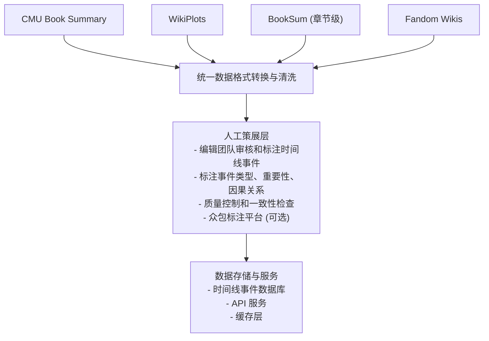
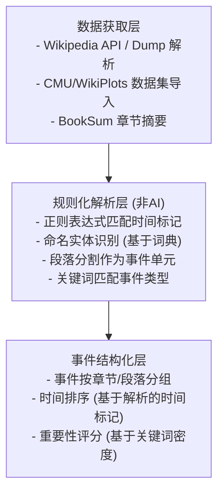
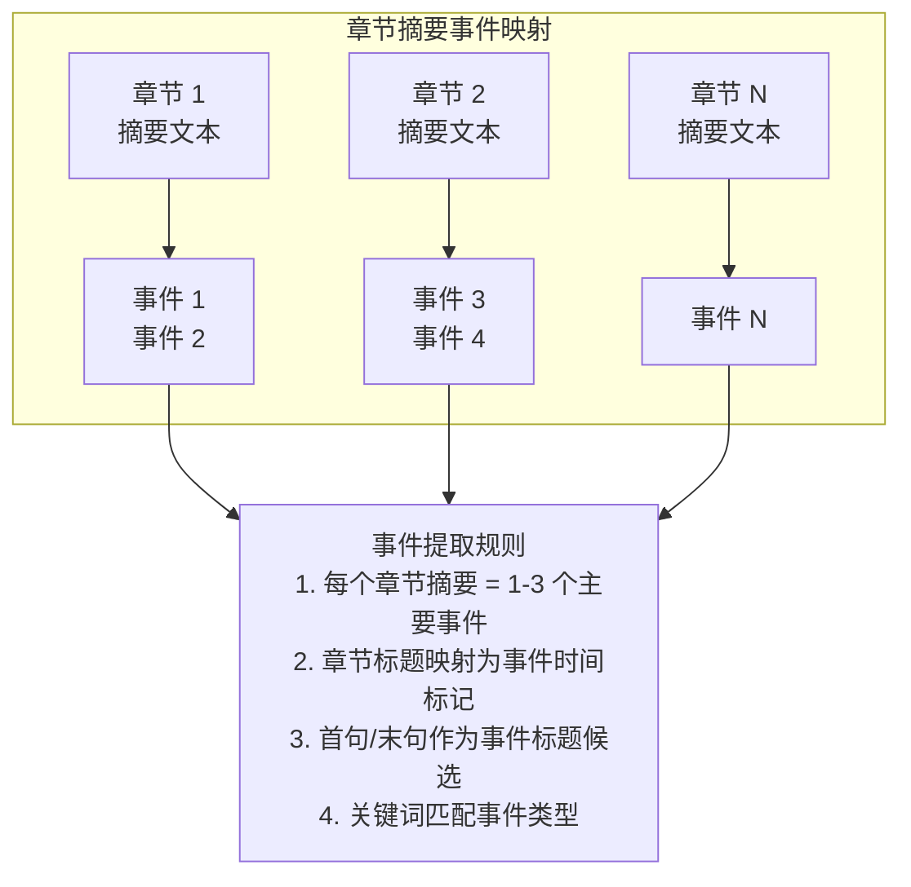
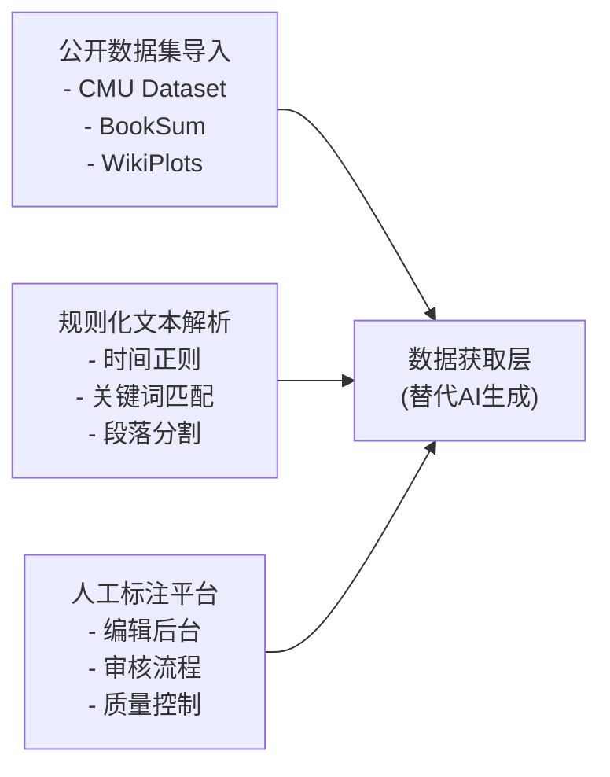

# 故事时间线功能 - 非AI实现方案调研

> Version: 1.0.0
> Status: Draft - Pending Review
> Author: System Architect
> Date: 2025-12-27

---

## 1. 调研目标

调研不依赖AI的故事时间线功能实现方案，从公开权威高质量渠道获取所需数据。

---

## 2. 公开数据源调研

### 2.1 书籍情节摘要数据集

#### 2.1.1 CMU Book Summary Dataset ⭐⭐⭐⭐⭐

| 属性 | 说明 |
|------|------|
| **来源** | Carnegie Mellon University |
| **规模** | 16,559 本书的情节摘要 |
| **数据来源** | Wikipedia 情节摘要 |
| **元数据** | Wikipedia ID, Freebase ID, 书名, 作者, 出版日期, 类型标签 |
| **许可证** | Creative Commons Attribution-ShareAlike License |
| **下载** | [booksummaries.tar.gz](https://www.cs.cmu.edu/~dbamman/booksummaries.html) (17MB) |
| **语言** | 英文 |

**优势**:
- 学术级别数据集，质量高
- CC-BY-SA 许可证，可商用
- 情节摘要详尽，包含多段落叙事描述
- 有 Freebase 元数据关联

**局限**:
- 仅英文书籍
- 情节摘要是整书级别，无章节粒度
- 16,559 本书覆盖有限

---

#### 2.1.2 WikiPlots Dataset ⭐⭐⭐⭐

| 属性 | 说明 |
|------|------|
| **来源** | Georgia Tech / Mark Riedl |
| **规模** | 112,936 个故事情节 |
| **数据来源** | 英文 Wikipedia 中含有 "Plot" 子标题的文章 |
| **格式** | plots.txt (情节文本) + titles.txt (标题列表) |
| **许可证** | 随 Wikipedia 内容许可 |
| **下载** | [GitHub - markriedl/WikiPlots](https://github.com/markriedl/WikiPlots) |
| **语言** | 英文 |

**优势**:
- 数据量大 (11万+)
- 包含电影、书籍、电视剧等多种故事类型
- 提供 Python 提取代码，可更新数据

**局限**:
- 情节是整体摘要，非结构化事件
- 无时间线信息
- 英文为主

---

#### 2.1.3 BookSum (Salesforce) ⭐⭐⭐⭐⭐

| 属性 | 说明 |
|------|------|
| **来源** | Salesforce Research |
| **粒度** | 段落级、章节级、全书级摘要 |
| **数据来源** | Project Gutenberg + CliffsNotes 等 |
| **许可证** | BSD-3-Clause (仅限研究) |
| **下载** | [GitHub - salesforce/booksum](https://github.com/salesforce/booksum) |
| **语言** | 英文 |

**数据结构**:
```json
{
  "bid": "book_id",
  "book_title": "书名",
  "chapter_id": "章节ID",
  "text": "原始章节文本",
  "summary": [
    {
      "source": "cliffsnotes",
      "text": "章节摘要",
      "analysis": "分析"
    }
  ],
  "is_aggregate": false
}
```

**优势**:
- **章节级别摘要** - 这是关键优势！
- 多粒度摘要（段落、章节、全书）
- 来自权威文学分析来源

**局限**:
- BSD-3-Clause 许可证限制为研究用途
- 仅公版书籍
- 需要运行脚本抓取数据

---

### 2.2 书籍元数据源

#### 2.2.1 Open Library API ⭐⭐⭐⭐

| 属性 | 说明 |
|------|------|
| **来源** | Internet Archive |
| **规模** | 数百万本书籍元数据 |
| **数据类型** | 作者、出版信息、封面、分类 |
| **API** | RESTful JSON API |
| **许可证** | 开放数据 |
| **文档** | [Open Library API](https://openlibrary.org/developers/api) |

**API 示例**:
```
GET https://openlibrary.org/works/OL45883W.json
GET https://openlibrary.org/search.json?q=the+lord+of+the+rings
```

**优势**:
- 免费公开 API
- 书籍元数据丰富
- Works/Editions 层级结构清晰

**局限**:
- **无情节摘要字段**
- 主要是书目信息

---

#### 2.2.2 DBpedia ⭐⭐⭐

| 属性 | 说明 |
|------|------|
| **来源** | 从 Wikipedia 提取的结构化数据 |
| **规模** | 23,000+ 本书籍数据 |
| **查询** | SPARQL 查询语言 |
| **文档** | [DBpedia](https://www.dbpedia.org/) |

**SPARQL 查询示例**:
```sparql
SELECT ?book ?title ?author WHERE {
  ?book a dbo:Book .
  ?book rdfs:label ?title .
  ?book dbo:author ?author .
  FILTER (lang(?title) = "en")
}
```

**优势**:
- 结构化知识图谱
- 可与其他数据集关联
- 支持复杂查询

**局限**:
- 学习曲线较高
- 数据可能不完整

---

#### 2.2.3 Wikidata ⭐⭐⭐

| 属性 | 说明 |
|------|------|
| **来源** | Wikimedia Foundation |
| **规模** | 16.5 亿条语义三元组 |
| **API** | REST API + SPARQL |
| **文档** | [Wikidata API](https://www.wikidata.org/wiki/Wikidata:Data_access) |

**相关属性**:
- P50: 作者
- P407: 原作语言
- P571: 成立日期
- P136: 类型

**优势**:
- 多语言支持
- 实体关联丰富
- 持续更新

**局限**:
- 主要是元数据，无情节信息
- 书籍内容覆盖不如电影完整

---

### 2.3 叙事结构学术数据集

#### 2.3.1 Event StoryLine Corpus (ESC) ⭐⭐⭐

| 属性 | 说明 |
|------|------|
| **来源** | 学术研究 |
| **规模** | 22 主题, 258 文档, 5,334 事件, 5,625 因果关系对 |
| **下载** | [GitHub - EventStoryLine](https://github.com/tommasoc80/EventStoryLine) |
| **用途** | 因果和时间关系提取 |

**优势**:
- 专门标注事件和因果关系
- 学术级别标注质量

**局限**:
- 基于新闻数据，非文学作品
- 规模较小

---

#### 2.3.2 ROCStories ⭐⭐

| 属性 | 说明 |
|------|------|
| **规模** | 98,159 个五句故事 |
| **用途** | 常识推理、故事理解 |
| **下载** | [ROCStories](https://cs.rochester.edu/nlp/rocstories/) |

**局限**:
- 短故事，非长篇小说
- 用于 NLP 研究，非实际应用

---

### 2.4 中文数据源

#### 2.4.1 中文维基百科

| 属性 | 说明 |
|------|------|
| **规模** | 1,516,702 篇条目 (截至 2025-12) |
| **下载** | [zhwiki dumps](https://dumps.wikimedia.org/zhwiki/latest/) |
| **格式** | XML dump |

**处理工具**:
- Gensim: Wikipedia 语料处理
- OpenCC: 繁简转换

**局限**:
- 需要自行解析和提取书籍情节
- 书籍条目相对较少

---

#### 2.4.2 中文图书数据集 (GitHub)

| 属性 | 说明 |
|------|------|
| **规模** | 13.3 万册中文图书 |
| **字段** | 书名、作者、出版社、关键词、摘要、分类号、出版年月 |
| **下载** | [GitHub - Chinese_book_dataset](https://github.com/JiangYanting/Chinese_book_dataset) |

**局限**:
- 摘要是书籍简介，非情节摘要
- 无章节级别数据

---

#### 2.4.3 豆瓣读书 (Douban) ⭐⭐⭐⭐

| 属性 | 说明 |
|------|------|
| **来源** | 豆瓣网 (book.douban.com) |
| **规模** | 数百万本中文书籍 |
| **官方 API** | ❌ 已关闭 (2020年后) |
| **替代方案** | 第三方 API / 网页解析 |
| **工具** | [acdzh/douban-book-api](https://github.com/acdzh/douban-book-api) |

**可获取数据**:
```json
{
  "title": "书名",
  "author": ["作者"],
  "book_intro": "内容简介（重要！）",
  "author_intro": "作者简介",
  "catalog": ["目录章节列表"],
  "original_texts": ["原文摘录"],
  "labels": ["标签"],
  "rating": { "star": 4.5, "count": 12345 },
  "comments": ["短评"],
  "reviews": ["长书评"]
}
```

**优势**:
- **中文书籍最权威数据源**
- 有内容简介 (`book_intro`)
- 有目录章节 (`catalog`) - 可用于章节级别映射
- 有原文摘录 (`original_texts`)
- 有用户书评和评分
- 覆盖面广，包括经典和当代书籍

**局限**:
- 官方 API 已关闭，需使用第三方工具或爬取
- `book_intro` 是出版社提供的简介，非详细情节摘要
- 无结构化的事件/时间线数据
- 爬取有法律和封禁风险
- 商业使用需评估合规性

**第三方工具**:
| 工具 | 类型 | 链接 |
|------|------|------|
| douban-book-api | Node.js API | [GitHub](https://github.com/acdzh/douban-book-api) |
| douban-mcp | MCP Server | [GitHub](https://github.com/yoyooyooo/douban-mcp) |
| Apify Douban | 云端爬虫 | [Apify](https://apify.com/kuaima/douban-book-pro) |
| calibre-web-douban | Python | [GitHub](https://github.com/fugary/calibre-web-douban-api) |

**数据获取策略**:
1. 通过 ISBN 匹配 Readmigo 书库中的书籍
2. 获取 `catalog` (目录) 作为章节结构
3. 获取 `book_intro` 作为整书摘要
4. 获取 `original_texts` 作为关键情节片段
5. 获取用户书评中的情节讨论

---

### 2.5 Fandom Wiki (文学/小说类)

| 属性 | 说明 |
|------|------|
| **内容** | 各类小说/影视作品的粉丝 Wiki |
| **数据** | 角色、情节、事件、人物关系 |
| **API** | MediaWiki API (有限制) |
| **工具** | [GOLEM-lab/fandom-wiki](https://github.com/GOLEM-lab/fandom-wiki) |

**示例 Wiki**:
- 冰与火之歌 Wiki
- 哈利波特 Wiki
- 三体 Wiki (中文)

**优势**:
- 粉丝维护，内容详尽
- 有结构化的 Infobox 数据
- 包含角色关系、时间线等

**局限**:
- 版权模糊
- 需要爬取，无官方 API
- 覆盖书籍有限（主要是热门 IP）

---

## 3. 非AI实现方案可行性分析

### 3.1 方案一：人工策展 + 公开数据融合



**适用场景**: 精品书籍库，如公版经典文学

**优势**:
- 数据质量有保障
- 完全可控，无版权风险
- 无 AI 依赖

**成本估算**:
| 项目 | 估算 |
|------|------|
| 每本书标注时间 | 2-4 小时 |
| 标注人员成本 | ¥50-100/本书 |
| 首批 100 本经典 | ¥5,000-10,000 |

---

### 3.2 方案二：Wikipedia/公开数据自动解析



**适用场景**: 大规模书籍处理，对精度要求不高

**优势**:
- 自动化程度高
- 可处理大量书籍
- 无 AI 成本

**局限**:
- 解析精度有限
- 复杂叙事结构难以处理
- 需要大量规则维护

---

### 3.3 方案三：章节摘要映射 (推荐)



**适用场景**: 公版经典书籍

**优势**:
- BookSum 已有章节级摘要
- 摘要质量高 (来自 CliffsNotes 等)
- 自动化 + 规则化处理

**局限**:
- 仅限 BookSum 覆盖的书籍
- 需遵守 BSD-3-Clause 研究许可

---

## 4. 数据覆盖度分析

### 4.1 Readmigo 目标书籍与数据源匹配

| 书籍类型 | 数量估计 | CMU | WikiPlots | BookSum | Fandom | 豆瓣 | 可行性 |
|----------|----------|-----|-----------|---------|--------|------|--------|
| 英文公版经典 | ~5,000 | ✅ 部分 | ✅ 大部分 | ✅ 部分 | ⚠️ 热门 | ⚠️ 少量 | **高** |
| 中文古典文学 | ~500 | ❌ | ⚠️ 少量 | ❌ | ⚠️ 少量 | ✅ 有 | **中** |
| 热门网络小说 | ~1,000 | ❌ | ❌ | ❌ | ✅ 部分 | ✅ 有 | **中** |
| 当代畅销书 | ~2,000 | ❌ | ⚠️ 少量 | ❌ | ⚠️ 部分 | ✅ 有 | **中** |

### 4.2 覆盖度结论

公开权威数据源主要覆盖:
- ✅ 英文公版文学经典 (CMU/BookSum/WikiPlots)
- ✅ 热门 IP (Fandom Wiki)
- ✅ 中文书籍基础信息 (豆瓣 - 内容简介+目录+摘录)
- ⚠️ 中文书籍**详细情节摘要**仍需人工补充

**豆瓣数据价值**:
- 提供章节目录结构 (`catalog`)
- 提供内容简介作为全书摘要
- 提供原文摘录作为关键情节片段
- 用户书评可提取情节讨论

---

## 5. 推荐实施方案

### 5.1 分阶段实施

```
Phase 1: MVP (公版经典)
├── 数据源: CMU Book Summary + BookSum
├── 书籍范围: 100 本英文经典
├── 实现方式: 半自动解析 + 人工审核
├── 时间线粒度: 章节级
└── 预计工期: 4-6 周

Phase 2: 扩展 (英文公版)
├── 数据源: WikiPlots + Wikipedia
├── 书籍范围: 1,000 本英文公版
├── 实现方式: 规则化自动解析
└── 预计工期: 4-8 周

Phase 3: 中文支持
├── 数据源: 豆瓣读书 + 中文维基百科 + 人工标注
├── 书籍范围: 100 本中文经典
├── 实现方式: 人工策展为主
└── 预计工期: 需评估成本

Phase 4: 热门 IP
├── 数据源: Fandom Wiki 提取
├── 书籍范围: 热门小说 (需版权评估)
├── 实现方式: 半自动提取
└── 预计工期: 需法律评估
```

### 5.2 技术架构调整

原设计的"AI 数据生成层"需要替换为:



---

## 6. 核心结论

### 6.1 可行性评估

| 维度 | 评估 | 说明 |
|------|------|------|
| **数据可获取性** | ⚠️ 中等 | 英文公版书覆盖好，中文/当代书覆盖差 |
| **数据质量** | ✅ 良好 | CMU/BookSum 为学术级数据 |
| **自动化程度** | ⚠️ 中等 | 需要规则化解析 + 人工审核 |
| **成本** | ⚠️ 中等 | 人工标注成本显著 |
| **可扩展性** | ❌ 较差 | 难以覆盖新书和中文书 |

### 6.2 关键决策点

1. **如果目标是英文公版经典书籍**:
   - ✅ 非AI方案可行
   - 推荐使用 BookSum + CMU Dataset
   - 成本可控

2. **如果目标是覆盖中文书籍或当代畅销书**:
   - ❌ 非AI方案难以实现
   - 公开数据源覆盖不足
   - 建议考虑 AI 辅助 + 人工审核的混合方案

3. **如果要求完全自动化**:
   - ❌ 非AI方案难以保证质量
   - 规则化解析适用于简单场景
   - 复杂叙事需要人工介入

### 6.3 最终建议

**推荐混合方案**:

```
公版经典 (英文)     →  BookSum + 规则解析 + 人工审核
热门 IP             →  Fandom Wiki + 人工整理 (需法律评估)
中文经典            →  豆瓣(目录+简介+摘录) + 人工标注事件
中文当代书籍        →  豆瓣(目录+简介) + 规则解析 + 人工审核
当代/新书 (英文)    →  暂不支持 或 AI辅助方案
```

**豆瓣数据使用策略**:
1. 通过 ISBN 匹配书籍，获取 `catalog` 作为章节骨架
2. `book_intro` 作为全书摘要，提取核心情节
3. `original_texts` 提供关键情节片段和金句
4. 用户长书评 (`reviews`) 中提取情节分析
5. 人工补充结构化事件和时间线标注

---

## 7. 数据源详细链接

| 数据源 | 链接 | 许可证 |
|--------|------|--------|
| CMU Book Summary | https://www.cs.cmu.edu/~dbamman/booksummaries.html | CC-BY-SA |
| WikiPlots | https://github.com/markriedl/WikiPlots | Wikipedia License |
| BookSum | https://github.com/salesforce/booksum | BSD-3-Clause (研究) |
| Open Library API | https://openlibrary.org/developers/api | Open Data |
| DBpedia | https://www.dbpedia.org/ | CC-BY-SA |
| Wikidata | https://www.wikidata.org/wiki/Wikidata:Data_access | CC0 |
| Event StoryLine | https://github.com/tommasoc80/EventStoryLine | Academic |
| 中文维基百科 | https://dumps.wikimedia.org/zhwiki/latest/ | CC-BY-SA |
| GOLEM Fandom Wiki | https://github.com/GOLEM-lab/fandom-wiki | MIT |
| **豆瓣读书** | https://book.douban.com | ⚠️ 需爬取 (官方API已关闭) |
| douban-book-api | https://github.com/acdzh/douban-book-api | 第三方工具 |
| douban-mcp | https://github.com/yoyooyooo/douban-mcp | MCP Server |

---

## 8. 待确认事项

1. **书籍优先级**: Readmigo 首批支持哪些书籍？英文公版还是中文？
2. **质量要求**: 时间线精度要求多高？是否接受自动化解析的误差？
3. **成本预算**: 人工标注预算多少？
4. **许可证约束**: BookSum 的 BSD-3-Clause 是否影响商用？
5. **Fandom 数据**: 是否有法律风险？
6. **豆瓣数据使用**:
   - 是否接受使用第三方工具爬取豆瓣数据？
   - 爬取频率和规模如何控制？
   - 是否需要法律合规评估？

---

**Document Status**: Draft - Pending Review
**Next Steps**: 请 review 后确认方向

---
