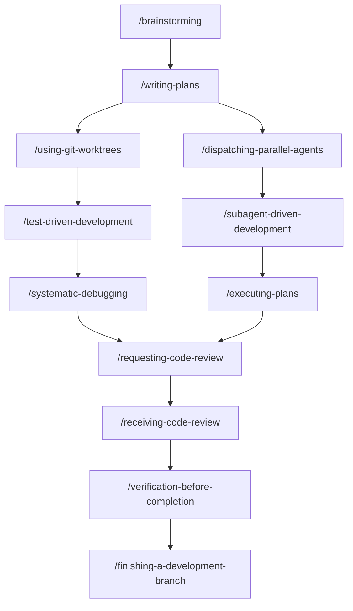
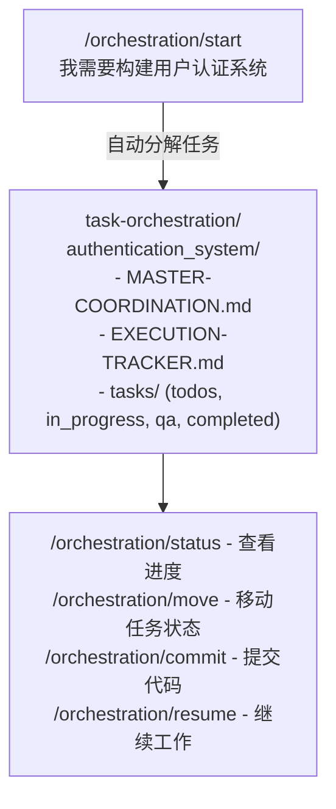

# Claude Code Skills 使用指南

## 目录

1. [Skills 概述](#skills-概述)
2. [Superpowers Skills](#superpowers-skills)
3. [Claude-Command-Suite](#claude-command-suite)
4. [实战工作流](#实战工作流)
5. [最佳实践](#最佳实践)

---

## Skills 概述

### 什么是 Skills？

Skills 是存放在 `~/.claude/` 目录下的指令模板，Claude 会根据上下文自动识别或手动调用。

### 目录结构

### 调用方式

| 方式 | 示例 | 说明 |
|------|------|------|
| Slash command | `/orchestration/start` | 手动调用 |
| 自然语言 | "Use code-auditor to review" | Agent 自动触发 |
| 自动识别 | 提到 "debug" 时自动激活 | 基于关键词 |

---

## Superpowers Skills

### 核心开发流程

### Skill 详解

#### 1. /brainstorming - 头脑风暴

**何时使用**: 任何创意工作前必用

**流程**:
1. 理解项目上下文
2. 一次只问一个问题
3. 提供 2-3 种方案及权衡
4. 分段呈现设计（每段 200-300 字）
5. 写入 `docs/plans/YYYY-MM-DD-<topic>-design.md`

**示例**:

---

#### 2. /systematic-debugging - 系统化调试

**何时使用**: 遇到任何 bug、测试失败、异常行为

**核心原则**: 找到根因前禁止修复

**四个阶段**:

| 阶段 | 活动 | 成功标准 |
|------|------|----------|
| 1. 根因调查 | 读错误、复现、检查变更 | 理解 WHAT 和 WHY |
| 2. 模式分析 | 找工作示例、对比 | 识别差异 |
| 3. 假设测试 | 形成理论、最小测试 | 确认或新假设 |
| 4. 实施修复 | 创建测试、修复、验证 | Bug 解决 |

**红线**:
- 如果尝试 3+ 次修复仍失败 → 停止，质疑架构

---

#### 3. /test-driven-development - 测试驱动开发

**流程**:
1. 先写失败的测试
2. 实现最小代码让测试通过
3. 重构（测试保持通过）

---

#### 4. /writing-plans - 编写计划

**何时使用**: 有规格或需求，准备多步骤实现

**输出**: 详细的实现计划文档

---

#### 5. /executing-plans - 执行计划

**何时使用**: 有写好的计划需要执行

**特点**: 在独立会话中执行，带审查检查点

---

#### 6. /dispatching-parallel-agents - 并行代理调度

**何时使用**: 2+ 个独立任务，无依赖关系

**示例**:

---

#### 7. /using-git-worktrees - 使用 Git Worktree

**何时使用**: 需要隔离的工作空间

**好处**: 不影响当前工作目录，可并行开发

---

#### 8. /verification-before-completion - 完成前验证

**何时使用**: 声称工作完成前

**原则**: 证据先于断言

---

## Claude-Command-Suite

### Orchestration - 任务编排系统

#### 核心命令

| 命令 | 作用 | 使用场景 |
|------|------|----------|
| `/orchestration/start` | 开始新项目 | 新功能开发 |
| `/orchestration/status` | 查看进度 | 了解当前状态 |
| `/orchestration/resume` | 继续工作 | 休息后恢复 |
| `/orchestration/move` | 更新任务状态 | 完成某个任务 |
| `/orchestration/commit` | 保存到 Git | 代码就绪时 |
| `/orchestration/sync` | 同步 Git | 保持同步 |
| `/orchestration/find` | 搜索任务 | 找特定任务 |
| `/orchestration/report` | 生成报告 | 站会汇报 |

#### 每日工作流

**开始工作**:

**完成任务**:

**结束工作**:

---

### Agents - AI 代理

#### 代理分类

#### 代理能力矩阵

| Agent | Read | Write | Edit | Bash | 主要职责 |
|-------|------|-------|------|------|----------|
| code-auditor | Y | - | - | Y | 代码质量 |
| security-auditor | Y | - | - | - | 安全审计 |
| performance-auditor | Y | - | - | Y | 性能优化 |
| test-engineer | Y | Y | Y | Y | 测试生成 |
| project-architect | Y | Y | Y | Y | 项目架构 |
| release-manager | Y | Y | Y | Y | 发布管理 |
| marketing-strategist | Y | Y | - | - | 市场策略 |
| growth-hacker | Y | Y | - | - | 用户增长 |

#### 代理链模式

**模式 1: 顺序分析**

**模式 2: 并行分析**

**模式 3: 迭代改进**

---

## 实战工作流

### 场景 1: 新功能开发

### 场景 2: Bug 修复

### 场景 3: 代码审查

### 场景 4: 发布准备

### 场景 5: 产品营销

---

## 最佳实践

### Skill 选择原则

| 情况 | 推荐 Skill |
|------|-----------|
| 新功能/创意工作 | `/brainstorming` 先 |
| 遇到 bug | `/systematic-debugging` |
| 写代码 | `/test-driven-development` |
| 多个独立任务 | `/dispatching-parallel-agents` |
| 完成声明前 | `/verification-before-completion` |

### 常见错误

| 错误 | 正确做法 |
|------|----------|
| 直接开始写代码 | 先 `/brainstorming` |
| 猜测修复 bug | 用 `/systematic-debugging` |
| 跳过测试 | 用 `/test-driven-development` |
| 声称完成不验证 | 用 `/verification-before-completion` |

### 效率提升技巧

1. **批量操作**: 一次调用多个 auditors
2. **上下文共享**: 提到前一个 agent 的发现
3. **显式链式调用**: 明确告诉 Claude 使用特定顺序
4. **并行执行**: 无依赖任务并行处理

---

## 快速参考卡

### 日常命令

### Agent 触发短语

---

*文档位置: `docs/09-reference/skills-guide.md`*
*相关文档: [agents-guide.md](./agents-guide.md)*
