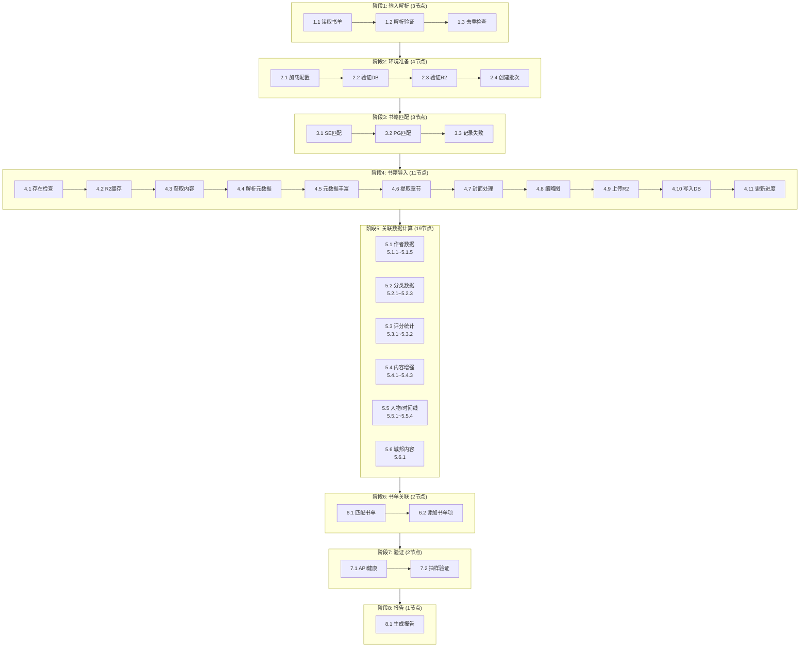
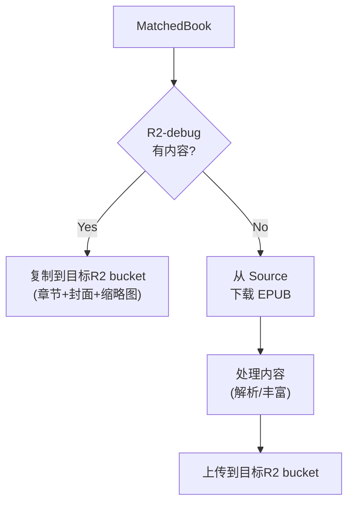

# Environment Pipeline 设计文档

## 1. 概述

### 1.1 目标

构建一个自动化Pipeline，输入**目标环境**和**书单**，输出完整配置好的可供客户端访问的API环境。

### 1.2 输入输出

| 类型 | 内容 |
|------|------|
| **输入** | 目标环境 (production/staging/debugging/local) + 书单JSON文件 |
| **输出** | 完整可用的API环境（数据库数据 + R2文件 + 验证通过的API端点） |

### 1.3 操作方式

Dashboard 唯一入口，向导式操作界面。

---

## 2. Pipeline 处理环节总览

Pipeline 共分为 **8个阶段、46个处理节点**：



---

## 2.1 数据流动 Workflow

展示数据从输入到输出的完整流动过程，包括每个节点所在的服务/系统。

### 服务图例

| 标记 | 服务 | 说明 |
|------|------|------|
| `[Dashboard]` | React Admin Dashboard | 前端界面，运行在用户浏览器 |
| `[Backend]` | NestJS Backend | 部署在 Fly.io |
| `[Neon]` | PostgreSQL Database | Neon Cloud 托管 |
| `[R2]` | Cloudflare R2 | 对象存储 |
| `[SE]` | Standard Ebooks | 外部数据源 standardebooks.org |
| `[PG]` | Project Gutenberg | 外部数据源 gutenberg.org |
| `[Wiki]` | Wikipedia/Wikidata | 外部数据源 |
| `[AI]` | AI Service | OpenAI/Claude API |

```
┌──────────────────────────────────────────────────────────────────────────────────────┐
│                              数据流动 Workflow                                        │
│                           (含服务/系统标注)                                           │
└──────────────────────────────────────────────────────────────────────────────────────┘

═══════════════════════════════════════════════════════════════════════════════════════
                                    【输入层】
═══════════════════════════════════════════════════════════════════════════════════════

    ┌─────────────────────┐         ┌─────────────────────┐
    │  📄 书单JSON文件      │         │  🌐 环境配置         │
    │  (phase1-ebooks.json)│         │  (production/staging)│
    │  [Dashboard]        │         │  [Dashboard]        │
    │                     │         │                     │
    │  {                  │         │  • DB连接串          │
    │    title,           │         │  • R2配置           │
    │    author,          │         │  • API URL          │
    │    chineseTitle,    │         │                     │
    │    section          │         │                     │
    │  }[]                │         │                     │
    └──────────┬──────────┘         └──────────┬──────────┘
               │                               │
               └───────────────┬───────────────┘
                               ▼
═══════════════════════════════════════════════════════════════════════════════════════
                                   【处理层】
═══════════════════════════════════════════════════════════════════════════════════════

┌──────────────────────────────────────────────────────────────────────────────────────┐
│  阶段1-2: 解析与准备                                              [Backend]          │
│  ┌─────────────┐      ┌─────────────┐      ┌─────────────┐                          │
│  │ BookItem[]  │  →   │ 去重后的     │  →   │ ImportBatch │                          │
│  │ (248本)     │      │ BookItem[]  │      │ 记录        │                          │
│  │ [Backend]   │      │ [Backend]   │      │ [Neon]      │                          │
│  └─────────────┘      └─────────────┘      └──────┬──────┘                          │
└──────────────────────────────────────────────────│──────────────────────────────────┘
                                                   ▼
┌──────────────────────────────────────────────────────────────────────────────────────┐
│  阶段3: 书籍匹配                                                  [Backend + 外部]    │
│                                                                                      │
│  BookItem[] ─────┬──────────────────┬──────────────────┐                            │
│  [Backend]       ▼                  ▼                  ▼                            │
│           ┌─────────────┐    ┌─────────────┐    ┌─────────────┐                     │
│           │ SE匹配成功   │    │ PG匹配成功   │    │ 匹配失败     │                     │
│           │ MatchedBook │    │ MatchedBook │    │ FailedBook  │                     │
│           │ [SE]        │    │ [PG]        │    │ [Backend]   │                     │
│           └──────┬──────┘    └──────┬──────┘    └─────────────┘                     │
│                  │                  │                                               │
│                  └────────┬─────────┘                                               │
│                           ▼                                                         │
│                    MatchedBook[]                                                    │
│                    (含 epubUrl, sourceUrl)                                          │
└──────────────────────────│──────────────────────────────────────────────────────────┘
                           ▼
┌──────────────────────────────────────────────────────────────────────────────────────┐
│  阶段4: 书籍导入 (每本书循环)                       [Backend + R2-debug + R2 + Neon]  │
│                                                                                      │
│  MatchedBook ───────────────────────────────────────────────────────────────────┐   │
│       │                                                                         │   │
│       ▼                                                                         │   │
│  ┌──────────────────────────────────────────────────────────────────────────┐  │   │
│  │                    环境策略判断                                           │  │   │
│  │   debug → 直接从Source下载                                               │  │   │
│  │   staging/production → 检查R2-debug缓存                                   │  │   │
│  └──────────────────────────────────────────────────────────────────────────┘  │   │
│       │                                                                         │   │
│       ▼                                                                         │   │
│  ┌─────────┐ Yes ┌─────────┐    ┌─────────┐    ┌─────────┐    ┌─────────┐     │   │
│  │ R2缓存  │────►│ 复制    │ →  │ 写入DB  │    │         │    │         │     │   │
│  │ 命中?   │     │ 到目标R2│    │         │    │         │    │         │     │   │
│  │[R2-dbg] │     │ [R2]    │    │ [Neon]  │    │         │    │         │     │   │
│  └────┬────┘     └─────────┘    └─────────┘    └─────────┘    └─────────┘     │   │
│       │ No                                                                      │   │
│       ▼                                                                         │   │
│  ┌─────────┐    ┌─────────┐    ┌─────────┐    ┌─────────┐    ┌─────────┐     │   │
│  │ 下载    │ →  │ 解析    │ →  │ 元数据  │ →  │ 提取    │ →  │ 封面+   │     │   │
│  │ EPUB    │    │ 元数据  │    │ 丰富    │    │ 章节    │    │ 缩略图  │     │   │
│  │ [SE/PG] │    │[Backend]│    │[Wiki]   │    │[Backend]│    │[Backend]│     │   │
│  └─────────┘    └─────────┘    └─────────┘    └─────────┘    └────┬────┘     │   │
│                                                                    │          │   │
│       ▼              ▼              ▼              ▼              ▼          │   │
│  ┌─────────┐    ┌─────────┐    ┌─────────┐    ┌─────────┐    ┌─────────┐     │   │
│  │ EPUB    │    │ Book    │    │ Enriched│    │ Chapter │    │ cover   │ ────┘   │
│  │ 文件    │    │ Metadata│    │ Meta    │    │ HTML[]  │    │ + thumbs│         │
│  └─────────┘    └─────────┘    └─────────┘    └─────────┘    └─────────┘         │
│                                                                                    │
│       ┌───────────────────────────────────────────────────────────┐               │
│       │                    上传到目标R2 → 写入DB                   │               │
│       │                    [R2 (目标)]    [Neon]                  │               │
│       └───────────────────────────────────────────────────────────┘               │
└──────────────────────────│────────────────────────────────────────────────────────┘
                           ▼
┌──────────────────────────────────────────────────────────────────────────────────────┐
│  阶段5: 关联数据计算 (核心数据扩散)                           [Backend + Wiki + AI + Neon]│
│                                                                                      │
│                              Book 记录                                               │
│                                  │                                                   │
│          ┌───────────┬───────────┼───────────┬───────────┬───────────┐              │
│          ▼           ▼           ▼           ▼           ▼           ▼              │
│    ┌──────────┐ ┌──────────┐ ┌──────────┐ ┌──────────┐ ┌──────────┐ ┌──────────┐   │
│    │ 5.1      │ │ 5.2      │ │ 5.3      │ │ 5.4      │ │ 5.5      │ │ 5.6      │   │
│    │ 作者数据  │ │ 分类数据  │ │ 评分统计  │ │ 内容增强  │ │ 人物关系  │ │ 城邦内容  │   │
│    │[Wiki+Neon]│ │ [Neon]   │ │ [Neon]   │ │[Wiki+AI] │ │[AI+Neon] │ │ [Neon]   │   │
│    └────┬─────┘ └────┬─────┘ └────┬─────┘ └────┬─────┘ └────┬─────┘ └────┬─────┘   │
│         │            │            │            │            │            │          │
│         ▼            ▼            ▼            ▼            ▼            ▼          │
│    ┌─────────────────────────────────────────────────────────────────────────┐     │
│    │                      生成的数据记录 → [Neon]                              │     │
│    ├─────────────────────────────────────────────────────────────────────────┤     │
│    │ Author          │ Category        │ BookStats       │ BookContext      │     │
│    │ AuthorTimeline  │ BookCategory    │ BookScore       │ ReadingGuide     │     │
│    │ AuthorQuote     │                 │                 │ Quote            │     │
│    │ AuthorInfluence │                 │                 │                  │     │
│    ├─────────────────────────────────────────────────────────────────────────┤     │
│    │ BookCharacter   │ CharacterRelationship │ BookCharacterGraph │ StoryEvent│     │
│    ├─────────────────────────────────────────────────────────────────────────┤     │
│    │ AgoraPost (作者帖子)                                                     │     │
│    └─────────────────────────────────────────────────────────────────────────┘     │
└──────────────────────────│──────────────────────────────────────────────────────────┘
                           ▼
┌──────────────────────────────────────────────────────────────────────────────────────┐
│  阶段6: 书单关联                                                  [Backend + Neon]    │
│                                                                                      │
│    Book.section ──────► BookList 匹配/创建 ──────► BookListItem 关联                  │
│    ("P0核心必选")        (name: "P0核心必选")        (bookId, bookListId, order)       │
│    [Backend]             [Neon]                    [Neon]                            │
└──────────────────────────│──────────────────────────────────────────────────────────┘
                           ▼
═══════════════════════════════════════════════════════════════════════════════════════
                                   【输出层】
═══════════════════════════════════════════════════════════════════════════════════════

┌──────────────────────────────────────────────────────────────────────────────────────┐
│                               最终输出数据                                            │
├──────────────────────────────────────────────────────────────────────────────────────┤
│                                                                                      │
│  ┌─────────────────────────────────────────────────────────────────────────────┐    │
│  │                    PostgreSQL [Neon Cloud]                                  │    │
│  │                    Region: AWS us-east-1 / Production                       │    │
│  ├─────────────────────────────────────────────────────────────────────────────┤    │
│  │                                                                             │    │
│  │  核心表                    关联表                     统计表                 │    │
│  │  ┌──────────┐             ┌──────────────────┐       ┌────────────┐        │    │
│  │  │ Book     │────────────►│ BookCategory     │       │ BookStats  │        │    │
│  │  │ Chapter  │             │ BookListItem     │       │ BookScore  │        │    │
│  │  │ Author   │             │ CharacterRel...  │       │ Category   │        │    │
│  │  └──────────┘             └──────────────────┘       │ (bookCount)│        │    │
│  │                                                      └────────────┘        │    │
│  │  内容表                    人物表                     社区表                 │    │
│  │  ┌──────────────┐         ┌──────────────────┐       ┌────────────┐        │    │
│  │  │ BookContext  │         │ BookCharacter    │       │ AgoraPost  │        │    │
│  │  │ ReadingGuide │         │ BookCharGraph    │       │ Quote      │        │    │
│  │  │ StoryEvent   │         │ AuthorTimeline   │       │ AuthorQuote│        │    │
│  │  └──────────────┘         └──────────────────┘       └────────────┘        │    │
│  │                                                                             │    │
│  └─────────────────────────────────────────────────────────────────────────────┘    │
│                                                                                      │
│  ┌─────────────────────────────────────────────────────────────────────────────┐    │
│  │                    Cloudflare R2 [Cloudflare]                               │    │
│  │                    Bucket: readmigo / readmigo-staging / readmigo-debug     │    │
│  ├─────────────────────────────────────────────────────────────────────────────┤    │
│  │                                                                             │    │
│  │  /books/{bookId}/                                                          │    │
│  │      ├── cover.jpg              ← 封面图片                                  │    │
│  │      ├── cover-thumb.jpg        ← 封面缩略图                                │    │
│  │      └── chapters/                                                         │    │
│  │          ├── ch001.html         ← 章节HTML                                  │    │
│  │          ├── ch002.html                                                    │    │
│  │          └── ...                                                           │    │
│  │                                                                             │    │
│  └─────────────────────────────────────────────────────────────────────────────┘    │
│                                                                                      │
│  ┌─────────────────────────────────────────────────────────────────────────────┐    │
│  │                    API Endpoints [Fly.io]                                   │    │
│  │                    App: readmigo-api / readmigo-staging / readmigo-debug    │    │
│  ├─────────────────────────────────────────────────────────────────────────────┤    │
│  │                                                                             │    │
│  │  GET /api/v1/books              ← 书籍列表（含分类、评分）                    │    │
│  │  GET /api/v1/books/:id          ← 书籍详情（含章节、人物、背景）              │    │
│  │  GET /api/v1/books/:id/chapters ← 章节内容（从R2获取）                       │    │
│  │  GET /api/v1/authors            ← 作者列表（含统计、时间线）                  │    │
│  │  GET /api/v1/authors/:id/quotes ← 作者名言                                  │    │
│  │  GET /api/v1/categories         ← 分类列表（含bookCount）                    │    │
│  │  GET /api/v1/agora/posts        ← 城邦帖子（作者名言帖）                      │    │
│  │  GET /api/v1/booklists          ← 书单列表                                  │    │
│  │                                                                             │    │
│  └─────────────────────────────────────────────────────────────────────────────┘    │
│                                                                                      │
└──────────────────────────────────────────────────────────────────────────────────────┘

═══════════════════════════════════════════════════════════════════════════════════════
                                  【数据依赖关系】
═══════════════════════════════════════════════════════════════════════════════════════

                              Book (核心)
                                  │
        ┌─────────┬─────────┬─────┴─────┬─────────┬─────────┐
        │         │         │           │         │         │
        ▼         ▼         ▼           ▼         ▼         ▼
    ┌───────┐ ┌───────┐ ┌───────┐ ┌─────────┐ ┌───────┐ ┌───────┐
    │Chapter│ │Author │ │Category│ │BookStats│ │Quote  │ │Book   │
    │       │ │       │ │       │ │BookScore│ │       │ │Context│
    └───────┘ └───┬───┘ └───┬───┘ └─────────┘ └───────┘ └───────┘
                  │         │
        ┌─────────┼─────────┤
        │         │         │
        ▼         ▼         ▼
    ┌────────┐ ┌────────┐ ┌──────────┐
    │Author  │ │Author  │ │Book      │
    │Timeline│ │Quote   │ │Category  │
    └────────┘ └───┬────┘ └──────────┘
                   │
                   ▼
              ┌─────────┐
              │AgoraPost│
              └─────────┘

    Book ───► BookCharacter ───► CharacterRelationship
                   │                      │
                   └──────────┬───────────┘
                              ▼
                      BookCharacterGraph

    Book ───► StoryEvent (时间线事件)

    Book ───► BookList (通过section) ───► BookListItem

```

### 节点-服务映射表

| 阶段 | 节点 | 操作 | 主服务 | 外部依赖 | 数据存储 |
|------|------|------|--------|----------|----------|
| **1** | 1.1 | 读取书单 | Backend | - | - |
| | 1.2 | 解析验证 | Backend | - | - |
| | 1.3 | 去重检查 | Backend | - | - |
| **2** | 2.1 | 加载配置 | Backend | - | - |
| | 2.2 | 验证DB | Backend | - | Neon |
| | 2.3 | 验证R2 | Backend | - | R2 |
| | 2.4 | 创建批次 | Backend | - | Neon |
| **3** | 3.1 | SE匹配 | Backend | Standard Ebooks | - |
| | 3.2 | PG匹配 | Backend | Gutenberg API | - |
| | 3.3 | 记录失败 | Backend | - | Neon |
| **4** | 4.1 | 存在检查 | Backend | - | Neon |
| | 4.2 | R2缓存检查 | Backend | - | R2-debug |
| | 4.3 | 获取内容 | Backend | SE / PG / R2-debug | - |
| | 4.4 | 解析元数据 | Backend | - | - |
| | 4.5 | 元数据丰富 | Backend | Wikipedia | - |
| | 4.6 | 提取章节 | Backend | - | - |
| | 4.7 | 封面处理 | Backend | - | - |
| | 4.8 | 缩略图生成 | Backend | - | - |
| | 4.9 | 上传R2 | Backend | - | R2 (目标) |
| | 4.10 | 写入DB | Backend | - | Neon |
| | 4.11 | 更新进度 | Backend | - | Neon |
| **5.1** | 5.1.1 | 创建Author | Backend | Wikipedia | Neon |
| | 5.1.2 | 作者统计 | Backend | - | Neon |
| | 5.1.3 | 作者时间线 | Backend | Wikipedia | Neon |
| | 5.1.4 | 作者名言 | Backend | - | Neon |
| | 5.1.5 | 作者影响力 | Backend | Wikipedia | Neon |
| **5.2** | 5.2.1 | 自动分类 | Backend | - | - |
| | 5.2.2 | BookCategory | Backend | - | Neon |
| | 5.2.3 | 分类统计 | Backend | - | Neon |
| **5.3** | 5.3.1 | BookStats | Backend | - | Neon |
| | 5.3.2 | BookScore | Backend | - | Neon |
| **5.4** | 5.4.1 | BookContext | Backend | Wikipedia | Neon |
| | 5.4.2 | ReadingGuide | Backend | AI Service | Neon |
| | 5.4.3 | Quote提取 | Backend | AI Service | Neon |
| **5.5** | 5.5.1 | BookCharacter | Backend | AI / Wikidata | Neon |
| | 5.5.2 | 人物关系 | Backend | AI Service | Neon |
| | 5.5.3 | 关系图 | Backend | - | Neon |
| | 5.5.4 | StoryEvent | Backend | AI Service | Neon |
| **5.6** | 5.6.1 | AgoraPost | Backend | - | Neon |
| **6** | 6.1 | 匹配书单 | Backend | - | Neon |
| | 6.2 | 添加书单项 | Backend | - | Neon |
| **7** | 7.1 | API健康 | Backend | - | - |
| | 7.2 | 抽样验证 | Backend | - | Neon + R2 |
| **8** | 8.1 | 生成报告 | Backend | - | Neon |

### 外部服务汇总

| 服务 | 用途 | 使用节点 |
|------|------|----------|
| **Standard Ebooks** | EPUB源 | 3.1, 4.3 |
| **Project Gutenberg** | EPUB源 | 3.2, 4.3 |
| **R2-debug** | 内容缓存（staging/production环境） | 4.2, 4.3 |
| **Wikipedia** | 作者信息、书籍背景、元数据丰富 | 4.5, 5.1.1, 5.1.3, 5.1.5, 5.4.1 |
| **Wikidata** | 结构化数据 | 5.1.1, 5.5.1 |
| **AI Service** | 内容生成、分析 | 5.4.2, 5.4.3, 5.5.1, 5.5.2, 5.5.4 |

---

## 3. 各阶段详细设计

### 阶段1: 输入解析

| 节点 | 名称 | 输入 | 处理逻辑 | 输出 | 失败处理 |
|------|------|------|----------|------|----------|
| 1.1 | 读取书单 | 书单文件路径 | 从 `/data/booklists/` 读取JSON文件 | 原始JSON数据 | 终止Pipeline，提示文件不存在 |
| 1.2 | 解析验证 | 原始JSON | 验证JSON格式，提取books数组，验证必填字段(title, author) | `BookItem[]` | 终止Pipeline，提示格式错误 |
| 1.3 | 去重检查 | `BookItem[]` | 按title+author去重，记录重复项 | 去重后的 `BookItem[]` + 重复统计 | 仅警告，继续执行 |

**BookItem 结构：**
```typescript
interface BookItem {
  title: string;        // 必填
  author: string;       // 必填
  chineseTitle?: string;
  section?: string;
}
```

---

### 阶段2: 环境准备

| 节点 | 名称 | 输入 | 处理逻辑 | 输出 | 失败处理 |
|------|------|------|----------|------|----------|
| 2.1 | 加载配置 | 环境名称 | 加载对应环境的配置（DB URL, R2配置等） | `EnvironmentConfig` | 终止Pipeline，提示配置错误 |
| 2.2 | 验证DB | DB连接配置 | 测试数据库连接，检查schema版本 | 连接成功确认 | 终止Pipeline，提示DB连接失败 |
| 2.3 | 验证R2 | R2配置 | 测试R2连接，检查bucket权限 | 连接成功确认 | 终止Pipeline，提示R2连接失败 |
| 2.4 | 创建批次 | 配置信息 | 在ImportBatch表创建记录，状态=RUNNING | `ImportBatch` 记录 | 终止Pipeline，提示创建失败 |

**环境配置映射：**

| 环境 | 数据库 | R2 Bucket | API URL |
|------|--------|-----------|---------|
| local | 本地PostgreSQL | 本地文件系统 | localhost:3000 |
| debugging | Neon debugging | readmigo-debug | readmigo-debug.fly.dev |
| staging | Neon staging | readmigo-staging | staging-api.readmigo.app |
| production | Neon production | readmigo | api.readmigo.app |

---

### 阶段3: 书籍匹配

| 节点 | 名称 | 输入 | 处理逻辑 | 输出 | 失败处理 |
|------|------|------|----------|------|----------|
| 3.1 | SE匹配 | `BookItem` | 构建Standard Ebooks URL，验证是否存在 | 匹配成功的书籍列表 | 传递给3.2继续匹配 |
| 3.2 | PG匹配 | SE未匹配的书籍 | 调用Gutenberg API搜索，选择最佳匹配 | 匹配成功的书籍列表 | 传递给3.3记录 |
| 3.3 | 记录失败 | 未匹配的书籍 | 记录无法匹配的书籍，写入错误日志 | 失败书籍列表 | 仅记录，继续执行 |

**匹配规则：**

```
Standard Ebooks URL 构建规则：
  title: "Pride and Prejudice"
  author: "Jane Austen"
  → https://standardebooks.org/ebooks/jane-austen/pride-and-prejudice

Gutenberg 搜索规则：
  API: https://gutendex.com/books?search={title}+{author}
  匹配策略: 标题相似度 > 80% && 作者匹配
```

**匹配结果结构：**
```typescript
interface MatchedBook {
  original: BookItem;
  source: 'STANDARD_EBOOKS' | 'GUTENBERG';
  sourceUrl: string;
  epubUrl: string;
  confidence: number;  // 0-100
}
```

---

### 阶段4: 书籍导入

**循环处理每本书，支持并行 (默认3本同时)**

#### 4.0 环境处理策略

根据目标环境不同，Pipeline 采用不同的内容获取策略：

| 目标环境 | 内容获取策略 | 说明 |
|---------|-------------|------|
| **debug** | 直接从 Source 下载 | 始终从 Standard Ebooks / Gutenberg 获取最新内容 |
| **staging** | R2-debug → Source | 优先从 R2-debug 复制，未命中则从 Source 下载 |
| **production** | R2-debug → Source | 优先从 R2-debug 复制，未命中则从 Source 下载 |



#### 4.1 处理节点

| 节点 | 名称 | 输入 | 处理逻辑 | 输出 | 失败处理 |
|------|------|------|----------|------|----------|
| 4.1 | 存在检查 | `MatchedBook` | 查询目标DB是否已存在(source+sourceId) | 是否跳过标记 | 跳过该书，继续下一本 |
| 4.2 | R2缓存检查 | `MatchedBook` | 检查R2-debug是否有该书内容（仅staging/production） | 缓存命中标记 | 继续下载流程 |
| 4.3 | 获取内容 | `MatchedBook` + 缓存标记 | 命中：从R2-debug复制；未命中：从Source下载EPUB | 内容数据 | 记录失败，继续下一本 |
| 4.4 | 解析元数据 | EPUB文件 | 提取title, author, description, language, cover等 | `BookMetadata` | 记录失败，继续下一本 |
| 4.5 | 元数据丰富 | `BookMetadata` | 从Wikipedia/Wikidata获取补充信息，计算难度评分 | `EnrichedMetadata` | 仅警告，使用基础数据 |
| 4.6 | 提取章节 | EPUB文件 | 解析TOC，提取各章节HTML内容 | `Chapter[]` | 记录失败，继续下一本 |
| 4.7 | 封面处理 | 原始封面 | 处理封面图片：调整尺寸、优化质量 | 处理后封面 | 使用默认封面 |
| 4.8 | 缩略图生成 | 处理后封面 | 生成多尺寸缩略图（small/medium/large） | 缩略图集 | 仅警告 |
| 4.9 | 上传R2 | 章节+封面+缩略图 | 上传所有内容到目标环境R2 bucket | R2 URLs | 记录失败，继续下一本 |
| 4.10 | 写入DB | 所有数据 | 写入Book, Chapter, Author关联 | DB记录ID | 记录失败，继续下一本 |
| 4.11 | 更新进度 | 完成状态 | 更新ImportBatch进度，推送状态更新 | 进度百分比 | 仅记录 |

#### 4.2 元数据丰富 (节点4.5)

| 数据项 | 来源 | 说明 |
|--------|------|------|
| 难度评分 | 计算 | 基于词汇复杂度、句子长度等计算 |
| 作者信息 | Wikipedia | 生卒年、国籍、文学时期 |
| 书籍背景 | Wikipedia | 创作背景、历史地位 |
| 主题标签 | AI分析 | 自动提取主题关键词 |

#### 4.3 封面与缩略图 (节点4.7-4.8)

| 图片类型 | 尺寸 | 用途 |
|---------|------|------|
| cover.jpg | 原始/最大1200px | 详情页展示 |
| cover-thumb-sm.jpg | 120x180 | 列表缩略图 |
| cover-thumb-md.jpg | 240x360 | 卡片展示 |
| cover-thumb-lg.jpg | 480x720 | 预览图 |

**R2 存储路径：**
```
/books/{bookId}/
  ├── cover.jpg              # 封面图片 (处理后)
  ├── cover-thumb-sm.jpg     # 小缩略图
  ├── cover-thumb-md.jpg     # 中缩略图
  ├── cover-thumb-lg.jpg     # 大缩略图
  └── chapters/
      ├── ch001.html         # 章节内容
      ├── ch002.html
      └── ...
```

**单本书处理状态：**
```typescript
enum BookProcessStatus {
  PENDING = 'pending',      // 等待处理
  MATCHING = 'matching',    // 正在匹配
  DOWNLOADING = 'downloading', // 正在下载
  PROCESSING = 'processing',   // 正在处理
  UPLOADING = 'uploading',     // 正在上传
  COMPLETED = 'completed',     // 完成
  SKIPPED = 'skipped',         // 已跳过(已存在)
  FAILED = 'failed'            // 失败
}
```

---

### 阶段5: 关联数据计算 (核心扩展)

本阶段是Pipeline最复杂的部分，需要根据导入的书籍计算和填充所有关联表格数据。

#### 5.1 作者数据处理

| 节点 | 名称 | 输入 | 处理逻辑 | 输出 | 数据表 | 必填字段 |
|------|------|------|----------|------|--------|----------|
| 5.1.1 | 创建/关联Author | 书籍author字段 | 查询是否已存在→不存在则创建 | Author记录 | `Author` | name |
| 5.1.2 | 更新作者统计 | Author ID | 计算bookCount, quoteCount | 统计数据 | `Author` | bookCount |
| 5.1.3 | 作者时间线 | Author信息 | 从Wikipedia/外部源获取生平事件 | 时间线数据 | `AuthorTimelineEvent` | year, title, category |
| 5.1.4 | 作者名言 | Author ID | 从书籍中提取或外部源获取名言 | 名言列表 | `AuthorQuote` | text |
| 5.1.5 | 作者影响力 | Author信息 | 分析作者间影响关系 | 影响网络 | `AuthorInfluence` | influencerId, strength |

**Author表需要填充的字段：**

| 字段 | 类型 | 数据来源 | 优先级 |
|------|------|----------|--------|
| `name` | String | 书籍author字段 | 必填 |
| `aliases` | String[] | Wikipedia/Wikidata | 可选 |
| `avatarUrl` | String | Wikipedia图片 | 可选 |
| `bio` | String | Wikipedia摘要 | 推荐 |
| `era` | String | 书单JSON或Wikipedia | 推荐 |
| `nationality` | String | 书单JSON或Wikipedia | 推荐 |
| `birthPlace` | String | Wikipedia | 可选 |
| `writingStyle` | String | AI生成或编辑填写 | 可选 |
| `famousWorks` | String[] | 书籍列表自动生成 | 推荐 |
| `literaryPeriod` | String | Wikipedia | 可选 |
| `literaryMovement` | String | Wikipedia | 可选 |
| `primaryGenres` | String[] | 书籍分类汇总 | 可选 |
| `themes` | String[] | AI分析 | 可选 |
| `aiPersonaPrompt` | String | AI生成 | 可选 |
| `bookCount` | Int | 自动计算 | 必填 |
| `quoteCount` | Int | 自动计算 | 必填 |
| `wikipediaUrl` | String | 搜索匹配 | 推荐 |
| `wikidataId` | String | Wikidata API | 推荐 |

---

#### 5.2 分类数据处理

| 节点 | 名称 | 输入 | 处理逻辑 | 输出 | 数据表 | 必填字段 |
|------|------|------|----------|------|--------|----------|
| 5.2.1 | 自动分类 | 书籍subjects/genres | 映射到系统分类体系 | 分类ID列表 | - | - |
| 5.2.2 | 创建BookCategory | 书籍ID + 分类ID | 创建关联记录，标记主分类 | 关联记录 | `BookCategory` | bookId, categoryId |
| 5.2.3 | 更新分类统计 | Category ID | 重新计算每个分类的bookCount | 更新后的统计 | `Category` | bookCount |

**分类映射规则：**

| 书籍字段 | 映射逻辑 | 示例 |
|----------|----------|------|
| `subjects` | 关键词匹配到Category.name | "Fiction" → 小说 |
| `genres` | 直接映射或模糊匹配 | "Romance" → 爱情 |
| `section` (书单) | 按section分组创建分类 | "P0核心必选" → 经典必读 |

**BookCategory表字段：**

| 字段 | 类型 | 说明 |
|------|------|------|
| `bookId` | UUID | 书籍ID (必填) |
| `categoryId` | UUID | 分类ID (必填) |
| `isPrimary` | Boolean | 是否主分类 (第一个为true) |

---

#### 5.3 书籍评分/统计初始化

| 节点 | 名称 | 输入 | 处理逻辑 | 输出 | 数据表 | 必填字段 |
|------|------|------|----------|------|--------|----------|
| 5.3.1 | 初始化BookStats | Book ID | 创建统计记录，所有计数初始化为0 | BookStats记录 | `BookStats` | bookId |
| 5.3.2 | 计算BookScore | Book信息 | 计算qualityScore, popularityScore, finalScore | BookScore记录 | `BookScore` | bookId, finalScore |

**BookStats表初始化字段：**

| 字段 | 初始值 | 说明 |
|------|--------|------|
| `viewCount` | 0 | 浏览量 |
| `uniqueViewerCount` | 0 | 独立访客 |
| `bookshelfCount` | 0 | 加入书架次数 |
| `wishlistCount` | 0 | 加入想读次数 |
| `readStartCount` | 0 | 开始阅读人数 |
| `readCompleteCount` | 0 | 完读人数 |
| `totalReadingMinutes` | 0 | 总阅读时长 |
| `highlightCount` | 0 | 划线次数 |
| `noteCount` | 0 | 笔记总数 |
| `aiInteractionCount` | 0 | AI交互次数 |

**BookScore计算规则：**

| 字段 | 计算逻辑 | 范围 |
|------|----------|------|
| `qualityScore` | 基于isClassic, isAwardWinner, editorialScore | 0-1 |
| `popularityScore` | 初始为0，后续根据用户行为更新 | 0-1 |
| `freshnessScore` | 基于importedAt时间 | 0-1 |
| `authorPopularityScore` | 基于作者bookCount和followerCount | 0-1 |
| `finalScore` | 加权综合: quality*0.4 + popularity*0.3 + freshness*0.2 + author*0.1 | 0-1 |

---

#### 5.4 内容增强 (可选，需配置开启)

| 节点 | 名称 | 输入 | 处理逻辑 | 输出 | 数据表 | 数据来源 |
|------|------|------|----------|------|--------|----------|
| 5.4.1 | BookContext | Book信息 | 获取书籍背景上下文 | 背景数据 | `BookContext` | Wikipedia |
| 5.4.2 | ReadingGuide | Book内容 | AI生成阅读指南 | 指南数据 | `ReadingGuide` | AI生成 |
| 5.4.3 | Quote提取 | 章节内容 | 从章节中提取名言金句 | 名言列表 | `Quote` | 章节分析 |

**BookContext表字段：**

| 字段 | 类型 | 数据来源 | 优先级 |
|------|------|----------|--------|
| `sourceType` | Enum | WIKIPEDIA/STANDARD_EBOOKS/OPEN_LIBRARY | 必填 |
| `sourceUrl` | String | 外部链接 | 推荐 |
| `summary` | String | Wikipedia摘要 | 推荐 |
| `creationBackground` | String | 创作背景 | 可选 |
| `historicalContext` | String | 历史背景 | 可选 |
| `themes` | String | 主题思想 | 可选 |
| `literaryStyle` | String | 文学风格 | 可选 |

**ReadingGuide表字段：**

| 字段 | 类型 | 生成方式 |
|------|------|----------|
| `overview` | String | AI摘要 |
| `readingTips` | String | AI建议 |
| `keyThemes` | Json | AI分析 |
| `discussionQuestions` | Json | AI生成 |
| `relatedBooks` | Json | 推荐算法 |

**Quote表字段：**

| 字段 | 类型 | 说明 |
|------|------|------|
| `text` | String | 名言文本 (必填) |
| `textEn` | String | 英文原文 |
| `source` | Enum | BOOK/AUTHOR |
| `bookId` | UUID | 关联书籍 |
| `bookTitle` | String | 书名 |
| `author` | String | 作者名 (必填) |
| `authorId` | UUID | 关联作者 |
| `chapter` | String | 出处章节 |
| `tags` | String[] | 标签 |

---

#### 5.5 人物关系/时间线 (可选，需配置开启)

| 节点 | 名称 | 输入 | 处理逻辑 | 输出 | 数据表 | 数据来源 |
|------|------|------|----------|------|--------|----------|
| 5.5.1 | BookCharacter | 章节内容 | 提取书中人物信息 | 人物列表 | `BookCharacter` | AI分析/Wikidata |
| 5.5.2 | CharacterRelationship | 人物列表 | 分析人物间关系 | 关系数据 | `CharacterRelationship` | AI分析 |
| 5.5.3 | BookCharacterGraph | 人物+关系 | 生成关系图元数据 | 图元数据 | `BookCharacterGraph` | 计算生成 |
| 5.5.4 | StoryEvent | 章节内容 | 提取故事事件时间线 | 事件列表 | `StoryEvent` | AI分析 |

**BookCharacter表字段：**

| 字段 | 类型 | 优先级 |
|------|------|--------|
| `name` | String | 必填 |
| `aliases` | String[] | 可选 |
| `role` | Enum | 必填 (PROTAGONIST/ANTAGONIST/SUPPORTING/MINOR) |
| `shortDescription` | String | 推荐 |
| `fullDescription` | String | 可选 |
| `personality` | Json | 可选 |
| `firstAppearanceChapter` | Int | 推荐 |
| `importanceScore` | Float | 必填 (0-1) |
| `imageUrl` | String | 可选 |
| `dataSource` | Enum | 必填 (AI_GENERATED/EDITORIAL/WIKIDATA) |

**CharacterRelationship表字段：**

| 字段 | 类型 | 说明 |
|------|------|------|
| `fromCharacterId` | UUID | 起始人物 (必填) |
| `toCharacterId` | UUID | 目标人物 (必填) |
| `type` | Enum | FAMILY/ROMANTIC/FRIEND/ENEMY/COLLEAGUE/UNKNOWN |
| `description` | String | 关系描述 |
| `sentiment` | Enum | POSITIVE/NEGATIVE/NEUTRAL/COMPLEX |
| `strength` | Float | 关系强度 0-1 |

**StoryEvent表字段：**

| 字段 | 类型 | 说明 |
|------|------|------|
| `title` | String | 事件标题 (必填) |
| `description` | String | 事件描述 |
| `type` | Enum | MAJOR/TURNING_POINT/CHARACTER/CONFLICT等 |
| `importance` | Enum | CRITICAL/HIGH/MEDIUM/LOW |
| `chapterIndex` | Int | 所在章节 |
| `spoilerLevel` | Int | 剧透等级 0-3 |
| `involvedCharacters` | String[] | 相关人物 |

---

#### 5.6 城邦(Agora)内容

| 节点 | 名称 | 输入 | 处理逻辑 | 输出 | 数据表 |
|------|------|------|----------|------|--------|
| 5.6.1 | 创建AgoraPost | Quote + Author | 为名言创建城邦帖子 | 帖子记录 | `AgoraPost` |

**AgoraPost表字段 (作者帖子类型)：**

| 字段 | 类型 | 说明 |
|------|------|------|
| `postType` | String | 'AUTHOR' (作者发布) |
| `authorId` | UUID | 关联作者 (必填) |
| `quoteId` | UUID | 关联名言 |
| `simulatedPostTime` | DateTime | 模拟发布时间 (历史日期穿越) |
| `likeCount` | Int | 初始化为0 |
| `commentCount` | Int | 初始化为0 |
| `isActive` | Boolean | true |

---

### 阶段6: 书单关联

| 节点 | 名称 | 输入 | 处理逻辑 | 输出 | 失败处理 |
|------|------|------|----------|------|----------|
| 6.1 | 匹配书单 | 书籍section字段 | 查找或创建对应的BookList | BookList ID | 仅警告 |
| 6.2 | 添加书单项 | Book ID + BookList ID | 创建BookListItem记录 | 关联记录 | 仅警告 |

**BookList表字段：**

| 字段 | 类型 | 说明 |
|------|------|------|
| `name` | String | 书单名称 (必填) |
| `type` | Enum | COLLECTION (导入创建的为集合类型) |
| `status` | Enum | ACTIVE |

**BookListItem表字段：**

| 字段 | 类型 | 说明 |
|------|------|------|
| `bookListId` | UUID | 书单ID (必填) |
| `bookId` | UUID | 书籍ID (必填) |
| `order` | Int | 排序 (按导入顺序) |

---

### 阶段7: 验证

| 节点 | 名称 | 输入 | 处理逻辑 | 输出 | 失败处理 |
|------|------|------|----------|------|----------|
| 7.1 | API健康 | API URL | 调用 /api/v1/health 端点 | 健康状态 | 警告，继续 |
| 7.2 | 抽样验证 | 导入的书籍ID | 随机抽取5本书，验证章节/封面可访问 | 验证结果 | 警告，继续 |

**验证检查项：**
```
- [ ] API /health 返回200
- [ ] Book API /books/{id} 返回正确数据
- [ ] Chapter内容 /books/{id}/chapters/{n} 可访问
- [ ] Cover图片 可访问且非空
```

---

### 阶段8: 报告

| 节点 | 名称 | 输入 | 处理逻辑 | 输出 | 失败处理 |
|------|------|------|----------|------|----------|
| 8.1 | 生成报告 | 所有阶段结果 | 汇总统计，生成最终报告 | `PipelineReport` | - |

**报告结构：**
```typescript
interface PipelineReport {
  batchId: string;
  environment: string;
  booklistFile: string;
  startTime: Date;
  endTime: Date;
  duration: number;  // 秒

  summary: {
    total: number;
    matched: number;
    imported: number;
    skipped: number;
    failed: number;
  };

  storage: {
    chaptersUploaded: number;
    coversUploaded: number;
    totalSize: number;  // bytes
  };

  // 关联数据统计 (阶段5)
  relatedData: {
    authors: {
      created: number;      // 新建作者数
      updated: number;      // 更新作者数
      timelineEvents: number;  // 时间线事件数
      quotes: number;       // 作者名言数
    };
    categories: {
      bookCategories: number;  // 书籍分类关联数
      categoriesUpdated: number;  // 更新分类统计数
    };
    bookStats: {
      created: number;      // BookStats记录数
      scores: number;       // BookScore记录数
    };
    content: {
      bookContexts: number;   // BookContext记录数
      readingGuides: number;  // ReadingGuide记录数
      quotes: number;         // Quote提取数
    };
    characters: {
      characters: number;     // BookCharacter数
      relationships: number;  // CharacterRelationship数
      graphs: number;         // BookCharacterGraph数
      events: number;         // StoryEvent数
    };
    agora: {
      posts: number;          // AgoraPost数
    };
    bookLists: {
      created: number;        // 新建书单数
      items: number;          // BookListItem关联数
    };
  };

  healthCheck: {
    apiHealth: boolean;
    sampleVerification: boolean;
    issues: string[];
  };

  failures: {
    book: BookItem;
    stage: string;
    error: string;
  }[];

  apiEndpoint: string;
}
```

---

## 4. Dashboard 界面设计

### 4.1 页面结构

```
┌─────────────────────────────────────────────────────────────────┐
│  Environment Pipeline                              [历史记录]   │
├─────────────────────────────────────────────────────────────────┤
│                                                                 │
│  ┌─────────────────────────────────────────────────────────┐   │
│  │  向导步骤                                                │   │
│  │  ① 选择环境  →  ② 选择书单  →  ③ 配置选项  →  ④ 执行   │   │
│  └─────────────────────────────────────────────────────────┘   │
│                                                                 │
│  ┌─────────────────────────────────────────────────────────┐   │
│  │  当前步骤内容区                                          │   │
│  │                                                          │   │
│  │  [根据当前步骤显示不同内容]                              │   │
│  │                                                          │   │
│  └─────────────────────────────────────────────────────────┘   │
│                                                                 │
│  ┌─────────────────────────────────────────────────────────┐   │
│  │                    [上一步]  [下一步/开始执行]           │   │
│  └─────────────────────────────────────────────────────────┘   │
│                                                                 │
└─────────────────────────────────────────────────────────────────┘
```

### 4.2 步骤1: 选择环境

```
┌─────────────────────────────────────────────────────────────┐
│  选择目标环境                                                │
├─────────────────────────────────────────────────────────────┤
│                                                             │
│  ┌──────────────┐  ┌──────────────┐  ┌──────────────┐      │
│  │ 🔴 Production │  │ 🟡 Staging   │  │ 🟢 Debugging │      │
│  │              │  │              │  │              │      │
│  │ api.readmigo │  │ staging-api  │  │ debug.fly    │      │
│  │ Neon Prod    │  │ Neon Staging │  │ Neon Debug   │      │
│  │ R2 Prod      │  │ R2 Staging   │  │ R2 Debug     │      │
│  └──────────────┘  └──────────────┘  └──────────────┘      │
│                                                             │
│  ⚠️ 警告：Production环境操作需要额外确认                     │
│                                                             │
└─────────────────────────────────────────────────────────────┘
```

### 4.3 步骤2: 选择书单

```
┌─────────────────────────────────────────────────────────────┐
│  选择书单文件                                                │
├─────────────────────────────────────────────────────────────┤
│                                                             │
│  可用书单：                                                  │
│  ┌─────────────────────────────────────────────────────┐   │
│  │ 📄 v1/phase1-ebooks.json                            │   │
│  │    248本书 | 生成于 2026-01-03                       │   │
│  │    包含: 核心必选、作者全集、科幻经典等               │   │
│  └─────────────────────────────────────────────────────┘   │
│  ┌─────────────────────────────────────────────────────┐   │
│  │ 📄 v1/phase1-authors.json                           │   │
│  │    100位作者 | 生成于 2026-01-03                     │   │
│  └─────────────────────────────────────────────────────┘   │
│                                                             │
│  书单预览：                                                  │
│  ┌─────────────────────────────────────────────────────┐   │
│  │ # | 书名                    | 作者           | 分类    │   │
│  │ 1 | Ulysses                | James Joyce    | P0核心  │   │
│  │ 2 | Heart of Darkness      | Joseph Conrad  | P0核心  │   │
│  │ 3 | Pride and Prejudice    | Jane Austen    | P0核心  │   │
│  │ ...                                                  │   │
│  └─────────────────────────────────────────────────────┘   │
│                                                             │
└─────────────────────────────────────────────────────────────┘
```

### 4.4 步骤3: 配置选项

```
┌─────────────────────────────────────────────────────────────┐
│  配置导入选项                                                │
├─────────────────────────────────────────────────────────────┤
│                                                             │
│  基本选项：                                                  │
│  ┌─────────────────────────────────────────────────────┐   │
│  │ ☑️ 跳过已存在的书籍 (skipExisting)                   │   │
│  │    已存在的书籍将被跳过，不会重复导入                 │   │
│  └─────────────────────────────────────────────────────┘   │
│                                                             │
│  高级选项：                                                  │
│  ┌─────────────────────────────────────────────────────┐   │
│  │ 并行处理数: [3] ▼  (1-5)                             │   │
│  │ 同时处理的书籍数量，建议3-5                          │   │
│  └─────────────────────────────────────────────────────┘   │
│  ┌─────────────────────────────────────────────────────┐   │
│  │ 书籍来源优先级:                                      │   │
│  │ ○ 自动 (Standard Ebooks优先)                        │   │
│  │ ○ 仅 Standard Ebooks                                │   │
│  │ ○ 仅 Project Gutenberg                              │   │
│  └─────────────────────────────────────────────────────┘   │
│  ┌─────────────────────────────────────────────────────┐   │
│  │ ☑️ 执行书籍丰富 (enrichBooks)                        │   │
│  │    处理封面、计算难度评分、生成缩略图                 │   │
│  └─────────────────────────────────────────────────────┘   │
│                                                             │
└─────────────────────────────────────────────────────────────┘
```

### 4.5 步骤4: 执行面板

```
┌─────────────────────────────────────────────────────────────┐
│  Pipeline 执行中                                [取消执行]   │
├─────────────────────────────────────────────────────────────┤
│                                                             │
│  总体进度：                                                  │
│  ████████████░░░░░░░░░░░░░░░░░░  45/248 (18%)              │
│                                                             │
│  当前阶段: 阶段4 - 书籍导入                                  │
│  当前书籍: Pride and Prejudice                              │
│  当前状态: 正在上传章节到R2...                               │
│                                                             │
│  ┌─────────────────────────────────────────────────────┐   │
│  │ 处理列表                                   [筛选 ▼]  │   │
│  ├─────────────────────────────────────────────────────┤   │
│  │ ✅ Ulysses                          完成 | 56章    │   │
│  │ ✅ Heart of Darkness                完成 | 12章    │   │
│  │ 🔄 Pride and Prejudice              上传中...      │   │
│  │ ⏳ The Great Gatsby                 等待中         │   │
│  │ ⏳ Jane Eyre                        等待中         │   │
│  │ ❌ Middlemarch                      失败 [查看]    │   │
│  │ ⏭️ Emma                            已跳过(已存在)  │   │
│  │ ...                                                │   │
│  └─────────────────────────────────────────────────────┘   │
│                                                             │
│  实时统计：                                                  │
│  ┌────────┐ ┌────────┐ ┌────────┐ ┌────────┐ ┌────────┐   │
│  │ 总计   │ │ 完成   │ │ 处理中 │ │ 跳过   │ │ 失败   │   │
│  │  248   │ │   42   │ │    3   │ │   12   │ │    1   │   │
│  └────────┘ └────────┘ └────────┘ └────────┘ └────────┘   │
│                                                             │
└─────────────────────────────────────────────────────────────┘
```

### 4.6 完成报告

```
┌─────────────────────────────────────────────────────────────┐
│  Pipeline 完成                                              │
├─────────────────────────────────────────────────────────────┤
│                                                             │
│  ╔═══════════════════════════════════════════════════════╗ │
│  ║  ✅ Pipeline 执行成功                                  ║ │
│  ╠═══════════════════════════════════════════════════════╣ │
│  ║  环境: production                                      ║ │
│  ║  书单: v1/phase1-ebooks.json                          ║ │
│  ║  耗时: 45分32秒                                        ║ │
│  ╠═══════════════════════════════════════════════════════╣ │
│  ║  书籍统计:                                             ║ │
│  ║    总计: 248  导入: 220  跳过: 25  失败: 3            ║ │
│  ╠═══════════════════════════════════════════════════════╣ │
│  ║  存储统计:                                             ║ │
│  ║    章节: 5,420个  封面: 220张  总大小: 1.2GB          ║ │
│  ╠═══════════════════════════════════════════════════════╣ │
│  ║  关联数据统计:                                         ║ │
│  ║    作者: 新建85  更新35  名言320  时间线事件180        ║ │
│  ║    分类: 书籍分类关联520  分类更新18                   ║ │
│  ║    评分: BookStats 220  BookScore 220                 ║ │
│  ║    内容: 背景180  指南180  名言1,200                   ║ │
│  ║    人物: 人物850  关系1,200  事件2,100                 ║ │
│  ║    城邦: 帖子320  书单项248                           ║ │
│  ╠═══════════════════════════════════════════════════════╣ │
│  ║  健康检查: ✅ 通过                                     ║ │
│  ║    - API健康: ✅                                       ║ │
│  ║    - 抽样验证: ✅ (5/5)                                ║ │
│  ╠═══════════════════════════════════════════════════════╣ │
│  ║  API端点: https://api.readmigo.app/api/v1             ║ │
│  ╚═══════════════════════════════════════════════════════╝ │
│                                                             │
│  失败书籍详情：                                              │
│  ┌─────────────────────────────────────────────────────┐   │
│  │ 书名              | 阶段      | 错误原因            │   │
│  │ Middlemarch       | 3.1匹配   | SE未找到此书        │   │
│  │ The Possessed     | 4.2下载   | EPUB下载超时        │   │
│  │ Faust             | 4.4章节   | 章节结构解析失败    │   │
│  └─────────────────────────────────────────────────────┘   │
│                                                             │
│  [查看完整日志]  [导出报告]  [返回首页]                      │
│                                                             │
└─────────────────────────────────────────────────────────────┘
```

---

## 5. API 设计

### 5.1 端点列表

| 方法 | 路径 | 说明 |
|------|------|------|
| `GET` | `/admin/pipeline/booklists` | 获取可用书单列表 |
| `GET` | `/admin/pipeline/booklists/:path/preview` | 预览书单内容 |
| `POST` | `/admin/pipeline/start` | 启动Pipeline |
| `GET` | `/admin/pipeline/:id/status` | 获取执行状态 |
| `GET` | `/admin/pipeline/:id/books` | 获取书籍处理列表 |
| `POST` | `/admin/pipeline/:id/cancel` | 取消执行 |
| `GET` | `/admin/pipeline/history` | 获取历史记录 |
| `GET` | `/admin/pipeline/:id/report` | 获取完整报告 |

### 5.2 请求/响应示例

**启动Pipeline:**
```typescript
// POST /admin/pipeline/start
// Request
{
  "environment": "production",
  "booklistPath": "v1/phase1-ebooks.json",
  "options": {
    "skipExisting": true,
    "parallel": 3,
    "source": "AUTO",
    "enrichBooks": true
  }
}

// Response
{
  "id": "pipeline_abc123",
  "batchId": "batch_xyz789",
  "status": "running",
  "createdAt": "2026-01-18T10:00:00Z"
}
```

**获取状态:**
```typescript
// GET /admin/pipeline/:id/status
// Response
{
  "id": "pipeline_abc123",
  "status": "running",
  "currentStage": "4",
  "currentStageName": "书籍导入",
  "progress": {
    "total": 248,
    "completed": 45,
    "skipped": 12,
    "failed": 1,
    "percentage": 18
  },
  "currentBook": {
    "title": "Pride and Prejudice",
    "author": "Jane Austen",
    "status": "uploading"
  },
  "startTime": "2026-01-18T10:00:00Z",
  "elapsedSeconds": 1200
}
```

---

## 6. 技术实现

### 6.1 后端模块结构

```
apps/backend/src/modules/pipeline/
├── pipeline.module.ts
├── pipeline.controller.ts
├── pipeline.service.ts
├── pipeline.processor.ts          # 后台任务处理器
├── dto/
│   ├── start-pipeline.dto.ts
│   ├── pipeline-status.dto.ts
│   └── pipeline-report.dto.ts
├── interfaces/
│   ├── book-item.interface.ts
│   ├── matched-book.interface.ts
│   └── pipeline-config.interface.ts
└── services/
    ├── booklist.service.ts        # 书单读取服务
    ├── book-matcher.service.ts    # 书籍匹配服务
    └── progress-tracker.service.ts # 进度追踪服务
```

### 6.2 Dashboard 页面结构

```
apps/dashboard/src/pages/pipeline/
├── index.tsx
├── PipelineDashboard.tsx
├── components/
│   ├── EnvironmentStep.tsx
│   ├── BooklistStep.tsx
│   ├── OptionsStep.tsx
│   ├── ExecutionPanel.tsx
│   ├── BookStatusList.tsx
│   ├── ProgressBar.tsx
│   ├── ReportPanel.tsx
│   └── PipelineHistory.tsx
└── hooks/
    ├── usePipelineStatus.ts       # 状态轮询hook
    └── useBooklists.ts            # 书单加载hook
```

### 6.3 复用现有模块

| 现有模块 | 复用方式 |
|---------|---------|
| `StandardEbooksImporter` | 复用EPUB下载和解析逻辑 |
| `BookEnrichmentService` | 复用封面处理、难度计算 |
| `StorageService` | 复用R2上传逻辑 |
| `ImportBatchService` | 复用批次管理 |
| `PrismaService` | 数据库操作 |

### 6.4 数据库变更

```prisma
// 在现有 ImportBatch 模型新增字段
model ImportBatch {
  // ... 现有字段

  // 新增
  booklistFile    String?   // 书单文件路径
  pipelineConfig  Json?     // Pipeline配置JSON
  pipelineStage   String?   // 当前阶段: "1" - "7"
  currentBookId   String?   // 当前处理的书籍
}
```

---

## 7. 错误处理策略

### 7.1 阶段级错误

| 阶段 | 错误类型 | 处理策略 |
|------|----------|----------|
| 1-2 | 配置/连接错误 | 终止Pipeline，提示错误 |
| 3 | 匹配失败 | 记录失败，继续其他书籍 |
| 4 | 单本处理失败 | 记录失败，继续下一本 |
| 5-6 | 后处理/验证失败 | 仅警告，Pipeline标记完成 |

### 7.2 重试策略

| 操作 | 重试次数 | 重试间隔 |
|------|----------|----------|
| EPUB下载 | 3次 | 5秒 |
| R2上传 | 3次 | 3秒 |
| DB写入 | 2次 | 1秒 |

---

## 8. 性能考虑

### 8.1 并行处理

- 默认并行数: 3
- 最大并行数: 5
- 每本书独立处理，互不阻塞

### 8.2 资源限制

- 单个EPUB最大: 50MB
- 章节HTML最大: 2MB
- 封面图片最大: 5MB

### 8.3 预估耗时

| 书籍数量 | 并行数 | 预估耗时 |
|----------|--------|----------|
| 50本 | 3 | ~15分钟 |
| 100本 | 3 | ~30分钟 |
| 248本 | 3 | ~75分钟 |

---

## 9. 安全考虑

### 9.1 权限控制

- 仅管理员可访问Pipeline功能
- Production环境需要二次确认

### 9.2 操作审计

- 所有Pipeline操作记录到ImportBatch
- 支持查看历史执行记录

---

## 10. 待确认问题

1. **书单扩展**：是否需要支持上传自定义书单文件？
2. **断点续传**：Pipeline中断后是否需要支持从断点恢复？
3. **通知机制**：Pipeline完成后是否需要发送通知（邮件/消息）？
4. **并发限制**：是否允许同一环境同时运行多个Pipeline？
