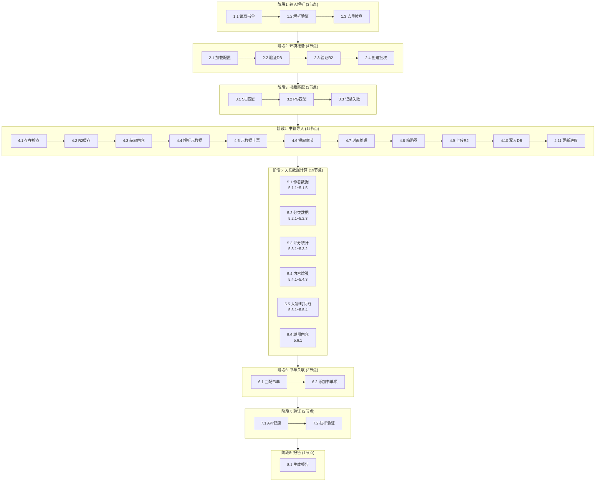
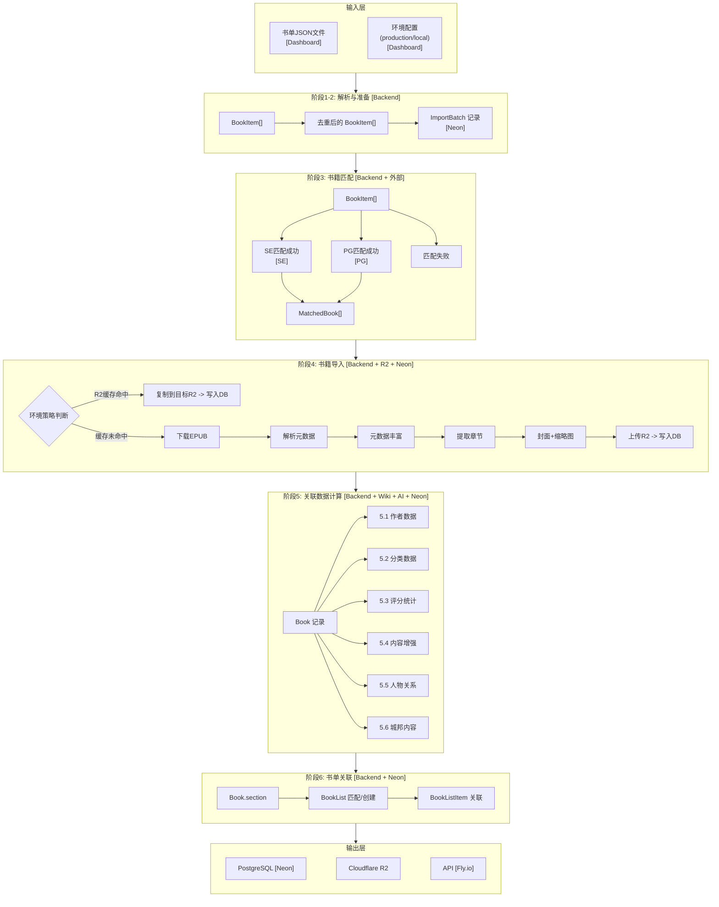
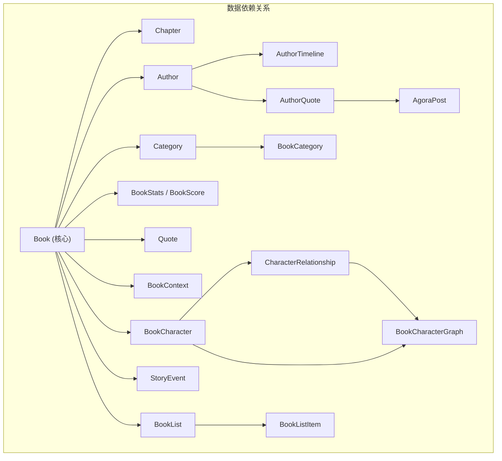
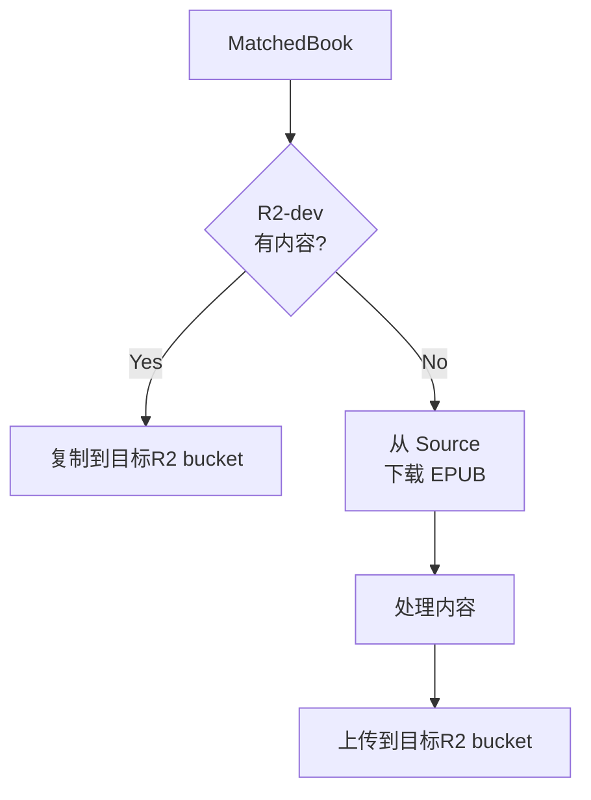

# Environment Pipeline 设计文档

## 1. 概述

### 1.1 目标

构建一个自动化 Pipeline，输入**目标环境**和**书单**，输出完整配置好的可供客户端访问的 API 环境。

### 1.2 输入输出

| 类型 | 内容 |
|------|------|
| **输入** | 目标环境 (production/local) + 书单 JSON 文件 |
| **输出** | 完整可用的 API 环境（数据库数据 + R2 文件 + 验证通过的 API 端点） |

### 1.3 操作方式

Dashboard 唯一入口，向导式操作界面。

> **注意**: Dashboard 部署在 Cloudflare Pages。

---

## 2. Pipeline 处理环节总览

Pipeline 共分为 **8 个阶段、46 个处理节点**：

---

## 2.1 数据流动 Workflow

### 服务图例

| 标记 | 服务 | 说明 |
|------|------|------|
| `[Dashboard]` | React Admin Dashboard | Cloudflare Pages 托管 |
| `[Backend]` | NestJS Backend | 部署在 Fly.io |
| `[Neon]` | PostgreSQL Database | Neon Cloud 托管 |
| `[R2]` | Cloudflare R2 | 对象存储 |
| `[SE]` | Standard Ebooks | 外部数据源 standardebooks.org |
| `[PG]` | Project Gutenberg | 外部数据源 gutenberg.org |
| `[Wiki]` | Wikipedia/Wikidata | 外部数据源 |
| `[AI]` | AI Service | OpenAI/Claude API |

### 节点-服务映射表

| 阶段 | 节点 | 操作 | 主服务 | 外部依赖 | 数据存储 |
|------|------|------|--------|----------|----------|
| **1** | 1.1 | 读取书单 | Backend | - | - |
| | 1.2 | 解析验证 | Backend | - | - |
| | 1.3 | 去重检查 | Backend | - | - |
| **2** | 2.1 | 加载配置 | Backend | - | - |
| | 2.2 | 验证DB | Backend | - | Neon |
| | 2.3 | 验证R2 | Backend | - | R2 |
| | 2.4 | 创建批次 | Backend | - | Neon |
| **3** | 3.1 | SE匹配 | Backend | Standard Ebooks | - |
| | 3.2 | PG匹配 | Backend | Gutenberg API | - |
| | 3.3 | 记录失败 | Backend | - | Neon |
| **4** | 4.1 | 存在检查 | Backend | - | Neon |
| | 4.2 | R2缓存检查 | Backend | - | R2-dev |
| | 4.3 | 获取内容 | Backend | SE / PG / R2-dev | - |
| | 4.4 | 解析元数据 | Backend | - | - |
| | 4.5 | 元数据丰富 | Backend | Wikipedia | - |
| | 4.6 | 提取章节 | Backend | - | - |
| | 4.7 | 封面处理 | Backend | - | - |
| | 4.8 | 缩略图生成 | Backend | - | - |
| | 4.9 | 上传R2 | Backend | - | R2 (目标) |
| | 4.10 | 写入DB | Backend | - | Neon |
| | 4.11 | 更新进度 | Backend | - | Neon |
| **5.1** | 5.1.1 | 创建Author | Backend | Wikipedia | Neon |
| | 5.1.2 | 作者统计 | Backend | - | Neon |
| | 5.1.3 | 作者时间线 | Backend | Wikipedia | Neon |
| | 5.1.4 | 作者名言 | Backend | - | Neon |
| | 5.1.5 | 作者影响力 | Backend | Wikipedia | Neon |
| **5.2** | 5.2.1 | 自动分类 | Backend | - | - |
| | 5.2.2 | BookCategory | Backend | - | Neon |
| | 5.2.3 | 分类统计 | Backend | - | Neon |
| **5.3** | 5.3.1 | BookStats | Backend | - | Neon |
| | 5.3.2 | BookScore | Backend | - | Neon |
| **5.4** | 5.4.1 | BookContext | Backend | Wikipedia | Neon |
| | 5.4.2 | ReadingGuide | Backend | AI Service | Neon |
| | 5.4.3 | Quote提取 | Backend | AI Service | Neon |
| **5.5** | 5.5.1 | BookCharacter | Backend | AI / Wikidata | Neon |
| | 5.5.2 | 人物关系 | Backend | AI Service | Neon |
| | 5.5.3 | 关系图 | Backend | - | Neon |
| | 5.5.4 | StoryEvent | Backend | AI Service | Neon |
| **5.6** | 5.6.1 | AgoraPost | Backend | - | Neon |
| **6** | 6.1 | 匹配书单 | Backend | - | Neon |
| | 6.2 | 添加书单项 | Backend | - | Neon |
| **7** | 7.1 | API健康 | Backend | - | - |
| | 7.2 | 抽样验证 | Backend | - | Neon + R2 |
| **8** | 8.1 | 生成报告 | Backend | - | Neon |

### 外部服务汇总

| 服务 | 用途 | 使用节点 |
|------|------|----------|
| **Standard Ebooks** | EPUB源 | 3.1, 4.3 |
| **Project Gutenberg** | EPUB源 | 3.2, 4.3 |
| **R2-dev** | 内容缓存（production 环境） | 4.2, 4.3 |
| **Wikipedia** | 作者信息、书籍背景、元数据丰富 | 4.5, 5.1.1, 5.1.3, 5.1.5, 5.4.1 |
| **Wikidata** | 结构化数据 | 5.1.1, 5.5.1 |
| **AI Service** | 内容生成、分析 | 5.4.2, 5.4.3, 5.5.1, 5.5.2, 5.5.4 |

---

## 3. 各阶段详细设计

### 阶段1: 输入解析

| 节点 | 名称 | 输入 | 处理逻辑 | 输出 | 失败处理 |
|------|------|------|----------|------|----------|
| 1.1 | 读取书单 | 书单文件路径 | 从 `/data/booklists/` 读取 JSON 文件 | 原始 JSON 数据 | 终止 Pipeline |
| 1.2 | 解析验证 | 原始 JSON | 验证 JSON 格式，提取 books 数组，验证必填字段 (title, author) | BookItem[] | 终止 Pipeline |
| 1.3 | 去重检查 | BookItem[] | 按 title+author 去重，记录重复项 | 去重后的 BookItem[] + 重复统计 | 仅警告 |

**BookItem 字段:**

| 字段 | 类型 | 必填 | 说明 |
|------|------|:----:|------|
| title | string | 是 | 书名 |
| author | string | 是 | 作者名 |
| chineseTitle | string | 否 | 中文书名 |
| section | string | 否 | 分类/分组 |

---

### 阶段2: 环境准备

| 节点 | 名称 | 输入 | 处理逻辑 | 输出 | 失败处理 |
|------|------|------|----------|------|----------|
| 2.1 | 加载配置 | 环境名称 | 加载对应环境的配置（DB URL, R2 配置等） | EnvironmentConfig | 终止 Pipeline |
| 2.2 | 验证DB | DB连接配置 | 测试数据库连接，检查 schema 版本 | 连接成功确认 | 终止 Pipeline |
| 2.3 | 验证R2 | R2配置 | 测试 R2 连接，检查 bucket 权限 | 连接成功确认 | 终止 Pipeline |
| 2.4 | 创建批次 | 配置信息 | 在 ImportBatch 表创建记录，状态=RUNNING | ImportBatch 记录 | 终止 Pipeline |

**环境配置映射:**

| 环境 | 数据库 | R2 Bucket | API URL |
|------|--------|-----------|---------|
| local | 本地 PostgreSQL | 本地文件系统 | localhost:3000 |
| production | Neon production | readmigo-production | readmigo-api.fly.dev |

---

### 阶段3: 书籍匹配

| 节点 | 名称 | 输入 | 处理逻辑 | 输出 | 失败处理 |
|------|------|------|----------|------|----------|
| 3.1 | SE匹配 | BookItem | 构建 Standard Ebooks URL，验证是否存在 | 匹配成功的书籍列表 | 传递给 3.2 |
| 3.2 | PG匹配 | SE未匹配的书籍 | 调用 Gutenberg API 搜索，选择最佳匹配 | 匹配成功的书籍列表 | 传递给 3.3 |
| 3.3 | 记录失败 | 未匹配的书籍 | 记录无法匹配的书籍，写入错误日志 | 失败书籍列表 | 仅记录 |

**匹配规则:**

| 来源 | URL/API 模式 | 匹配策略 |
|------|-------------|----------|
| Standard Ebooks | `https://standardebooks.org/ebooks/{author}/{title}` | URL 构建 + 验证 |
| Gutenberg | `https://gutendex.com/books?search={title}+{author}` | 标题相似度 > 80% && 作者匹配 |

**MatchedBook 字段:**

| 字段 | 类型 | 说明 |
|------|------|------|
| original | BookItem | 原始书单条目 |
| source | enum | STANDARD_EBOOKS / GUTENBERG |
| sourceUrl | string | 来源 URL |
| epubUrl | string | EPUB 下载 URL |
| confidence | number | 匹配置信度 (0-100) |

---

### 阶段4: 书籍导入

**循环处理每本书，支持并行 (默认 3 本同时)**

#### 4.0 环境处理策略

| 目标环境 | 内容获取策略 | 说明 |
|---------|-------------|------|
| **local** | 直接从 Source 下载 | 始终从 Standard Ebooks / Gutenberg 获取最新内容 |
| **production** | R2-dev -> Source | 优先从 R2-dev 复制，未命中则从 Source 下载 |

#### 4.1 处理节点

| 节点 | 名称 | 处理逻辑 | 失败处理 |
|------|------|----------|----------|
| 4.1 | 存在检查 | 查询目标 DB 是否已存在 (source+sourceId) | 跳过该书 |
| 4.2 | R2缓存检查 | 检查 R2-dev 是否有该书内容 (仅 production) | 继续下载流程 |
| 4.3 | 获取内容 | 命中：从 R2-dev 复制；未命中：从 Source 下载 EPUB | 记录失败 |
| 4.4 | 解析元数据 | 提取 title, author, description, language, cover 等 | 记录失败 |
| 4.5 | 元数据丰富 | 从 Wikipedia/Wikidata 获取补充信息，计算难度评分 | 仅警告 |
| 4.6 | 提取章节 | 解析 TOC，提取各章节 HTML 内容 | 记录失败 |
| 4.7 | 封面处理 | 调整尺寸、优化质量 | 使用默认封面 |
| 4.8 | 缩略图生成 | 生成多尺寸缩略图 (small/medium/large) | 仅警告 |
| 4.9 | 上传R2 | 上传所有内容到目标环境 R2 bucket | 记录失败 |
| 4.10 | 写入DB | 写入 Book, Chapter, Author 关联 | 记录失败 |
| 4.11 | 更新进度 | 更新 ImportBatch 进度，推送状态更新 | 仅记录 |

#### 4.2 元数据丰富 (节点4.5)

| 数据项 | 来源 | 说明 |
|--------|------|------|
| 难度评分 | 计算 | 基于词汇复杂度、句子长度等 |
| 作者信息 | Wikipedia | 生卒年、国籍、文学时期 |
| 书籍背景 | Wikipedia | 创作背景、历史地位 |
| 主题标签 | AI分析 | 自动提取主题关键词 |

#### 4.3 封面与缩略图 (节点4.7-4.8)

| 图片类型 | 尺寸 | 用途 |
|---------|------|------|
| cover.jpg | 原始/最大1200px | 详情页展示 |
| cover-thumb-sm.jpg | 120x180 | 列表缩略图 |
| cover-thumb-md.jpg | 240x360 | 卡片展示 |
| cover-thumb-lg.jpg | 480x720 | 预览图 |

**R2 存储路径:**

| 路径 | 说明 |
|------|------|
| `/books/{bookId}/cover.jpg` | 封面图片 |
| `/books/{bookId}/cover-thumb-sm.jpg` | 小缩略图 |
| `/books/{bookId}/cover-thumb-md.jpg` | 中缩略图 |
| `/books/{bookId}/cover-thumb-lg.jpg` | 大缩略图 |
| `/books/{bookId}/chapters/ch001.html` | 章节内容 |

---

### 阶段5: 关联数据计算 (核心扩展)

本阶段是 Pipeline 最复杂的部分，需要根据导入的书籍计算和填充所有关联表格数据。

#### 5.1 作者数据处理

| 节点 | 名称 | 处理逻辑 | 数据表 |
|------|------|----------|--------|
| 5.1.1 | 创建/关联 Author | 查询是否已存在 -> 不存在则创建 | Author |
| 5.1.2 | 更新作者统计 | 计算 bookCount, quoteCount | Author |
| 5.1.3 | 作者时间线 | 从 Wikipedia 获取生平事件 | AuthorTimelineEvent |
| 5.1.4 | 作者名言 | 从书籍中提取或外部源获取 | AuthorQuote |
| 5.1.5 | 作者影响力 | 分析作者间影响关系 | AuthorInfluence |

**Author 表需要填充的字段:**

| 字段 | 类型 | 数据来源 | 优先级 |
|------|------|----------|--------|
| name | String | 书籍 author 字段 | 必填 |
| aliases | String[] | Wikipedia/Wikidata | 可选 |
| avatarUrl | String | Wikipedia 图片 | 可选 |
| bio | String | Wikipedia 摘要 | 推荐 |
| era | String | 书单 JSON 或 Wikipedia | 推荐 |
| nationality | String | 书单 JSON 或 Wikipedia | 推荐 |
| birthPlace | String | Wikipedia | 可选 |
| writingStyle | String | AI 生成或编辑填写 | 可选 |
| famousWorks | String[] | 书籍列表自动生成 | 推荐 |
| literaryPeriod | String | Wikipedia | 可选 |
| literaryMovement | String | Wikipedia | 可选 |
| primaryGenres | String[] | 书籍分类汇总 | 可选 |
| themes | String[] | AI 分析 | 可选 |
| aiPersonaPrompt | String | AI 生成 | 可选 |
| bookCount | Int | 自动计算 | 必填 |
| quoteCount | Int | 自动计算 | 必填 |
| wikipediaUrl | String | 搜索匹配 | 推荐 |
| wikidataId | String | Wikidata API | 推荐 |

---

#### 5.2 分类数据处理

| 节点 | 名称 | 处理逻辑 | 数据表 |
|------|------|----------|--------|
| 5.2.1 | 自动分类 | 映射到系统分类体系 | - |
| 5.2.2 | 创建 BookCategory | 创建关联记录，标记主分类 | BookCategory |
| 5.2.3 | 更新分类统计 | 重新计算每个分类的 bookCount | Category |

**分类映射规则:**

| 书籍字段 | 映射逻辑 | 示例 |
|----------|----------|------|
| subjects | 关键词匹配到 Category.name | "Fiction" -> 小说 |
| genres | 直接映射或模糊匹配 | "Romance" -> 爱情 |
| section (书单) | 按 section 分组创建分类 | "P0核心必选" -> 经典必读 |

---

#### 5.3 书籍评分/统计初始化

| 节点 | 名称 | 处理逻辑 | 数据表 |
|------|------|----------|--------|
| 5.3.1 | 初始化 BookStats | 创建统计记录，所有计数初始化为 0 | BookStats |
| 5.3.2 | 计算 BookScore | 计算 qualityScore, popularityScore, finalScore | BookScore |

**BookScore 计算规则:**

| 字段 | 计算逻辑 | 范围 |
|------|----------|------|
| qualityScore | 基于 isClassic, isAwardWinner, editorialScore | 0-1 |
| popularityScore | 初始为 0，后续根据用户行为更新 | 0-1 |
| freshnessScore | 基于 importedAt 时间 | 0-1 |
| authorPopularityScore | 基于作者 bookCount 和 followerCount | 0-1 |
| finalScore | 加权综合: quality*0.4 + popularity*0.3 + freshness*0.2 + author*0.1 | 0-1 |

---

#### 5.4 内容增强 (可选，需配置开启)

| 节点 | 名称 | 处理逻辑 | 数据表 | 数据来源 |
|------|------|----------|--------|----------|
| 5.4.1 | BookContext | 获取书籍背景上下文 | BookContext | Wikipedia |
| 5.4.2 | ReadingGuide | AI 生成阅读指南 | ReadingGuide | AI 生成 |
| 5.4.3 | Quote 提取 | 从章节中提取名言金句 | Quote | 章节分析 |

---

#### 5.5 人物关系/时间线 (可选，需配置开启)

| 节点 | 名称 | 处理逻辑 | 数据表 | 数据来源 |
|------|------|----------|--------|----------|
| 5.5.1 | BookCharacter | 提取书中人物信息 | BookCharacter | AI/Wikidata |
| 5.5.2 | CharacterRelationship | 分析人物间关系 | CharacterRelationship | AI |
| 5.5.3 | BookCharacterGraph | 生成关系图元数据 | BookCharacterGraph | 计算生成 |
| 5.5.4 | StoryEvent | 提取故事事件时间线 | StoryEvent | AI |

---

#### 5.6 城邦 (Agora) 内容

| 节点 | 名称 | 处理逻辑 | 数据表 |
|------|------|----------|--------|
| 5.6.1 | 创建 AgoraPost | 为名言创建城邦帖子 | AgoraPost |

---

### 阶段6: 书单关联

| 节点 | 名称 | 处理逻辑 | 失败处理 |
|------|------|----------|----------|
| 6.1 | 匹配书单 | 查找或创建对应的 BookList | 仅警告 |
| 6.2 | 添加书单项 | 创建 BookListItem 记录 | 仅警告 |

---

### 阶段7: 验证

| 节点 | 名称 | 处理逻辑 | 失败处理 |
|------|------|----------|----------|
| 7.1 | API健康 | 调用 /api/v1/health 端点 | 警告 |
| 7.2 | 抽样验证 | 随机抽取 5 本书，验证章节/封面可访问 | 警告 |

**验证检查项:**

| 检查项 | 说明 |
|--------|------|
| API 健康 | /health 返回 200 |
| Book API | /books/{id} 返回正确数据 |
| Chapter 内容 | /books/{id}/chapters/{n} 可访问 |
| Cover 图片 | 封面可访问且非空 |

---

### 阶段8: 报告

| 节点 | 名称 | 处理逻辑 |
|------|------|----------|
| 8.1 | 生成报告 | 汇总统计，生成最终 PipelineReport |

**报告内容:**

| 报告部分 | 包含信息 |
|----------|----------|
| 基本信息 | batchId, environment, booklistFile, startTime, endTime, duration |
| 书籍统计 | total, matched, imported, skipped, failed |
| 存储统计 | chaptersUploaded, coversUploaded, totalSize |
| 作者数据 | created, updated, timelineEvents, quotes |
| 分类数据 | bookCategories, categoriesUpdated |
| 评分统计 | BookStats, BookScore 记录数 |
| 内容增强 | bookContexts, readingGuides, quotes |
| 人物数据 | characters, relationships, graphs, events |
| 城邦数据 | posts |
| 书单数据 | created, items |
| 健康检查 | apiHealth, sampleVerification, issues |
| 失败详情 | book, stage, error |

---

## 4. Dashboard 界面设计

Dashboard 采用向导式四步操作流程：

| 步骤 | 名称 | 说明 |
|------|------|------|
| 1 | 选择环境 | 选择 Local 或 Production 环境 |
| 2 | 选择书单 | 选择 JSON 书单文件，预览书籍列表 |
| 3 | 配置选项 | 设置跳过已存在、并行数、书籍来源优先级、是否执行丰富 |
| 4 | 执行面板 | 实时进度条、处理列表、统计数据、完成报告 |

> **注意**: Production 环境操作需要额外确认。

---

## 5. API 设计

### 5.1 端点列表

| 方法 | 路径 | 说明 |
|------|------|------|
| GET | /admin/pipeline/booklists | 获取可用书单列表 |
| GET | /admin/pipeline/booklists/:path/preview | 预览书单内容 |
| POST | /admin/pipeline/start | 启动 Pipeline |
| GET | /admin/pipeline/:id/status | 获取执行状态 |
| GET | /admin/pipeline/:id/books | 获取书籍处理列表 |
| POST | /admin/pipeline/:id/cancel | 取消执行 |
| GET | /admin/pipeline/history | 获取历史记录 |
| GET | /admin/pipeline/:id/report | 获取完整报告 |

---

## 6. 技术实现

### 6.1 后端模块结构

| 文件 | 说明 |
|------|------|
| `src/modules/pipeline/pipeline.module.ts` | 模块定义 |
| `src/modules/pipeline/pipeline.controller.ts` | API 控制器 |
| `src/modules/pipeline/pipeline.service.ts` | 服务层 |
| `src/modules/pipeline/pipeline.processor.ts` | 后台任务处理器 |
| `src/modules/pipeline/dto/` | 请求/响应 DTO |
| `src/modules/pipeline/interfaces/` | 接口定义 |
| `src/modules/pipeline/services/` | 子服务 (booklist, book-matcher, progress-tracker) |

### 6.2 复用现有模块

| 现有模块 | 复用方式 |
|---------|---------|
| StandardEbooksImporter | 复用 EPUB 下载和解析逻辑 |
| BookEnrichmentService | 复用封面处理、难度计算 |
| StorageService | 复用 R2 上传逻辑 |
| ImportBatchService | 复用批次管理 |
| PrismaService | 数据库操作 |

### 6.3 数据库变更

在现有 ImportBatch 模型新增字段:

| 字段 | 类型 | 说明 |
|------|------|------|
| booklistFile | String? | 书单文件路径 |
| pipelineConfig | Json? | Pipeline 配置 JSON |
| pipelineStage | String? | 当前阶段 "1"-"7" |
| currentBookId | String? | 当前处理的书籍 |

---

## 7. 错误处理策略

### 7.1 阶段级错误

| 阶段 | 错误类型 | 处理策略 |
|------|----------|----------|
| 1-2 | 配置/连接错误 | 终止 Pipeline |
| 3 | 匹配失败 | 记录失败，继续其他书籍 |
| 4 | 单本处理失败 | 记录失败，继续下一本 |
| 5-6 | 后处理/验证失败 | 仅警告，Pipeline 标记完成 |

### 7.2 重试策略

| 操作 | 重试次数 | 重试间隔 |
|------|----------|----------|
| EPUB 下载 | 3次 | 5秒 |
| R2 上传 | 3次 | 3秒 |
| DB 写入 | 2次 | 1秒 |

---

## 8. 性能考虑

### 8.1 并行处理

| 参数 | 值 |
|------|-----|
| 默认并行数 | 3 |
| 最大并行数 | 5 |
| 处理模式 | 每本书独立处理，互不阻塞 |

### 8.2 资源限制

| 限制 | 值 |
|------|-----|
| 单个 EPUB 最大 | 50MB |
| 章节 HTML 最大 | 2MB |
| 封面图片最大 | 5MB |

### 8.3 预估耗时

| 书籍数量 | 并行数 | 预估耗时 |
|----------|--------|----------|
| 50本 | 3 | ~15分钟 |
| 100本 | 3 | ~30分钟 |
| 248本 | 3 | ~75分钟 |

---

## 9. 安全考虑

| 项目 | 说明 |
|------|------|
| 权限控制 | 仅管理员可访问 Pipeline 功能 |
| Production 确认 | Production 环境需要二次确认 |
| 操作审计 | 所有 Pipeline 操作记录到 ImportBatch |
| 历史记录 | 支持查看历史执行记录 |

---

## 10. 待确认问题

1. **书单扩展**：是否需要支持上传自定义书单文件？
2. **断点续传**：Pipeline 中断后是否需要支持从断点恢复？
3. **通知机制**：Pipeline 完成后是否需要发送通知？
4. **并发限制**：是否允许同一环境同时运行多个 Pipeline？
