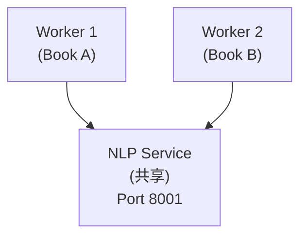

# 双语批量处理执行计划

## 项目背景

| 项目 | 说明 |
|------|------|
| 书籍总数 | 241 本 |
| 来源分布 | Standard Ebooks: 197 本, Gutenberg: 44 本 |
| 类型 | 公版书 (Public Domain) |
| 处理目标 | 为所有书籍添加中文翻译，支持双语阅读 |

---

## 第一阶段：准备工作

### 1. 词汇表导入 (ECDICT)

| 状态 | 完成 |
|------|------|
| 数据源 | ECDICT (skywind3000/ECDICT) |
| 词条数量 | 3,402,564 |
| 导入速度 | ~9,000-15,000 词/秒 |
| 预计时间 | 4-6 分钟 |

**ECDICT 字段映射**：

| ECDICT 字段 | Vocabulary 字段 | 说明 |
|-------------|-----------------|------|
| word | word | 单词 |
| phonetic | phonetic | 音标 |
| pos | part_of_speech | 词性 |
| definition | definition | 英文释义 |
| translation | definition_zh | 中文释义 |
| bnc/frq | frequency_rank | 词频排名 |
| collins | cefr_level (推算) | CEFR 等级 |

---

### 2. 中文 EPUB 来源方案

**书籍特点分析**：

| 特点 | 说明 |
|------|------|
| 类型 | 公版书 (版权已过期) |
| 语言 | 英文原版 |
| 来源 | Standard Ebooks (82%), Gutenberg (18%) |
| 年代 | 主要为 19-20 世纪初经典文学 |

**中文来源方案对比**：

| 来源 | 优点 | 缺点 | 推荐度 |
|------|------|------|--------|
| **好读 (haodoo.net)** | 繁体中文、品质高、公版书丰富 | 需繁简转换 | ★★★★★ |
| **Gutenberg 中文版** | 合法、免费、质量有保证 | 覆盖率低 (~50本) | ★★★ |
| **Z-Library** | 覆盖率高 | 版权灰色地带 | ★★ |
| **标准译本购买** | 质量最高 | 成本高、不可商用 | ★ |
| **AI 翻译** | 完全可控、覆盖率 100% | 质量不如人工翻译 | ★★★ |

**公版译本版权说明**：

| 原著时间 | 译者去世时间 | 版权状态 |
|----------|--------------|----------|
| 1844 (基督山伯爵) | 蒋学模 (1918-2008) | 2058 年进入公版 |
| 1813 (傲慢与偏见) | 王科一 (1929-2000) | 2050 年进入公版 |
| - | 林纾 (1852-1924) | 已公版 (1974 年起) |
| - | 严复 (1854-1921) | 已公版 (1971 年起) |

**推荐来源**：[好读网站](https://www.haodoo.net)

**好读网站特点:**

| 特点 | 说明 |
|------|------|
| 类型 | 免费正体中文图书馆 |
| 格式 | EPUB、PDB、PRC |
| 品质 | 经典版 / 典藏版标注 |
| 运营 | 超过 20 年 |

**注意事项:**

| 事项 | 说明 |
|------|------|
| 繁简转换 | 需使用 OpenCC 转换为简体 |
| 台湾译本 | 部分书籍为台湾版本 |
| 版权核实 | 需确认译本版权状态 |

**推荐处理流程:**

---

### 3. R2 上传脚本

**R2 目录结构:**

| 路径 | 说明 |
|------|------|
| `books/{book-id}/book.epub` | 现有英文 EPUB |
| `bilingual/{book-id}/aligned.json` | 对齐结果 (新增) |
| `bilingual/{book-id}/tokens.json` | 分词结果 (新增) |
| `bilingual/{book-id}/metadata.json` | 处理元数据 (新增) |

**上传脚本** (`scripts/upload-to-r2.ts`)：

| 功能 | 说明 |
|------|------|
| 认证 | 使用 Cloudflare R2 API |
| 格式 | JSON (gzip 压缩) |
| 命名 | `bilingual/{book-id}/aligned.json` |

---

## 第二阶段：试运行

### 4. 单书完整处理验证

**测试书籍**：The Count of Monte Cristo

| 信息 | 值 |
|------|-----|
| Book ID | `99035bd3-fd24-413b-b794-69ef370f72b3` |
| 英文 EPUB | `~/epubs/the_count_of_monte_cristo_en.epub` |
| 中文 EPUB | `~/epubs/the_count_of_monte_cristo_zh.epub` |
| 章节数 | 117 (过滤后) |
| 估计段落数 | ~15,000 |

**验收标准**：

| 指标 | 目标 |
|------|------|
| 平均对齐分数 | > 0.6 |
| 高分段落比例 | > 50% |
| 词汇关联率 | > 30% |
| 处理时间 | < 30 分钟 |

---

### 5. 数据库写入优化

**当前问题**：逐条插入效率低

**优化方案**：

| 方案 | 预期提升 |
|------|----------|
| 批量 INSERT | 10x |
| 事务合并 | 2x |
| 索引优化 | 1.5x |
| 连接池 | 1.2x |

**优化方式**: 使用 Prisma `createMany` 批量插入替代逐条 `create`。

---

### 6. 并行处理测试

**服务器配置**：

| 资源 | 规格 |
|------|------|
| CPU | 4 核 |
| RAM | 8 GB (可用 5.3 GB) |
| NLP 服务 | 2.5 GB 内存占用 |

**并行方案**：

**建议配置**：

| 参数 | 值 | 说明 |
|------|-----|------|
| 并行进程数 | 2-3 | 避免内存溢出 |
| 批处理大小 | 50 | NLP 嵌入请求 |
| DB 连接数 | 5 | Prisma 连接池 |

---

## 第三阶段：批量处理

### 7. 全书处理计划

**时间估算**：

| 场景 | 单书时间 | 241 本总时间 |
|------|----------|--------------|
| 串行处理 | 20 分钟 | 80 小时 (3.3 天) |
| 2 并行 | 20 分钟 | 40 小时 (1.7 天) |
| 3 并行 | 20 分钟 | 27 小时 (1.1 天) |

**PM2 批处理配置** (通过 `ecosystem.config.js`):

| Worker | 书籍范围 | 数量 |
|--------|----------|------|
| bilingual-worker-1 | start 0 | 80 本 |
| bilingual-worker-2 | start 80 | 80 本 |
| bilingual-worker-3 | start 160 | 81 本 |

---

## 依赖服务清单

| 服务 | 端口 | 状态 | PM2 名称 |
|------|------|------|----------|
| NLP Service | 8001 | 运行中 | nlp-service |
| PostgreSQL | 5432 | Neon 托管 | - |
| R2 Storage | - | Cloudflare | - |

---

## 监控与日志

**PM2 常用操作**: `pm2 list`, `pm2 logs bilingual-worker-1`, `pm2 monit`, `pm2 stop all`

**进度追踪**: 通过查询 `bilingual_books` 表的 status 字段统计处理进度，查询 `bilingual_paragraphs` 表的 alignment_score 字段识别低分章节。

---

## 风险与应对

| 风险 | 影响 | 应对措施 |
|------|------|----------|
| 中文 EPUB 缺失 | 无法处理该书 | 优先处理有中文版的书籍 |
| 对齐分数低 | 阅读体验差 | 标记需复核，后续人工校对 |
| 服务器内存不足 | 进程崩溃 | 限制并行数为 2 |
| Neon 连接数限制 | 连接超时 | 使用连接池，限制并发 |
| 处理中断 | 数据不一致 | 支持断点续传，upsert 操作 |

---

## 相关文档

- [双语段落语义对齐实战指南](./bilingual-semantic-alignment.md)
- [双语阅读数据预处理分析](./bilingual-data-preprocessing.md)
- [Cloudflare R2 配置](../infrastructure/cloudflare-r2-setup.md)
