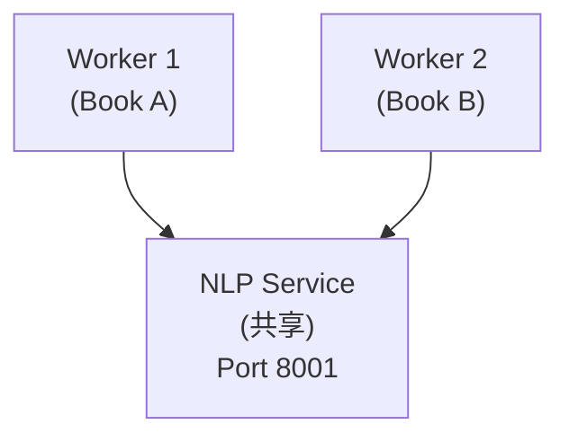

# 双语批量处理执行计划

## 项目背景

| 项目 | 说明 |
|------|------|
| 书籍总数 | 241 本 |
| 来源分布 | Standard Ebooks: 197 本, Gutenberg: 44 本 |
| 类型 | 公版书 (Public Domain) |
| 处理目标 | 为所有书籍添加中文翻译，支持双语阅读 |

---

## 第一阶段：准备工作

### 1. 词汇表导入 (ECDICT)

| 状态 | 完成 |
|------|------|
| 数据源 | ECDICT (skywind3000/ECDICT) |
| 词条数量 | 3,402,564 |
| 导入速度 | ~9,000-15,000 词/秒 |
| 预计时间 | 4-6 分钟 |

**ECDICT 字段映射**：

| ECDICT 字段 | Vocabulary 字段 | 说明 |
|-------------|-----------------|------|
| word | word | 单词 |
| phonetic | phonetic | 音标 |
| pos | part_of_speech | 词性 |
| definition | definition | 英文释义 |
| translation | definition_zh | 中文释义 |
| bnc/frq | frequency_rank | 词频排名 |
| collins | cefr_level (推算) | CEFR 等级 |

**执行命令**：

```bash
# 在 Droplet 上运行
cd ~/readmigo/packages/database
pm2 start 'source ~/readmigo/apps/nlp-service/venv/bin/activate && \
  DATABASE_URL="$DATABASE_URL" python3 scripts/import-ecdict.py' \
  --name ecdict-import --no-autorestart
```

---

### 2. 中文 EPUB 来源方案

**书籍特点分析**：

| 特点 | 说明 |
|------|------|
| 类型 | 公版书 (版权已过期) |
| 语言 | 英文原版 |
| 来源 | Standard Ebooks (82%), Gutenberg (18%) |
| 年代 | 主要为 19-20 世纪初经典文学 |

**中文来源方案对比**：

| 来源 | 优点 | 缺点 | 推荐度 |
|------|------|------|--------|
| **好读 (haodoo.net)** | 繁体中文、品质高、公版书丰富 | 需繁简转换 | ★★★★★ |
| **Gutenberg 中文版** | 合法、免费、质量有保证 | 覆盖率低 (~50本) | ★★★ |
| **Z-Library** | 覆盖率高 | 版权灰色地带 | ★★ |
| **标准译本购买** | 质量最高 | 成本高、不可商用 | ★ |
| **AI 翻译** | 完全可控、覆盖率 100% | 质量不如人工翻译 | ★★★ |

**公版译本版权说明**：

| 原著时间 | 译者去世时间 | 版权状态 |
|----------|--------------|----------|
| 1844 (基督山伯爵) | 蒋学模 (1918-2008) | 2058 年进入公版 |
| 1813 (傲慢与偏见) | 王科一 (1929-2000) | 2050 年进入公版 |
| - | 林纾 (1852-1924) | 已公版 (1974 年起) |
| - | 严复 (1854-1921) | 已公版 (1971 年起) |

**推荐来源**：[好读网站](https://www.haodoo.net)

```
┌─────────────────────────────────────────────────────┐
│              好读网站 (haodoo.net)                   │
└─────────────────────────────────────────────────────┘

特点：
├── 免费的正体中文图书馆
├── 支持 EPUB、PDB、PRC 格式下载
├── 经典版 / 典藏版 品质标注
└── 运营超过 20 年，内容丰富

分类：
├── 世紀百強 (经典文学)
├── 歷史煙雲 (历史小说)
├── 武俠小說
├── 言情小說
└── 小說園地 (含外国文学译本)

使用注意：
├── 繁体中文，需转换为简体
├── 部分书籍为台湾译本
└── 需核实译本版权状态
```

**推荐处理流程**：

```
┌─────────────────────────────────────────────────────┐
│              中文 EPUB 获取流程                      │
└─────────────────────────────────────────────────────┘

1. 查询好读目录
   └── 搜索对应书名

2. 下载 EPUB 文件
   └── 优先选择「經典版」或「典藏版」

3. 繁简转换
   └── 使用 OpenCC 转换

4. 质量检查
   └── 抽样验证翻译质量

5. 上传至 Droplet
   └── 存放到 ~/epubs/ 目录
```

---

### 3. R2 上传脚本

**目录结构设计**：

```
r2-production/
├── books/                    # 现有英文 EPUB
│   └── {book-id}/
│       └── book.epub
└── bilingual/                # 双语处理结果 (新增)
    └── {book-id}/
        ├── aligned.json      # 对齐结果
        ├── tokens.json       # 分词结果
        └── metadata.json     # 处理元数据
```

**上传脚本** (`scripts/upload-to-r2.ts`)：

| 功能 | 说明 |
|------|------|
| 认证 | 使用 Cloudflare R2 API |
| 格式 | JSON (gzip 压缩) |
| 命名 | `bilingual/{book-id}/aligned.json` |

---

## 第二阶段：试运行

### 4. 单书完整处理验证

**测试书籍**：The Count of Monte Cristo

| 信息 | 值 |
|------|-----|
| Book ID | `99035bd3-fd24-413b-b794-69ef370f72b3` |
| 英文 EPUB | `~/epubs/the_count_of_monte_cristo_en.epub` |
| 中文 EPUB | `~/epubs/the_count_of_monte_cristo_zh.epub` |
| 章节数 | 117 (过滤后) |
| 估计段落数 | ~15,000 |

**执行命令**：

```bash
cd ~/readmigo/packages/database/scripts/bilingual-pipeline
npx ts-node index.ts \
  --book-id 99035bd3-fd24-413b-b794-69ef370f72b3 \
  --en-epub ~/epubs/the_count_of_monte_cristo_en.epub \
  --zh-epub ~/epubs/the_count_of_monte_cristo_zh.epub \
  --use-semantic
```

**验收标准**：

| 指标 | 目标 |
|------|------|
| 平均对齐分数 | > 0.6 |
| 高分段落比例 | > 50% |
| 词汇关联率 | > 30% |
| 处理时间 | < 30 分钟 |

---

### 5. 数据库写入优化

**当前问题**：逐条插入效率低

**优化方案**：

| 方案 | 预期提升 |
|------|----------|
| 批量 INSERT | 10x |
| 事务合并 | 2x |
| 索引优化 | 1.5x |
| 连接池 | 1.2x |

**批量插入代码示例**：

```typescript
// 原方案：逐条插入
for (const para of paragraphs) {
  await prisma.bilingualParagraph.create({ data: para });
}

// 优化方案：批量插入
await prisma.bilingualParagraph.createMany({
  data: paragraphs,
  skipDuplicates: true,
});
```

---

### 6. 并行处理测试

**服务器配置**：

| 资源 | 规格 |
|------|------|
| CPU | 4 核 |
| RAM | 8 GB (可用 5.3 GB) |
| NLP 服务 | 2.5 GB 内存占用 |

**并行方案**：



**建议配置**：

| 参数 | 值 | 说明 |
|------|-----|------|
| 并行进程数 | 2-3 | 避免内存溢出 |
| 批处理大小 | 50 | NLP 嵌入请求 |
| DB 连接数 | 5 | Prisma 连接池 |

---

## 第三阶段：批量处理

### 7. 全书处理计划

**时间估算**：

| 场景 | 单书时间 | 241 本总时间 |
|------|----------|--------------|
| 串行处理 | 20 分钟 | 80 小时 (3.3 天) |
| 2 并行 | 20 分钟 | 40 小时 (1.7 天) |
| 3 并行 | 20 分钟 | 27 小时 (1.1 天) |

**PM2 批处理配置**：

```javascript
// ecosystem.config.js
module.exports = {
  apps: [
    {
      name: 'bilingual-worker-1',
      script: 'npx',
      args: 'ts-node process-batch.ts --start 0 --count 80',
      cwd: './packages/database/scripts/bilingual-pipeline',
    },
    {
      name: 'bilingual-worker-2',
      script: 'npx',
      args: 'ts-node process-batch.ts --start 80 --count 80',
      cwd: './packages/database/scripts/bilingual-pipeline',
    },
    {
      name: 'bilingual-worker-3',
      script: 'npx',
      args: 'ts-node process-batch.ts --start 160 --count 81',
      cwd: './packages/database/scripts/bilingual-pipeline',
    },
  ],
};
```

---

## 依赖服务清单

| 服务 | 端口 | 状态 | PM2 名称 |
|------|------|------|----------|
| NLP Service | 8001 | 运行中 | nlp-service |
| PostgreSQL | 5432 | Neon 托管 | - |
| R2 Storage | - | Cloudflare | - |

---

## 监控与日志

**PM2 常用命令**：

```bash
# 查看所有进程
pm2 list

# 查看日志
pm2 logs bilingual-worker-1 --lines 100

# 监控资源
pm2 monit

# 停止所有
pm2 stop all
```

**进度追踪 SQL**：

```sql
-- 查看处理进度
SELECT
  bb.status,
  COUNT(*) as count,
  AVG(bb.data_version) as avg_version
FROM bilingual_books bb
GROUP BY bb.status;

-- 查看低分章节
SELECT
  b.title,
  bp.chapter_order,
  AVG(bp.alignment_score) as avg_score
FROM bilingual_paragraphs bp
JOIN bilingual_books bb ON bp.bilingual_book_id = bb.id
JOIN books b ON bb.english_book_id = b.id
GROUP BY b.title, bp.chapter_order
HAVING AVG(bp.alignment_score) < 0.5
ORDER BY avg_score;
```

---

## 风险与应对

| 风险 | 影响 | 应对措施 |
|------|------|----------|
| 中文 EPUB 缺失 | 无法处理该书 | 优先处理有中文版的书籍 |
| 对齐分数低 | 阅读体验差 | 标记需复核，后续人工校对 |
| 服务器内存不足 | 进程崩溃 | 限制并行数为 2 |
| Neon 连接数限制 | 连接超时 | 使用连接池，限制并发 |
| 处理中断 | 数据不一致 | 支持断点续传，upsert 操作 |

---

## 相关文档

- [双语段落语义对齐实战指南](./bilingual-semantic-alignment.md)
- [双语阅读数据预处理分析](./bilingual-data-preprocessing.md)
- [Cloudflare R2 配置](../infrastructure/cloudflare-r2-setup.md)
