# 双语阅读数据预处理分析

## 概述

iOS 双语阅读功能采用"预处理 + 下发"模式，所有数据在服务端完成处理后下发到客户端，实现离线可用的流畅阅读体验。本文档分析需要预处理的数据类型、处理流程及技术要点。

---

## 预处理数据总览

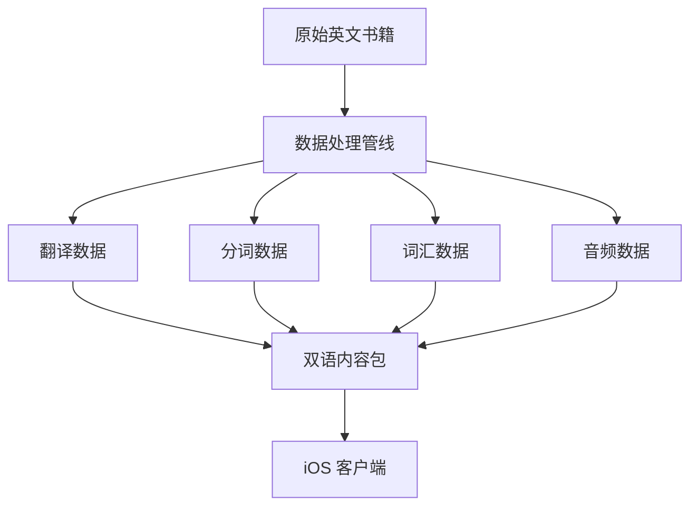

### 数据类型概览

| 数据类型 | 说明 | 处理复杂度 | 存储占比 |
| -------- | ---- | ---------- | -------- |
| 翻译数据 | 段落级中文译文 | 高 | 40% |
| 分词数据 | 英文文本词组切分 | 中 | 30% |
| 词汇数据 | 词汇释义与例句 | 中 | 25% |
| 音频数据 | 词汇发音文件 | 低 | 5% |

---

## 一、翻译数据

### 1.1 翻译粒度

| 粒度 | 优点 | 缺点 | 选择 |
| ---- | ---- | ---- | ---- |
| 全章翻译 | 上下文连贯 | 无法对应原文段落 | 否 |
| 段落翻译 | 可对照、上下文适中 | 需保持段落对齐 | **是** |
| 句子翻译 | 精确对应 | 上下文割裂、数据量大 | 否 |

### 1.2 段落对齐要求

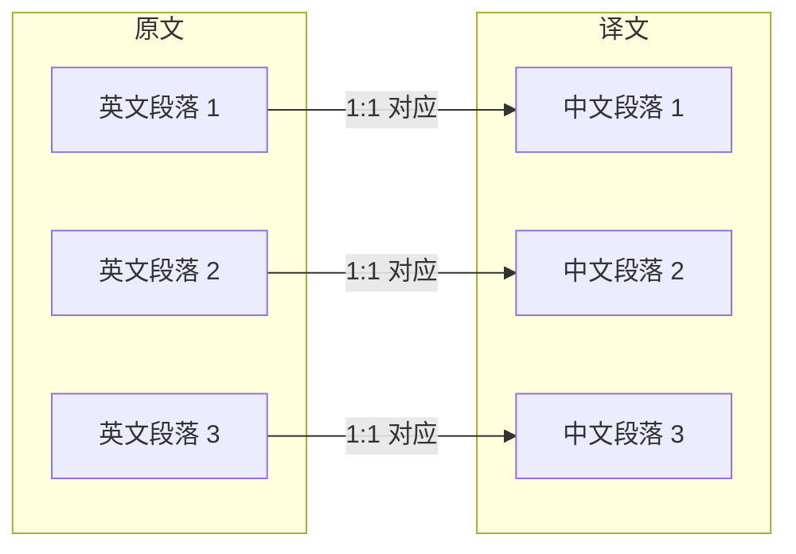

### 1.3 翻译处理流程

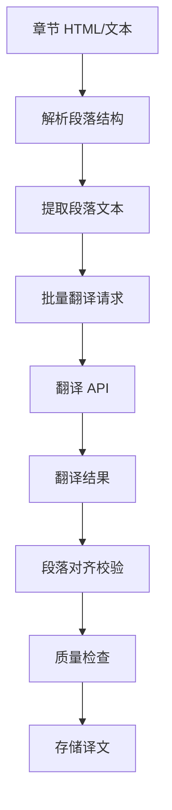

### 1.4 翻译质量控制

| 检查项 | 说明 | 处理方式 |
| ------ | ---- | -------- |
| 段落数量一致 | 译文段落数 = 原文段落数 | 强制对齐或人工复核 |
| 空段落处理 | 原文空段落保留 | 译文同样保留空 |
| 特殊内容保留 | 人名、地名、专有名词 | 配置保留规则 |
| 格式标记保留 | 标题、引用等类型 | 继承原文段落类型 |

### 1.5 翻译数据结构

| 字段 | 说明 |
| ---- | ---- |
| paragraph_id | 段落唯一标识 |
| original_text | 原文文本（用于校验） |
| translated_text | 中文译文 |
| translation_source | 翻译来源（机器/人工） |
| confidence_score | 翻译置信度 |

---

## 二、分词数据

### 2.1 分词目标


### 2.2 分词类型

| 类型 | 说明 | 可点击 | 示例 |
| ---- | ---- | ------ | ---- |
| word | 独立单词 | 是 | "beautiful" |
| phrase | 固定词组 | 是 | "look forward to" |
| punctuation | 标点符号 | 否 | "." "," "!" |
| space | 空格 | 否 | " " |
| number | 数字 | 否 | "2024" |
| proper_noun | 专有名词 | 是 | "New York" |

### 2.3 分词处理流程

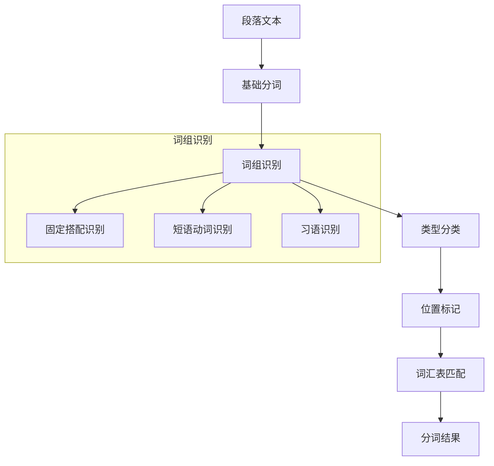

### 2.4 词组识别规则

| 词组类型 | 识别方式 | 示例 |
| -------- | -------- | ---- |
| 短语动词 | 动词 + 介词/副词 | "give up", "look after" |
| 固定搭配 | 词组词典匹配 | "as well as", "in spite of" |
| 习语 | 习语库匹配 | "break the ice", "piece of cake" |
| 复合名词 | NLP 识别 | "ice cream", "bus stop" |
| 专有名词 | 命名实体识别 | "United States", "Harry Potter" |

### 2.5 分词数据结构

| 字段 | 类型 | 说明 |
| ---- | ---- | ---- |
| id | String | Token 唯一标识 |
| text | String | 词组文本 |
| start | Int | 原文起始位置 |
| end | Int | 原文结束位置 |
| type | Enum | 类型（word/phrase/punctuation 等） |
| lemma | String | 词元/原形 |
| vocab_id | String? | 关联词汇表 ID |

### 2.6 分词处理挑战

| 挑战 | 说明 | 解决方案 |
| ---- | ---- | -------- |
| 词组边界 | "look forward to" 是整体还是三个词 | 优先匹配词组词典 |
| 歧义消解 | "bank" 是银行还是河岸 | 结合上下文 NLP 分析 |
| 连字符处理 | "well-known" 是一个词还是两个 | 统一作为一个词处理 |
| 缩写展开 | "I'm" → "I am" | 保留原形，标记为缩写 |
| 所有格 | "John's" 的处理 | 作为独立 token，关联到 "John" |

---

## 三、词汇数据

### 3.1 词汇数据来源

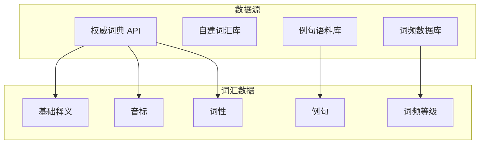

### 3.2 词汇数据结构

| 字段 | 类型 | 说明 | 必需 |
| ---- | ---- | ---- | ---- |
| id | String | 词汇唯一标识 | 是 |
| word | String | 词汇原形 | 是 |
| phonetic_us | String | 美式音标 | 是 |
| phonetic_uk | String | 英式音标 | 否 |
| audio_us_url | String | 美式发音 URL | 是 |
| audio_uk_url | String | 英式发音 URL | 否 |
| definitions | Array | 释义列表 | 是 |
| examples | Array | 例句列表 | 否 |
| frequency_rank | Int | 词频排名 | 否 |
| cefr_level | String | CEFR 等级 | 否 |
| synonyms | Array | 同义词 | 否 |
| antonyms | Array | 反义词 | 否 |

### 3.3 释义数据结构

| 字段 | 类型 | 说明 |
| ---- | ---- | ---- |
| pos | String | 词性（n./v./adj./adv. 等） |
| definition_en | String | 英文释义 |
| definition_zh | String | 中文释义 |
| usage_note | String? | 用法说明 |

### 3.4 例句数据结构

| 字段 | 类型 | 说明 |
| ---- | ---- | ---- |
| sentence_en | String | 英文例句 |
| sentence_zh | String | 中文翻译 |
| source | String? | 来源（书名/语料库） |
| highlight_range | Range? | 目标词在例句中的位置 |

### 3.5 词汇处理流程

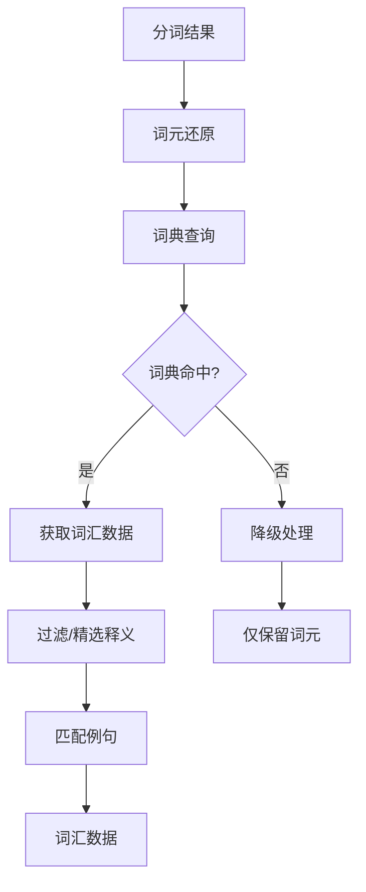

### 3.6 词汇数据优化

| 优化项 | 说明 | 效果 |
| ------ | ---- | ---- |
| 释义精选 | 保留 2-3 个常用释义 | 减少数据量 50% |
| 例句筛选 | 优先选择简短、相关的例句 | 提高可读性 |
| 去重处理 | 章节内相同词汇只存一份 | 减少冗余 |
| 词频过滤 | 超高频词（the, a, is）不关联词汇 | 减少无效数据 |

### 3.7 高频词处理策略

| 词频等级 | 示例 | 处理方式 |
| -------- | ---- | -------- |
| Top 100 | the, is, a, to | 不关联词汇，不可点击 |
| Top 500 | have, make, go | 可点击，简化释义 |
| Top 2000 | beautiful, important | 完整词汇数据 |
| 2000+ | sophisticated | 完整词汇 + 详细例句 |

---

## 四、音频数据

### 4.1 音频类型

| 类型 | 格式 | 码率 | 用途 |
| ---- | ---- | ---- | ---- |
| 词汇发音 | MP3/AAC | 64kbps | 单词/词组发音 |

### 4.2 音频处理流程

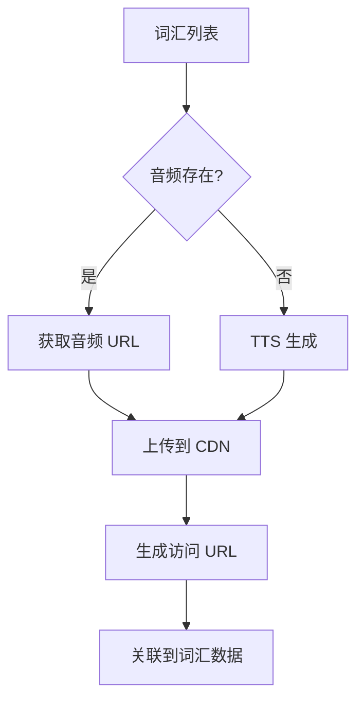

### 4.3 音频来源优先级

| 优先级 | 来源 | 质量 | 说明 |
| ------ | ---- | ---- | ---- |
| 1 | 权威词典音频 | 高 | 真人发音 |
| 2 | 专业 TTS | 中 | 高质量合成 |
| 3 | 通用 TTS | 低 | 兜底方案 |

### 4.4 音频存储策略

| 策略 | 说明 |
| ---- | ---- |
| CDN 分发 | 音频文件存储在 CDN，就近访问 |
| 懒加载 | 用户点击发音时才下载 |
| 本地缓存 | 已播放的音频缓存到本地 |
| LRU 淘汰 | 缓存超过 100MB 时淘汰旧文件 |

---

## 五、数据处理管线

### 5.1 完整处理流程

```mermaid
flowchart TD
    subgraph 输入
        BOOK[书籍原始内容]
    end

    subgraph 阶段一：内容解析
        BOOK --> PARSE[解析章节结构]
        PARSE --> EXTRACT[提取段落]
    end

    subgraph 阶段二：翻译处理
        EXTRACT --> TRANSLATE[段落翻译]
        TRANSLATE --> ALIGN[对齐校验]
    end

    subgraph 阶段三：分词处理
        EXTRACT --> TOKENIZE[文本分词]
        TOKENIZE --> PHRASE[词组识别]
        PHRASE --> CLASSIFY[类型分类]
    end

    subgraph 阶段四：词汇处理
        CLASSIFY --> LEMMA[词元还原]
        LEMMA --> VOCAB_LOOKUP[词典查询]
        VOCAB_LOOKUP --> VOCAB_ENRICH[词汇丰富]
    end

    subgraph 阶段五：音频处理
        VOCAB_ENRICH --> AUDIO_FETCH[获取发音]
        AUDIO_FETCH --> AUDIO_UPLOAD[上传 CDN]
    end

    subgraph 阶段六：数据组装
        ALIGN --> ASSEMBLE[组装章节数据]
        CLASSIFY --> ASSEMBLE
        VOCAB_ENRICH --> ASSEMBLE
        AUDIO_UPLOAD --> ASSEMBLE
    end

    subgraph 输出
        ASSEMBLE --> OUTPUT[双语章节数据包]
    end
```

### 5.2 处理阶段详解

| 阶段 | 输入 | 输出 | 耗时占比 |
| ---- | ---- | ---- | -------- |
| 内容解析 | 原始 HTML/文本 | 段落数组 | 5% |
| 翻译处理 | 英文段落 | 中文译文 | 60% |
| 分词处理 | 英文段落 | Token 数组 | 15% |
| 词汇处理 | Token 列表 | 词汇数据 | 15% |
| 音频处理 | 词汇列表 | 音频 URL | 3% |
| 数据组装 | 各阶段输出 | 完整数据包 | 2% |

### 5.3 并行处理策略

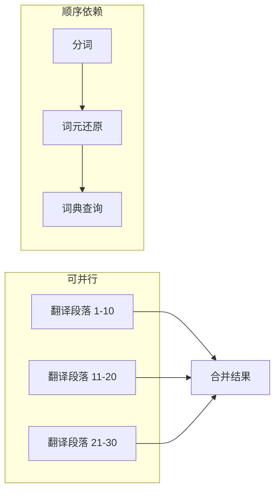

---

## 六、数据存储结构

### 6.1 章节数据包结构

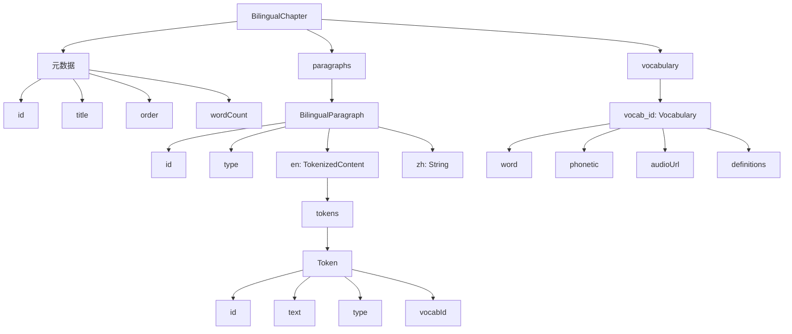

### 6.2 数据体积估算

| 数据项 | 单章节估算 | 全书估算（30章） |
| ------ | ---------- | ---------------- |
| 英文原文 | 15 KB | 450 KB |
| 中文译文 | 20 KB | 600 KB |
| 分词数据 | 25 KB | 750 KB |
| 词汇数据 | 100 KB | 500 KB（去重后） |
| 总计 | 160 KB | 2.3 MB |

### 6.3 数据压缩

| 压缩方式 | 压缩率 | 说明 |
| -------- | ------ | ---- |
| JSON 原始 | 1x | 基准 |
| Gzip 压缩 | 0.3x | 网络传输使用 |
| 字段精简 | 0.7x | 移除冗余字段 |
| 综合 | 0.2x | 约 500KB/全书 |

---

## 七、质量保障

### 7.1 翻译质量检查

| 检查项 | 方法 | 阈值 |
| ------ | ---- | ---- |
| 段落对齐 | 数量一致性检查 | 100% |
| 长度比例 | 译文/原文长度比 | 0.8-1.5 |
| 空译检测 | 译文非空检查 | 0% 空译 |
| 重复检测 | 相邻段落重复度 | < 50% |

### 7.2 分词质量检查

| 检查项 | 方法 | 阈值 |
| ------ | ---- | ---- |
| 覆盖率 | Token 拼接 = 原文 | 100% |
| 词组识别率 | 抽样人工验证 | > 90% |
| 类型准确率 | 类型标注正确性 | > 95% |

### 7.3 词汇数据检查

| 检查项 | 方法 | 阈值 |
| ------ | ---- | ---- |
| 词典命中率 | 有释义的词汇占比 | > 85% |
| 音频可用率 | 音频 URL 有效性 | > 95% |
| 释义完整性 | 至少一个中文释义 | 100% |

---

## 八、处理性能指标

| 指标 | 目标值 | 说明 |
| ---- | ------ | ---- |
| 单章节处理时间 | < 30s | 包含翻译 API 调用 |
| 全书处理时间 | < 15min | 30 章节并行处理 |
| 翻译 API QPS | 10 | 速率限制 |
| 词典查询 QPS | 100 | 本地缓存加速 |
| 失败重试次数 | 3 | 自动重试机制 |

---

## 九、数据更新策略

### 9.1 增量更新

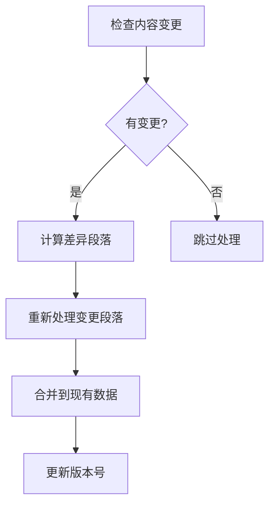

### 9.2 版本管理

| 字段 | 说明 |
| ---- | ---- |
| content_version | 内容版本（原文变更时递增） |
| translation_version | 翻译版本（译文更新时递增） |
| vocab_version | 词汇版本（词典更新时递增） |
| processed_at | 最后处理时间 |

---

## 十、案例分析：《基督山伯爵》

以《The Count of Monte Cristo》（基督山伯爵）为例，详细说明数据预处理的实际应用。

### 10.1 书籍基本信息

| 属性 | 数值 |
| ---- | ---- |
| 英文书名 | The Count of Monte Cristo |
| 作者 | Alexandre Dumas |
| 章节数 | 117 章 |
| 总字数 | 约 464,000 词 |
| 平均章节字数 | 约 3,966 词 |

### 10.2 原文示例

以第一章开头段落为例：

**原文段落**：
> On the 24th of February, 1815, the look-out of Notre-Dame de la Garde signalled the three-master, the Pharaon, from Smyrna, Trieste, and Naples.

### 10.3 翻译数据处理

#### 翻译结果

| 字段 | 内容 |
| ---- | ---- |
| paragraph_id | ch1_p1 |
| original_text | On the 24th of February, 1815, the look-out of Notre-Dame de la Garde signalled the three-master, the Pharaon, from Smyrna, Trieste, and Naples. |
| translated_text | 1815年2月24日，圣母山上的瞭望台发出信号，三桅帆船法老号从士麦拿、的里雅斯特和那不勒斯驶来。 |

#### 翻译难点处理

| 难点 | 原文 | 处理方式 | 结果 |
| ---- | ---- | -------- | ---- |
| 日期格式 | 24th of February, 1815 | 转换为中文习惯 | 1815年2月24日 |
| 地名 | Notre-Dame de la Garde | 意译 | 圣母山 |
| 船名 | the Pharaon | 音译 | 法老号 |
| 城市名 | Smyrna, Trieste, Naples | 标准译名 | 士麦拿、的里雅斯特、那不勒斯 |

### 10.4 分词数据处理

#### 分词结果


#### Token 详细数据

| Token | text | type | lemma | vocab_id |
| ----- | ---- | ---- | ----- | -------- |
| T1 | On | word | on | - |
| T2 | the | word | the | - |
| T3 | 24th | number | - | - |
| T5 | February | word | february | vocab_february |
| T10 | look-out | word | look-out | vocab_lookout |
| T12 | Notre-Dame de la Garde | proper_noun | - | - |
| T13 | signalled | word | signal | vocab_signal |
| T15 | three-master | word | three-master | vocab_threemaster |
| T18 | Pharaon | proper_noun | - | - |
| T21 | Smyrna | proper_noun | - | - |

#### 分词处理要点

| 要点 | 示例 | 处理方式 |
| ---- | ---- | -------- |
| 连字符词 | look-out, three-master | 作为单个词处理 |
| 多词专有名词 | Notre-Dame de la Garde | 作为单个 proper_noun |
| 序数词 | 24th | 标记为 number |
| 高频词过滤 | the, of, and | 不关联词汇 |

### 10.5 词汇数据示例

#### look-out 词汇数据

| 字段 | 内容 |
| ---- | ---- |
| id | vocab_lookout |
| word | look-out |
| phonetic_us | /ˈlʊk.aʊt/ |
| audio_us_url | https://cdn.../lookout.mp3 |

**释义列表**：

| pos | definition_en | definition_zh |
| --- | ------------- | ------------- |
| n. | a place from which to watch | 瞭望台，观察哨 |
| n. | a person who watches for danger | 瞭望员，放哨的人 |

**例句**：

| sentence_en | sentence_zh |
| ----------- | ----------- |
| The look-out spotted the ship on the horizon. | 瞭望员在地平线上发现了那艘船。 |

#### three-master 词汇数据

| 字段 | 内容 |
| ---- | ---- |
| id | vocab_threemaster |
| word | three-master |
| phonetic_us | /ˌθriːˈmæstər/ |

**释义列表**：

| pos | definition_en | definition_zh |
| --- | ------------- | ------------- |
| n. | a sailing ship with three masts | 三桅帆船 |

#### signal 词汇数据

| 字段 | 内容 |
| ---- | ---- |
| id | vocab_signal |
| word | signal |
| phonetic_us | /ˈsɪɡ.nəl/ |

**释义列表**：

| pos | definition_en | definition_zh |
| --- | ------------- | ------------- |
| v. | to make a movement or sound to give information | 发信号，示意 |
| n. | a movement, light, or sound that gives information | 信号，暗号 |

### 10.6 章节数据包示例

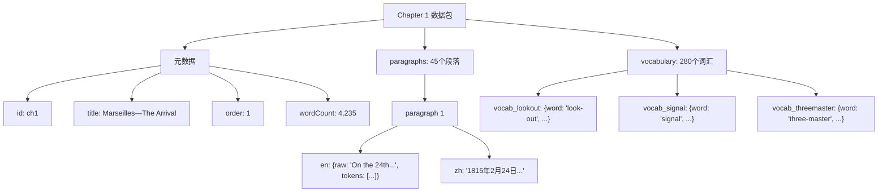

### 10.7 全书数据统计

| 统计项 | 数值 |
| ------ | ---- |
| 总段落数 | 约 5,200 |
| 唯一词汇数 | 约 12,000 |
| 需关联词汇的 Token | 约 85,000 |
| 词汇表条目（去重） | 约 8,500 |
| 音频文件数 | 约 8,500 |

### 10.8 数据体积估算

| 数据项 | 单章节 | 全书（117章） |
| ------ | ------ | ------------- |
| 英文原文 | 20 KB | 2.3 MB |
| 中文译文 | 25 KB | 2.9 MB |
| 分词数据 | 35 KB | 4.1 MB |
| 词汇数据 | - | 3.2 MB（去重） |
| **JSON 总计** | - | **12.5 MB** |
| **Gzip 压缩后** | - | **约 3 MB** |

### 10.9 处理耗时估算

| 阶段 | 单章节 | 全书（并行） |
| ---- | ------ | ------------ |
| 内容解析 | 0.5s | 1min |
| 翻译处理 | 25s | 30min |
| 分词处理 | 3s | 6min |
| 词汇处理 | 5s | 10min |
| 音频获取 | 2s | 5min |
| **总计** | 35s | **约 50min** |

### 10.10 特殊处理案例

#### 法语词汇处理

《基督山伯爵》原著包含大量法语词汇：

| 法语原文 | 处理方式 | 结果 |
| -------- | -------- | ---- |
| monsieur | 保留 + 释义 | 先生（法语） |
| mademoiselle | 保留 + 释义 | 小姐（法语） |
| château | 保留 + 释义 | 城堡（法语） |
| abbé | 保留 + 释义 | 神父（法语） |

#### 历史术语处理

| 术语 | 释义 |
| ---- | ---- |
| Bonapartist | 拿破仑党人，支持拿破仑的人 |
| the Hundred Days | 百日王朝（1815年拿破仑复辟的100天） |
| Elba | 厄尔巴岛（拿破仑流放地） |
| the Restoration | 波旁王朝复辟 |

#### 人名地名处理

| 类型 | 原文 | 译名 | 处理 |
| ---- | ---- | ---- | ---- |
| 主角 | Edmond Dantès | 爱德蒙·唐泰斯 | 首次出现加注释 |
| 地名 | Château d'If | 伊夫堡 | 意译 |
| 船名 | the Pharaon | 法老号 | 音译 |

---

## 十一、总结

### 预处理数据清单

| 数据类型 | 核心内容 | 处理难点 |
| -------- | -------- | -------- |
| 翻译数据 | 段落级中英对照 | 保持段落对齐、翻译质量 |
| 分词数据 | 词组边界与类型 | 词组识别、歧义消解 |
| 词汇数据 | 释义、音标、例句 | 词典覆盖、数据精选 |
| 音频数据 | 发音文件 | 来源质量、存储分发 |

### 技术栈建议

| 环节 | 推荐技术 |
| ---- | -------- |
| 翻译服务 | DeepL API / Google Translate |
| NLP 分词 | spaCy / NLTK |
| 词组识别 | 自建词组词典 + NLP |
| 词典服务 | 自建词典 + 第三方 API |
| 音频存储 | Cloudflare R2 / AWS S3 |
| 任务调度 | Celery / Bull Queue |

### 相关文档

- [双语段落语义对齐实战指南](./bilingual-semantic-alignment.md) - 语义对齐实战经验
- [双语阅读功能实现原理](../reader/bilingual-reading.md)
- [iOS 双语阅读实现方案](../ios/bilingual-reading-implementation.md)
- [EPUB 格式实现原理](../reader/epub-format-specification.md)
