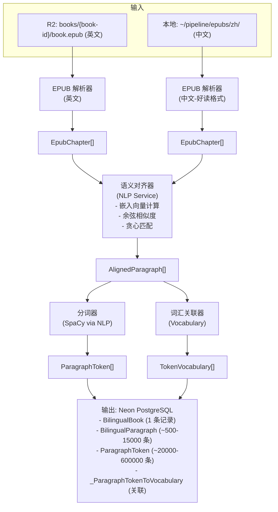

# 双语管线存储结构

## 一、输入文件

| 类型 | 存储位置 | 格式 | 来源 |
|------|----------|------|------|
| 英文 EPUB | `R2: books/{book-id}/book.epub` | EPUB 3.0 | Standard Ebooks / Gutenberg |
| 中文 EPUB | `~/pipeline/epubs/zh/{title}_zh.epub` | EPUB 2.0 | 好读 (haodoo.net) |
| 任务清单 | `~/pipeline/tasks.json` | JSON | batch-process.ts 生成 |
| 环境配置 | `~/pipeline/.env.pipeline` | ENV | 手动配置 |

### tasks.json 结构

```
┌─────────────────────────────────────────────────────────────┐
│  bookId: UUID                 书籍 ID                        │
│  title: string                书名                           │
│  enPath: string               英文 EPUB 本地路径              │
│  zhPath: string               中文 EPUB 本地路径              │
└─────────────────────────────────────────────────────────────┘
```

---

## 二、输出数据

### 数据库表 (Neon PostgreSQL)

| 表名 | 主要字段 | 说明 |
|------|----------|------|
| BilingualBook | id, english_book_id, status, data_version | 双语书籍记录 |
| BilingualParagraph | chapter_order, paragraph_order, original_text, translated_text, alignment_score | 对齐段落对 |
| ParagraphToken | token_index, text, lemma, pos, is_word | 分词结果 |
| _ParagraphTokenToVocabulary | A (token_id), B (vocabulary_id) | Token-词汇关联 |

### 数据关系图

```
┌─────────────────────────────────────────────────────────────┐
│                    数据库存储结构                             │
└─────────────────────────────────────────────────────────────┘

Book (现有)
  │
  ├──1:1──► BilingualBook
  │           │
  │           └──1:N──► BilingualParagraph
  │                       │
  │                       └──1:N──► ParagraphToken
  │                                   │
  │                                   └──N:M──► Vocabulary (现有)
  │
  └──1:N──► Chapter (现有, 英文原文)
```

---

## 三、临时文件

| 类型 | 位置 | 生命周期 |
|------|------|----------|
| EPUB 解压目录 | `~/readmigo/.../temp/epub-{name}-{timestamp}/` | 处理完成后删除 |
| 失败日志 | `~/pipeline/logs/failed-worker-{n}.json` | 永久保留 |
| PM2 日志 | `~/.pm2/logs/bilingual-worker-*.log` | PM2 管理 |

---

## 四、R2 云存储结构

```
readmigo-production (R2 Bucket)
│
├── books/                          # 现有英文书籍
│   └── {book-id}/
│       ├── book.epub              # 英文 EPUB
│       └── cover.jpg              # 封面
│
├── pipeline/                       # 管线工作目录
│   ├── epubs/
│   │   ├── en/{book-id}.epub      # 下载的英文 EPUB 副本
│   │   └── zh/{title}_zh.epub     # 中文 EPUB
│   └── logs/                       # 处理日志
│
└── bilingual/                      # 预留: 双语处理结果缓存
    └── {book-id}/
        ├── aligned.json           # 对齐结果
        └── metadata.json          # 处理元数据
```

---

## 五、数据流图



---

## 六、性能基准

### 单书处理时间分解

| 阶段 | 时间 | 占比 | 瓶颈因素 |
|------|------|------|----------|
| EPUB 解析 | 5s | 0.1% | I/O |
| 语义对齐 | 20 min | 33% | NLP 嵌入 (CPU) |
| 分词 | 25 min | 42% | SpaCy (CPU) |
| 词汇关联 | 5 min | 8% | DB 查询 |
| 数据库写入 | 10 min | 17% | Neon CU |
| **总计** | **~60 min** | 100% | - |

### 数据量统计

| 指标 | 单书平均 | 基督山伯爵 (117章) | 200 本预估 |
|------|----------|-------------------|------------|
| 章节数 | 30 | 117 | 6,000 |
| 段落数 | 4,000 | 14,679 | 800,000 |
| Token 数 | 150,000 | 588,600 | 30,000,000 |
| 词汇关联 | 40,000 | 155,287 | 8,000,000 |

### 存储占用估算

| 数据项 | 单书平均 | 200 本预估 |
|--------|----------|------------|
| BilingualParagraph | 0.5 MB | 100 MB |
| ParagraphToken | 4 MB | 800 MB |
| 词汇关联 | 1 MB | 200 MB |
| **数据库总增量** | **~5 MB** | **~1 GB** |

---

## 七、批量处理配置

### PM2 生态系统配置

```
┌─────────────────────────────────────────────────────────────┐
│                 ecosystem.config.js                          │
├─────────────────────────────────────────────────────────────┤
│  Worker 1: --start 0 --count N                              │
│  Worker 2: --start N --count M                              │
│  Worker 3: --start N+M --count K (可选)                     │
└─────────────────────────────────────────────────────────────┘

推荐配置:
├── Worker 数量: 2 (4核8GB服务器)
├── 单 Worker 书籍数: 任务总数 / Worker 数
└── 超时设置: 60 分钟 / 书
```

### 环境变量 (.env.pipeline)

| 变量 | 说明 |
|------|------|
| PIPELINE_DIR | 管线工作目录 |
| DATABASE_URL | Neon PostgreSQL 连接串 |
| R2_* | Cloudflare R2 凭证 |
| NLP_SERVICE_URL | NLP 服务地址 |

---

## 八、关键文件清单

| 文件 | 说明 |
|------|------|
| `packages/database/scripts/bilingual-pipeline/index.ts` | 管线主入口 |
| `packages/database/scripts/bilingual-pipeline/epub-parser.ts` | EPUB 解析器 |
| `packages/database/scripts/bilingual-pipeline/semantic-aligner.ts` | 语义对齐器 |
| `packages/database/scripts/bilingual-pipeline/tokenizer.ts` | 分词器 |
| `packages/database/scripts/bilingual-pipeline/vocabulary-linker.ts` | 词汇关联器 |
| `packages/database/scripts/bilingual-pipeline/batch-writer.ts` | 批量写入器 |
| `packages/database/scripts/bilingual-pipeline/batch-process.ts` | 批量任务生成 |
| `packages/database/scripts/bilingual-pipeline/process-worker.ts` | Worker 脚本 |

---

## 相关文档

| 文档 | 说明 |
|------|------|
| [双语管线执行报告](./bilingual-pipeline-execution-report.md) | 执行结果记录 |
| [双语批量处理执行计划](./bilingual-batch-processing.md) | 批处理方案 |
| [双语段落语义对齐实战指南](./bilingual-semantic-alignment.md) | 对齐算法详解 |
| [双语阅读系统架构](../architecture/bilingual-reading-system.md) | 完整架构设计 |
