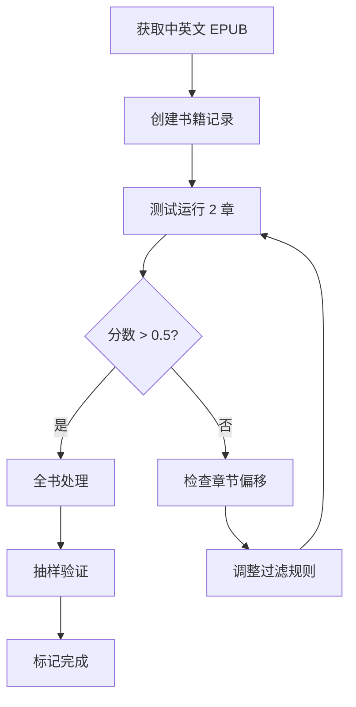

# 双语段落语义对齐实战指南

## 概述

本文档记录使用语义嵌入进行中英文双语段落对齐的实战经验，以《基督山伯爵》(The Count of Monte Cristo) 为案例，详细说明处理流程、常见问题及解决方案。

---

## 语义对齐方案

### 为什么需要语义对齐

| 方案 | 问题 |
|------|------|
| 位置比例对齐 | 中英文段落数量不同时完全失效 |
| 基于锚点对齐 | 锚点识别困难，精度低 |
| 人工对齐 | 成本高，无法批量处理 |

**语义对齐优势**：通过多语言句子嵌入，直接比较中英文段落的语义相似度，无需段落数量一致。

### 技术选型

| 组件 | 选择 | 理由 |
|------|------|------|
| 嵌入模型 | paraphrase-multilingual-MiniLM-L12-v2 | 支持50+语言、384维、CPU可运行 |
| 相似度计算 | 余弦相似度 | 标准做法，效果稳定 |
| 匹配算法 | 贪心匹配 + 滑动窗口 | 保持段落顺序性 |

---

## 处理流程

```mermaid
flowchart TD
    subgraph 输入
        EN_EPUB[英文 EPUB]
        ZH_EPUB[中文 EPUB]
    end

    subgraph 阶段一：EPUB解析
        EN_EPUB --> PARSE1[解析章节/段落]
        ZH_EPUB --> PARSE2[解析章节/段落]
    end

    subgraph 阶段二：章节过滤
        PARSE1 --> FILTER1[过滤非正文章节]
        PARSE2 --> FILTER2[过滤非正文章节]
        FILTER2 --> FOOTNOTE[过滤脚注段落]
    end

    subgraph 阶段三：章节配对
        FILTER1 --> MATCH[按顺序配对章节]
        FOOTNOTE --> MATCH
    end

    subgraph 阶段四：语义对齐
        MATCH --> EMBED[获取段落嵌入向量]
        EMBED --> SIM[计算相似度矩阵]
        SIM --> GREEDY[贪心匹配]
    end

    subgraph 输出
        GREEDY --> RESULT[对齐结果]
        RESULT --> DB[写入数据库]
    end
```

---

## 关键问题与解决方案

### 问题一：章节偏移

**现象**：对齐分数很低（0.3-0.4），内容明显不匹配。

**原因**：英文EPUB包含前置章节（标题页、版权页），中文EPUB没有。

| 英文 EPUB 章节 | 中文 EPUB 章节 |
|----------------|----------------|
| Ch0: Title page | Ch0: 第一章 返航马赛 |
| Ch1: Imprint (版权) | Ch1: 第二章 父与子 |
| Ch2: Chapter I | Ch2: 第三章 加泰罗尼亚村 |
| Ch3: Chapter II | ... |

**解决方案**：在章节过滤时排除非正文章节。

| 过滤条件 | 说明 |
|----------|------|
| 标题模式匹配 | title page, copyright, imprint, contents 等 |
| 段落数阈值 | 少于 10 个段落的章节视为非正文 |
| 书名匹配 | 标题与书名相同的章节（标题页） |

### 问题二：脚注干扰

**现象**：中文段落中混入脚注，影响对齐准确性。

**示例**：脚注格式如 `[6] 沙隆：即马恩河畔沙隆，法国东北部城市。`

**解决方案**：使用正则表达式匹配 `[数字]` 前缀的段落进行过滤。

### 问题三：EPUB并行解析竞态条件

**现象**：两个EPUB同时解析时，数据混乱。

**原因**：临时目录使用 `Date.now()` 生成，毫秒级精度可能重复。

**解决方案**：使用更唯一的目录名格式 `epub-{basename}-{timestamp}-{randomSuffix}`。

### 问题四：章节标题不一致

**现象**：英文章节 "The Colosseum" 对应中文章节 "露面"，标题完全不同。

**结论**：这是翻译差异，不是错误。验证方式是检查段落内容是否语义匹配。

---

## CLI 使用方法

### 参数说明

| 参数 | 必需 | 说明 |
|------|------|------|
| --book-id | 是 | 数据库中的书籍 UUID |
| --en-epub | 是 | 英文 EPUB 文件路径 |
| --zh-epub | 是 | 中文 EPUB 文件路径 |
| --use-semantic | 否 | 使用语义对齐（推荐） |
| --test-chapters N | 否 | 仅处理 N 个章节 |
| --skip-chapters N | 否 | 跳过前 N 个章节 |
| --dry-run | 否 | 不写入数据库 |

---

## 依赖服务

### NLP 服务

语义对齐需要运行 NLP 服务来计算嵌入向量（默认端口 8001）。

**关键端点**：

| 端点 | 方法 | 说明 |
|------|------|------|
| /embed | POST | 计算文本嵌入向量 |
| /tokenize | POST | SpaCy 分词 |

### 长时间任务管理

使用 PM2 管理长时间运行的处理任务（PM2 名称: `nlp-service`）。

---

## 验证方法

### 对齐分数判断

| 分数范围 | 质量评估 | 建议操作 |
|----------|----------|----------|
| > 0.7 | 高置信度 | 直接使用 |
| 0.5 - 0.7 | 中等置信度 | 抽样验证 |
| < 0.5 | 低置信度 | 需人工复核 |

### 抽样验证要点

| 验证项 | 方法 |
|--------|------|
| 日期时间 | 检查日期是否对应（如 "February 24, 1815" ↔ "一八一五年二月二十四日"） |
| 人名 | 检查人名是否匹配（如 "Sinbad the Sailor" ↔ "水手辛巴德"） |
| 地名 | 检查地名是否对应（如 "Colosseum" ↔ "斗兽场"） |
| 对话 | 检查对话内容是否语义一致 |

---

## 测试结果：基督山伯爵

### 书籍信息

| 属性 | 英文版 | 中文版 |
|------|--------|--------|
| EPUB 章节数 | 122 | 122 |
| 过滤后章节数 | 117 | 117 |
| 总段落数 | ~15,000 | ~14,000 |

### 对齐结果统计

| 指标 | 修复前 | 修复后 |
|------|--------|--------|
| 平均对齐分数 | 0.35 | 0.67 |
| 高分段落比例 (>0.5) | ~30% | ~70% |
| 匹配章节数 | 121 | 117 |

### 抽样验证结果

**Chapter 2 (Marseilles—The Arrival)**

| 段落 | 英文关键词 | 中文关键词 | 分数 |
|------|-----------|-----------|------|
| Para1 | "24th of February, 1815" | "一八一五年二月二十四日" | 0.540 |
| Para4 | "ship drew on" | "法老号顺利穿越" | 0.836 |
| Para7 | "eighteen or twenty, black eyes" | "还不到二十岁...黑眼睛" | 0.784 |

**Chapter 35 (The Colosseum / 露面)**

| 段落 | 英文关键词 | 中文关键词 | 分数 |
|------|-----------|-----------|------|
| Para2 | "ride to the Colosseum" | "去斗兽场的路上" | 0.676 |
| Para4 | "Sinbad the Sailor" | "水手辛巴德" | 0.858 |
| Para5 | "young man...Colosseum" | "年轻人...斗兽场的幽灵" | 0.790 |

---

## 批量处理建议

### 新书处理流程



### 常见调整

| 问题 | 调整方式 |
|------|----------|
| 特定书籍前置章节 | 添加书名到跳过模式 |
| 脚注格式不同 | 修改脚注正则表达式 |
| 章节数量不匹配 | 检查是否有合并/拆分章节 |

---

## 相关文件

| 文件 | 说明 |
|------|------|
| `packages/database/scripts/bilingual-pipeline/index.ts` | 管线主入口 |
| `packages/database/scripts/bilingual-pipeline/semantic-aligner.ts` | 语义对齐器 |
| `packages/database/scripts/bilingual-pipeline/epub-parser.ts` | EPUB 解析器 |
| `packages/database/scripts/bilingual-pipeline/types.ts` | 类型定义 |
| `apps/nlp-service/main.py` | NLP 服务 |

## 相关文档

- [双语阅读数据预处理分析](./bilingual-data-preprocessing.md) - 理论设计与数据结构
- [双语阅读功能实现原理](../reader/bilingual-reading.md) - 阅读器实现
- [iOS 双语阅读实现方案](../ios/bilingual-reading-implementation.md) - iOS 客户端实现
- [EPUB 格式实现原理](../reader/epub-format-specification.md) - EPUB 解析规范
