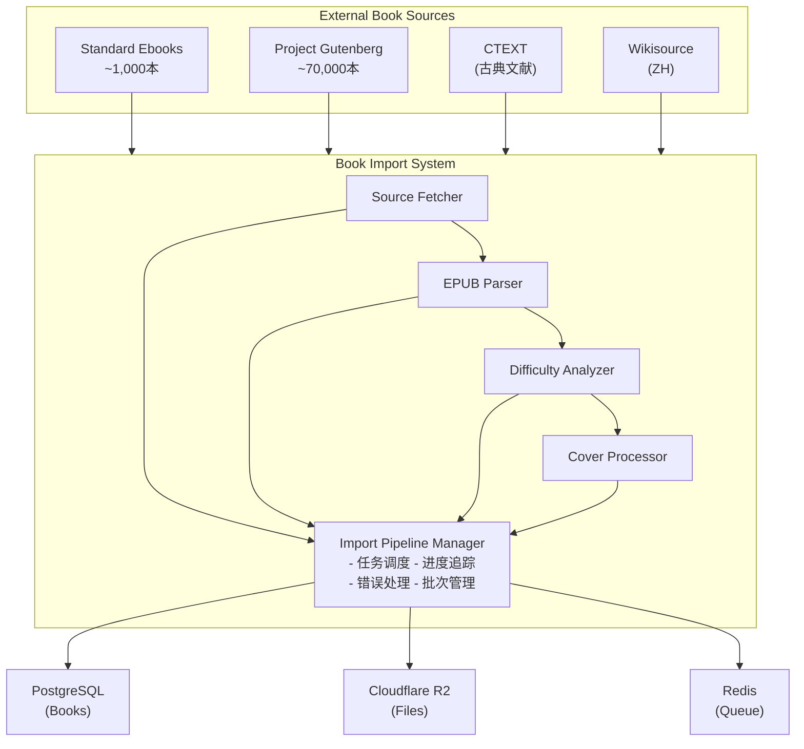
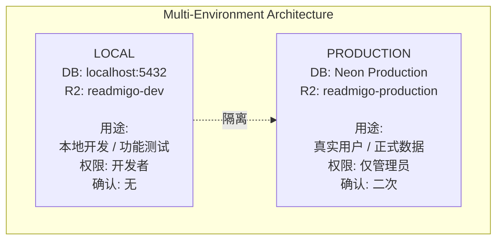
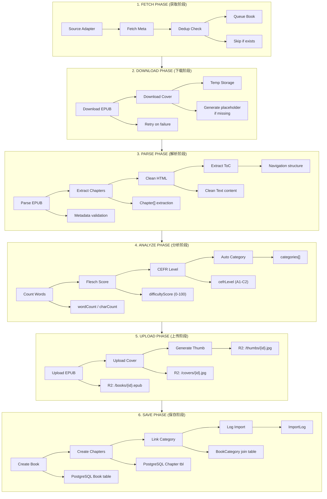
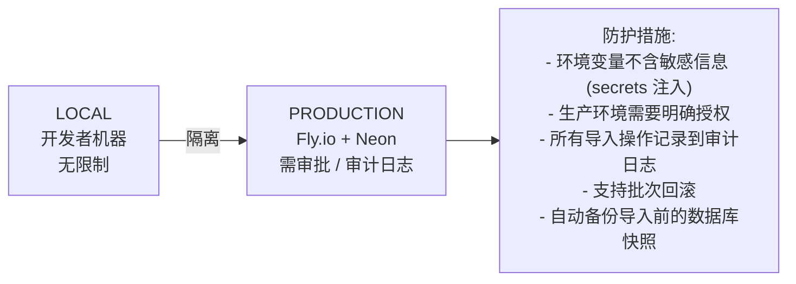

# Readmigo 书籍导入系统设计文档

> Version: 1.2.0
> Status: Implementation Complete (Core + Batch Management)
> Last Updated: 2025-12-27

---

## 1. 概述

### 1.1 设计目标

构建一个可扩展、多源、自动化的书籍导入系统，支撑 Readmigo 的内容运营需求。

| 目标 | 说明 |
|------|------|
| 多源支持 | Standard Ebooks、Project Gutenberg、中文古籍等多个公版书源 |
| 环境隔离 | 本地和 Production 环境独立配置，数据隔离 |
| 批量导入 | 海量书籍的批量导入，带进度追踪和断点续传 |
| 自动处理 | EPUB 解析、封面提取、难度分析、分类标注自动化 |
| 质量控制 | 导入前预检、去重机制、错误处理和回滚 |

### 1.2 核心原则

| 原则 | 说明 |
|------|------|
| **幂等性** | 重复导入同一书籍不会产生重复数据 |
| **可追溯** | 每本书记录来源、导入时间、导入批次 |
| **可回滚** | 支持按批次回滚导入的书籍 |
| **渐进式** | 支持增量导入，只导入新书籍 |
| **环境隔离** | 不同环境使用独立的数据库和存储 |

### 1.3 在系统中的定位

---

## 2. 系统架构

### 2.1 整体架构

### 2.2 环境架构

> **注意**: 项目已简化为 2 环境架构 (Local + Production)。不存在 Staging 或 Debug 环境。

---

## 3. 数据源设计

### 3.1 支持的书籍来源

| 来源 | 类型 | 数量 | 语言 | 特点 |
|------|------|------|------|------|
| Standard Ebooks | 公版书 | ~1,000 | 英语 | 高质量排版、精校文本 |
| Project Gutenberg | 公版书 | ~70,000 | 多语言 | 数量最大、覆盖广 |
| Gutenberg-ZH | 公版书 | ~500 | 中文 | 中文经典文学 |
| CTEXT | 古籍 | ~10,000 | 古文 | 中国古典文献 |
| Wikisource-ZH | 维基文库 | ~5,000 | 中文 | 现代中文作品 |

### 3.2 数据源适配器接口

每个数据源实现统一的 `BookSourceAdapter` 接口:

| 方法 | 说明 |
|------|------|
| `fetchBookList(options)` | 获取书籍列表 (AsyncGenerator) |
| `fetchBookContent(sourceBookId)` | 获取 EPUB 内容 |
| `fetchCover(sourceBookId)` | 获取书籍封面 |
| `checkExists(metadata)` | 检查是否已导入 (去重) |

BookMetadata 核心字段:

| 字段 | 说明 |
|------|------|
| sourceId / sourceBookId / sourceUrl | 来源标识 |
| title / author | 书名和作者 |
| language / languageVariant | 语言 (en, zh-Hans 等) |
| description / subjects / genres | 描述和分类 |
| coverUrl / epubUrl | 资源 URL |

BookSource 枚举: `STANDARD_EBOOKS`, `GUTENBERG`, `GUTENBERG_ZH`, `CTEXT`, `WIKISOURCE_ZH`, `USER_UPLOAD`

---

## 4. 导入流水线设计

### 4.1 导入流程

### 4.2 ImportBatch 管理

| 字段 | 说明 |
|------|------|
| id | 批次唯一标识 |
| source | 数据源 (BookSource) |
| environment | 环境 |
| status | PENDING / RUNNING / PAUSED / COMPLETED / FAILED / CANCELLED |
| totalBooks / processedBooks / successBooks / failedBooks / skippedBooks | 进度统计 |
| errors | 错误记录 (JSON) |

### 4.3 导入阶段 (ImportPhase)

| 阶段 | 说明 |
|------|------|
| FETCHING | 获取元数据 |
| DOWNLOADING | 下载 EPUB 和封面 |
| PARSING | 解析 EPUB 内容 |
| ANALYZING | 难度分析 |
| UPLOADING | 上传文件到 R2 |
| SAVING | 写入数据库 |

---

## 5. 难度分析系统

### 5.1 英文难度分析

分析指标:

| 指标 | 说明 |
|------|------|
| wordCount / characterCount | 字数统计 |
| fleschReadingEase | Flesch 可读性 (0-100, 越高越易读) |
| fleschKincaidGrade | 美国年级水平 |
| difficultyScore | 标准化难度分数 (0-100) |
| cefrLevel | CEFR 等级 (A1-C2) |

Flesch 到难度分数映射:

| Flesch 分数 | 难度等级 | CEFR 等级 |
|-------------|----------|-----------|
| 90-100 (很易) | 0-10 | A1 |
| 80-90 (易) | 10-20 | A2 |
| 70-80 (较易) | 20-30 | B1 |
| 60-70 (标准) | 30-40 | B2 |
| 50-60 (中等偏难) | 40-50 | C1 |
| 0-50 (难-很难) | 50-100 | C2 |

### 5.2 中文难度分析

| 分析维度 | 方法 |
|----------|------|
| 分词 | jieba 分词 |
| HSK 等级分析 | 词汇匹配 HSK 1-6 级词表 |
| 句子复杂度 | 平均句子长度 |
| 难度分数 | 综合 HSK 分布、句子复杂度、字符多样性 |

---

## 6. 脚本与环境配置

### 6.1 主要脚本目录

| 路径 | 说明 |
|------|------|
| `scripts/book-ingestion/pipeline.ts` | 英文导入管道入口 |
| `scripts/book-ingestion/pipeline-chinese.ts` | 中文书籍导入 |
| `scripts/book-ingestion/sources/` | 数据源适配器 |
| `scripts/book-ingestion/processors/` | 处理器 (EPUB 解析、难度分析、封面处理) |

### 6.2 环境配置

| 环境 | 数据库 | R2 Bucket | R2 公开 URL |
|------|--------|-----------|-------------|
| Local | localhost:5432 | readmigo-dev | cdn-dev.readmigo.app |
| Production | Neon Production | readmigo-production | cdn.readmigo.app |

> **注意**: Production 环境敏感信息通过 Fly.io secrets 注入，不存储在代码仓库中。

### 6.3 导入配置参数

| 参数 | Local | Production | 说明 |
|------|-------|------------|------|
| IMPORT_BATCH_SIZE | 100 | 50 | 批次大小 |
| IMPORT_CONCURRENCY | 5 | 3 | 并发数 |
| IMPORT_RETRY_COUNT | 3 | 5 | 重试次数 |
| IMPORT_TIMEOUT | 30000 | 60000 | 超时 (ms) |
| LOG_LEVEL | debug | info | 日志级别 |

---

## 7. 数据模型

### 7.1 导入相关表

| 表名 | 主要字段 | 说明 |
|------|----------|------|
| ImportBatch | id, source, environment, status, progress stats | 导入批次记录 |
| Book (扩展) | source, sourceId, sourceUrl, importBatchId | 导入来源追踪 |

Book 表去重索引: `@@unique([source, sourceId])`

BookSource 枚举值: `STANDARD_EBOOKS`, `GUTENBERG`, `GUTENBERG_ZH`, `CTEXT`, `WIKISOURCE_ZH`, `USER_UPLOAD`

ImportStatus 枚举值: `PENDING`, `RUNNING`, `PAUSED`, `COMPLETED`, `FAILED`, `CANCELLED`

---

## 8. 监控与告警

### 8.1 导入监控指标

| 类别 | 指标 |
|------|------|
| 性能 | booksPerMinute, averageProcessTime, downloadSpeed, uploadSpeed |
| 质量 | successRate, duplicateRate, errorRate |
| 资源 | memoryUsage, cpuUsage, diskUsage |

### 8.2 告警规则

| 规则 | 条件 | 严重级别 | 动作 |
|------|------|----------|------|
| 高错误率 | errorRate > 10% | warning | 暂停导入 |
| 极高错误率 | errorRate > 25% | critical | 停止导入并通知 |
| 导入过慢 | booksPerMinute < 5 | warning | 通知运维 |

---

## 9. 安全考虑

### 9.1 环境隔离

### 9.2 访问控制

| 环境 | 权限要求 | 需要审批 | 最大批次 |
|------|----------|----------|----------|
| local | developer | 否 | 无限制 |
| production | admin | 是 | 1000 |

---

## 10. 实施计划

### Phase 1: 基础框架 -- COMPLETED

- [x] CLI 脚本框架搭建
- [x] 环境配置管理
- [x] 数据库 Schema 扩展
- [x] 日志系统

### Phase 2: 核心导入 -- COMPLETED

- [x] Standard Ebooks 适配器
- [x] EPUB 解析器
- [x] 封面处理器
- [x] R2 存储集成

### Phase 3: 难度分析 -- COMPLETED

- [x] 英文难度分析器 (Flesch + CEFR)
- [x] 中文难度分析器 (HSK)

### Phase 4: 扩展数据源 -- MOSTLY COMPLETED

- [x] Project Gutenberg 适配器
- [x] Gutenberg-ZH 中文适配器
- [x] LibriVox 有声书适配器
- [x] CTEXT 古籍数据源
- [x] Wikisource-ZH 数据源

### Phase 5: 运维功能 -- COMPLETED

- [x] 导入监控和告警
- [x] Dashboard 书籍管理界面集成
- [x] 增量导入 API

---

## 实施进度

| 版本 | 状态 | 完成度 | 更新日期 |
|------|------|--------|----------|
| v1.3 | 运维完成 | 95% | 2025-12-28 |

### 待开发

| 项目 | 优先级 | 说明 |
|------|--------|------|
| 并发控制 | 低 | 控制同时处理的书籍数量 |
| 断点续传 | 低 | 导入中断后恢复 |
| CEFR 等级自动映射 | 中 | 改进映射算法 |
| 导入测试 | 中 | 添加单元测试和集成测试 |

### 依赖项状态

| 依赖 | 状态 | 说明 |
|------|------|------|
| Cloudflare R2 | 已配置 | 存储 EPUB 和封面 |
| PostgreSQL | 已部署 | Neon 托管 |
| Prisma ORM | 已配置 | 数据库访问层 |
| Redis | 可选 | 任务队列 |
