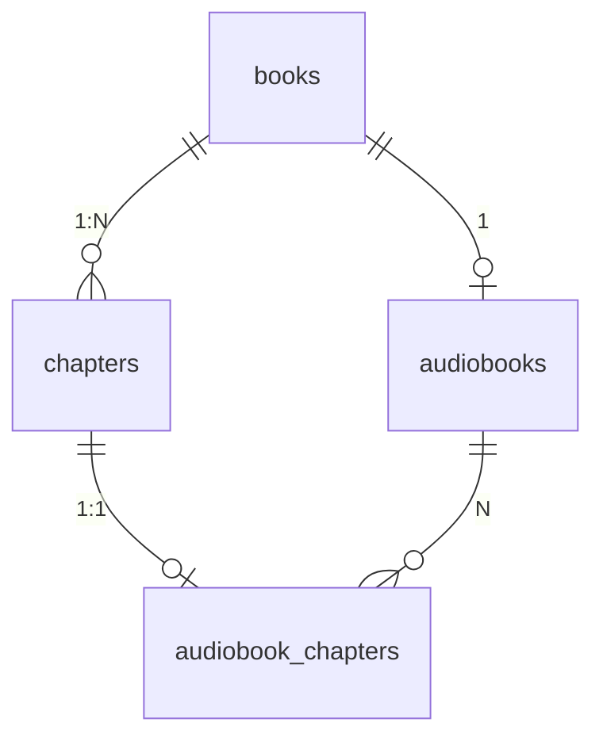
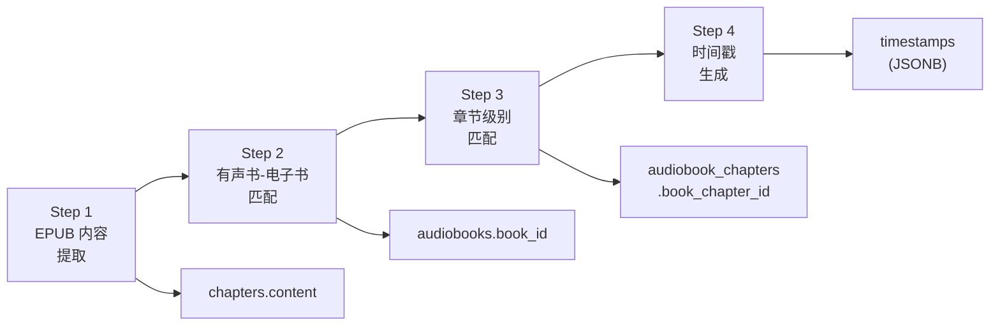
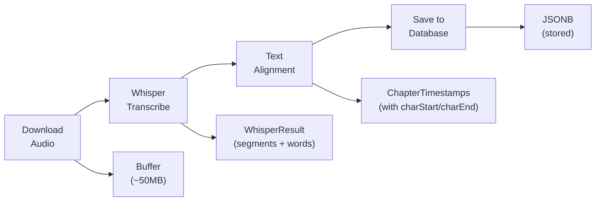
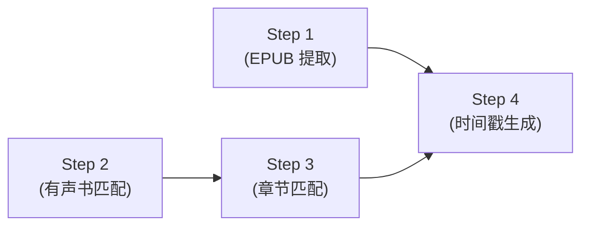

# Audiobook Highlight Sync Pipeline

## 概述

本文档描述了 Readmigo 有声书高亮同步功能的完整数据处理流程。该功能允许用户在听有声书时，电子书文本实时高亮显示当前朗读的句子和单词。

### 核心目标

- 实现有声书音频与电子书文本的精确同步
- 支持句子级和单词级高亮
- 支持离线使用（预生成时间戳）
- 自动化批量处理

---

## 数据模型

### 数据库表关系

### 关键表结构

#### `books` 表
| 字段 | 类型 | 说明 |
|------|------|------|
| id | UUID | 主键 |
| title | VARCHAR | 书名 |
| epub_url | VARCHAR | EPUB 文件 URL (R2 存储) |

#### `chapters` 表 (电子书章节)
| 字段 | 类型 | 说明 |
|------|------|------|
| id | UUID | 主键 |
| book_id | UUID | 关联的书籍 |
| order | INTEGER | 章节顺序 |
| title | VARCHAR | 章节标题 |
| href | VARCHAR | EPUB 内部路径 |
| **content** | TEXT | **章节纯文本内容** (需要提取) |
| html_content | TEXT | 章节 HTML 内容 |
| word_count | INTEGER | 字数统计 |

#### `audiobooks` 表
| 字段 | 类型 | 说明 |
|------|------|------|
| id | UUID | 主键 |
| title | VARCHAR | 有声书标题 |
| **book_id** | UUID | **关联的电子书** (需要匹配) |
| language | VARCHAR | 语言代码 |
| status | ENUM | 状态 (ACTIVE/INACTIVE) |

#### `audiobook_chapters` 表 (有声书章节)
| 字段 | 类型 | 说明 |
|------|------|------|
| id | UUID | 主键 |
| audiobook_id | UUID | 关联的有声书 |
| **book_chapter_id** | UUID | **关联的电子书章节** (需要匹配) |
| chapter_number | INTEGER | 章节编号 |
| title | VARCHAR | 章节标题 |
| audio_url | VARCHAR | 音频文件 URL |
| duration | INTEGER | 时长(秒) |
| **timestamps** | JSONB | **时间戳数据** (需要生成) |

---

## 完整工作流程

---

## Step 1: EPUB 内容提取

### 目标
从 R2 存储的 EPUB 文件中提取每个章节的纯文本内容，填充到 `chapters.content` 字段。

### 输入/输出

| 方向 | 说明 |
|------|------|
| 输入 | `books.epub_url` (EPUB 文件的 R2 URL)、`chapters` 表记录 (content 为空) |
| 输出 | `chapters.content` (纯文本)、`chapters.html_content` (HTML)、`chapters.word_count` (字数) |

### 处理逻辑

获取书籍 EPUB URL -> 下载 EPUB -> 解析 EPUB -> 遍历章节，根据 `chapter.href` 找到对应 section -> 提取纯文本 (去除 HTML 标签) -> 更新数据库

### 需要的脚本
- `scripts/epub-extraction/extract-all.ts` - 批量处理所有书籍

### 当前状态
| 指标 | 值 |
|------|------|
| 总章节数 | 4,255 |
| 已提取内容 | 0 |
| 完成率 | 0% |

---

## Step 2: 有声书与电子书匹配

### 目标
将有声书 (audiobooks) 与对应的电子书 (books) 建立关联。

### 输入/输出

| 方向 | 说明 |
|------|------|
| 输入 | `audiobooks` 表 (`book_id` 为空)、`books` 表 |
| 输出 | `audiobooks.book_id` (指向匹配的电子书) |

### 匹配策略

| 优先级 | 策略 | 说明 |
|--------|------|------|
| 1 | 标准化标题精确匹配 | 移除副标题、版本号后精确比对 |
| 2 | 模糊匹配 | Levenshtein distance < 3 |
| 3 | 作者 + 部分标题匹配 | 组合匹配 |

### 需要的脚本
- `scripts/matching/match-audiobooks.ts` - 有声书匹配

### 当前状态
| 指标 | 值 |
|------|------|
| 总有声书数 | 119 |
| 已匹配 | 21 |
| 完成率 | 17.6% |

---

## Step 3: 章节级别匹配

### 目标
将有声书的各章节与电子书的对应章节建立关联。

### 输入/输出

| 方向 | 说明 |
|------|------|
| 输入 | `audiobook_chapters` (`book_chapter_id` 为空)、`chapters` (属于已匹配的 book) |
| 输出 | `audiobook_chapters.book_chapter_id` (指向匹配的电子书章节) |

### 匹配策略

| 优先级 | 策略 | 说明 |
|--------|------|------|
| 1 | 按顺序匹配 | 章节数相同时直接按序号对应 |
| 2 | 标题匹配 | 标准化标题后精确匹配 |
| 3 | 章节号提取匹配 | 从标题中提取章节编号 |

### 特殊情况处理

| 情况 | 处理方式 |
|------|----------|
| 章节数量不匹配 | 使用标题/章节号匹配 |
| 有声书包含引言/致谢 | 跳过无对应内容的章节 |
| 电子书章节拆分更细 | 一个音频章节可能对应多个文本章节 |

### 需要的脚本
- `scripts/matching/match-chapters.ts` - 章节级别匹配

### 当前状态
| 指标 | 值 |
|------|------|
| 已链接有声书的总章节 | ~1,200 (估算) |
| 已匹配章节 | 0 |
| 完成率 | 0% |

---

## Step 4: 时间戳生成

### 目标
使用 Whisper ASR 将有声书音频转录，并与电子书文本对齐，生成精确到单词级别的时间戳。

### 输入/输出

| 方向 | 说明 |
|------|------|
| 输入 | `audiobook_chapters.audio_url` (音频 URL)、`chapters.content` (文本)、`audiobook_chapters.book_chapter_id` (必须已关联) |
| 输出 | `audiobook_chapters.timestamps` (JSONB 时间戳数据) |

### Timestamps 数据结构

| 字段 | 类型 | 说明 |
|------|------|------|
| version | number | 版本号 (1) |
| generatedAt | string | ISO 8601 日期 |
| method | string | 生成方法 ('whisper') |
| language | string | 语言代码 |
| duration | number | 总时长(秒) |
| segments | array | 分段列表 |

**Segment 字段:**

| 字段 | 类型 | 说明 |
|------|------|------|
| id | number | 段落 ID |
| startTime / endTime | number | 时间范围(秒) |
| text | string | 对应原文文本 |
| charStart / charEnd | number | 在 content 中的字符位置 |
| confidence | number | 对齐置信度 (0-1) |
| words | array | 单词级时间戳 (可选) |

### 处理流程

### Whisper 服务

通过 Docker 部署 Whisper 服务，支持 CPU 模式。

**API 端点:**

| 端点 | 方法 | 说明 |
|------|------|------|
| `/health` | GET | 健康检查 |
| `/transcribe` | POST | 音频转录（返回 word-level timestamps） |
| `/transcribe/align` | POST | 转录 + 与参考文本对齐 |

### 文本对齐算法

| 步骤 | 说明 |
|------|------|
| 1. 标准化文本 | 小写、去标点、合并空格 |
| 2. 遍历转录段落 | 处理每个 Whisper segment |
| 3. 查找匹配位置 | 精确匹配 -> 前缀匹配 -> 滑动窗口 + 相似度 |
| 4. 映射字符位置 | 映射回原始文本字符位置 |
| 5. 对齐单词时间戳 | 处理 word-level timestamps |

### 已有脚本
- `scripts/timestamp-generation/generate-all.ts` - 批量生成
- `scripts/timestamp-generation/whisper-client.ts` - Whisper 客户端
- `scripts/timestamp-generation/text-aligner.ts` - 文本对齐

### 当前状态
| 指标 | 值 |
|------|------|
| 可处理章节 | 0 (blocked by Step 1 & 3) |
| 已生成时间戳 | 0 |
| Whisper 服务 | Running (base model) |

---

## 依赖关系

### 前置条件检查

| Step | 前置条件 |
|------|----------|
| Step 1 | `books.epub_url` 存在 |
| Step 2 | 无 |
| Step 3 | `audiobooks.book_id` 不为空 |
| Step 4 | `audiobook_chapters.book_chapter_id` 不为空 AND `chapters.content` 不为空 |

---

## 错误处理

### Step 1: EPUB 提取

| 错误 | 处理 |
|------|------|
| EPUB 下载失败 | 重试 3 次，记录错误日志 |
| EPUB 格式损坏 | 跳过，记录错误 |
| 章节 href 不匹配 | 尝试模糊匹配 |

### Step 4: 时间戳生成

| 错误 | 处理 |
|------|------|
| 音频下载失败 | 重试 3 次 |
| Whisper 服务不可用 | 退出并提示启动服务 |
| 对齐失败（confidence < 0.5） | 标记为低质量，仍保存 |
| 内存不足 | 分批处理长章节 |

---

## 离线支持

时间戳数据可预先上传到 R2，存储路径: `audiobooks/{audiobook_id}/timestamps.json`

---

## 待开发脚本清单

| 脚本 | 路径 | 状态 |
|------|------|------|
| EPUB 内容提取 | `scripts/epub-extraction/extract-all.ts` | 待开发 |
| 章节匹配 | `scripts/matching/match-chapters.ts` | 待开发 |
| 时间戳验证 | `scripts/timestamp-generation/validate-timestamps.ts` | 待开发 |
| 有声书匹配 | `scripts/matching/match-audiobooks.ts` | 已完成 (21/119) |
| 时间戳生成 | `scripts/timestamp-generation/generate-all.ts` | 已完成 |
| Whisper 服务 | `infrastructure/whisper/` | 已完成 |

---

## 附录

### A. 环境变量

| 变量 | 说明 |
|------|------|
| DATABASE_URL | Production Neon PostgreSQL |
| R2_PUBLIC_URL | Cloudflare R2 公开 URL |
| R2_ACCESS_KEY | R2 访问密钥 |
| R2_SECRET_KEY | R2 密钥 |
| R2_BUCKET | `readmigo-production` |
| WHISPER_SERVICE_URL | Whisper 服务地址 (默认 `http://localhost:8000`) |

### B. Whisper 模型选择

| 模型 | 大小 | 速度 | 准确率 | 推荐场景 |
|------|------|------|--------|----------|
| base | 74 MB | 最快 | 较低 | 开发测试 |
| small | 244 MB | 快 | 中等 | 快速验证 |
| medium | 769 MB | 中等 | 较高 | 平衡选择 |
| large-v3 | 3.1 GB | 慢 | 最高 | 生产环境 |

### C. 性能估算

| 场景 | 配置 | 处理速度 |
|------|------|----------|
| CPU (large-v3) | M1 Mac | ~0.5x 实时 |
| CPU (base) | M1 Mac | ~5x 实时 |
| GPU (large-v3) | RTX 3080 | ~10x 实时 |

**21 本已匹配有声书预估处理时间:**
- 平均每本: 10 小时音频
- CPU (large-v3): ~420 小时
- CPU (base): ~42 小时
- GPU (large-v3): ~21 小时
