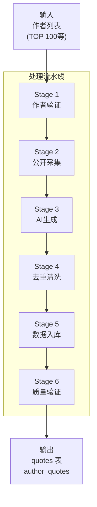
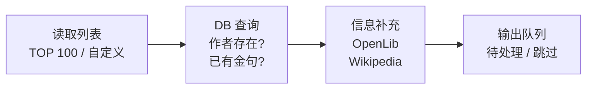
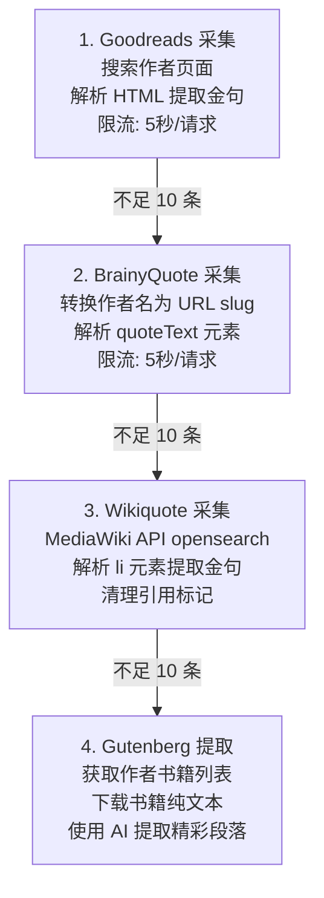
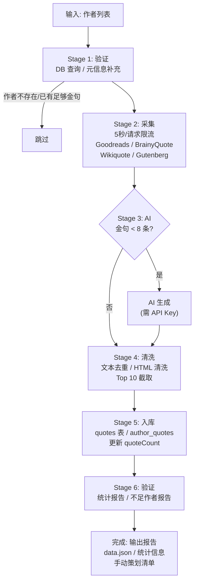

# P002: 金句数据生成流水线

> 从公开渠道采集和生成作者金句数据的完整流水线

---

## 一、流水线概述

### 1.1 基本信息

| 属性 | 值 |
|------|-----|
| 流水线编号 | P002 |
| 名称 | 金句数据生成 |
| 脚本文件 | `scripts/agora-import/generate-quotes.ts` |
| 输入来源 | 作者列表 (TOP_100_AUTHORS) |
| 输出目标 | quotes / author_quotes 表 |
| 数据来源 | Goodreads, BrainyQuote, Wikiquote, Gutenberg, AI |
| **目标环境** | **production** |
| 执行模式 | 手动触发 |

### 1.2 使用场景

| 场景 | 描述 |
|------|------|
| 新作者上线 | 为新导入的作者生成金句 |
| 金句扩充 | 扩充现有作者的金句数量 |
| 质量提升 | 替换低质量金句 |
| 版本发布 | 发布前补充金句数据 |

---

## 二、数据来源优先级

| 优先级 | 来源 | 质量 | 可用性 | 说明 |
|--------|------|------|--------|------|
| 1 | Goodreads | 最高 | 中 | 社区投票，质量最高 |
| 2 | BrainyQuote | 高 | 高 | 精选金句库 |
| 3 | Wikiquote | 高 | 高 | 维基风格编辑 |
| 4 | Gutenberg | 中 | 中 | 从原著提取 |
| 5 | AI 生成 | 中 | 高 | 最后手段，需验证 |

> 目标: 每位作者 8-10 条金句

| 来源 | URL 模式 | 提取方式 | 每作者限制 |
|------|----------|----------|:----------:|
| Goodreads | `goodreads.com/author/quotes/{id}` | HTML 解析 | 15 条 |
| BrainyQuote | `brainyquote.com/authors/{slug}-quotes` | HTML 解析 | 12 条 |
| Wikiquote | `en.wikiquote.org/wiki/{name}` | API | 10 条 |
| Gutenberg | `gutenberg.org/ebooks/author/{id}` | AI 提取 | 8 条 |
| AI 生成 | Claude API | Prompt 生成 | 10 条 |

---

## 三、阶段定义

### 3.1 Stage 1: 作者验证

| 检查项 | 说明 | 处理方式 |
|--------|------|----------|
| 作者存在性 | 检查 authors 表是否存在 | 不存在则跳过 |
| 现有金句数 | 检查已有金句数量 | >= 8 条则跳过 |
| 作者元信息 | bio / era / nationality | 从 OpenLibrary / Wikipedia 补充 |

### 3.2 Stage 2: 公开渠道采集

| 来源 | 解析规则 | 金句要求 |
|------|----------|----------|
| Goodreads | `
` | 20-500 字符 |
| BrainyQuote | `<a title="view quote">` | 20-500 字符 |
| Wikiquote | `<li>` 元素内文本 | 20-500 字符，排除导航 |
| Gutenberg | AI 提取 | 20-150 词 |

### 3.3 Stage 3: AI 生成补充

| 项目 | 说明 |
|------|------|
| 触发条件 | 作者金句 < 8 条 且 ANTHROPIC_API_KEY 已配置 |
| 提取模型 | claude-3-5-haiku-20241022 |
| 生成模型 | claude-3-5-sonnet-20241022 |
| 输出 | 8-10 条 AI 生成金句，标记 source: 'ai' |

**Prompt 要求:**

| 要求 | 说明 |
|------|------|
| 主题风格 | 反映作者已知主题、风格和世界观 |
| 时代背景 | 符合其时代和文化背景 |
| 内容质量 | 深刻、难忘、有代表性 |
| 长度限制 | 每条 20-150 词 |
| 来源归属 | 包含书名或 "Essays/Letters" |

**成本估算:**

| 项目 | 费用 |
|------|------|
| 单作者 | ~$0.003 |
| 100 作者 | ~$0.30 |
| AI 触发率 | 约 30% (大部分从公开渠道获取) |

### 3.4 Stage 4: 去重与清洗

**去重规则:**

| 规则 | 说明 |
|------|------|
| 完全去重 | 完全相同文本去重 |
| 相似度去重 | 相似度 > 90% 去重 (Levenshtein) |
| 版本选择 | 同作者同书籍保留最长版本 |

**清洗规则:**

| 规则 | 说明 |
|------|------|
| HTML 实体解码 | `&quot;` `&amp;` `&#39;` 等 |
| 空白处理 | 移除多余空白 |
| 引用标记 | 移除 [1] [2] 等 |
| 引号格式 | 统一引号格式 |

**质量过滤:**

| 过滤项 | 阈值 |
|--------|------|
| 长度 | 20-500 字符 |
| 导航文本 | 排除 wikiquote, wikipedia 等 |
| 纯对话 | 排除 (除非特别有意义) |

**排序优先级:** Goodreads > BrainyQuote > Wikiquote > Gutenberg > AI，每作者取 Top 10

### 3.5 Stage 5: 数据入库

**目标表: quotes**

| 字段 | 说明 |
|------|------|
| text | 金句内容 |
| textEn | 英文版本 (如有翻译) |
| source | 来源类型 (BOOK / AUTHOR / AI) |
| bookId | 关联书籍 ID |
| bookTitle | 书籍名称 |
| author | 作者名 |
| authorId | 作者 ID |
| chapter | 章节 (可选) |
| tags[] | 标签 |
| isActive | 是否启用 |

**目标表: author_quotes (作者专属金句)**

| 字段 | 说明 |
|------|------|
| authorId | 作者 ID |
| text | 金句内容 |
| source | 出处 |
| tags[] | 标签 |
| likeCount | 点赞数 |
| isActive | 是否启用 |

**入库流程:** 重复检查(text去重) -> 关联作者(authorId/bookId) -> 批量写入(upsert/批量100条) -> 更新统计(作者金句数/quoteCount)

| 字段映射 | 来源 | 说明 |
|----------|------|------|
| text | 采集/生成 | 金句内容 |
| source | 采集来源 | GOODREADS/BRAINYQUOTE/WIKIQUOTE/GUTENBERG/AI |
| bookTitle | Goodreads/手动 | 关联书籍 |
| author | 作者列表 | 作者名 |
| authorId | DB 查询 | 关联作者记录 |
| tags | AI 分析/手动 | 主题标签 |

### 3.6 Stage 6: 质量验证

**验证检查项:**

| 类型 | 检查项 |
|------|--------|
| 数量验证 | 每作者 >= 8 条金句、总金句数符合预期、AI 生成比例 < 50% |
| 关联验证 | authorId 正确关联、bookId 关联有效、无孤立金句 |
| 内容验证 | 无空内容、无重复内容、长度符合要求、标签非空 |

**统计报告示例:**

| 指标 | 值 |
|------|-----|
| 总处理作者 | 100 |
| 成功 (>= 8 条) | 85 (85.0%) |
| 部分成功 (< 8 条) | 10 (10.0%) |
| 失败 | 5 (5.0%) |
| 总金句数 | 920 |
| 平均每作者 | 9.2 |

**来源分布:**

| 来源 | 数量 | 占比 |
|------|------|------|
| Goodreads | 350 | 38.0% |
| BrainyQuote | 280 | 30.4% |
| Wikiquote | 150 | 16.3% |
| Gutenberg | 40 | 4.3% |
| AI | 100 | 10.9% |

---

## 四、执行流程

### 4.1 完整执行流程图

### 4.2 执行参数

| 参数 | 必需 | 说明 |
|------|:----:|------|
| --test | 否 | 测试模式 (5 作者) |
| --start=N | 否 | 从第 N 位作者开始 |
| --dry-run | 否 | 仅采集不入库 |

### 4.3 环境变量

| 变量 | 必需 | 说明 |
|------|:----:|------|
| `DATABASE_URL` | 是 | Production 数据库连接 |
| `ANTHROPIC_API_KEY` | 否 | AI 生成 (可选) |

---

## 五、错误处理

### 5.1 错误分类

| 类型 | 说明 | 处理 |
|------|------|------|
| 致命错误 (Fatal) | 数据库连接失败、作者列表为空、输出目录不可写 | 终止流水线 |
| 可恢复错误 (Recoverable) | 单个公开渠道请求失败、AI 生成失败、HTML 解析失败、单作者入库失败 | 跳过作者继续 |
| 警告 (Warning) | 金句数量不足 8 条、无法提取书籍来源、标签生成失败 | 记录日志继续 |

### 5.2 限流与重试

| 操作 | 限流 | 重试 | 失败处理 |
|------|------|------|----------|
| Goodreads 请求 | 5秒/请求 | 1 次 | 跳过此来源 |
| BrainyQuote 请求 | 5秒/请求 | 1 次 | 跳过此来源 |
| Wikiquote API | 2秒/请求 | 2 次 | 跳过此来源 |
| AI 生成 | 无 | 1 次 | 记录到不足清单 |
| 数据库写入 | 无 | 3 次 | 记录错误 |

---

## 六、运行环境

| 项目 | 说明 |
|------|------|
| 运行位置 | Digital Ocean Droplet (mcloud88.com) |
| 任务管理 | PM2 |
| 日志 | PM2 logs |

### 6.1 执行时间预估

| 作者数量 | 预估时间 | 主要耗时 |
|----------|----------|----------|
| 5 (测试) | 3-5 分钟 | 公开渠道限流 |
| 50 | 30-45 分钟 | 公开渠道限流 |
| 100 | 1-1.5 小时 | 公开渠道限流 |
| 100 + AI | 1.5-2 小时 | AI 调用 |

---

## 七、输出文件

| 文件 | 路径 | 内容 |
|------|------|------|
| data.json | `scripts/agora-import/data.json` | 作者和金句数据 |
| MISSING_QUOTES.md | `scripts/agora-import/MISSING_QUOTES.md` | 需手动策划的作者 |
| 执行日志 | 控制台输出 | 详细执行记录 |

---

## 八、版本历史

| 版本 | 日期 | 变更说明 |
|------|------|----------|
| 1.0 | 2024-12-31 | 初始设计 |
| 1.1 | 2026-02-07 | 更新为 Production-only (架构简化后 Debug/Staging 已取消) |
