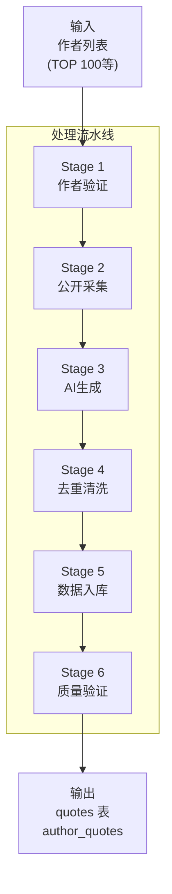
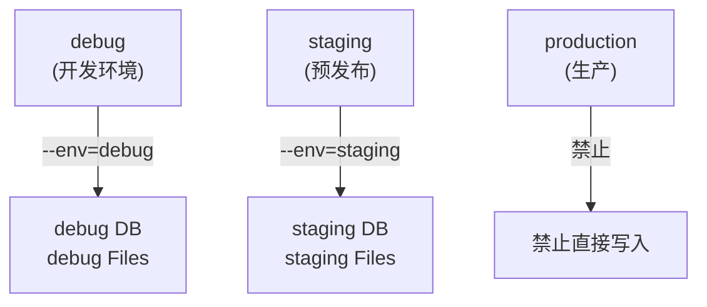
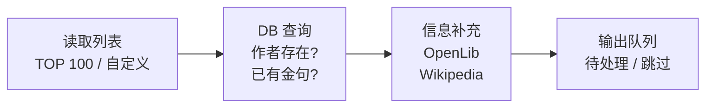
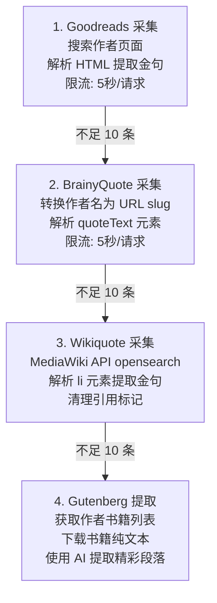
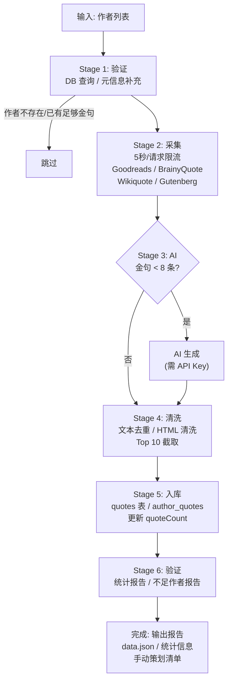
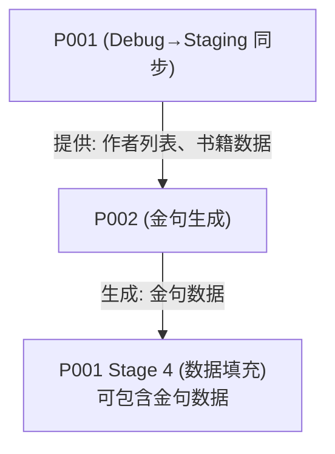

# P002: 金句数据生成流水线

> 从公开渠道采集和生成作者金句数据的完整流水线

---

## 一、流水线概述



### 1.1 基本信息

| 属性 | 值 |
|------|-----|
| 流水线编号 | P002 |
| 名称 | 金句数据生成 |
| 脚本文件 | `scripts/agora-import/generate-quotes.ts` |
| 输入来源 | 作者列表 (TOP_100_AUTHORS) |
| 输出目标 | quotes / author_quotes 表 |
| 数据来源 | Goodreads, BrainyQuote, Wikiquote, Gutenberg, AI |
| **目标环境** | **debug / staging (必须指定)** |
| 执行模式 | 手动触发 |

### 1.2 使用场景

| 场景 | 描述 |
|------|------|
| 新作者上线 | 为新导入的作者生成金句 |
| 金句扩充 | 扩充现有作者的金句数量 |
| 质量提升 | 替换低质量金句 |
| 版本发布 | 发布前补充金句数据 |

### 1.3 目标环境配置



> production 环境禁止直接执行此流水线，必须通过 P001 同步

| 环境 | 用途 | DATABASE_URL | 说明 |
|------|------|--------------|------|
| **debug** | 开发测试 | `DATABASE_DEBUG_URL` | 新功能开发、数据验证 |
| **staging** | 预发布验证 | `DATABASE_STAGING_URL` | 发布前内容准备 |
| production | ❌ 禁止 | - | 必须通过 P001 同步 |

---

## 二、数据来源优先级

```
┌─────────────────────────────────────────────────────────────────────────────────────┐
│                           数据来源优先级                                              │
├─────────────────────────────────────────────────────────────────────────────────────┤
│                                                                                       │
│   优先级    来源           质量      可用性     说明                                  │
│   ───────────────────────────────────────────────────────────────────────────────   │
│                                                                                       │
│      1      Goodreads       ⭐⭐⭐⭐⭐    中       社区投票，质量最高                   │
│             ▼                                                                         │
│      2      BrainyQuote     ⭐⭐⭐⭐     高       精选金句库                           │
│             ▼                                                                         │
│      3      Wikiquote       ⭐⭐⭐⭐     高       维基风格编辑                         │
│             ▼                                                                         │
│      4      Gutenberg       ⭐⭐⭐       中       从原著提取                           │
│             ▼                                                                         │
│      5      AI 生成         ⭐⭐⭐       高       最后手段，需验证                     │
│                                                                                       │
│   目标: 每位作者 8-10 条金句                                                          │
│                                                                                       │
└─────────────────────────────────────────────────────────────────────────────────────┘
```

| 来源 | URL 模式 | 提取方式 | 每作者限制 |
|------|----------|----------|:----------:|
| Goodreads | `goodreads.com/author/quotes/{id}` | HTML 解析 | 15 条 |
| BrainyQuote | `brainyquote.com/authors/{slug}-quotes` | HTML 解析 | 12 条 |
| Wikiquote | `en.wikiquote.org/wiki/{name}` | API | 10 条 |
| Gutenberg | `gutenberg.org/ebooks/author/{id}` | AI 提取 | 8 条 |
| AI 生成 | Claude API | Prompt 生成 | 10 条 |

---

## 三、阶段定义

### 3.1 Stage 1: 作者验证



> 输出: authorsToProcess[] / authorsSkipped[] / authorsMeta{}

| 检查项 | 说明 | 处理方式 |
|--------|------|----------|
| 作者存在性 | 检查 authors 表是否存在 | 不存在则跳过 |
| 现有金句数 | 检查已有金句数量 | ≥8 条则跳过 |
| 作者元信息 | bio / era / nationality | 从 OpenLibrary / Wikipedia 补充 |

### 3.2 Stage 2: 公开渠道采集



| 来源 | 解析规则 | 金句要求 |
|------|----------|----------|
| Goodreads | `<div class="quoteText">` | 20-500 字符 |
| BrainyQuote | `<a title="view quote">` | 20-500 字符 |
| Wikiquote | `<li>` 元素内文本 | 20-500 字符，排除导航 |
| Gutenberg | AI 提取 | 20-150 词 |

### 3.3 Stage 3: AI 生成补充

```
┌─────────────────────────────────────────────────────────────────────────────────────┐
│                           Stage 3: AI 生成补充                                        │
├─────────────────────────────────────────────────────────────────────────────────────┤
│                                                                                       │
│   触发条件: 作者金句 < 8 条 且 ANTHROPIC_API_KEY 已配置                               │
│                                                                                       │
│   ┌─────────────────────────────────────────────────────────────────────────────┐   │
│   │                         AI 生成流程                                          │   │
│   ├─────────────────────────────────────────────────────────────────────────────┤   │
│   │                                                                               │   │
│   │   输入:                                                                       │   │
│   │   • 作者姓名                                                                  │   │
│   │   • 作者简介 (bio)                                                           │   │
│   │   • 时代背景 (era)                                                           │   │
│   │                                                                               │   │
│   │   Prompt 要求:                                                                │   │
│   │   • 反映作者已知主题、风格和世界观                                            │   │
│   │   • 符合其时代和文化背景                                                      │   │
│   │   • 深刻、难忘、有代表性                                                      │   │
│   │   • 每条 20-150 词                                                           │   │
│   │   • 包含来源归属 (书名或 "Essays/Letters")                                   │   │
│   │                                                                               │   │
│   │   模型:                                                                       │   │
│   │   • 提取: claude-3-5-haiku-20241022                                          │   │
│   │   • 生成: claude-3-5-sonnet-20241022                                         │   │
│   │                                                                               │   │
│   │   输出:                                                                       │   │
│   │   • 8-10 条 AI 生成金句                                                      │   │
│   │   • 标记 source: 'ai'                                                        │   │
│   │                                                                               │   │
│   └─────────────────────────────────────────────────────────────────────────────┘   │
│                                                                                       │
│   成本估算:                                                                           │
│   ┌─────────────────────────────────────────────────────────────────────────────┐   │
│   │  • 单作者: ~$0.003                                                           │   │
│   │  • 100 作者: ~$0.30                                                          │   │
│   │  • AI 触发率: 约 30% (大部分从公开渠道获取)                                   │   │
│   └─────────────────────────────────────────────────────────────────────────────┘   │
│                                                                                       │
└─────────────────────────────────────────────────────────────────────────────────────┘
```

### 3.4 Stage 4: 去重与清洗

```
┌─────────────────────────────────────────────────────────────────────────────────────┐
│                           Stage 4: 去重与清洗                                         │
├─────────────────────────────────────────────────────────────────────────────────────┤
│                                                                                       │
│   文本去重 ───► 内容清洗 ───► 质量过滤 ───► 排序截取                                │
│                                                                                       │
│   去重规则:                                                                           │
│   ┌─────────────────────────────────────────────────────────────────────────────┐   │
│   │  • 完全相同文本去重                                                          │   │
│   │  • 相似度 > 90% 去重 (Levenshtein)                                          │   │
│   │  • 同作者同书籍保留最长版本                                                   │   │
│   └─────────────────────────────────────────────────────────────────────────────┘   │
│                                                                                       │
│   清洗规则:                                                                           │
│   ┌─────────────────────────────────────────────────────────────────────────────┐   │
│   │  • HTML 实体解码 (&quot; &amp; &#39;)                                       │   │
│   │  • 移除多余空白                                                              │   │
│   │  • 移除引用标记 [1] [2]                                                      │   │
│   │  • 统一引号格式                                                              │   │
│   └─────────────────────────────────────────────────────────────────────────────┘   │
│                                                                                       │
│   质量过滤:                                                                           │
│   ┌─────────────────────────────────────────────────────────────────────────────┐   │
│   │  • 长度: 20-500 字符                                                         │   │
│   │  • 排除导航文本 (wikiquote, wikipedia 等)                                    │   │
│   │  • 排除纯对话 (除非特别有意义)                                               │   │
│   └─────────────────────────────────────────────────────────────────────────────┘   │
│                                                                                       │
│   排序优先级:                                                                         │
│   ┌─────────────────────────────────────────────────────────────────────────────┐   │
│   │  1. Goodreads (社区投票)                                                     │   │
│   │  2. BrainyQuote (精选)                                                       │   │
│   │  3. Wikiquote (维基)                                                         │   │
│   │  4. Gutenberg (原著)                                                         │   │
│   │  5. AI (生成)                                                                │   │
│   │                                                                               │   │
│   │  每作者取 Top 10                                                             │   │
│   └─────────────────────────────────────────────────────────────────────────────┘   │
│                                                                                       │
└─────────────────────────────────────────────────────────────────────────────────────┘
```

### 3.5 Stage 5: 数据入库

```
┌─────────────────────────────────────────────────────────────────────────────────────┐
│                           Stage 5: 数据入库                                          │
├─────────────────────────────────────────────────────────────────────────────────────┤
│                                                                                       │
│   ⚠️  环境验证 (入库前必须确认)                                                       │
│   ┌─────────────────────────────────────────────────────────────────────────────┐   │
│   │                                                                               │   │
│   │   --env=debug   → 连接 DEBUG 数据库 → 确认提示                               │   │
│   │   --env=staging → 连接 STAGING 数据库 → 确认提示                             │   │
│   │                                                                               │   │
│   │   ┌─────────────────────────────────────────────────────────────┐           │   │
│   │   │  🔔 即将写入 STAGING 环境数据库                              │           │   │
│   │   │     - 数据库: staging.readmigo.com                          │           │   │
│   │   │     - 作者数: 100                                           │           │   │
│   │   │     - 预计金句: 800-1000 条                                 │           │   │
│   │   │                                                              │           │   │
│   │   │  确认继续? [y/N]                                             │           │   │
│   │   └─────────────────────────────────────────────────────────────┘           │   │
│   │                                                                               │   │
│   └─────────────────────────────────────────────────────────────────────────────┘   │
│                                                                                       │
│   目标表:                                                                             │
│   ┌─────────────────────────────────────────────────────────────────────────────┐   │
│   │  quotes 表                                                                   │   │
│   ├─────────────────────────────────────────────────────────────────────────────┤   │
│   │  • text          - 金句内容                                                  │   │
│   │  • textEn        - 英文版本 (如有翻译)                                       │   │
│   │  • source        - 来源类型 (BOOK / AUTHOR / AI)                            │   │
│   │  • bookId        - 关联书籍 ID                                               │   │
│   │  • bookTitle     - 书籍名称                                                  │   │
│   │  • author        - 作者名                                                    │   │
│   │  • authorId      - 作者 ID                                                   │   │
│   │  • chapter       - 章节 (可选)                                               │   │
│   │  • tags[]        - 标签                                                      │   │
│   │  • isActive      - 是否启用                                                  │   │
│   └─────────────────────────────────────────────────────────────────────────────┘   │
│                                                                                       │
│   ┌─────────────────────────────────────────────────────────────────────────────┐   │
│   │  author_quotes 表 (作者专属金句)                                             │   │
│   ├─────────────────────────────────────────────────────────────────────────────┤   │
│   │  • authorId      - 作者 ID                                                   │   │
│   │  • text          - 金句内容                                                  │   │
│   │  • source        - 出处                                                      │   │
│   │  • tags[]        - 标签                                                      │   │
│   │  • likeCount     - 点赞数                                                    │   │
│   │  • isActive      - 是否启用                                                  │   │
│   └─────────────────────────────────────────────────────────────────────────────┘   │
│                                                                                       │
│   入库流程:                                                                           │
│   重复检查(text去重) ───► 关联作者(authorId/bookId) ───► 批量写入(upsert/批量100条) ───► 更新统计(作者金句数/quoteCount)  │
│                                                                                       │
└─────────────────────────────────────────────────────────────────────────────────────┘
```

| 字段映射 | 来源 | 说明 |
|----------|------|------|
| text | 采集/生成 | 金句内容 |
| source | 采集来源 | GOODREADS/BRAINYQUOTE/WIKIQUOTE/GUTENBERG/AI |
| bookTitle | Goodreads/手动 | 关联书籍 |
| author | 作者列表 | 作者名 |
| authorId | DB 查询 | 关联作者记录 |
| tags | AI 分析/手动 | 主题标签 |

### 3.6 Stage 6: 质量验证

```
┌─────────────────────────────────────────────────────────────────────────────────────┐
│                           Stage 6: 质量验证                                          │
├─────────────────────────────────────────────────────────────────────────────────────┤
│                                                                                       │
│   ┌─────────────────────────────────────────────────────────────────────────────┐   │
│   │                         验证检查项                                           │   │
│   ├─────────────────────────────────────────────────────────────────────────────┤   │
│   │                                                                               │   │
│   │   数量验证:                                                                   │   │
│   │   □ 每作者 ≥ 8 条金句                                                        │   │
│   │   □ 总金句数符合预期                                                         │   │
│   │   □ AI 生成比例 < 50%                                                        │   │
│   │                                                                               │   │
│   │   关联验证:                                                                   │   │
│   │   □ authorId 正确关联                                                        │   │
│   │   □ bookId 关联有效 (如有)                                                   │   │
│   │   □ 无孤立金句                                                               │   │
│   │                                                                               │   │
│   │   内容验证:                                                                   │   │
│   │   □ 无空内容                                                                 │   │
│   │   □ 无重复内容                                                               │   │
│   │   □ 长度符合要求                                                             │   │
│   │   □ 标签非空                                                                 │   │
│   │                                                                               │   │
│   └─────────────────────────────────────────────────────────────────────────────┘   │
│                                                                                       │
│   ┌─────────────────────────────────────────────────────────────────────────────┐   │
│   │                         统计报告                                             │   │
│   ├─────────────────────────────────────────────────────────────────────────────┤   │
│   │                                                                               │   │
│   │   Authors:                                                                    │   │
│   │     Total processed:        100                                              │   │
│   │     ✅ Success (≥8 quotes): 85 (85.0%)                                       │   │
│   │     ⚠️  Partial (<8 quotes): 10 (10.0%)                                      │   │
│   │     ❌ Failed:               5 (5.0%)                                        │   │
│   │                                                                               │   │
│   │   Quotes:                                                                     │   │
│   │     Total collected:        920                                              │   │
│   │     Average per author:     9.2                                              │   │
│   │                                                                               │   │
│   │   Sources:                                                                    │   │
│   │     - Goodreads:    350 (38.0%)                                              │   │
│   │     - BrainyQuote:  280 (30.4%)                                              │   │
│   │     - Wikiquote:    150 (16.3%)                                              │   │
│   │     - Gutenberg:    40 (4.3%)                                                │   │
│   │     - AI:           100 (10.9%)                                              │   │
│   │                                                                               │   │
│   └─────────────────────────────────────────────────────────────────────────────┘   │
│                                                                                       │
│   不足作者报告: MISSING_QUOTES.md                                                    │
│   ┌─────────────────────────────────────────────────────────────────────────────┐   │
│   │  列出金句不足的作者及手动策划链接                                             │   │
│   │  • Goodreads 搜索链接                                                        │   │
│   │  • BrainyQuote 搜索链接                                                      │   │
│   │  • Wikiquote 页面链接                                                        │   │
│   │  • Gutenberg 作者页面                                                        │   │
│   └─────────────────────────────────────────────────────────────────────────────┘   │
│                                                                                       │
└─────────────────────────────────────────────────────────────────────────────────────┘
```

---

## 四、执行流程

### 4.1 完整执行流程图



### 4.2 执行命令

```
┌─────────────────────────────────────────────────────────────────────────────────────┐
│                           命令格式                                                    │
├─────────────────────────────────────────────────────────────────────────────────────┤
│                                                                                       │
│   npx ts-node scripts/agora-import/generate-quotes.ts --env=<环境> [选项]            │
│                                                                                       │
│   必需参数:                                                                           │
│   ├── --env=debug      写入 debug 环境数据库                                         │
│   └── --env=staging    写入 staging 环境数据库                                       │
│                                                                                       │
│   可选参数:                                                                           │
│   ├── --test           测试模式 (5 作者)                                             │
│   ├── --start=N        从第 N 位作者开始                                             │
│   └── --dry-run        仅采集不入库                                                  │
│                                                                                       │
└─────────────────────────────────────────────────────────────────────────────────────┘
```

| 命令示例 | 说明 |
|----------|------|
| `npx ts-node generate-quotes.ts --env=debug` | Debug 环境完整执行 |
| `npx ts-node generate-quotes.ts --env=staging` | Staging 环境完整执行 |
| `npx ts-node generate-quotes.ts --env=debug --test` | Debug 测试模式 (5 作者) |
| `npx ts-node generate-quotes.ts --env=staging --start=50` | Staging 从第 50 位开始 |
| `npx ts-node generate-quotes.ts --env=debug --dry-run` | 仅采集，不写入数据库 |

⚠️ **注意**: `--env` 参数为必需，未指定环境时流水线将拒绝执行

### 4.3 环境变量

```
┌─────────────────────────────────────────────────────────────────────────────────────┐
│                           环境变量配置                                                │
├─────────────────────────────────────────────────────────────────────────────────────┤
│                                                                                       │
│   根据 --env 参数自动选择对应的数据库连接:                                            │
│                                                                                       │
│   --env=debug   →  使用 DATABASE_DEBUG_URL                                           │
│   --env=staging →  使用 DATABASE_STAGING_URL                                         │
│                                                                                       │
└─────────────────────────────────────────────────────────────────────────────────────┘
```

| 变量 | 必需 | 说明 |
|------|:----:|------|
| `DATABASE_DEBUG_URL` | ✅* | Debug 环境数据库连接 |
| `DATABASE_STAGING_URL` | ✅* | Staging 环境数据库连接 |
| `ANTHROPIC_API_KEY` | ⭕ | AI 生成 (可选) |

*根据 `--env` 参数，对应环境的 DATABASE_URL 为必需

---

## 五、错误处理

### 5.1 错误分类

```
┌─────────────────────────────────────────────────────────────────────────────────────┐
│                           错误处理策略                                                │
├─────────────────────────────────────────────────────────────────────────────────────┤
│                                                                                       │
│   ┌─────────────────────────────────────────────────────────────────────────────┐   │
│   │  致命错误 (Fatal) - 终止流水线                                                │   │
│   ├─────────────────────────────────────────────────────────────────────────────┤   │
│   │  • 数据库连接失败                                                             │   │
│   │  • 作者列表为空                                                               │   │
│   │  • 输出目录不可写                                                             │   │
│   └─────────────────────────────────────────────────────────────────────────────┘   │
│                                                                                       │
│   ┌─────────────────────────────────────────────────────────────────────────────┐   │
│   │  可恢复错误 (Recoverable) - 跳过作者继续                                      │   │
│   ├─────────────────────────────────────────────────────────────────────────────┤   │
│   │  • 单个公开渠道请求失败                                                       │   │
│   │  • AI 生成失败                                                                │   │
│   │  • HTML 解析失败                                                              │   │
│   │  • 单作者入库失败                                                             │   │
│   └─────────────────────────────────────────────────────────────────────────────┘   │
│                                                                                       │
│   ┌─────────────────────────────────────────────────────────────────────────────┐   │
│   │  警告 (Warning) - 记录日志继续                                                │   │
│   ├─────────────────────────────────────────────────────────────────────────────┤   │
│   │  • 金句数量不足 8 条                                                          │   │
│   │  • 无法提取书籍来源                                                           │   │
│   │  • 标签生成失败                                                               │   │
│   └─────────────────────────────────────────────────────────────────────────────┘   │
│                                                                                       │
└─────────────────────────────────────────────────────────────────────────────────────┘
```

### 5.2 限流与重试

| 操作 | 限流 | 重试 | 失败处理 |
|------|------|------|----------|
| Goodreads 请求 | 5秒/请求 | 1 次 | 跳过此来源 |
| BrainyQuote 请求 | 5秒/请求 | 1 次 | 跳过此来源 |
| Wikiquote API | 2秒/请求 | 2 次 | 跳过此来源 |
| AI 生成 | 无 | 1 次 | 记录到不足清单 |
| 数据库写入 | 无 | 3 次 | 记录错误 |

---

## 六、运行环境

### 6.1 Droplet 服务器执行

```
┌─────────────────────────────────────────────────────────────────────────────────────┐
│                           运行环境                                                   │
├─────────────────────────────────────────────────────────────────────────────────────┤
│                                                                                       │
│   运行位置: Digital Ocean Droplet                                                    │
│                                                                                       │
│   执行方式:                                                                           │
│   ┌─────────────────────────────────────────────────────────────────────────────┐   │
│   │  # 创建 tmux 会话 (建议用环境名命名)                                         │   │
│   │  tmux new -s quotes-staging                                                  │   │
│   │                                                                               │   │
│   │  # 切换到项目目录                                                             │   │
│   │  cd /path/to/readmigo/scripts/agora-import                                   │   │
│   │                                                                               │   │
│   │  # 执行流水线 (必须指定环境)                                                  │   │
│   │  npx ts-node generate-quotes.ts --env=staging 2>&1 | tee \                   │   │
│   │      quotes-staging-$(date +%Y%m%d).log                                      │   │
│   │                                                                               │   │
│   │  # 或 Debug 环境                                                             │   │
│   │  npx ts-node generate-quotes.ts --env=debug 2>&1 | tee \                     │   │
│   │      quotes-debug-$(date +%Y%m%d).log                                        │   │
│   │                                                                               │   │
│   │  # 断开会话 (流水线继续运行)                                                  │   │
│   │  Ctrl+B, D                                                                    │   │
│   │                                                                               │   │
│   │  # 重新连接                                                                   │   │
│   │  tmux attach -t quotes-staging                                                │   │
│   └─────────────────────────────────────────────────────────────────────────────┘   │
│                                                                                       │
└─────────────────────────────────────────────────────────────────────────────────────┘
```

### 6.2 执行时间预估

| 作者数量 | 预估时间 | 主要耗时 |
|----------|----------|----------|
| 5 (测试) | 3-5 分钟 | 公开渠道限流 |
| 50 | 30-45 分钟 | 公开渠道限流 |
| 100 | 1-1.5 小时 | 公开渠道限流 |
| 100 + AI | 1.5-2 小时 | AI 调用 |

---

## 七、输出文件

### 7.1 主要输出

| 文件 | 路径 | 内容 |
|------|------|------|
| data.json | `scripts/agora-import/data.json` | 作者和金句数据 |
| MISSING_QUOTES.md | `scripts/agora-import/MISSING_QUOTES.md` | 需手动策划的作者 |
| 执行日志 | 控制台输出 | 详细执行记录 |

### 7.2 data.json 结构

```
{
  "authors": [
    {
      "id": "author-jane-austen",
      "name": "Jane Austen",
      "bio": "...",
      "era": "1775-1817",
      "nationality": "British",
      "bookCount": 6
    }
  ],
  "quotes": [
    {
      "authorId": "author-jane-austen",
      "text": "It is a truth universally acknowledged...",
      "bookTitle": "Pride and Prejudice",
      "chapter": null,
      "tags": ["love", "marriage", "society"],
      "source": "goodreads"
    }
  ]
}
```

---

## 八、与 P001 的关系



> 典型工作流: 1. P001 导入新作者 -> 2. P002 为新作者生成金句 -> 3. P001 同步金句到 Staging

---

## 九、版本历史

| 版本 | 日期 | 变更说明 |
|------|------|----------|
| 1.0 | 2024-12-31 | 初始设计 |

