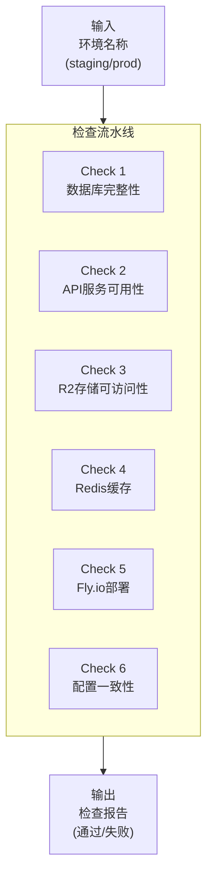
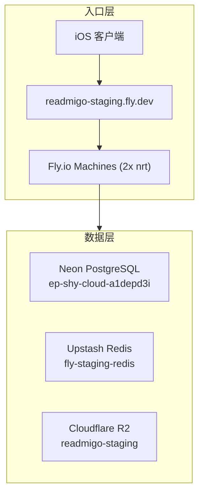

# P003: 环境完整性检查流水线

> Staging/Production 环境的全面健康检查与完整性验证

---

## 一、流水线概述



### 1.1 基本信息

| 属性 | 值 |
|------|-----|
| 流水线编号 | P003 |
| 名称 | 环境完整性检查 |
| 输入 | 环境名称 (staging / production) |
| 输出 | 检查报告 (JSON/终端输出) |
| 执行模式 | 手动触发 / 定时任务 |
| 预计耗时 | 1-3 分钟 |

### 1.2 使用场景

| 场景 | 描述 |
|------|------|
| 部署后验证 | 新版本部署后验证环境正常 |
| 问题排查 | iOS 客户端报错时快速定位问题 |
| 定期巡检 | 每日/每周自动检查环境健康 |
| 数据库切换后 | 切换 Neon 项目后验证连接正确 |

---

## 二、环境配置

### 2.1 Staging 环境



| 组件 | 地址/标识 |
|------|-----------|
| API 域名 | `readmigo-staging.fly.dev` |
| API 前缀 | `/api/v1` |
| 数据库 | `ep-shy-cloud-a1depd3i.ap-southeast-1.aws.neon.tech` |
| Redis | `fly-readmigo-staging-redis.upstash.io:6379` |
| R2 Bucket | `readmigo-staging` |
| R2 公开域名 | `pub-xxx.r2.dev` 或自定义域名 |

---

## 三、检查项详解

### 3.1 Check 1: 数据库完整性

```
┌─────────────────────────────────────────────────────────────────────────────────────┐
│                           Check 1: 数据库完整性                                        │
├─────────────────────────────────────────────────────────────────────────────────────┤
│                                                                                       │
│   ┌─────────────────────────────────────────────────────────────────────────────┐   │
│   │  1.1 连接检查                                                                 │   │
│   ├─────────────────────────────────────────────────────────────────────────────┤   │
│   │  • 数据库连接是否成功                                                         │   │
│   │  • 连接延迟 (应 < 200ms)                                                      │   │
│   │  • SSL/TLS 是否启用                                                           │   │
│   └─────────────────────────────────────────────────────────────────────────────┘   │
│                                                                                       │
│   ┌─────────────────────────────────────────────────────────────────────────────┐   │
│   │  1.2 核心表存在性                                                             │   │
│   ├─────────────────────────────────────────────────────────────────────────────┤   │
│   │  必须存在的表:                                                                 │   │
│   │  • books              - 书籍主表                                              │   │
│   │  • authors            - 作者表                                                │   │
│   │  • categories         - 分类表                                                │   │
│   │  • book_categories    - 书籍-分类关联表                                       │   │
│   │  • discover_tabs      - 发现页Tab配置表                                       │   │
│   │  • translations       - 翻译表                                                │   │
│   │  • chapters           - 章节表                                                │   │
│   │  • audiobooks         - 有声书表                                              │   │
│   │  • audiobook_chapters - 有声书章节表                                          │   │
│   │  • users              - 用户表                                                │   │
│   │  • user_books         - 用户书架表                                            │   │
│   │  • book_scores        - 书籍评分表                                            │   │
│   │  • book_lists         - 书单表                                                │   │
│   │  • agora_posts        - Agora动态表                                           │   │
│   └─────────────────────────────────────────────────────────────────────────────┘   │
│                                                                                       │
│   ┌─────────────────────────────────────────────────────────────────────────────┐   │
│   │  1.3 数据量检查                                                               │   │
│   ├─────────────────────────────────────────────────────────────────────────────┤   │
│   │                                                                               │   │
│   │  表名              │ 最低要求    │ 说明                                       │   │
│   │  ──────────────────┼─────────────┼──────────────────────────────────────────  │   │
│   │  books (ACTIVE)    │ > 100       │ 活跃书籍数量                               │   │
│   │  authors           │ > 50        │ 作者数量                                   │   │
│   │  categories        │ > 8         │ 分类数量 (至少8个root分类)                 │   │
│   │  discover_tabs     │ = 8         │ 发现页Tab (精确8个)                        │   │
│   │  book_categories   │ > 100       │ 书籍-分类关联                              │   │
│   │  translations      │ > 200       │ 翻译条目                                   │   │
│   │  book_scores       │ > 50        │ 评分记录                                   │   │
│   │                                                                               │   │
│   └─────────────────────────────────────────────────────────────────────────────┘   │
│                                                                                       │
│   ┌─────────────────────────────────────────────────────────────────────────────┐   │
│   │  1.4 数据关联完整性                                                           │   │
│   ├─────────────────────────────────────────────────────────────────────────────┤   │
│   │                                                                               │   │
│   │  检查项:                                                                       │   │
│   │  • 所有 books.authorId 都指向有效的 authors.id                               │   │
│   │  • 所有 book_categories.bookId 都指向有效的 books.id                         │   │
│   │  • 所有 book_categories.categoryId 都指向有效的 categories.id               │   │
│   │  • 所有 discover_tabs.categoryId 都指向有效的 categories.id                 │   │
│   │  • 所有 chapters.bookId 都指向有效的 books.id                                │   │
│   │                                                                               │   │
│   │  SQL 示例:                                                                     │   │
│   │  SELECT COUNT(*) FROM books b                                                 │   │
│   │  LEFT JOIN authors a ON b.author_id = a.id                                   │   │
│   │  WHERE b.author_id IS NOT NULL AND a.id IS NULL;                             │   │
│   │  -- 结果应为 0                                                                 │   │
│   │                                                                               │   │
│   └─────────────────────────────────────────────────────────────────────────────┘   │
│                                                                                       │
│   ┌─────────────────────────────────────────────────────────────────────────────┐   │
│   │  1.5 Discover Tab 分类书籍分布                                                │   │
│   ├─────────────────────────────────────────────────────────────────────────────┤   │
│   │                                                                               │   │
│   │  每个 Discover Tab 必须有书籍:                                                 │   │
│   │                                                                               │   │
│   │  Tab 名称              │ 最低书籍数                                           │   │
│   │  ──────────────────────┼─────────────                                         │   │
│   │  Classics              │ > 10                                                 │   │
│   │  Fiction               │ > 5                                                  │   │
│   │  Adventure & Fantasy   │ > 5                                                  │   │
│   │  Drama & Poetry        │ > 3                                                  │   │
│   │  Nonfiction            │ > 3                                                  │   │
│   │  Mystery & Thriller    │ > 3                                                  │   │
│   │  Children's & YA       │ > 3                                                  │   │
│   │  Romance & Family      │ > 1                                                  │   │
│   │                                                                               │   │
│   └─────────────────────────────────────────────────────────────────────────────┘   │
│                                                                                       │
└─────────────────────────────────────────────────────────────────────────────────────┘
```

**检查命令:**

```sql
-- 1.1 连接检查
SELECT NOW(), current_database(), version();

-- 1.2 核心表存在性
SELECT table_name FROM information_schema.tables
WHERE table_schema = 'public'
AND table_name IN ('books', 'authors', 'categories', 'discover_tabs', 'translations');

-- 1.3 数据量检查
SELECT
  (SELECT COUNT(*) FROM books WHERE status = 'ACTIVE') as active_books,
  (SELECT COUNT(*) FROM authors) as authors,
  (SELECT COUNT(*) FROM categories) as categories,
  (SELECT COUNT(*) FROM discover_tabs WHERE is_active = true) as discover_tabs,
  (SELECT COUNT(*) FROM book_categories) as book_category_links,
  (SELECT COUNT(*) FROM translations) as translations;

-- 1.4 孤儿记录检查
SELECT COUNT(*) as orphan_books FROM books b
LEFT JOIN authors a ON b.author_id = a.id
WHERE b.author_id IS NOT NULL AND a.id IS NULL;

-- 1.5 每个 Tab 的书籍数
SELECT dt.name, dt.category_id,
  (SELECT COUNT(*) FROM book_categories bc WHERE bc.category_id = dt.category_id) as book_count
FROM discover_tabs dt WHERE dt.is_active = true;
```

### 3.2 Check 2: API 服务可用性

```
┌─────────────────────────────────────────────────────────────────────────────────────┐
│                           Check 2: API 服务可用性                                      │
├─────────────────────────────────────────────────────────────────────────────────────┤
│                                                                                       │
│   ┌─────────────────────────────────────────────────────────────────────────────┐   │
│   │  2.1 健康检查端点                                                             │   │
│   ├─────────────────────────────────────────────────────────────────────────────┤   │
│   │                                                                               │   │
│   │  GET /api/v1/health                                                          │   │
│   │                                                                               │   │
│   │  期望响应:                                                                     │   │
│   │  {                                                                            │   │
│   │    "status": "ok",                                                           │   │
│   │    "database": { "status": "ok", "latency": <number> },                      │   │
│   │    "redis": { "status": "ok", "latency": <number> },                         │   │
│   │    "storage": { "status": "ok", "configured": true }                         │   │
│   │  }                                                                            │   │
│   │                                                                               │   │
│   │  检查项:                                                                       │   │
│   │  • HTTP 状态码 = 200                                                          │   │
│   │  • status = "ok"                                                              │   │
│   │  • database.status = "ok"                                                     │   │
│   │  • database.latency < 200ms                                                   │   │
│   │  • redis.status = "ok"                                                        │   │
│   │  • redis.latency < 50ms                                                       │   │
│   │                                                                               │   │
│   └─────────────────────────────────────────────────────────────────────────────┘   │
│                                                                                       │
│   ┌─────────────────────────────────────────────────────────────────────────────┐   │
│   │  2.2 Discover API                                                             │   │
│   ├─────────────────────────────────────────────────────────────────────────────┤   │
│   │                                                                               │   │
│   │  GET /api/v1/recommendation/discover/tabs                                    │   │
│   │  检查项:                                                                       │   │
│   │  • HTTP 200                                                                   │   │
│   │  • 返回 tabs 数组                                                             │   │
│   │  • tabs.length = 8                                                            │   │
│   │  • 每个 tab 有 id, name, categoryId                                           │   │
│   │                                                                               │   │
│   │  GET /api/v1/recommendation/discover?categoryId={id}                         │   │
│   │  检查项 (对每个 tab 的 categoryId):                                            │   │
│   │  • HTTP 200                                                                   │   │
│   │  • 返回 books 数组                                                            │   │
│   │  • total > 0                                                                  │   │
│   │  • books[0] 包含 id, title, author 等必要字段                                 │   │
│   │                                                                               │   │
│   └─────────────────────────────────────────────────────────────────────────────┘   │
│                                                                                       │
│   ┌─────────────────────────────────────────────────────────────────────────────┐   │
│   │  2.3 Books API                                                                │   │
│   ├─────────────────────────────────────────────────────────────────────────────┤   │
│   │                                                                               │   │
│   │  GET /api/v1/books?limit=10                                                  │   │
│   │  检查项:                                                                       │   │
│   │  • HTTP 200                                                                   │   │
│   │  • 返回书籍列表                                                               │   │
│   │  • 每本书有 id, title, coverUrl                                              │   │
│   │                                                                               │   │
│   │  GET /api/v1/books/{id}                                                      │   │
│   │  检查项:                                                                       │   │
│   │  • HTTP 200                                                                   │   │
│   │  • 返回完整书籍详情                                                           │   │
│   │  • 包含 chapters 数组 (如果已解析)                                            │   │
│   │                                                                               │   │
│   └─────────────────────────────────────────────────────────────────────────────┘   │
│                                                                                       │
│   ┌─────────────────────────────────────────────────────────────────────────────┐   │
│   │  2.4 Authors API                                                              │   │
│   ├─────────────────────────────────────────────────────────────────────────────┤   │
│   │                                                                               │   │
│   │  GET /api/v1/authors?limit=10                                                │   │
│   │  检查项:                                                                       │   │
│   │  • HTTP 200                                                                   │   │
│   │  • 返回作者列表                                                               │   │
│   │  • 每个作者有 id, name                                                        │   │
│   │                                                                               │   │
│   └─────────────────────────────────────────────────────────────────────────────┘   │
│                                                                                       │
│   ┌─────────────────────────────────────────────────────────────────────────────┐   │
│   │  2.5 Cache API                                                                │   │
│   ├─────────────────────────────────────────────────────────────────────────────┤   │
│   │                                                                               │   │
│   │  GET /api/v1/recommendation/cache/status                                     │   │
│   │  检查项:                                                                       │   │
│   │  • HTTP 200                                                                   │   │
│   │  • hasTabs = true                                                             │   │
│   │  • bookCacheCount >= 16 (8 tabs × 2 locales)                                 │   │
│   │  • tabsGeneratedAt 在 24 小时内                                               │   │
│   │                                                                               │   │
│   └─────────────────────────────────────────────────────────────────────────────┘   │
│                                                                                       │
│   ┌─────────────────────────────────────────────────────────────────────────────┐   │
│   │  2.6 响应时间要求                                                             │   │
│   ├─────────────────────────────────────────────────────────────────────────────┤   │
│   │                                                                               │   │
│   │  端点                           │ P95 响应时间                                │   │
│   │  ───────────────────────────────┼──────────────                              │   │
│   │  /health                        │ < 500ms                                    │   │
│   │  /recommendation/discover/tabs  │ < 200ms (缓存命中)                         │   │
│   │  /recommendation/discover       │ < 300ms (缓存命中)                         │   │
│   │  /books                         │ < 500ms                                    │   │
│   │  /books/{id}                    │ < 300ms                                    │   │
│   │                                                                               │   │
│   └─────────────────────────────────────────────────────────────────────────────┘   │
│                                                                                       │
└─────────────────────────────────────────────────────────────────────────────────────┘
```

**检查命令:**

```bash
# 2.1 健康检查
curl -s https://readmigo-staging.fly.dev/api/v1/health | jq .

# 2.2 Discover Tabs
curl -s https://readmigo-staging.fly.dev/api/v1/recommendation/discover/tabs | jq '.tabs | length'

# 2.2 每个 Tab 的书籍 (示例)
curl -s "https://readmigo-staging.fly.dev/api/v1/recommendation/discover?categoryId=xxx" | jq '.total'

# 2.5 缓存状态
curl -s https://readmigo-staging.fly.dev/api/v1/recommendation/cache/status | jq .
```

### 3.3 Check 3: R2 存储可访问性

```
┌─────────────────────────────────────────────────────────────────────────────────────┐
│                           Check 3: R2 存储可访问性                                     │
├─────────────────────────────────────────────────────────────────────────────────────┤
│                                                                                       │
│   ┌─────────────────────────────────────────────────────────────────────────────┐   │
│   │  3.1 Bucket 连接检查                                                          │   │
│   ├─────────────────────────────────────────────────────────────────────────────┤   │
│   │                                                                               │   │
│   │  使用 AWS CLI 或 wrangler 验证 Bucket 可访问:                                 │   │
│   │  • 列出 Bucket 内容                                                           │   │
│   │  • 检查 Bucket 是否存在                                                       │   │
│   │                                                                               │   │
│   └─────────────────────────────────────────────────────────────────────────────┘   │
│                                                                                       │
│   ┌─────────────────────────────────────────────────────────────────────────────┐   │
│   │  3.2 封面图片可访问性                                                         │   │
│   ├─────────────────────────────────────────────────────────────────────────────┤   │
│   │                                                                               │   │
│   │  抽样检查 (从 books 表随机选 5 本):                                           │   │
│   │  • HEAD 请求 coverUrl                                                         │   │
│   │  • 期望 HTTP 200                                                              │   │
│   │  • Content-Type 为 image/jpeg 或 image/png                                   │   │
│   │  • Content-Length > 0                                                         │   │
│   │                                                                               │   │
│   │  R2 路径格式: covers/{bookId}/cover.jpg                                       │   │
│   │                                                                               │   │
│   └─────────────────────────────────────────────────────────────────────────────┘   │
│                                                                                       │
│   ┌─────────────────────────────────────────────────────────────────────────────┐   │
│   │  3.3 EPUB 文件可访问性                                                        │   │
│   ├─────────────────────────────────────────────────────────────────────────────┤   │
│   │                                                                               │   │
│   │  抽样检查 (从 books 表随机选 5 本):                                           │   │
│   │  • HEAD 请求 epubUrl                                                          │   │
│   │  • 期望 HTTP 200                                                              │   │
│   │  • Content-Type 为 application/epub+zip                                      │   │
│   │  • Content-Length > 10KB                                                      │   │
│   │                                                                               │   │
│   │  R2 路径格式: epubs/{bookId}/{filename}.epub                                  │   │
│   │                                                                               │   │
│   └─────────────────────────────────────────────────────────────────────────────┘   │
│                                                                                       │
│   ┌─────────────────────────────────────────────────────────────────────────────┐   │
│   │  3.4 音频文件可访问性 (如有)                                                  │   │
│   ├─────────────────────────────────────────────────────────────────────────────┤   │
│   │                                                                               │   │
│   │  抽样检查 (从 audiobook_chapters 表随机选 5 个):                              │   │
│   │  • HEAD 请求 audioUrl                                                         │   │
│   │  • 期望 HTTP 200 或 206 (支持 Range)                                          │   │
│   │  • Content-Type 为 audio/mpeg                                                 │   │
│   │  • Content-Length > 100KB                                                     │   │
│   │                                                                               │   │
│   │  R2 路径格式: audio/{audiobookId}/{chapterNum}.mp3                            │   │
│   │                                                                               │   │
│   └─────────────────────────────────────────────────────────────────────────────┘   │
│                                                                                       │
│   ┌─────────────────────────────────────────────────────────────────────────────┐   │
│   │  3.5 作者头像可访问性                                                         │   │
│   ├─────────────────────────────────────────────────────────────────────────────┤   │
│   │                                                                               │   │
│   │  抽样检查 (从 authors 表选有 avatarUrl 的 5 个):                              │   │
│   │  • HEAD 请求 avatarUrl                                                        │   │
│   │  • 期望 HTTP 200                                                              │   │
│   │  • Content-Type 为 image/jpeg 或 image/png                                   │   │
│   │                                                                               │   │
│   │  R2 路径格式: authors/{authorId}/avatar.jpg                                   │   │
│   │                                                                               │   │
│   └─────────────────────────────────────────────────────────────────────────────┘   │
│                                                                                       │
└─────────────────────────────────────────────────────────────────────────────────────┘
```

**检查命令:**

```bash
# 获取书籍的 coverUrl 并检查
COVER_URL=$(psql $DATABASE_URL -t -c "SELECT cover_url FROM books WHERE cover_url IS NOT NULL LIMIT 1")
curl -sI "$COVER_URL" | head -5

# 获取 EPUB URL 并检查
EPUB_URL=$(psql $DATABASE_URL -t -c "SELECT epub_url FROM books WHERE epub_url IS NOT NULL LIMIT 1")
curl -sI "$EPUB_URL" | head -5

# 获取作者头像 URL 并检查
AVATAR_URL=$(psql $DATABASE_URL -t -c "SELECT avatar_url FROM authors WHERE avatar_url IS NOT NULL LIMIT 1")
curl -sI "$AVATAR_URL" | head -5
```

### 3.4 Check 4: Redis 缓存

```
┌─────────────────────────────────────────────────────────────────────────────────────┐
│                           Check 4: Redis 缓存                                         │
├─────────────────────────────────────────────────────────────────────────────────────┤
│                                                                                       │
│   ┌─────────────────────────────────────────────────────────────────────────────┐   │
│   │  4.1 连接检查                                                                 │   │
│   ├─────────────────────────────────────────────────────────────────────────────┤   │
│   │                                                                               │   │
│   │  • 通过 API /health 端点验证 redis.status = "ok"                             │   │
│   │  • redis.latency < 50ms                                                       │   │
│   │                                                                               │   │
│   └─────────────────────────────────────────────────────────────────────────────┘   │
│                                                                                       │
│   ┌─────────────────────────────────────────────────────────────────────────────┐   │
│   │  4.2 Discover 缓存存在性                                                      │   │
│   ├─────────────────────────────────────────────────────────────────────────────┤   │
│   │                                                                               │   │
│   │  必须存在的缓存键:                                                             │   │
│   │  • discover:v2:tabs:en                                                        │   │
│   │  • discover:v2:tabs:zh-Hans                                                   │   │
│   │  • discover:v2:books:{categoryId}:en (每个 tab)                              │   │
│   │  • discover:v2:books:{categoryId}:zh-Hans (每个 tab)                         │   │
│   │  • discover:v2:books:all:en                                                   │   │
│   │  • discover:v2:books:all:zh-Hans                                              │   │
│   │                                                                               │   │
│   │  总计: 2 tabs缓存 + 16 books缓存 = 18 个键                                    │   │
│   │                                                                               │   │
│   └─────────────────────────────────────────────────────────────────────────────┘   │
│                                                                                       │
│   ┌─────────────────────────────────────────────────────────────────────────────┐   │
│   │  4.3 缓存新鲜度                                                               │   │
│   ├─────────────────────────────────────────────────────────────────────────────┤   │
│   │                                                                               │   │
│   │  通过 /recommendation/cache/status 验证:                                      │   │
│   │  • tabsGeneratedAt 在最近 24 小时内                                           │   │
│   │  • bookCacheCount >= 16                                                       │   │
│   │                                                                               │   │
│   │  如果缓存过期或缺失:                                                           │   │
│   │  POST /api/v1/recommendation/cache/refresh                                    │   │
│   │                                                                               │   │
│   └─────────────────────────────────────────────────────────────────────────────┘   │
│                                                                                       │
└─────────────────────────────────────────────────────────────────────────────────────┘
```

**检查命令:**

```bash
# 通过 API 检查缓存状态
curl -s https://readmigo-staging.fly.dev/api/v1/recommendation/cache/status | jq .

# 如果需要刷新缓存
curl -X POST https://readmigo-staging.fly.dev/api/v1/recommendation/cache/refresh | jq .

# 通过 fly ssh 直接检查 Redis (需要在 Fly.io 容器内)
fly ssh console -a readmigo-staging
# 然后在容器内使用 redis-cli 或 node 连接
```

### 3.5 Check 5: Fly.io 部署状态

```
┌─────────────────────────────────────────────────────────────────────────────────────┐
│                           Check 5: Fly.io 部署状态                                    │
├─────────────────────────────────────────────────────────────────────────────────────┤
│                                                                                       │
│   ┌─────────────────────────────────────────────────────────────────────────────┐   │
│   │  5.1 应用状态                                                                 │   │
│   ├─────────────────────────────────────────────────────────────────────────────┤   │
│   │                                                                               │   │
│   │  fly status -a readmigo-staging                                              │   │
│   │                                                                               │   │
│   │  检查项:                                                                       │   │
│   │  • App 状态: deployed                                                         │   │
│   │  • Machines: 至少 1 台运行中                                                  │   │
│   │  • Region: nrt (Tokyo) 或其他配置区域                                         │   │
│   │                                                                               │   │
│   └─────────────────────────────────────────────────────────────────────────────┘   │
│                                                                                       │
│   ┌─────────────────────────────────────────────────────────────────────────────┐   │
│   │  5.2 机器健康检查                                                             │   │
│   ├─────────────────────────────────────────────────────────────────────────────┤   │
│   │                                                                               │   │
│   │  fly machines list -a readmigo-staging                                       │   │
│   │                                                                               │   │
│   │  检查项:                                                                       │   │
│   │  • 所有机器 STATE = started                                                   │   │
│   │  • Health checks = passing (TCP + HTTP)                                       │   │
│   │                                                                               │   │
│   │  常见问题:                                                                     │   │
│   │  • HTTP health check failing: 可能是 Redis 连接问题                           │   │
│   │  • Machine stopped: 可能需要 fly machine start                               │   │
│   │                                                                               │   │
│   └─────────────────────────────────────────────────────────────────────────────┘   │
│                                                                                       │
│   ┌─────────────────────────────────────────────────────────────────────────────┐   │
│   │  5.3 Secrets 配置验证                                                         │   │
│   ├─────────────────────────────────────────────────────────────────────────────┤   │
│   │                                                                               │   │
│   │  fly secrets list -a readmigo-staging                                        │   │
│   │                                                                               │   │
│   │  必须存在的 Secrets:                                                          │   │
│   │  • DATABASE_URL          - Neon PostgreSQL 连接串                            │   │
│   │  • REDIS_URL             - Upstash Redis 连接串                              │   │
│   │  • R2_ACCESS_KEY_ID      - Cloudflare R2 访问密钥                            │   │
│   │  • R2_SECRET_ACCESS_KEY  - Cloudflare R2 密钥                                │   │
│   │  • R2_BUCKET_NAME        - R2 Bucket 名称                                    │   │
│   │  • R2_ENDPOINT           - R2 端点 URL                                       │   │
│   │  • JWT_SECRET            - JWT 签名密钥                                      │   │
│   │                                                                               │   │
│   │  验证 DATABASE_URL 指向正确的数据库:                                          │   │
│   │  fly ssh console -a readmigo-staging                                         │   │
│   │  > echo $DATABASE_URL | grep "ep-shy-cloud"  # 应匹配当前数据库               │   │
│   │                                                                               │   │
│   └─────────────────────────────────────────────────────────────────────────────┘   │
│                                                                                       │
│   ┌─────────────────────────────────────────────────────────────────────────────┐   │
│   │  5.4 最近部署记录                                                             │   │
│   ├─────────────────────────────────────────────────────────────────────────────┤   │
│   │                                                                               │   │
│   │  fly releases -a readmigo-staging                                            │   │
│   │                                                                               │   │
│   │  检查项:                                                                       │   │
│   │  • 最近部署状态: complete                                                     │   │
│   │  • 部署时间: 确认是预期版本                                                   │   │
│   │                                                                               │   │
│   └─────────────────────────────────────────────────────────────────────────────┘   │
│                                                                                       │
└─────────────────────────────────────────────────────────────────────────────────────┘
```

**检查命令:**

```bash
# 5.1 应用状态
fly status -a readmigo-staging

# 5.2 机器列表
fly machines list -a readmigo-staging

# 5.3 Secrets 列表 (只显示名称，不显示值)
fly secrets list -a readmigo-staging

# 5.4 部署记录
fly releases -a readmigo-staging

# 进入容器检查环境变量
fly ssh console -a readmigo-staging
```

### 3.6 Check 6: 配置一致性

```
┌─────────────────────────────────────────────────────────────────────────────────────┐
│                           Check 6: 配置一致性                                         │
├─────────────────────────────────────────────────────────────────────────────────────┤
│                                                                                       │
│   ┌─────────────────────────────────────────────────────────────────────────────┐   │
│   │  6.1 多环境 DATABASE_URL 一致性                                               │   │
│   ├─────────────────────────────────────────────────────────────────────────────┤   │
│   │                                                                               │   │
│   │  所有以下位置的 DATABASE_URL 必须指向同一个数据库:                              │   │
│   │                                                                               │   │
│   │  位置                                    │ 检查命令                           │   │
│   │  ───────────────────────────────────────┼───────────────────────────────────  │   │
│   │  Fly.io secrets                         │ fly ssh + echo $DATABASE_URL       │   │
│   │  Droplet packages/database/.env         │ ssh + cat .env                     │   │
│   │  Droplet apps/backend/.env.staging      │ ssh + cat .env.staging             │   │
│   │                                                                               │   │
│   │  验证: 所有都应包含相同的 Neon host (如 ep-shy-cloud-xxx)                     │   │
│   │                                                                               │   │
│   └─────────────────────────────────────────────────────────────────────────────┘   │
│                                                                                       │
│   ┌─────────────────────────────────────────────────────────────────────────────┐   │
│   │  6.2 Neon 数据库项目确认                                                      │   │
│   ├─────────────────────────────────────────────────────────────────────────────┤   │
│   │                                                                               │   │
│   │  当前 Staging 使用的 Neon 项目:                                               │   │
│   │  • 项目名: readmigo-staging (或其他)                                          │   │
│   │  • Host: ep-shy-cloud-a1depd3i.ap-southeast-1.aws.neon.tech                  │   │
│   │  • 数据库: neondb                                                             │   │
│   │                                                                               │   │
│   │  ⚠️ 注意: 切换数据库后必须同时更新 Fly.io 和 Droplet 配置                     │   │
│   │                                                                               │   │
│   └─────────────────────────────────────────────────────────────────────────────┘   │
│                                                                                       │
│   ┌─────────────────────────────────────────────────────────────────────────────┐   │
│   │  6.3 iOS 客户端配置                                                           │   │
│   ├─────────────────────────────────────────────────────────────────────────────┤   │
│   │                                                                               │   │
│   │  检查 ios/Readmigo/Core/Config/Environment.swift:                            │   │
│   │  • staging.baseURL = "https://readmigo-staging.fly.dev/api/v1"              │   │
│   │                                                                               │   │
│   │  iOS 必须指向 Fly.io 而非 Droplet                                             │   │
│   │                                                                               │   │
│   └─────────────────────────────────────────────────────────────────────────────┘   │
│                                                                                       │
└─────────────────────────────────────────────────────────────────────────────────────┘
```

**检查命令:**

```bash
# 6.1 检查 Fly.io DATABASE_URL
fly ssh console -a readmigo-staging -C "echo \$DATABASE_URL | cut -d'@' -f2 | cut -d'/' -f1"

# 6.1 检查 Droplet DATABASE_URL
ssh readmigo@mcloud88.com "grep DATABASE_URL ~/projects/readmigo/packages/database/.env | cut -d'@' -f2 | cut -d'/' -f1"

# 6.3 检查 iOS 配置
grep -A2 "staging" ios/Readmigo/Core/Config/Environment.swift
```

---

## 四、一键检查脚本

### 4.1 完整检查脚本

```bash
#!/bin/bash
# scripts/check-staging-health.sh
# Staging 环境完整性检查脚本

set -e

# 颜色定义
RED='\033[0;31m'
GREEN='\033[0;32m'
YELLOW='\033[1;33m'
NC='\033[0m'

# 配置
STAGING_API="https://readmigo-staging.fly.dev/api/v1"
FLY_APP="readmigo-staging"

PASSED=0
FAILED=0
WARNINGS=0

# 辅助函数
check_pass() {
    echo -e "  ${GREEN}✓${NC} $1"
    ((PASSED++))
}

check_fail() {
    echo -e "  ${RED}✗${NC} $1"
    ((FAILED++))
}

check_warn() {
    echo -e "  ${YELLOW}⚠${NC} $1"
    ((WARNINGS++))
}

echo "================================================"
echo "P003: Staging 环境完整性检查"
echo "================================================"
echo "时间: $(date)"
echo ""

# ========================================
# Check 1: API 健康检查
# ========================================
echo -e "\n${YELLOW}[Check 1] API 健康检查${NC}"

HEALTH=$(curl -s --max-time 10 "$STAGING_API/health" 2>/dev/null || echo '{"error":"timeout"}')

if echo "$HEALTH" | jq -e '.status == "ok"' > /dev/null 2>&1; then
    check_pass "API 健康状态: ok"
else
    check_fail "API 健康检查失败"
fi

if echo "$HEALTH" | jq -e '.database.status == "ok"' > /dev/null 2>&1; then
    DB_LATENCY=$(echo "$HEALTH" | jq '.database.latency')
    check_pass "数据库连接: ok (${DB_LATENCY}ms)"
else
    check_fail "数据库连接失败"
fi

if echo "$HEALTH" | jq -e '.redis.status == "ok"' > /dev/null 2>&1; then
    REDIS_LATENCY=$(echo "$HEALTH" | jq '.redis.latency')
    check_pass "Redis 连接: ok (${REDIS_LATENCY}ms)"
else
    check_fail "Redis 连接失败"
fi

# ========================================
# Check 2: Discover Tabs
# ========================================
echo -e "\n${YELLOW}[Check 2] Discover Tabs${NC}"

TABS=$(curl -s --max-time 10 "$STAGING_API/recommendation/discover/tabs" 2>/dev/null)
TAB_COUNT=$(echo "$TABS" | jq '.tabs | length' 2>/dev/null || echo 0)

if [ "$TAB_COUNT" -eq 8 ]; then
    check_pass "Discover Tabs 数量: $TAB_COUNT"
else
    check_fail "Discover Tabs 数量: $TAB_COUNT (期望 8)"
fi

# 检查每个 Tab 的书籍数
echo "  检查各 Tab 书籍数..."
for row in $(echo "$TABS" | jq -r '.tabs[] | @base64'); do
    NAME=$(echo "$row" | base64 -d | jq -r '.name')
    CAT_ID=$(echo "$row" | base64 -d | jq -r '.categoryId')

    if [ "$CAT_ID" != "null" ]; then
        BOOKS=$(curl -s --max-time 10 "$STAGING_API/recommendation/discover?categoryId=$CAT_ID" 2>/dev/null)
        BOOK_COUNT=$(echo "$BOOKS" | jq '.total' 2>/dev/null || echo 0)

        if [ "$BOOK_COUNT" -gt 0 ]; then
            check_pass "$NAME: $BOOK_COUNT 本书"
        else
            check_fail "$NAME: 0 本书"
        fi
    fi
done

# ========================================
# Check 3: 缓存状态
# ========================================
echo -e "\n${YELLOW}[Check 3] 缓存状态${NC}"

CACHE=$(curl -s --max-time 10 "$STAGING_API/recommendation/cache/status" 2>/dev/null)

if echo "$CACHE" | jq -e '.hasTabs == true' > /dev/null 2>&1; then
    check_pass "Tabs 缓存存在"
else
    check_fail "Tabs 缓存缺失"
fi

CACHE_COUNT=$(echo "$CACHE" | jq '.bookCacheCount' 2>/dev/null || echo 0)
if [ "$CACHE_COUNT" -ge 16 ]; then
    check_pass "Books 缓存数量: $CACHE_COUNT"
else
    check_warn "Books 缓存数量: $CACHE_COUNT (期望 >= 16)"
fi

# ========================================
# Check 4: Fly.io 状态
# ========================================
echo -e "\n${YELLOW}[Check 4] Fly.io 部署状态${NC}"

if command -v fly &> /dev/null; then
    MACHINES=$(fly machines list -a $FLY_APP --json 2>/dev/null || echo '[]')
    RUNNING=$(echo "$MACHINES" | jq '[.[] | select(.state == "started")] | length')

    if [ "$RUNNING" -gt 0 ]; then
        check_pass "运行中的机器: $RUNNING"
    else
        check_fail "没有运行中的机器"
    fi
else
    check_warn "fly CLI 未安装，跳过 Fly.io 检查"
fi

# ========================================
# 结果汇总
# ========================================
echo ""
echo "================================================"
echo "检查结果汇总"
echo "================================================"
echo -e "  ${GREEN}通过: $PASSED${NC}"
echo -e "  ${RED}失败: $FAILED${NC}"
echo -e "  ${YELLOW}警告: $WARNINGS${NC}"
echo ""

if [ $FAILED -gt 0 ]; then
    echo -e "${RED}环境检查失败，请修复上述问题${NC}"
    exit 1
else
    echo -e "${GREEN}环境检查通过${NC}"
    exit 0
fi
```

### 4.2 使用方法

```bash
# 本地执行
bash scripts/check-staging-health.sh

# 或通过 npm
npm run check:staging
```

### 4.3 添加到 package.json

```json
{
  "scripts": {
    "check:staging": "bash scripts/check-staging-health.sh",
    "check:production": "STAGING_API=https://api.readmigo.app/api/v1 bash scripts/check-staging-health.sh"
  }
}
```

---

## 五、检查结果处理

### 5.1 常见问题与修复

```
┌─────────────────────────────────────────────────────────────────────────────────────┐
│                           常见问题诊断与修复                                           │
├─────────────────────────────────────────────────────────────────────────────────────┤
│                                                                                       │
│   问题 1: API 健康检查失败                                                            │
│   ┌─────────────────────────────────────────────────────────────────────────────┐   │
│   │   症状: /health 返回 5xx 或超时                                              │   │
│   │                                                                               │   │
│   │   排查步骤:                                                                    │   │
│   │   1. fly status -a readmigo-staging (检查机器状态)                           │   │
│   │   2. fly logs -a readmigo-staging (查看错误日志)                             │   │
│   │   3. fly ssh console (检查环境变量)                                          │   │
│   │                                                                               │   │
│   │   修复:                                                                        │   │
│   │   • 机器未运行: fly machine start <id>                                       │   │
│   │   • Redis 连接失败: 检查 REDIS_URL secret                                    │   │
│   │   • 数据库连接失败: 检查 DATABASE_URL secret                                 │   │
│   └─────────────────────────────────────────────────────────────────────────────┘   │
│                                                                                       │
│   问题 2: Discover Tabs 返回 0 或错误数量                                             │
│   ┌─────────────────────────────────────────────────────────────────────────────┐   │
│   │   症状: tabs.length != 8                                                      │   │
│   │                                                                               │   │
│   │   排查步骤:                                                                    │   │
│   │   1. 检查数据库 discover_tabs 表                                              │   │
│   │   2. 检查缓存是否过期                                                         │   │
│   │                                                                               │   │
│   │   修复:                                                                        │   │
│   │   • 缓存问题: POST /recommendation/cache/refresh                             │   │
│   │   • 数据库问题: 运行 sync-discover-tabs.ts                                   │   │
│   └─────────────────────────────────────────────────────────────────────────────┘   │
│                                                                                       │
│   问题 3: Tab 显示 0 本书                                                             │
│   ┌─────────────────────────────────────────────────────────────────────────────┐   │
│   │   症状: 某个或所有 Tab 返回 total: 0                                          │   │
│   │                                                                               │   │
│   │   排查步骤:                                                                    │   │
│   │   1. 检查 book_categories 表是否有关联记录                                   │   │
│   │   2. 检查 books 表是否有 ACTIVE 状态书籍                                     │   │
│   │   3. 检查分类 ID 是否正确                                                     │   │
│   │                                                                               │   │
│   │   修复:                                                                        │   │
│   │   • 运行 generate-categories-from-books.ts                                   │   │
│   │   • 刷新缓存                                                                  │   │
│   └─────────────────────────────────────────────────────────────────────────────┘   │
│                                                                                       │
│   问题 4: 缓存缺失或过期                                                              │
│   ┌─────────────────────────────────────────────────────────────────────────────┐   │
│   │   症状: hasTabs: false 或 bookCacheCount < 16                                │   │
│   │                                                                               │   │
│   │   修复:                                                                        │   │
│   │   curl -X POST $STAGING_API/recommendation/cache/refresh                     │   │
│   └─────────────────────────────────────────────────────────────────────────────┘   │
│                                                                                       │
│   问题 5: DATABASE_URL 不一致                                                         │
│   ┌─────────────────────────────────────────────────────────────────────────────┐   │
│   │   症状: Fly.io 和 Droplet 返回不同数据                                        │   │
│   │                                                                               │   │
│   │   排查:                                                                        │   │
│   │   比较两个环境的 DATABASE_URL host 部分                                       │   │
│   │                                                                               │   │
│   │   修复 (参考 P001 10.9 章节):                                                 │   │
│   │   1. fly secrets set DATABASE_URL=... -a readmigo-staging                    │   │
│   │   2. 更新 Droplet .env 文件                                                   │   │
│   │   3. fly apps restart readmigo-staging                                       │   │
│   │   4. pm2 restart readmigo-staging (Droplet)                                  │   │
│   │   5. 刷新缓存                                                                 │   │
│   └─────────────────────────────────────────────────────────────────────────────┘   │
│                                                                                       │
└─────────────────────────────────────────────────────────────────────────────────────┘
```

### 5.2 检查报告输出格式

```json
{
  "timestamp": "2026-01-02T15:30:00Z",
  "environment": "staging",
  "duration": "2.5s",
  "summary": {
    "passed": 15,
    "failed": 0,
    "warnings": 1
  },
  "checks": {
    "api_health": {
      "status": "pass",
      "details": {
        "database": { "status": "ok", "latency": 69 },
        "redis": { "status": "ok", "latency": 2 }
      }
    },
    "discover_tabs": {
      "status": "pass",
      "count": 8,
      "tabs": [
        { "name": "Classics", "bookCount": 100 },
        { "name": "Fiction", "bookCount": 45 }
      ]
    },
    "cache": {
      "status": "pass",
      "hasTabs": true,
      "bookCacheCount": 16
    },
    "flyio": {
      "status": "pass",
      "machines": 2,
      "running": 2
    }
  }
}
```

---

## 六、定时检查配置

### 6.1 GitHub Actions 定时任务

```yaml
# .github/workflows/staging-health-check.yml
name: Staging Health Check

on:
  schedule:
    - cron: '0 */6 * * *'  # 每6小时运行一次
  workflow_dispatch:  # 手动触发

jobs:
  health-check:
    runs-on: ubuntu-latest
    steps:
      - uses: actions/checkout@v4

      - name: Run health check
        run: bash scripts/check-staging-health.sh

      - name: Notify on failure
        if: failure()
        run: |
          # 发送 Slack/邮件通知
          echo "Health check failed!"
```

### 6.2 Droplet Cron 任务

```bash
# 添加到 crontab
# crontab -e

# 每 6 小时运行一次健康检查
0 */6 * * * cd ~/projects/readmigo && bash scripts/check-staging-health.sh >> /var/log/readmigo/health-check.log 2>&1
```

---

## 七、版本历史

| 版本 | 日期 | 变更说明 |
|------|------|----------|
| 1.0 | 2026-01-02 | 初始版本: 完整的 Staging 环境检查流水线 |

---

## 八、相关文档

| 文档 | 说明 |
|------|------|
| P001-debug-staging-sync.md | Debug → Staging 同步流水线 |
| P001 10.8 章节 | 数据库连接排查经验 |
| P001 10.9 章节 | Fly.io 环境同步经验 |
