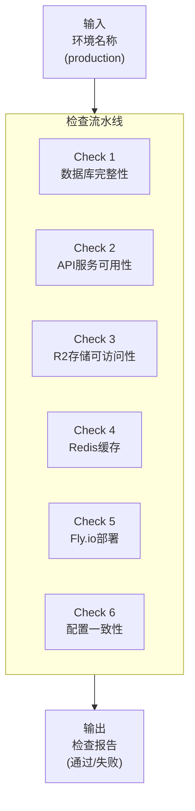
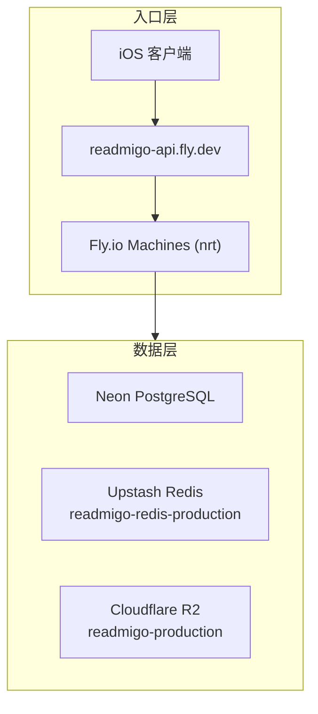

# P003: 环境完整性检查流水线

> Production 环境的全面健康检查与完整性验证

> **注意**: 原文档面向 Staging 环境，已更新为 Production-only（2026-01 架构简化后仅保留 Local + Production）。

---

## 一、流水线概述

### 1.1 基本信息

| 属性 | 值 |
|------|-----|
| 流水线编号 | P003 |
| 名称 | 环境完整性检查 |
| 输入 | 环境名称 (production) |
| 输出 | 检查报告 (JSON/终端输出) |
| 执行模式 | 手动触发 / 定时任务 |
| 预计耗时 | 1-3 分钟 |

### 1.2 使用场景

| 场景 | 描述 |
|------|------|
| 部署后验证 | 新版本部署后验证环境正常 |
| 问题排查 | iOS 客户端报错时快速定位问题 |
| 定期巡检 | 每日/每周自动检查环境健康 |
| 数据库切换后 | 切换 Neon 项目后验证连接正确 |

---

## 二、环境配置

### 2.1 Production 环境

| 组件 | 地址/标识 |
|------|-----------|
| API 域名 | `readmigo-api.fly.dev` |
| API 前缀 | `/api/v1` |
| Fly.io 应用 | `readmigo-api` |
| R2 Bucket | `readmigo-production` |
| R2 公开 CDN | `cdn.readmigo.app` |

---

## 三、检查项详解

### 3.1 Check 1: 数据库完整性

| 检查类别 | 检查项 | 说明 |
|----------|--------|------|
| 连接检查 | 数据库连接成功 | 连接延迟 < 200ms，SSL/TLS 启用 |
| 核心表存在性 | books, authors, categories, chapters, users 等 | 所有必要表存在 |
| 数据量检查 | books (ACTIVE) > 100, authors > 50, categories > 8 | 最低数据量保证 |
| 数据关联完整性 | 所有外键引用有效 | 无孤儿记录 |
| Discover Tab 分布 | 每个 Tab 至少有 1 本书 | 8 个 Tab 均有书籍 |

### 3.2 Check 2: API 服务可用性

| 端点 | 检查项 | P95 响应时间 |
|------|--------|-------------|
| GET /api/v1/health | status=ok, database.status=ok, redis.status=ok | < 500ms |
| GET /api/v1/recommendation/discover/tabs | tabs.length = 8 | < 200ms (缓存命中) |
| GET /api/v1/recommendation/discover?categoryId={id} | total > 0 | < 300ms (缓存命中) |
| GET /api/v1/books?limit=10 | 返回书籍列表，含 id, title, coverUrl | < 500ms |
| GET /api/v1/books/{id} | 返回完整书籍详情 | < 300ms |
| GET /api/v1/authors?limit=10 | 返回作者列表 | < 500ms |
| GET /api/v1/recommendation/cache/status | hasTabs=true, bookCacheCount>=16 | < 200ms |

### 3.3 Check 3: R2 存储可访问性

| 检查项 | 方法 | 期望结果 |
|--------|------|----------|
| Bucket 连接 | 列出 Bucket 内容 | Bucket 可访问 |
| 封面图片 | 抽样 HEAD 请求 coverUrl (5 本书) | HTTP 200, image/jpeg |
| EPUB 文件 | 抽样 HEAD 请求 epubUrl (5 本书) | HTTP 200, application/epub+zip, > 10KB |
| 音频文件 | 抽样 HEAD 请求 audioUrl (如有) | HTTP 200 或 206 |
| 作者头像 | 抽样 HEAD 请求 avatarUrl (5 个作者) | HTTP 200, image/jpeg |

### 3.4 Check 4: Redis 缓存

| 检查项 | 说明 |
|--------|------|
| 连接状态 | 通过 /health 端点验证 redis.status=ok, latency < 50ms |
| Discover 缓存 | discover:v2:tabs:en/zh-Hans, discover:v2:books:{categoryId}:en/zh-Hans 等 (约 18 个键) |
| 缓存新鲜度 | tabsGeneratedAt 在最近 24 小时内 |
| 缓存刷新 | 如过期: POST /api/v1/recommendation/cache/refresh |

### 3.5 Check 5: Fly.io 部署状态

| 检查项 | 说明 |
|--------|------|
| 应用状态 | `fly status -a readmigo-api`, App 状态 deployed |
| 机器健康 | 至少 1 台 STATE=started, Health checks passing |
| Secrets 配置 | DATABASE_URL, REDIS_URL, R2_ACCESS_KEY_ID, R2_SECRET_ACCESS_KEY, R2_BUCKET_NAME, JWT_SECRET |
| 最近部署 | `fly releases -a readmigo-api`, 最近部署 complete |

### 3.6 Check 6: 配置一致性

| 检查项 | 说明 |
|--------|------|
| DATABASE_URL 一致性 | Fly.io secrets 与 Droplet .env.production 指向同一个 Neon 数据库 |
| iOS 客户端配置 | production.baseURL = "https://readmigo-api.fly.dev/api/v1" |

---

## 四、常见问题与修复

| 问题 | 症状 | 排查/修复 |
|------|------|-----------|
| API 健康检查失败 | /health 返回 5xx 或超时 | `fly status/logs -a readmigo-api`, 检查 REDIS_URL / DATABASE_URL |
| Discover Tabs 数量错误 | tabs.length != 8 | 刷新缓存 POST /recommendation/cache/refresh, 或运行 sync-discover-tabs.ts |
| Tab 显示 0 本书 | 某 Tab 返回 total: 0 | 检查 book_categories 表, 运行 generate-categories-from-books.ts |
| 缓存缺失或过期 | hasTabs: false | POST /recommendation/cache/refresh |
| DATABASE_URL 不一致 | Fly.io 和 Droplet 返回不同数据 | fly secrets set DATABASE_URL=..., 更新 Droplet .env, 重启服务 |

---

## 五、版本历史

| 版本 | 日期 | 变更说明 |
|------|------|----------|
| 1.0 | 2026-01-02 | 初始版本: Staging 环境检查流水线 |
| 1.1 | 2026-02-07 | 更新为 Production-only (架构简化后 Staging 已取消) |

---

## 六、相关文档

| 文档 | 说明 |
|------|------|
| [pipeline-system.md](../pipeline-system.md) | Pipeline 系统总览 |
