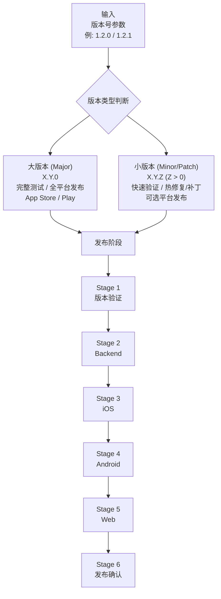
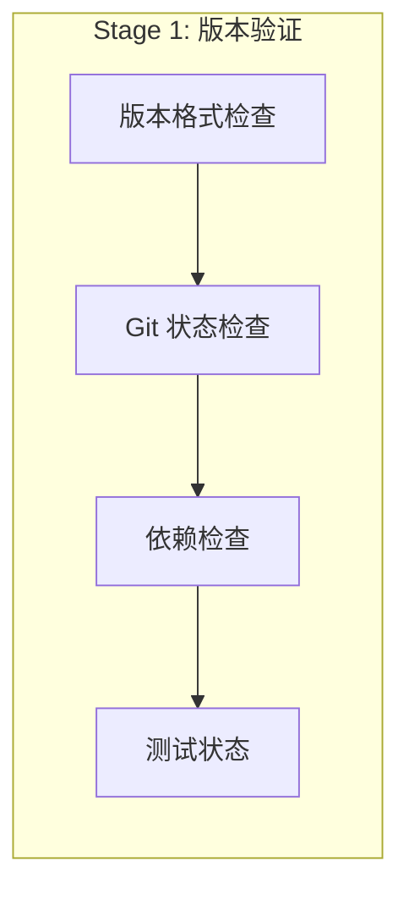
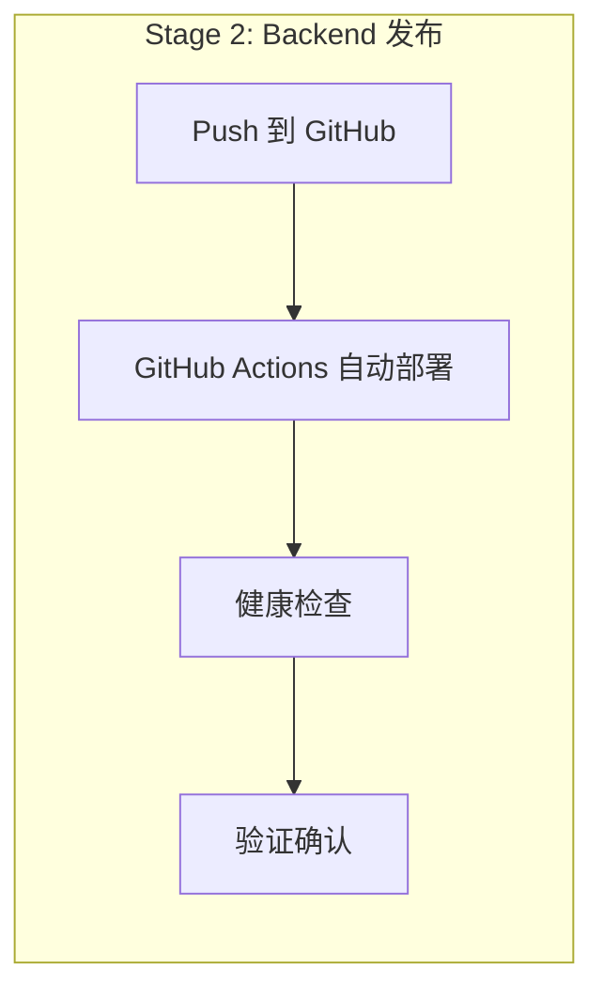
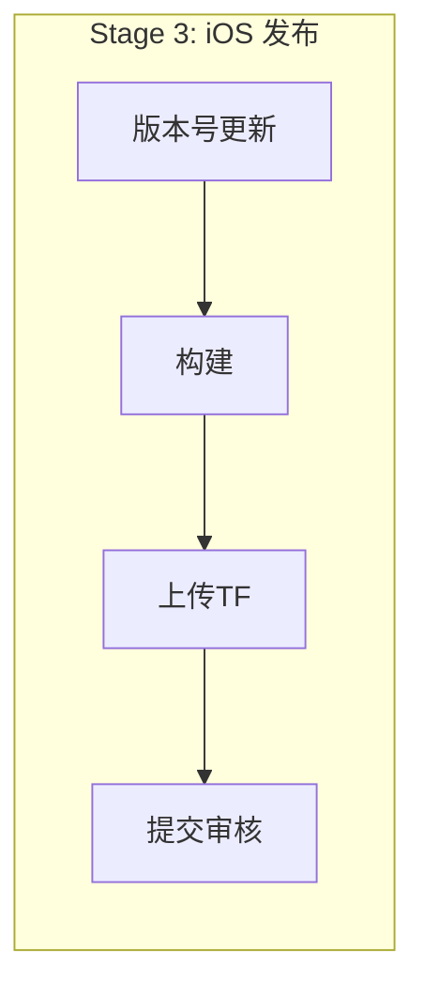
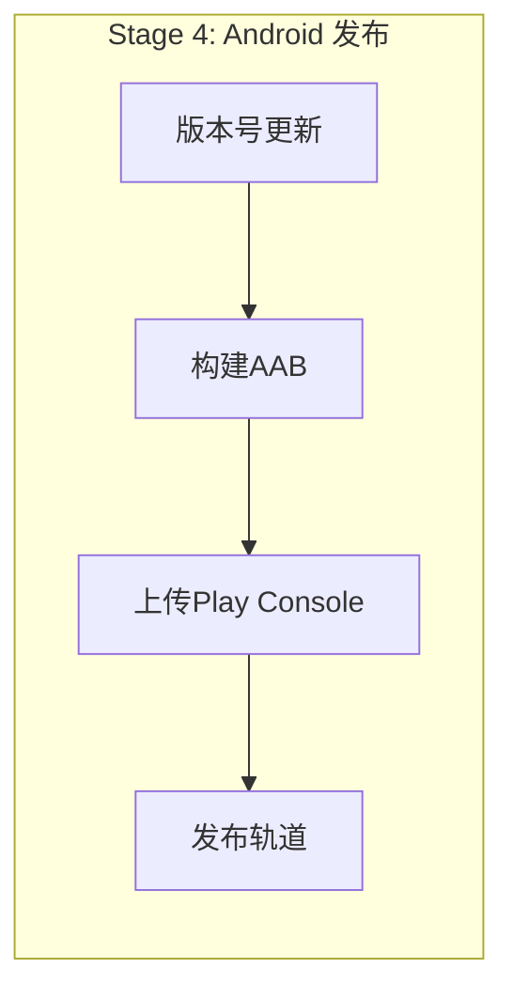
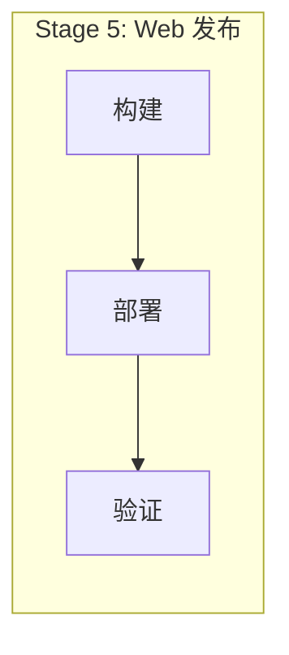
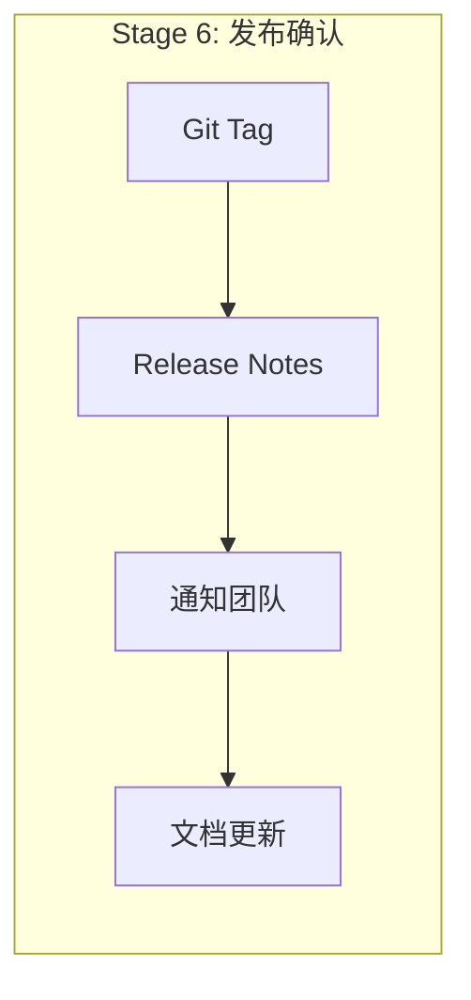

# P004: 全栈发版流水线

> 自动化全栈发版流程 | iOS + Android + Backend + Web

---

## 一、流水线概述

### 1.1 基本信息

| 属性 | 值 |
|------|-----|
| 流水线编号 | P004 |
| 名称 | 全栈发版流水线 |
| 输入 | 版本号 (SemVer 格式) |
| 输出 | 多平台发布 |
| 执行模式 | 手动触发 |

### 1.2 版本类型定义

| 类型 | 格式 | 说明 | 示例 |
|------|------|------|------|
| **大版本** | X.Y.0 | 新功能发布、完整测试 | 1.2.0, 2.0.0 |
| **小版本** | X.Y.Z (Z>0) | Bug修复、热修复、补丁 | 1.2.1, 1.2.2 |

---

## 二、触发命令

| 参数 | 必需 | 说明 | 示例 |
|------|:----:|------|------|
| 版本号 | 是 | SemVer 格式 | 1.2.0, 1.2.1 |
| 平台 | 否 | 指定平台 (默认全部) | ios, android, backend, web |

---

## 三、发版阶段定义

### Stage 1: 版本验证

| 操作 | 说明 |
|------|------|
| 检查 Git 状态 | 确保在 main 分支，拉取最新代码 |
| 版本格式 | 验证 SemVer 格式 |

### Stage 2: Backend 发布

| 操作 | 说明 |
|------|------|
| 部署方式 | 推送代码到 GitHub，GitHub Actions 自动执行 `fly deploy` |
| 部署配置 | 使用 `fly.toml` (唯一配置文件) |
| 健康检查 | `GET https://readmigo-api.fly.dev/api/v1/health` |

> **注意**: 项目仅有一个 `fly.toml` (app=readmigo-api)。不存在 fly.staging.toml 或 fly.production.toml。部署通过 GitHub Actions 自动完成，无需手动执行 fly deploy。

### Stage 3: iOS 发布

> 大版本: 需提交 App Store 审核 | 小版本: 可仅更新 TestFlight

### Stage 4: Android 发布

> 大版本: Production 轨道 | 小版本: Internal / Beta 轨道

### Stage 5: Web 发布 (如适用)

### Stage 6: 发布确认

---

## 四、大版本 vs 小版本差异

### 4.1 大版本发布 (X.Y.0)

| 阶段 | 操作 | 必需 |
|------|------|:----:|
| 版本验证 | 完整 Git 检查 | 是 |
| Backend | Push 触发自动部署 | 是 |
| iOS | TestFlight → App Store 审核 | 是 |
| Android | Internal → Production | 是 |
| Web | 完整部署 | 否 |
| 发布确认 | Tag + Release Notes | 是 |

### 4.2 小版本发布 (X.Y.Z, Z>0)

| 阶段 | 操作 | 必需 |
|------|------|:----:|
| 版本验证 | 快速检查 | 是 |
| Backend | Push 触发自动部署 | 否 |
| iOS | 仅 TestFlight (或跳过) | 否 |
| Android | Internal 轨道 (或跳过) | 否 |
| Web | 快速部署 | 否 |
| 发布确认 | 轻量 Tag | 否 |

---

## 五、回滚流程

### 5.1 Backend 回滚

| 操作 | 说明 |
|------|------|
| 查看部署历史 | `fly releases -a readmigo-api` |
| 回滚 | `fly deploy --image <previous-image>` |

### 5.2 移动端回滚

| 平台 | 方法 |
|------|------|
| iOS | 在 App Store Connect 中停止当前版本分发，恢复上一版本 |
| Android | 在 Play Console 中降低发布百分比或回滚 |

---

## 六、版本号管理

### 6.1 SemVer 规范

| 部分 | 说明 |
|------|------|
| MAJOR | 破坏性变更 |
| MINOR | 新功能 (向后兼容) |
| PATCH | 修复 bug (向后兼容) |

### 6.2 Build 号规范

| 平台 | Build 号 | 说明 |
|------|----------|------|
| iOS | CURRENT_PROJECT_VERSION | 每次上传递增 |
| Android | versionCode | 每次上传递增 |
| Backend | Git commit hash | 自动 |

---

## 七、版本快照记录

每次大版本发布后，必须在版本发布历史文档中记录功能快照。

### 7.1 快照记录内容

| 项目 | 必需 | 说明 |
|------|:----:|------|
| 版本信息 | 是 | version.json 内容快照 |
| 各端版本号 | 是 | iOS/Android/Backend/Web 版本 |
| 技术栈 | 是 | 主要依赖版本 |
| 功能模块列表 | 是 | 各端功能清单 |
| API 模块列表 | 是 | Backend 端点清单 |
| Git Tag | 是 | 对应的 Git Tag |

---

## 八、相关文档

| 文档 | 描述 |
|------|------|
| [pipeline-system.md](../pipeline-system.md) | 流水线系统总览 |
| [release-history.md](../../08-releases/history/release-history.md) | 版本发布历史与功能快照 |
