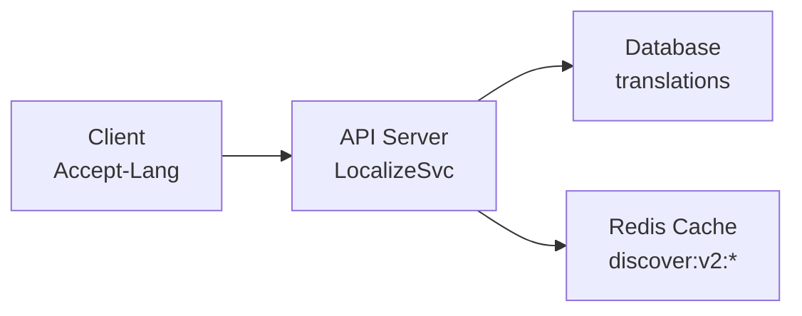

# P005: Staging Environment Data Cleanup Pipeline

## Document Information

| Field | Value |
|-------|-------|
| Version | 1.1 |
| Created | 2026-01-02 |
| Last Updated | 2026-01-02 |
| Owner | DevOps |
| Status | Active |

---

## 1. Overview

### 1.1 Purpose

This pipeline handles **translation quality issues** in the staging environment, specifically addressing:
- Locale mixing (zh-Hans requests returning zh-Hant/en content)
- Missing translations for books, authors, genres

### 1.2 Scope Limitations

```
┌─────────────────────────────────────────────────────────────┐
│                    IMPORTANT PRINCIPLES                      │
├─────────────────────────────────────────────────────────────┤
│  ✓ Focus ONLY on translations                               │
│  ✗ DO NOT add/delete data records                           │
│  ✗ DO NOT sync data from debug environment                  │
│  ✗ DO NOT modify discover tabs, categories, or books        │
│                                                             │
│  Staging environment is INDEPENDENT from debug.             │
│  All structural data (tabs, categories, books) are          │
│  computed from staging database itself.                     │
└─────────────────────────────────────────────────────────────┘
```

### 1.3 When to Use

- When locale-related bugs are reported (mixed language content)
- When translation coverage is insufficient
- Before major releases requiring staging validation

---

## 2. Staging Environment Reference

### 2.1 Infrastructure

```
┌─────────────────────────────────────────────────────────────┐
│                    Staging Environment                       │
├─────────────────────────────────────────────────────────────┤
│  API:      readmigo-staging.fly.dev                         │
│  Database: Neon PostgreSQL (ep-shy-cloud-a1depd3i)          │
│  Redis:    Upstash (readmigo-staging)                       │
│  R2:       Cloudflare (readmigo-staging)                    │
└─────────────────────────────────────────────────────────────┘
```

### 2.2 Localization Architecture



### 2.3 Translations Table Schema

```sql
CREATE TABLE translations (
  id            UUID PRIMARY KEY,
  entity_type   VARCHAR(50),    -- 'book', 'author', 'category', 'genre'
  entity_id     VARCHAR(255),   -- UUID or slug
  field_name    VARCHAR(50),    -- 'title', 'author', 'name', etc.
  locale        VARCHAR(10),    -- 'zh-Hans', 'zh-Hant'
  value         TEXT,           -- Translated content
  status        VARCHAR(20),    -- 'published', 'draft'
  created_at    TIMESTAMP,
  updated_at    TIMESTAMP
);
```

**Entity Types**:

| entityType | entityId | fieldName | Description |
|------------|----------|-----------|-------------|
| book | book.id (UUID) | title | Book title translation |
| book | book.id (UUID) | author | Author name in book |
| author | author.id (UUID) | name | Author entity name |
| category | category.id (UUID) | name | Category name |
| genre | genre slug (string) | name | Genre name |

### 2.4 Supported Locales

| Locale | Description | Cache Key Suffix |
|--------|-------------|------------------|
| en | English (default) | :en |
| zh-Hans | Simplified Chinese | :zh-Hans |
| zh-Hant | Traditional Chinese | :zh-Hant |

---

## 3. Diagnostic Procedures

### 3.1 Check Current Data State

#### 3.1.1 Translation Coverage

```bash
# Run from project root
npx tsx -e "
import { PrismaClient } from '@prisma/client';
const prisma = new PrismaClient();

async function checkTranslations() {
  const bookTranslations = await prisma.translation.groupBy({
    by: ['locale', 'fieldName'],
    where: { entityType: 'book', status: 'published' },
    _count: true
  });

  const authorTranslations = await prisma.translation.count({
    where: { entityType: 'author', status: 'published' }
  });

  const totalBooks = await prisma.book.count({ where: { status: 'ACTIVE' } });
  const booksWithCategories = await prisma.book.count({
    where: { status: 'ACTIVE', categories: { some: {} } }
  });

  console.log('=== Translation Coverage Report ===');
  console.log('Total active books:', totalBooks);
  console.log('Books with categories:', booksWithCategories);
  console.log('\\nBook translations:');
  console.table(bookTranslations);
  console.log('Author translations:', authorTranslations);

  await prisma.\$disconnect();
}
checkTranslations();
"
```

#### 3.1.2 Discover Tab Status

```bash
npx tsx -e "
import { PrismaClient } from '@prisma/client';
const prisma = new PrismaClient();

async function checkDiscoverTabs() {
  const tabs = await prisma.discoverTab.findMany({
    orderBy: { sortOrder: 'asc' }
  });

  console.log('=== Discover Tabs ===');
  console.log('Total tabs:', tabs.length);
  tabs.forEach(t => {
    console.log(\`  [\${t.isActive ? 'ACTIVE' : 'INACTIVE'}] \${t.name} (\${t.slug}) -> \${t.categoryId || 'ALL'}\`);
  });

  await prisma.\$disconnect();
}
checkDiscoverTabs();
"
```

#### 3.1.3 API Response Check

```bash
# Check tabs API (zh-Hans)
curl -s "https://readmigo-staging.fly.dev/api/v1/recommendation/discover/tabs" \
  -H "Accept-Language: zh-Hans" | jq '.tabs[] | {name, slug}'

# Check books API (zh-Hans)
curl -s "https://readmigo-staging.fly.dev/api/v1/recommendation/discover?pageSize=3" \
  -H "Accept-Language: zh-Hans" | jq '.books[] | {title: .book.title, author: .book.author}'
```

---

## 4. Common Issues and Fixes

### 4.1 Issue: Mixed Locale Content

**Symptom**: zh-Hans request returns English or zh-Hant content

**Cause**:
1. Missing translations in `translations` table
2. Cache contains stale data from wrong locale

**Diagnosis**:
```bash
# Check if book has translation
npx tsx -e "
import { PrismaClient } from '@prisma/client';
const prisma = new PrismaClient();

const bookId = '<problematic-book-id>';
const translations = await prisma.translation.findMany({
  where: { entityType: 'book', entityId: bookId }
});
console.log(translations);
await prisma.\$disconnect();
"
```

**Fix**:
```bash
# 1. Clear Redis cache
curl -X POST "https://readmigo-staging.fly.dev/api/v1/recommendation/cache/refresh"

# 2. If translations missing, generate them (see Section 5)
```

### 4.2 Issue: Empty Genre Display

**Symptom**: Books show empty genres

**Cause**: Genre translations missing in translations table

**Fix**: Generate genre translations (see Section 5.4)

---

## 5. Translation Generation Pipeline

### 5.1 Priority Order

| Priority | Entity Type | Scope | Reason |
|----------|-------------|-------|--------|
| 1 | Discover Tabs | All | Required for tab display |
| 2 | Books (curated) | With categories/scores | Displayed in discover |
| 3 | Authors | Referenced by curated books | Author names in UI |
| 4 | Genres | All unique genres | Genre tags in UI |
| 5 | Categories | Root + children | Category filters |

### 5.2 Generate Book Translations

```bash
# For curated books only (with categories)
npx tsx scripts/generate-translations.ts \
  --entity=book \
  --locale=zh-Hans \
  --filter="categories.some" \
  --database=staging

# For specific book IDs
npx tsx scripts/generate-translations.ts \
  --entity=book \
  --locale=zh-Hans \
  --ids="id1,id2,id3" \
  --database=staging
```

### 5.3 Generate Author Translations

```bash
# Authors referenced by curated books
npx tsx scripts/generate-translations.ts \
  --entity=author \
  --locale=zh-Hans \
  --filter="books.some.categories.some" \
  --database=staging
```

### 5.4 Generate Genre Translations

```bash
# All unique genres
npx tsx scripts/generate-translations.ts \
  --entity=genre \
  --locale=zh-Hans \
  --database=staging
```

---

## 6. Cache Management

### 6.1 Cache Structure

```
discover:v2:tabs:en           # English tabs
discover:v2:tabs:zh-Hans      # Chinese tabs
discover:v2:books:all:en      # All books (English)
discover:v2:books:all:zh-Hans # All books (Chinese)
discover:v2:books:<categoryId>:en      # Category books (English)
discover:v2:books:<categoryId>:zh-Hans # Category books (Chinese)
user:readbooks:<userId>       # User read books (5min TTL)
```

### 6.2 Cache Operations

```bash
# Check cache status
curl -s "https://readmigo-staging.fly.dev/api/v1/recommendation/cache/status" | jq

# Force full cache refresh
curl -X POST "https://readmigo-staging.fly.dev/api/v1/recommendation/cache/refresh"

# Clear all cache (via Fly.io SSH)
fly ssh console -a readmigo-staging
> redis-cli -u $UPSTASH_REDIS_URL
> KEYS discover:v2:*
> DEL discover:v2:tabs:en discover:v2:tabs:zh-Hans ...
```

### 6.3 Cache Rebuild After Data Changes

```
┌─────────────────────────────────────────────────────────────┐
│                  Cache Rebuild Workflow                      │
├─────────────────────────────────────────────────────────────┤
│  1. Update translations in database                          │
│  2. Verify translations: SELECT * FROM translations WHERE... │
│  3. Call cache refresh API                                   │
│  4. Verify API response: curl /discover/tabs                 │
└─────────────────────────────────────────────────────────────┘
```

---

## 7. Full Cleanup Procedure

### 7.1 Pre-Cleanup Checklist

| Item | Command | Expected |
|------|---------|----------|
| Database connectivity | `npx prisma db pull` | Success |
| API health | `curl .../health` | 200 OK |
| Redis connectivity | `curl .../cache/status` | JSON response |
| Backup exists | Check Neon dashboard | Recent backup |

### 7.2 Step-by-Step Cleanup (Translations Only)

```
┌────────────────────────────────────────────────────────────────┐
│                Translation Cleanup Workflow                     │
├────────────────────────────────────────────────────────────────┤
│                                                                 │
│  Step 1: Diagnose Translation Coverage                         │
│  ├── Run diagnostic queries (Section 3)                        │
│  ├── Check books without translations                          │
│  └── Document missing translations                             │
│                                                                 │
│  Step 2: Generate Missing Translations                         │
│  ├── Books (title, author fields)                              │
│  ├── Authors (name field)                                      │
│  ├── Genres (name field)                                       │
│  └── Categories (name field)                                   │
│                                                                 │
│  Step 3: Rebuild Cache                                         │
│  ├── POST /api/v1/recommendation/cache/refresh                 │
│  └── Verify cache status                                       │
│                                                                 │
│  Step 4: Validate                                              │
│  ├── API responses (all locales)                               │
│  ├── Mobile app testing                                        │
│  └── Document results                                          │
│                                                                 │
└────────────────────────────────────────────────────────────────┘
```

### 7.3 Post-Cleanup Validation

```bash
# Validate all locales
for locale in en zh-Hans zh-Hant; do
  echo "=== Testing $locale ==="

  # Tabs
  curl -s "https://readmigo-staging.fly.dev/api/v1/recommendation/discover/tabs" \
    -H "Accept-Language: $locale" | jq '.tabs | length'

  # Books
  curl -s "https://readmigo-staging.fly.dev/api/v1/recommendation/discover?pageSize=2" \
    -H "Accept-Language: $locale" | jq '.books[0].book | {title, author}'
done
```

---

## 8. Emergency Procedures

### 8.1 Rollback Cache

If cache refresh causes issues:

```bash
# Option 1: Clear and let system rebuild on next request
fly ssh console -a readmigo-staging
> redis-cli -u $UPSTASH_REDIS_URL FLUSHDB

# Option 2: Restore from backup (if Redis backup exists)
# Contact Upstash support for Redis restore
```

### 8.2 Database Rollback

```bash
# Neon supports point-in-time recovery
# Access Neon dashboard: console.neon.tech
# Select branch -> Restore to specific timestamp
```

---

## 9. Monitoring and Alerts

### 9.1 Key Metrics to Monitor

| Metric | Threshold | Action |
|--------|-----------|--------|
| Cache hit rate | < 80% | Check cache rebuild |
| API response time | > 500ms | Check DB queries |
| Translation coverage | < 50% of curated | Run translation generation |
| Error rate | > 1% | Check logs |

### 9.2 Log Analysis

```bash
# Check recent errors on Fly.io
fly logs -a readmigo-staging | grep -i "error\|warn"

# Check cache-related logs
fly logs -a readmigo-staging | grep -i "cache"
```

---

## 10. Appendix

### 10.1 Related Documents

| Document | Purpose |
|----------|---------|
| P001-debug-staging-sync.md | Database sync procedures |
| P003-environment-integrity-check.md | Environment health checks |

### 10.2 Useful Commands Reference

```bash
# Quick API check
curl -s "https://readmigo-staging.fly.dev/api/v1/recommendation/discover/tabs" | jq '.tabs | length'

# Database query via Prisma
npx tsx -e "import { PrismaClient } from '@prisma/client'; ..."

# PM2 on Droplet
ssh readmigo@mcloud88.com "pm2 list"

# Fly.io commands
fly status -a readmigo-staging
fly ssh console -a readmigo-staging
fly logs -a readmigo-staging
```

### 10.3 Changelog

| Version | Date | Changes |
|---------|------|---------|
| 1.0 | 2026-01-02 | Initial document creation |
| 1.1 | 2026-01-02 | Clarified scope: translations only, no data sync from debug |
