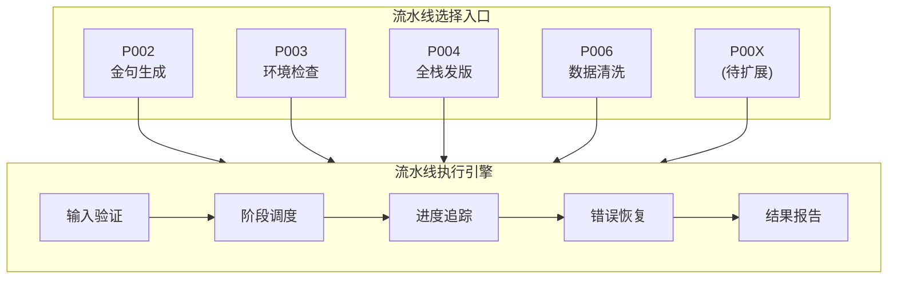

# Readmigo 生产流水线系统

> 可扩展的自动化处理流水线集合 | 数据同步 | 内容处理 | 发布管理

---

## 一、流水线系统总览

### 1.1 流水线注册表

| 编号 | 流水线名称 | 描述 | 状态 | 文档链接 |
|------|-----------|------|------|----------|
| ~~**P001**~~ | ~~Debug→Staging 同步~~ | ~~书单同步到 Staging 环境~~ | ❌ 已废弃 | [详细文档](./execution-logs/P001-debug-staging-sync.md) |
| **P002** | 金句数据生成 | 从公开渠道采集/生成作者金句 | ✅ 可用 | [详细文档](./execution-logs/P002-generate-quotes.md) |
| **P003** | 环境完整性检查 | Production 环境健康检查 | ✅ 可用 | [详细文档](./execution-logs/P003-environment-integrity-check.md) |
| **P004** | 全栈发版流水线 | iOS/Android/Backend/Web 统一发版 | ✅ 可用 | [详细文档](./execution-logs/P004-fullstack-release.md) |
| **P006** | V2 数据清洗 | 重建 100% SE 内容库 | ✅ 可用 | [详细文档](./execution-logs/P006-v2-data-cleanup.md) |

### 1.2 运行环境

所有流水线均运行在 **Digital Ocean Droplet 服务器**上：

| 特性 | 说明 |
|------|------|
| 运行位置 | Droplet 服务器 (mcloud88.com) |
| 会话管理 | PM2 / tmux 持久会话 |
| 执行时长 | 支持长时间运行 (数小时-数天) |
| 断点续传 | 支持检查点机制 |
| 进度监控 | 实时日志 + 状态查询 |

### 1.3 通用流水线结构

---

## 二、如何添加新流水线

### 2.1 添加步骤

### 2.2 文档模板

每个流水线需要包含以下部分：

| 章节 | 必需 | 描述 |
|------|:----:|------|
| 概述 | ✅ | 流水线目的和使用场景 |
| 输入规范 | ✅ | 输入格式、来源、验证规则 |
| 阶段定义 | ✅ | 每个处理阶段的详细说明 |
| 输出规范 | ✅ | 输出格式、目标位置 |
| 执行命令 | ✅ | 如何启动流水线 |
| 错误处理 | ✅ | 常见错误和恢复方案 |
| 依赖关系 | ⭕ | 与其他流水线的关系 |

---

## 三、流水线命名规范

| 组成部分 | 格式 | 示例 |
|----------|------|------|
| 编号前缀 | P + 三位数字 | P001, P002, P100 |
| 名称 | 简洁描述性 | 金句生成 |
| 文件名 | 编号-短横线名称 | P002-generate-quotes.md |

---

## 四、规划中的流水线

> 以下流水线计划逐步实现

| 编号 | 名称 | 预计用途 | 优先级 |
|------|------|----------|:------:|
| P003 | 封面生成流水线 | 批量生成/处理书籍封面 | 高 |
| P007 | 数据清洗流水线 | 重复检测和数据修复 | 低 |

---

## 五、相关文档索引

| 文档 | 描述 |
|------|------|
| [P002-generate-quotes.md](./execution-logs/P002-generate-quotes.md) | 金句数据生成流水线详细设计 |
| [P004-fullstack-release.md](./execution-logs/P004-fullstack-release.md) | 全栈发版流水线详细设计 |
| [P006-v2-data-cleanup.md](./execution-logs/P006-v2-data-cleanup.md) | V2 数据清洗执行记录 |
