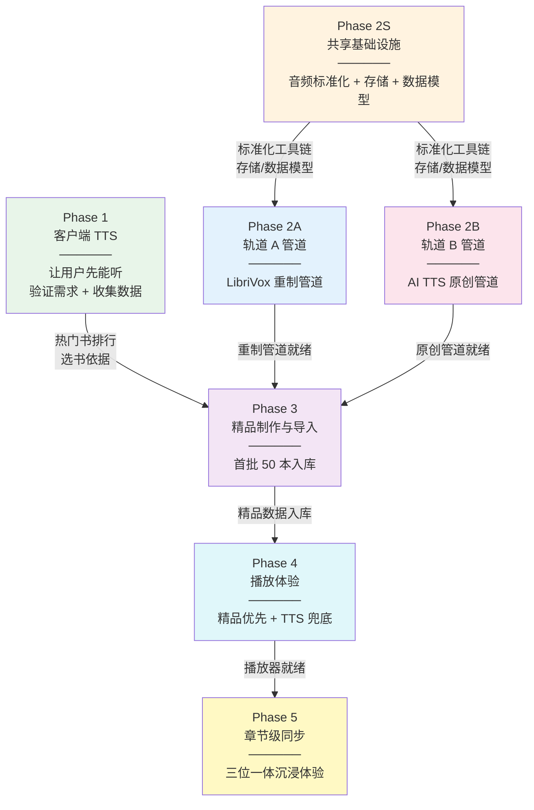
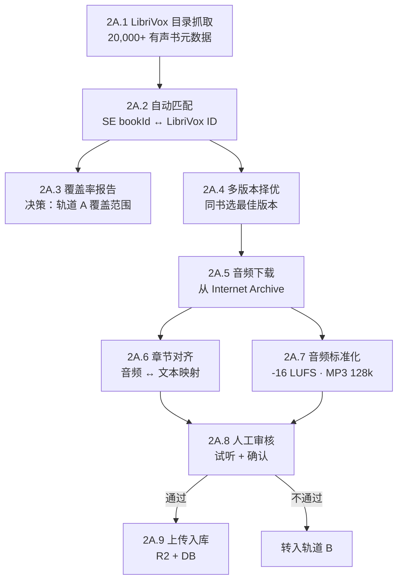
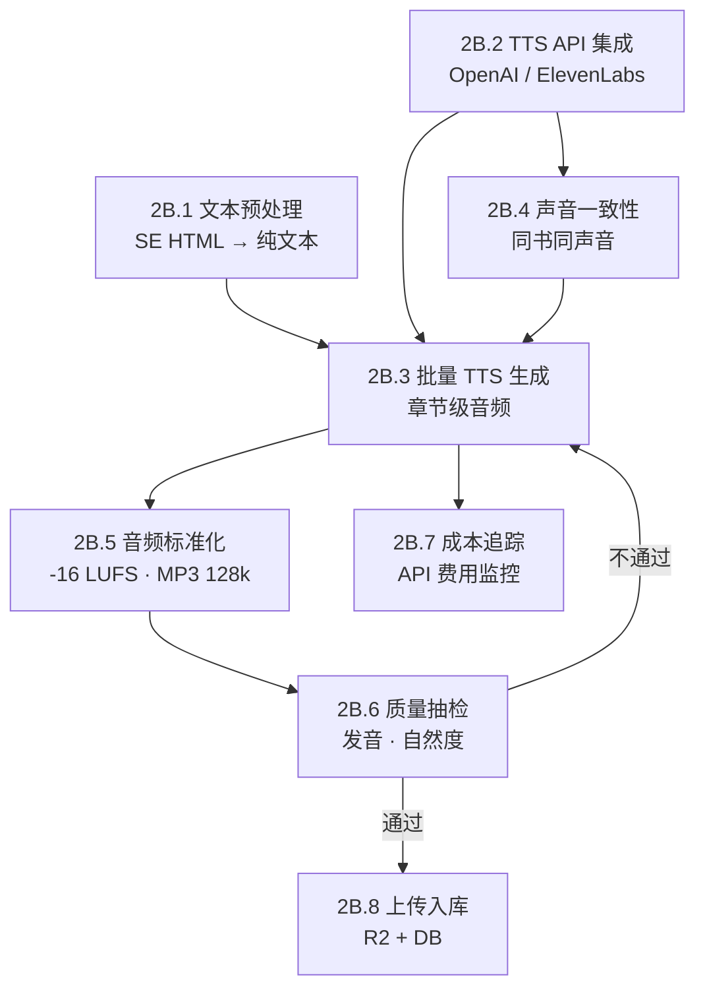
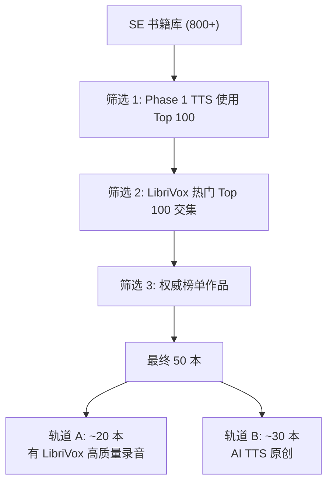
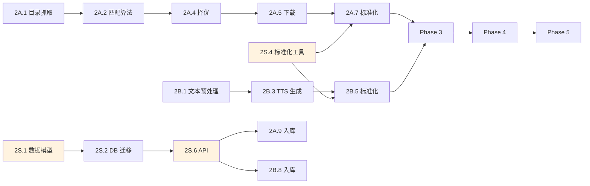

# Audio Lab 任务编排：实现业务线 2

> Readmigo Audio Lab（生产端 · 精品有声书制作）完整任务分解与依赖编排
>
> 源文档：[01-product/audiobook-vision.md](../01-product/audiobook-vision.md)

---

## 一、任务全景



### 并行关系

```
时间线 →→→→→→→→→→→→→→→→→→→→→→→→→→→→→→→→→→→→→→→→→→→→

Phase 1 ████████████░░░░░░░░░░░░░░░░░░░░░░░░░░░░░░░░░

Phase 2S      ████████████░░░░░░░░░░░░░░░░░░░░░░░░░░░░░
Phase 2A           ██████████████░░░░░░░░░░░░░░░░░░░░░░░
Phase 2B           ██████████████░░░░░░░░░░░░░░░░░░░░░░░

Phase 3                         ████████████░░░░░░░░░░░░
Phase 4                                      ████████░░░
Phase 5                                              ████

P1 与 P2 可完全并行
P2S → P2A/P2B 串行（基础设施先行）
P2A ∥ P2B 并行
P3 等待 P2A + P2B + P1（选书数据）
P4 等待 P3
P5 等待 P4
```

---

## 二、Phase 1 — 客户端 TTS（让用户先能听）

> 目标：所有书籍拥有语音朗读能力，零服务端成本，收集用户行为数据

### 现有资源盘点

| 文档 | 路径 | 状态 | 可复用度 |
|------|------|:----:|:-------:|
| iOS TTS 概念设计 | `03-architecture/ios-tts-concept.md` | ✅ 完整 | 高 |
| iOS TTS 详细设计 | `03-architecture/ios-tts-design.md` | ✅ 完整 | 高 |
| iOS 有声书功能规格 | `04-development/platforms/ios/features/audiobook.md` | ✅ 完整 | 高 |
| Android 有声书功能规格 | `04-development/platforms/android/features/audiobook.md` | ✅ 完整 | 高 |
| Web 有声书模块 | `04-development/platforms/web/features/audiobook.md` | ✅ 完整 | 中 |
| RN 有声书功能 | `04-development/platforms/rn/features/audiobook.md` | ✅ 完整 | 中 |
| TTS 系统设计（多声音） | `07-modules/audiobook/tts-system-design.md` | ✅ 完整 | 高 |

### 任务拆解

| ID | 任务 | 依赖 | 平台 | 产出 |
|:--:|------|:----:|:----:|------|
| **1.1** | **文本供应层实现** | — | iOS | ChapterTextProvider（API + 缓存 + 离线回退） |
| **1.2** | TTS 引擎核心实现 | 1.1 | iOS | AVSpeechSynthesizer 段落级朗读 + 句子拆分 |
| **1.3** | 视觉同步（WebView ↔ TTS） | 1.2 | iOS | 段落高亮 + 自动滚动 + 点击跳转 |
| **1.4** | 播放控制 UI | 1.2 | iOS | 播放/暂停、上下句、倍速、睡眠定时 |
| **1.5** | 系统集成 | 1.2 | iOS | 后台播放、锁屏控制、耳机事件、音频中断恢复 |
| **1.6** | 听读进度持久化 | 1.2 | iOS | 断点续听 + 阅读/听读进度统一 |
| **1.7** | 听书行为埋点 | 1.4 | iOS | 哪些书被听、听多久、完成率 → **Phase 3 选书依据** |
| **1.8** | Android TTS 实现 | 1.7 完成后 | Android | TextToSpeech + MediaSession + Foreground Service |

### 交付物

- App 内任意书籍可 TTS 朗读（iOS 先行，Android 跟进）
- 热门书排行数据（听书使用频次 Top N）

---

## 三、Phase 2S — 共享基础设施

> 目标：为轨道 A/B 搭建共用的音频标准化工具链、存储结构、数据模型

### 任务拆解

| ID | 任务 | 依赖 | 执行环境 | 产出 |
|:--:|------|:----:|:-------:|------|
| **2S.1** | **数据模型设计** | — | Backend | Prisma schema: `Audiobook` + `AudiobookChapter` 表设计 |
| **2S.2** | 数据库迁移 | 2S.1 | Backend | Prisma migration 执行 + 验证 |
| **2S.3** | R2 存储结构搭建 | — | Infra | `books/{bookId}/audio/` 目录规范 + metadata.json schema |
| **2S.4** | 音频标准化工具链 | — | Pipeline | FFmpeg 脚本：音量归一化（-16 LUFS）+ 格式统一（MP3 128kbps）+ 静音裁剪 |
| **2S.5** | 音质评审标准定义 | — | 文档 | 质量评级标准（A/B/C/D）+ 达标阈值 |
| **2S.6** | API 端点设计 | 2S.1 | Backend | 有声书 CRUD API + 音频上传接口 |

### 数据模型草案

```
Audiobook
├── id
├── bookId → Book
├── source: LIBRIVOX_REMASTER | AI_TTS | HUMAN_RECORDING
├── narratorName
├── narratorInfo (JSON)
├── totalDuration (秒)
├── qualityRating: A | B | C
├── librivoxUrl (轨道 A 来源)
├── ttsModel (轨道 B: "openai-tts-1" / "elevenlabs-v2" 等)
├── status: DRAFT | REVIEW | PUBLISHED
├── createdAt / updatedAt
│
└── AudiobookChapter[]
    ├── id
    ├── audiobookId → Audiobook
    ├── bookChapterId → Chapter (文本章节关联)
    ├── chapterIndex
    ├── audioUrl (R2 URL)
    ├── duration (秒)
    ├── fileSize (bytes)
    └── timestamps (JSON: 段落同步数据, Phase 5 填充)
```

### 交付物

- 数据库表 + API 端点就绪
- R2 存储结构搭建完成
- FFmpeg 标准化脚本可运行

---

## 四、Phase 2A — 轨道 A 管道（重制 LibriVox）

> 目标：搭建 LibriVox 高质量录音的自动化重制管道

### 现有资源盘点

| 文档 | 路径 | 可复用内容 |
|------|------|-----------|
| LibriVox 匹配分析报告 | `06-content/sources/librivox/audiobook-matching-analysis.md` | Top 100 热门书、作者匹配率、多版本选择策略 |
| 有声书设计 V2 | `07-modules/audiobook/audiobook-design-v2.md` | LibriVox 匹配策略 |
| 有声书-电子书关联设计 | `07-modules/audiobook/audiobook-ebook-linking-design.md` | 章节对齐方案 |

### 任务拆解

| ID | 任务 | 依赖 | 执行环境 | 产出 |
|:--:|------|:----:|:-------:|------|
| **2A.1** | **LibriVox API 目录抓取** | — | Pipeline | 20,000+ 有声书元数据入本地 DB（title, author, url, sections, reader） |
| **2A.2** | SE ↔ LibriVox 自动匹配算法 | 2A.1 | Pipeline | title + author 模糊匹配 → 匹配结果表（bookId ↔ librivoxId, confidence） |
| **2A.3** | 覆盖率摸底报告 | 2A.2 | 文档 | SE 多少本书能匹配到 LibriVox？匹配率按类型/作者统计 |
| **2A.4** | 多版本择优算法 | 2A.2 | Pipeline | 同书多版本 → 评分排序（Solo > Group, 高码率优先, 新录音优先） |
| **2A.5** | 音频批量下载器 | 2A.4 | Pipeline | Internet Archive MP3 下载 + 本地暂存 + 断点续传 |
| **2A.6** | 章节对齐算法 | 2A.5, 2S.4 | Pipeline | LibriVox 音频 section ↔ SE 文本 chapter 映射（模糊匹配 + 置信度分数） |
| **2A.7** | 音频标准化执行 | 2A.5, 2S.4 | Pipeline | 调用共享工具链：归一化 + 格式转换 + 静音裁剪 |
| **2A.8** | 人工审核工具 | 2A.6, 2A.7 | Web/CLI | 审核界面：试听 + 确认章节对齐 + 标记质量等级 |
| **2A.9** | R2 上传 + 数据库写入 | 2A.7, 2A.8, 2S.3, 2S.6 | Pipeline | 音频文件 → R2, 元数据 → Audiobook/AudiobookChapter 记录 |

### 轨道 A 管道流程



### 交付物

- LibriVox 全量目录元数据
- SE ↔ LibriVox 匹配表 + 覆盖率报告
- 端到端重制管道（下载 → 择优 → 标准化 → 对齐 → 审核 → 入库）

---

## 五、Phase 2B — 轨道 B 管道（AI TTS 原创）

> 目标：为无 LibriVox 高质量录音的书籍建设 AI TTS 原创制作管道

### 任务拆解

| ID | 任务 | 依赖 | 执行环境 | 产出 |
|:--:|------|:----:|:-------:|------|
| **2B.1** | **SE HTML → 纯文本预处理** | — | Pipeline | 按章节拆分 + 去 HTML 标签 + 保留段落结构 + 处理特殊字符 |
| **2B.2** | AI TTS API 选型 & 集成 | — | Pipeline | OpenAI TTS / ElevenLabs 接入 + 声音选择 + 费用估算 |
| **2B.3** | 章节级 TTS 批量生成 | 2B.1, 2B.2 | Pipeline | 输入纯文本 → 输出 MP3 + 断点续传 + 错误重试 |
| **2B.4** | 声音一致性管理 | 2B.2 | Pipeline | 同一本书保持同一声音；声音档案库（voice_id → 适用场景） |
| **2B.5** | 音频标准化执行 | 2B.3, 2S.4 | Pipeline | 调用共享工具链（与轨道 A 统一标准） |
| **2B.6** | 质量抽检流程 | 2B.5 | Web/CLI | AI 生成音频抽检：发音准确性、自然度、无异常 |
| **2B.7** | 成本追踪与优化 | 2B.3 | Pipeline | 按书/按章节记录 API 费用；热门书用高质量模型，长尾书用经济模型 |
| **2B.8** | R2 上传 + 数据库写入 | 2B.5, 2B.6, 2S.3, 2S.6 | Pipeline | 音频文件 → R2, 元数据 → Audiobook/AudiobookChapter 记录 |

### 轨道 B 管道流程



### 轨道 B 的天然优势

| 对比 | 轨道 A | 轨道 B |
|------|--------|--------|
| 章节对齐 | 需要复杂匹配算法（2A.6） | **天然对齐（从 SE 文本直接生成）** |
| 覆盖率 | 受限于 LibriVox 已有录音 | **任何 SE 书籍都可制作** |
| 质量上限 | 受限于原始录音 | **可用最新 AI 模型** |

### 交付物

- SE 文本预处理工具
- AI TTS 批量生成管道（支持 OpenAI / ElevenLabs）
- 端到端原创管道（文本 → TTS → 标准化 → 抽检 → 入库）

---

## 六、Phase 3 — 精品制作与导入

> 目标：首批 50 本精品有声书通过管道产出并入库

### 任务拆解

| ID | 任务 | 依赖 | 产出 |
|:--:|------|:----:|------|
| **3.1** | 首批选书（50 本） | P1 热门数据 + 2A.3 覆盖率 | 选书清单 + 轨道分配（A or B） |
| **3.2** | 轨道分配决策 | 3.1, 2A.3 | 每本书标记：A（有 LibriVox 高质量）/ B（无或质量不达标） |
| **3.3** | 轨道 A 批量执行 | 3.2, P2A 管道就绪 | 轨道 A 分配的书籍完成重制 |
| **3.4** | 轨道 B 批量执行 | 3.2, P2B 管道就绪 | 轨道 B 分配的书籍完成原创制作 |
| **3.5** | 统一质量审核 | 3.3, 3.4, 2S.5 | 全部 50 本通过质量评审 |
| **3.6** | 批量入库 | 3.5, 2S.3, 2S.6 | 音频 → R2, 元数据 → DB, API 可查询 |
| **3.7** | 验收报告 | 3.6 | 首批有声书统计：来源占比、总时长、平均质量评级 |

### 选书优先级



### 交付物

- 首批 50 本精品有声书入库
- 验收报告（来源占比、时长、质量）

---

## 七、Phase 4 — 播放体验

> 目标：用户在 App 中听到精品有声书，无精品时自动回退 TTS

### 任务拆解

| ID | 任务 | 依赖 | 平台 | 产出 |
|:--:|------|:----:|:----:|------|
| **4.1** | 音频源优先级策略 | P3 入库 | iOS/Android | 有精品 → 播放精品；无 → 回退 TTS |
| **4.2** | 精品音频流式播放 | 4.1 | iOS | AVPlayer 流式播放 R2 音频 |
| **4.3** | 音频下载 & 离线收听 | 4.2 | iOS | 精品音频离线缓存管理 |
| **4.4** | 播放器 UI 升级 | 4.2 | iOS | 进度条、倍速、定时关闭、章节列表 |
| **4.5** | 音频源标识 | 4.1 | iOS | UI 展示：「精品录音」vs「AI 朗读」标签 |
| **4.6** | 阅读/收听进度同步 | 4.2, 1.6 | iOS | 阅读进度 ↔ 收听进度双向关联 |
| **4.7** | Android 精品播放实现 | 4.1~4.6 iOS 验证后 | Android | 同 iOS 功能对齐 |

### 音频源决策流程

```
用户点击「听」
     │
     ▼
查询该书是否有 Audiobook 记录 (status = PUBLISHED)
     │
     ├── 有 → 加载精品音频 URL → 流式播放
     │         UI 标签：「精品录音 · {narrator}」
     │
     └── 无 → 回退客户端 TTS（与 Phase 1 体验一致）
               UI 标签：「AI 朗读」
```

### 交付物

- 用户可听到精品有声书
- 精品音频 / TTS 无缝切换

---

## 八、Phase 5 — 章节级音频+文本同步

> 目标：音频播放时同步高亮文本，翻译联动，三位一体沉浸式体验

### 任务拆解

| ID | 任务 | 依赖 | 执行环境 | 产出 |
|:--:|------|:----:|:-------:|------|
| **5.1** | Forced alignment 工具集成 | P3 入库 | Pipeline | WhisperX 或 Aeneas 部署 + 配置 |
| **5.2** | 段落时间戳批量生成 | 5.1 | Pipeline | 每章音频 → `timestamps[]` JSON 数据 |
| **5.3** | 时间戳数据回写 | 5.2, 2S.6 | Pipeline | AudiobookChapter.timestamps 字段填充 |
| **5.4** | 客户端同步播放 | 5.3, 4.2 | iOS | 音频播放 → 实时高亮对应段落 + 自动滚动 |
| **5.5** | 翻译联动 | 5.4 | iOS | 播放到某段 → 显示该段翻译 |
| **5.6** | 同步精度调优 | 5.4 | Pipeline + iOS | 时间戳校准 + 客户端补偿算法 |

### 交付物

- 文本 + 音频 + 翻译 三位一体同步播放
- 沉浸式语言学习终极体验

---

## 九、依赖关系矩阵

### 关键路径



### 并行可执行组

| 并行组 | 可同时进行的任务 | 前置条件 |
|:------:|----------------|---------|
| **A** | 1.1~1.7（iOS TTS） ∥ 2S.1~2S.5（共享基础设施） ∥ 2A.1（LibriVox 抓取） ∥ 2B.1（文本预处理） ∥ 2B.2（TTS 选型） | 无 |
| **B** | 2A.2~2A.5（匹配+下载） ∥ 2B.3~2B.4（TTS 生成） | 并行组 A |
| **C** | 2A.6~2A.9（对齐+入库） ∥ 2B.5~2B.8（标准化+入库） | 并行组 B + 2S 完成 |
| **D** | 3.3（轨道 A 执行） ∥ 3.4（轨道 B 执行） | 选书完成 |
| **E** | 4.1~4.6（播放体验） ∥ 5.1~5.2（时间戳生成） | Phase 3 |

### 阻塞依赖（必须等待）

| 被阻塞任务 | 等待 | 原因 |
|-----------|------|------|
| 2A.6 章节对齐 | 2A.5 下载完成 | 需要音频文件才能对齐 |
| 2A.7/2B.5 标准化 | 2S.4 工具链就绪 | 共享工具链 |
| 2A.9/2B.8 入库 | 2S.2 DB 迁移 + 2S.6 API | 需要数据表和接口 |
| 3.1 选书 | P1 行为数据 + 2A.3 覆盖率 | 需要数据驱动选书 |
| 4.1 音频源策略 | Phase 3 入库 | 需要精品音频数据 |
| 5.4 同步播放 | 5.3 时间戳回写 | 需要时间戳数据 |

---

## 十、里程碑与交付物总览

| 里程碑 | 阶段 | 核心交付物 | 决策点 |
|:------:|:----:|-----------|--------|
| **M1** | Phase 1 完成 | App 全书可 TTS 朗读 + 热门书排行 | 用户是否想听书？ |
| **M2** | Phase 2S 完成 | 数据模型 + R2 存储 + 标准化工具链 | — |
| **M3** | Phase 2A 完成 | LibriVox 重制管道 + 覆盖率报告 | 轨道 A 覆盖率如何？决定 A/B 比例 |
| **M4** | Phase 2B 完成 | AI TTS 原创管道 + 成本模型 | TTS 成本是否可控？ |
| **M5** | Phase 3 完成 | 首批 50 本精品有声书入库 | 质量是否达标？ |
| **M6** | Phase 4 完成 | 用户可听精品有声书 | 用户满意度如何？ |
| **M7** | Phase 5 完成 | 三位一体沉浸式体验 | — |

---

## 十一、任务总量统计

| 阶段 | 任务数 | 类型分布 |
|------|:------:|---------|
| Phase 1 | 8 | iOS 6 + Android 1 + 埋点 1 |
| Phase 2S | 6 | Backend 3 + Infra 1 + Pipeline 1 + 文档 1 |
| Phase 2A | 9 | Pipeline 7 + Web/CLI 1 + 文档 1 |
| Phase 2B | 8 | Pipeline 6 + Web/CLI 1 + Pipeline 1 |
| Phase 3 | 7 | Pipeline 4 + 文档 2 + 决策 1 |
| Phase 4 | 7 | iOS 5 + Android 1 + 跨端 1 |
| Phase 5 | 6 | Pipeline 3 + iOS 2 + 调优 1 |
| **合计** | **51** | |

### 按执行环境分布

| 环境 | 任务数 | 说明 |
|------|:------:|------|
| Pipeline (Droplet) | 22 | 数据处理、音频生成、标准化 |
| iOS | 13 | 客户端 TTS + 播放器 + 同步 |
| Backend (API) | 3 | 数据模型、迁移、API |
| Android | 2 | TTS + 精品播放 |
| Web/CLI | 2 | 审核工具 |
| Infra | 1 | R2 存储 |
| 文档 | 4 | 报告、标准定义 |
| 决策 | 4 | 选书、轨道分配、比例调整 |

---

## 十二、流水线注册（对接 pipeline-system）

Audio Lab 需在现有流水线系统中注册以下新管道：

| 编号 | 名称 | 描述 | 依赖 |
|------|------|------|------|
| **P010** | LibriVox 目录同步 | 抓取 LibriVox API 全量元数据 | — |
| **P011** | SE-LibriVox 匹配 | 自动匹配 + 覆盖率报告 | P010 |
| **P012** | 轨道 A 重制管道 | 下载 → 择优 → 标准化 → 对齐 → 审核 → 入库 | P011, P010 |
| **P013** | 轨道 B 原创管道 | 文本预处理 → TTS 生成 → 标准化 → 抽检 → 入库 | — |
| **P014** | Forced Alignment | 批量生成段落时间戳 | P012 或 P013 |

---

*创建日期：2026-02-08*
